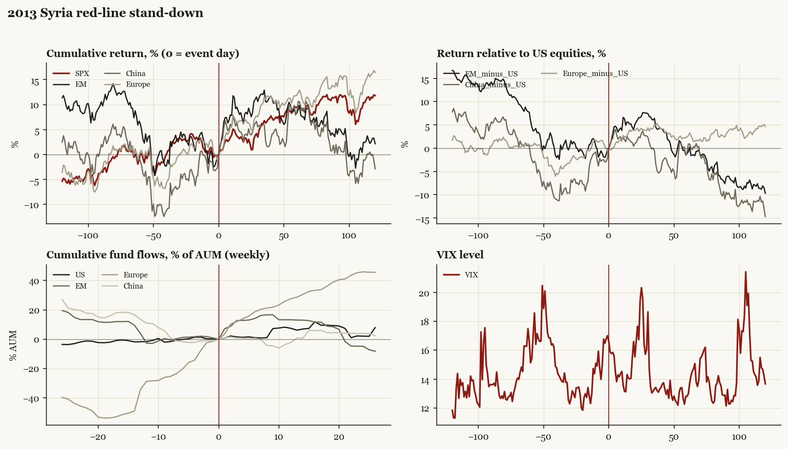

# 2013 Syria red-line stand-down

*Obama administration. Outbreak/event 2013-08-31, buildup from 2013-08-21. Telegraphed; type: threat_resolved.*

[Index](README.md)

## What moved

- Equities ran -0.2% over the 60 trading days into the event.
- The S&P 500 moved +9.5% over the following 60 trading days and +11.8% over 120.
- Cumulative net flows into US equity funds: +6.1% of assets in the 13 weeks after (vs +1.8% in the 13 weeks before).
- Cumulative net flows into emerging-market funds: +13.0% of assets in the 13 weeks after (vs -3.9% in the 13 weeks before).
- Cumulative net flows into Europe funds: +28.6% of assets in the 13 weeks after (vs +34.4% in the 13 weeks before).
- Cumulative net flows into China funds: +0.8% of assets in the 13 weeks after (vs -13.5% in the 13 weeks before).
- Implied volatility moved -1.1 VIX points across the event (from 17.0).
- Strike threatened after Ghouta, then sent to Congress and shelved; relief case

## Detail

| series | runup pre-60d | +20d | +60d | +120d |
|---|---|---|---|---|
| SPX | -0.2% | +3.3% | +9.5% | +11.8% |
| US | -0.2% | +3.0% | +9.5% | +11.8% |
| EM | -6.1% | +8.1% | +8.3% | +2.2% |
| China | +1.4% | +4.0% | +8.6% | -2.9% |
| Taiwan | -0.1% | +3.4% | +2.7% | +0.9% |
| Europe | -0.7% | +6.8% | +11.9% | +16.4% |
| Japan | +1.3% | +6.3% | +7.6% | +4.0% |
| Bonds | -5.3% | +1.5% | +1.4% | +2.5% |
| Gold | +2.3% | -9.1% | -12.9% | -5.3% |
