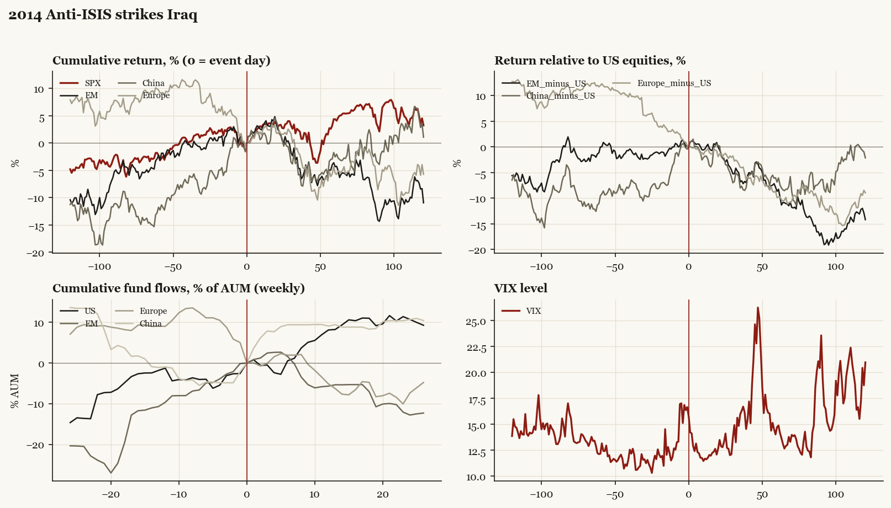

# 2014 Anti-ISIS strikes Iraq

*Obama administration. Outbreak/event 2014-08-08, buildup from 2014-06-10. Telegraphed; type: campaign.*

[Index](README.md)

## What moved

- Equities ran +2.3% over the 60 trading days into the event.
- The S&P 500 moved +4.4% over the following 60 trading days and +3.2% over 120.
- Cumulative net flows into US equity funds: +8.2% of assets in the 13 weeks after (vs +1.8% in the 13 weeks before).
- Cumulative net flows into emerging-market funds: -5.4% of assets in the 13 weeks after (vs +10.7% in the 13 weeks before).
- Cumulative net flows into Europe funds: -6.3% of assets in the 13 weeks after (vs -9.0% in the 13 weeks before).
- Cumulative net flows into China funds: +9.4% of assets in the 13 weeks after (vs +1.1% in the 13 weeks before).
- Implied volatility moved -2.4 VIX points across the event (from 16.7).
- Mosul fell 06-10

## Detail

| series | runup pre-60d | +20d | +60d | +120d |
|---|---|---|---|---|
| SPX | +2.3% | +3.6% | +4.4% | +3.2% |
| US | +2.2% | +3.8% | +4.3% | +3.2% |
| EM | +2.2% | +3.7% | -4.3% | -11.0% |
| China | +11.8% | +4.0% | -2.5% | +1.1% |
| Taiwan | +6.4% | +4.6% | +0.0% | -3.0% |
| Europe | -9.7% | +1.8% | -5.6% | -5.7% |
| Japan | +4.4% | +0.8% | +3.4% | -2.2% |
| Bonds | +1.1% | -0.1% | +1.3% | +8.9% |
| Gold | +0.4% | -4.5% | -11.8% | -2.2% |
