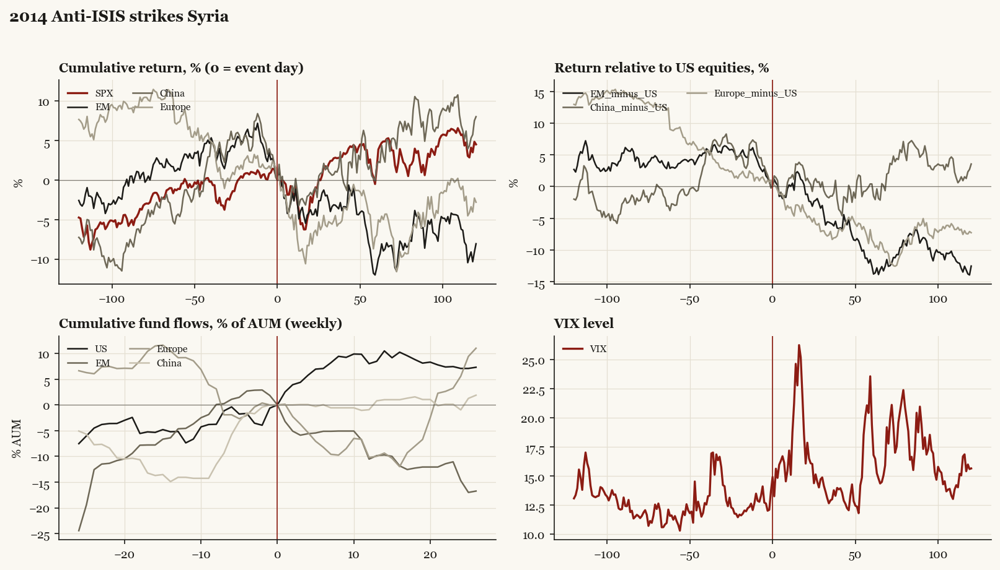

# 2014 Anti-ISIS strikes Syria

*Obama administration. Outbreak/event 2014-09-23, buildup from 2014-09-10. Telegraphed; type: campaign.*

[Index](README.md)

## What moved

- Equities ran +1.1% over the 60 trading days into the event.
- The S&P 500 moved +1.5% over the following 60 trading days and +4.5% over 120.
- Cumulative net flows into US equity funds: +8.5% of assets in the 13 weeks after (vs +5.2% in the 13 weeks before).
- Cumulative net flows into emerging-market funds: -9.9% of assets in the 13 weeks after (vs +4.6% in the 13 weeks before).
- Cumulative net flows into Europe funds: -10.0% of assets in the 13 weeks after (vs -9.2% in the 13 weeks before).
- Cumulative net flows into China funds: +0.8% of assets in the 13 weeks after (vs +14.1% in the 13 weeks before).
- Implied volatility moved -0.4 VIX points across the event (from 13.7).
- Address announcing expansion 09-10

## Detail

| series | runup pre-60d | +20d | +60d | +120d |
|---|---|---|---|---|
| SPX | +1.1% | -2.1% | +1.5% | +4.5% |
| US | +1.5% | -2.5% | +1.4% | +4.5% |
| EM | -1.5% | -3.8% | -11.1% | -8.1% |
| China | +4.3% | -1.6% | +1.8% | +8.0% |
| Taiwan | -0.7% | -2.3% | -5.9% | +1.2% |
| Europe | -7.3% | -6.8% | -7.0% | -2.8% |
| Japan | -1.7% | -5.6% | -4.4% | +6.4% |
| Bonds | +0.5% | +2.7% | +4.4% | +5.4% |
| Gold | -7.5% | +2.1% | -2.7% | -6.4% |
