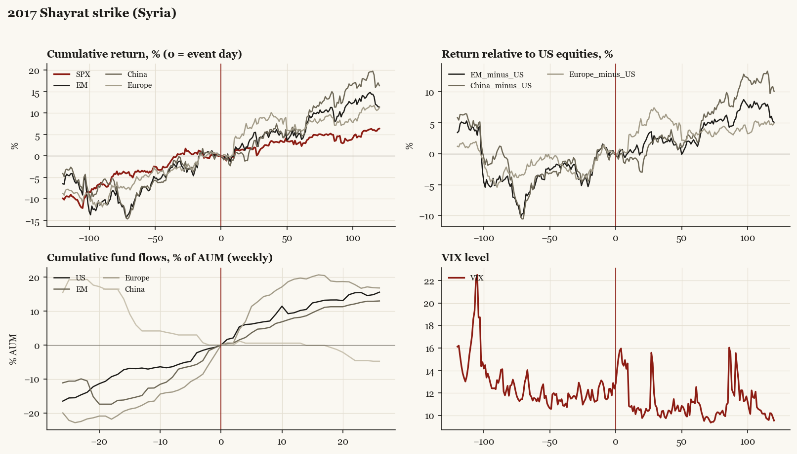

# 2017 Shayrat strike (Syria)

*Trump1 administration. Outbreak/event 2017-04-07, buildup from 2017-04-04. Surprise; type: one_off.*

[Index](README.md)

## What moved

- Equities ran +3.5% over the 60 trading days into the event.
- The S&P 500 moved +3.2% over the following 60 trading days and +6.4% over 120.
- Cumulative net flows into US equity funds: +10.2% of assets in the 13 weeks after (vs +6.8% in the 13 weeks before).
- Cumulative net flows into emerging-market funds: +8.2% of assets in the 13 weeks after (vs +14.9% in the 13 weeks before).
- Cumulative net flows into Europe funds: +19.7% of assets in the 13 weeks after (vs +17.8% in the 13 weeks before).
- Cumulative net flows into China funds: +0.5% of assets in the 13 weeks after (vs -4.1% in the 13 weeks before).
- Implied volatility moved +1.7 VIX points across the event (from 12.4).
- Response to Khan Shaykhun, 3 days later

## Detail

| series | runup pre-60d | +20d | +60d | +120d |
|---|---|---|---|---|
| SPX | +3.5% | +1.8% | +3.2% | +6.4% |
| US | +3.6% | +1.9% | +3.2% | +6.3% |
| EM | +7.7% | +2.1% | +5.0% | +11.4% |
| China | +7.1% | -1.1% | +5.9% | +16.4% |
| Taiwan | +8.3% | +2.5% | +7.8% | +7.4% |
| Europe | +4.9% | +6.5% | +6.1% | +11.2% |
| Japan | +0.8% | +3.3% | +4.5% | +8.7% |
| Bonds | -0.4% | +0.0% | +1.4% | +1.7% |
| Gold | +5.3% | -2.3% | -2.4% | +2.3% |
