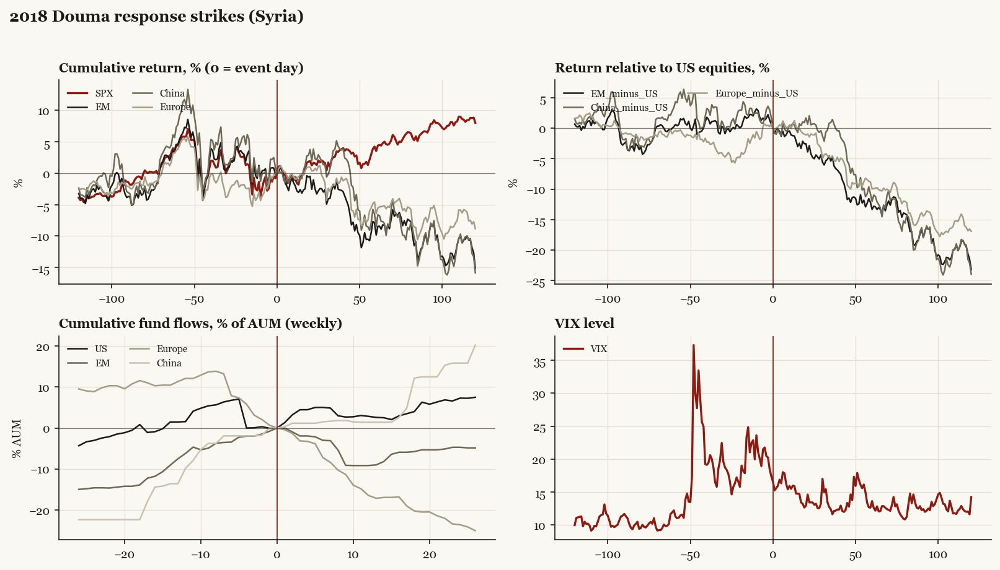

# 2018 Douma response strikes (Syria)

*Trump1 administration. Outbreak/event 2018-04-14, buildup from 2018-04-07. Telegraphed; type: one_off.*

[Index](README.md)

## What moved

- Equities ran -4.4% over the 60 trading days into the event.
- The S&P 500 moved +3.5% over the following 60 trading days and +8.0% over 120.
- Cumulative net flows into US equity funds: +2.6% of assets in the 13 weeks after (vs -1.5% in the 13 weeks before).
- Cumulative net flows into emerging-market funds: -9.0% of assets in the 13 weeks after (vs +7.5% in the 13 weeks before).
- Cumulative net flows into Europe funds: -17.2% of assets in the 13 weeks after (vs -11.4% in the 13 weeks before).
- Cumulative net flows into China funds: +1.4% of assets in the 13 weeks after (vs +13.6% in the 13 weeks before).
- Implied volatility moved -2.2 VIX points across the event (from 17.4).
- Week of public deliberation

## Detail

| series | runup pre-60d | +20d | +60d | +120d |
|---|---|---|---|---|
| SPX | -4.4% | +1.9% | +3.5% | +8.0% |
| US | -4.4% | +2.1% | +3.5% | +8.0% |
| EM | -4.6% | -0.5% | -9.8% | -15.1% |
| China | -7.8% | +3.8% | -8.5% | -15.9% |
| Taiwan | -0.5% | -1.5% | -6.6% | -5.7% |
| Europe | -3.8% | +1.0% | -6.4% | -8.9% |
| Japan | -4.9% | +2.0% | -5.8% | -2.1% |
| Bonds | -1.7% | -1.4% | +0.2% | -3.5% |
| Gold | +1.4% | -2.5% | -8.3% | -11.8% |
