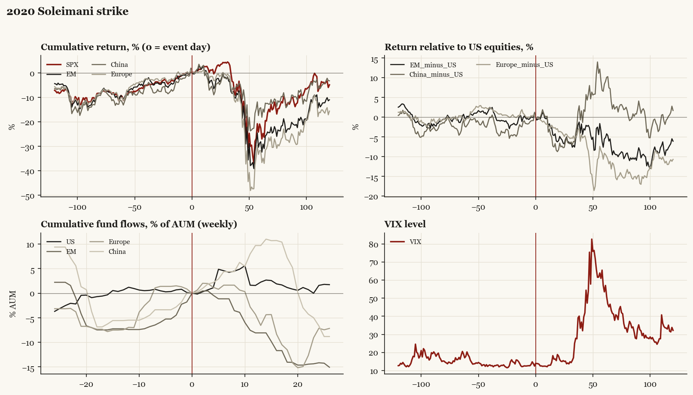

# 2020 Soleimani strike

*Trump1 administration. Outbreak/event 2020-01-03, no buildup window. Surprise; type: one_off.*

[Index](README.md)

## What moved

- Equities ran +11.2% over the 60 trading days into the event.
- The S&P 500 moved -22.4% over the following 60 trading days and -4.8% over 120.
- Cumulative net flows into US equity funds: +2.3% of assets in the 13 weeks after (vs -0.7% in the 13 weeks before).
- Cumulative net flows into emerging-market funds: -8.1% of assets in the 13 weeks after (vs +7.3% in the 13 weeks before).
- Cumulative net flows into Europe funds: -6.6% of assets in the 13 weeks after (vs +7.4% in the 13 weeks before).
- Cumulative net flows into China funds: +9.7% of assets in the 13 weeks after (vs +5.6% in the 13 weeks before).
- Implied volatility moved +1.4 VIX points across the event (from 12.5).
- Iran missile retaliation 01-08; market at new highs within days

## Detail

| series | runup pre-60d | +20d | +60d | +120d |
|---|---|---|---|---|
| SPX | +11.2% | +0.4% | -22.4% | -4.8% |
| US | +11.0% | +0.5% | -22.6% | -4.8% |
| EM | +10.7% | -5.4% | -28.1% | -10.9% |
| China | +13.1% | -7.7% | -14.2% | -3.1% |
| Taiwan | +11.0% | -6.4% | -21.9% | -2.1% |
| Europe | +11.2% | -3.2% | -31.7% | -15.5% |
| Japan | +5.5% | -1.7% | -18.1% | -5.5% |
| Bonds | -2.2% | +2.6% | +9.2% | +9.7% |
| Gold | +2.7% | +1.7% | +1.7% | +12.9% |
