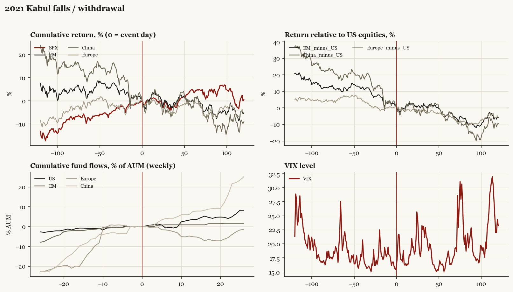

# 2021 Kabul falls / withdrawal

*Biden administration. Outbreak/event 2021-08-15, buildup from 2021-07-02. Telegraphed; type: withdrawal.*

[Index](README.md)

## What moved

- Equities ran +7.4% over the 60 trading days into the event.
- The S&P 500 moved +4.5% over the following 60 trading days and +0.5% over 120.
- Cumulative net flows into US equity funds: +3.7% of assets in the 13 weeks after (vs +0.9% in the 13 weeks before).
- Cumulative net flows into emerging-market funds: +0.9% of assets in the 13 weeks after (vs +1.5% in the 13 weeks before).
- Cumulative net flows into Europe funds: -5.1% of assets in the 13 weeks after (vs +12.1% in the 13 weeks before).
- Cumulative net flows into China funds: +7.6% of assets in the 13 weeks after (vs +6.3% in the 13 weeks before).
- Implied volatility moved +2.5 VIX points across the event (from 15.4).
- Bagram handover 07-02; exit complete 08-30

## Detail

| series | runup pre-60d | +20d | +60d | +120d |
|---|---|---|---|---|
| SPX | +7.4% | -0.8% | +4.5% | +0.5% |
| US | +7.4% | -0.6% | +4.4% | +0.4% |
| EM | -4.3% | +1.9% | +0.1% | -5.3% |
| China | -12.9% | +0.0% | -3.0% | -9.0% |
| Taiwan | +4.1% | +4.3% | +4.1% | +3.2% |
| Europe | +0.3% | -1.4% | -0.1% | -5.1% |
| Japan | +0.9% | +7.4% | +2.3% | -6.0% |
| Bonds | +4.2% | +0.5% | -0.2% | -5.7% |
| Gold | -5.1% | +1.0% | +2.4% | +1.1% |
