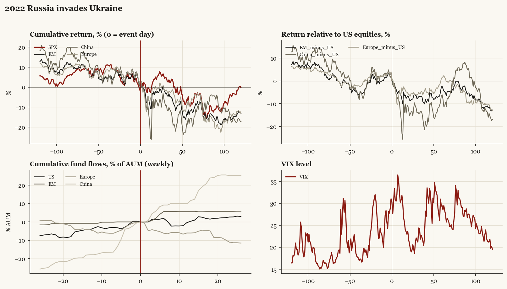

# 2022 Russia invades Ukraine

*Biden administration. Outbreak/event 2022-02-24, buildup from 2021-11-10. Telegraphed; type: third_party.*

[Index](README.md)

## What moved

- Equities ran -8.2% over the 60 trading days into the event.
- The S&P 500 moved -9.5% over the following 60 trading days and -0.3% over 120.
- Cumulative net flows into US equity funds: +0.3% of assets in the 13 weeks after (vs +4.2% in the 13 weeks before).
- Cumulative net flows into emerging-market funds: +5.6% of assets in the 13 weeks after (vs +0.8% in the 13 weeks before).
- Cumulative net flows into Europe funds: -6.1% of assets in the 13 weeks after (vs +4.3% in the 13 weeks before).
- Cumulative net flows into China funds: +11.6% of assets in the 13 weeks after (vs +17.9% in the 13 weeks before).
- Implied volatility moved -3.4 VIX points across the event (from 31.0).
- US intel warnings from Nov 2021; famous intraday reversal on outbreak day

## Detail

| series | runup pre-60d | +20d | +60d | +120d |
|---|---|---|---|---|
| SPX | -8.2% | +5.3% | -9.5% | -0.3% |
| US | -8.1% | +5.0% | -9.5% | -0.3% |
| EM | -5.3% | -2.1% | -11.8% | -13.1% |
| China | -9.9% | -7.8% | -15.6% | -17.3% |
| Taiwan | -2.3% | -1.6% | -15.2% | -18.2% |
| Europe | -5.5% | -0.9% | -8.0% | -13.4% |
| Japan | -7.8% | +1.0% | -8.4% | -8.9% |
| Bonds | -5.7% | -3.5% | -8.9% | -10.5% |
| Gold | +6.1% | +3.3% | -2.9% | -7.4% |
