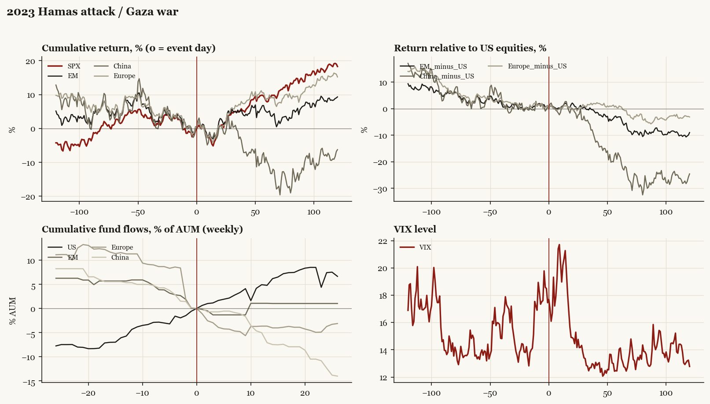

# 2023 Hamas attack / Gaza war

*Biden administration. Outbreak/event 2023-10-07, no buildup window. Surprise; type: third_party.*

[Index](README.md)

## What moved

- Equities ran -3.8% over the 60 trading days into the event.
- The S&P 500 moved +7.8% over the following 60 trading days and +18.3% over 120.
- Cumulative net flows into US equity funds: +4.8% of assets in the 13 weeks after (vs +5.7% in the 13 weeks before).
- Cumulative net flows into emerging-market funds: +1.1% of assets in the 13 weeks after (vs -5.7% in the 13 weeks before).
- Cumulative net flows into Europe funds: -3.7% of assets in the 13 weeks after (vs -11.3% in the 13 weeks before).
- Cumulative net flows into China funds: -7.1% of assets in the 13 weeks after (vs -5.3% in the 13 weeks before).
- Implied volatility moved -0.4 VIX points across the event (from 17.4).
- US carrier deployment follows

## Detail

| series | runup pre-60d | +20d | +60d | +120d |
|---|---|---|---|---|
| SPX | -3.8% | +0.7% | +7.8% | +18.3% |
| US | -3.9% | +0.8% | +7.8% | +18.3% |
| EM | -8.2% | +2.9% | +4.7% | +9.3% |
| China | -7.8% | +0.9% | -9.8% | -6.3% |
| Taiwan | -7.0% | +0.9% | -2.5% | +7.5% |
| Europe | -9.1% | +0.8% | +8.9% | +15.2% |
| Japan | -4.7% | +2.7% | +5.7% | +16.1% |
| Bonds | -8.5% | -0.0% | +7.0% | +3.8% |
| Gold | -4.8% | +5.9% | +9.1% | +20.0% |
