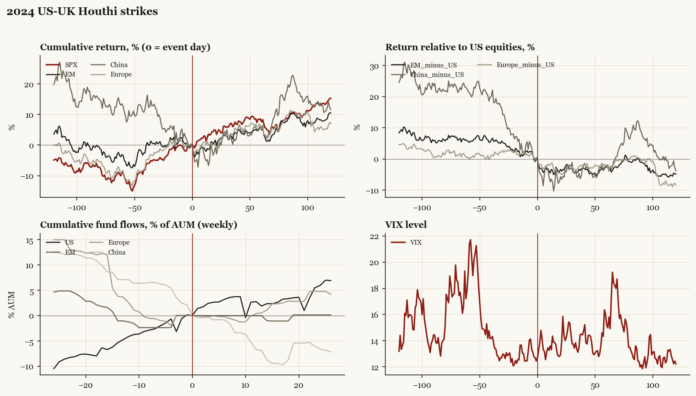

# 2024 US-UK Houthi strikes

*Biden administration. Outbreak/event 2024-01-12, buildup from 2023-12-18. Telegraphed; type: campaign.*

[Index](README.md)

## What moved

- Equities ran +9.0% over the 60 trading days into the event.
- The S&P 500 moved +7.6% over the following 60 trading days and +15.3% over 120.
- Cumulative net flows into US equity funds: +1.9% of assets in the 13 weeks after (vs +4.8% in the 13 weeks before).
- Cumulative net flows into emerging-market funds: -0.0% of assets in the 13 weeks after (vs +1.1% in the 13 weeks before).
- Cumulative net flows into Europe funds: +0.5% of assets in the 13 weeks after (vs -3.7% in the 13 weeks before).
- Cumulative net flows into China funds: -6.9% of assets in the 13 weeks after (vs -7.1% in the 13 weeks before).
- Implied volatility moved +0.8 VIX points across the event (from 12.4).
- Operation Prosperity Guardian 12-18 preceded strikes

## Detail

| series | runup pre-60d | +20d | +60d | +120d |
|---|---|---|---|---|
| SPX | +9.0% | +4.9% | +7.6% | +15.3% |
| US | +8.9% | +5.0% | +7.6% | +15.3% |
| EM | +3.3% | +1.6% | +4.9% | +10.5% |
| China | -12.7% | -0.7% | +5.5% | +11.5% |
| Taiwan | -2.6% | +6.1% | +11.1% | +24.3% |
| Europe | +8.4% | +0.4% | +5.3% | +7.0% |
| Japan | +10.4% | +0.8% | +4.3% | +4.7% |
| Bonds | +8.8% | -2.0% | -4.9% | -2.5% |
| Gold | +6.3% | -1.4% | +12.8% | +14.1% |
