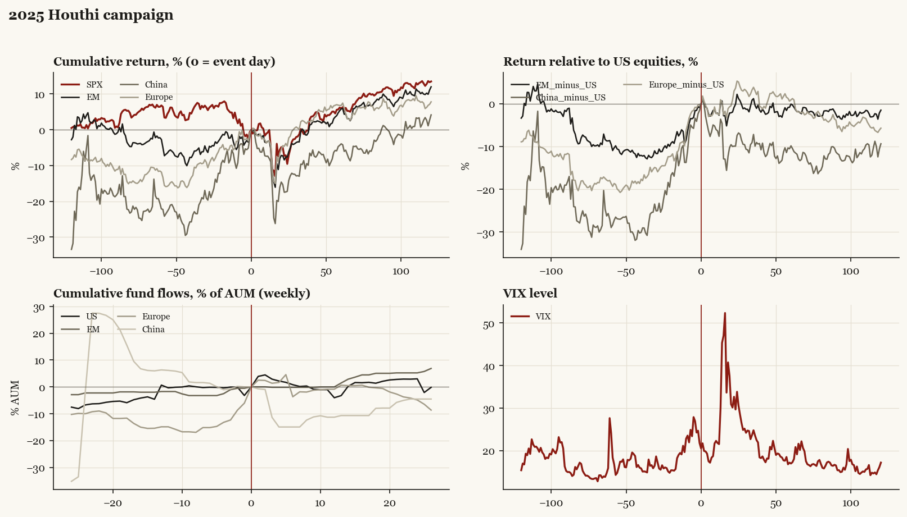

# 2025 Houthi campaign

*Trump2 administration. Outbreak/event 2025-03-15, no buildup window. Surprise; type: campaign.*

[Index](README.md)

## What moved

- Equities ran -6.8% over the 60 trading days into the event.
- The S&P 500 moved +5.9% over the following 60 trading days and +13.5% over 120.
- Cumulative net flows into US equity funds: -3.2% of assets in the 13 weeks after (vs -0.7% in the 13 weeks before).
- Cumulative net flows into emerging-market funds: +1.4% of assets in the 13 weeks after (vs +1.7% in the 13 weeks before).
- Cumulative net flows into Europe funds: +0.6% of assets in the 13 weeks after (vs +14.9% in the 13 weeks before).
- Cumulative net flows into China funds: -10.7% of assets in the 13 weeks after (vs -6.3% in the 13 weeks before).
- Implied volatility moved -0.1 VIX points across the event (from 21.8).
- Sustained campaign begins

## Detail

| series | runup pre-60d | +20d | +60d | +120d |
|---|---|---|---|---|
| SPX | -6.8% | -4.9% | +5.9% | +13.5% |
| US | -6.8% | -5.1% | +5.9% | +13.5% |
| EM | +2.7% | -7.2% | +5.8% | +12.0% |
| China | +22.1% | -14.6% | -3.9% | +4.2% |
| Taiwan | -7.1% | -10.2% | +9.6% | +18.4% |
| Europe | +11.8% | -5.5% | +6.8% | +7.8% |
| Japan | +2.7% | -6.1% | +3.6% | +13.0% |
| Bonds | +0.5% | -1.5% | -2.0% | +1.2% |
| Gold | +12.3% | +6.8% | +10.9% | +19.1% |
