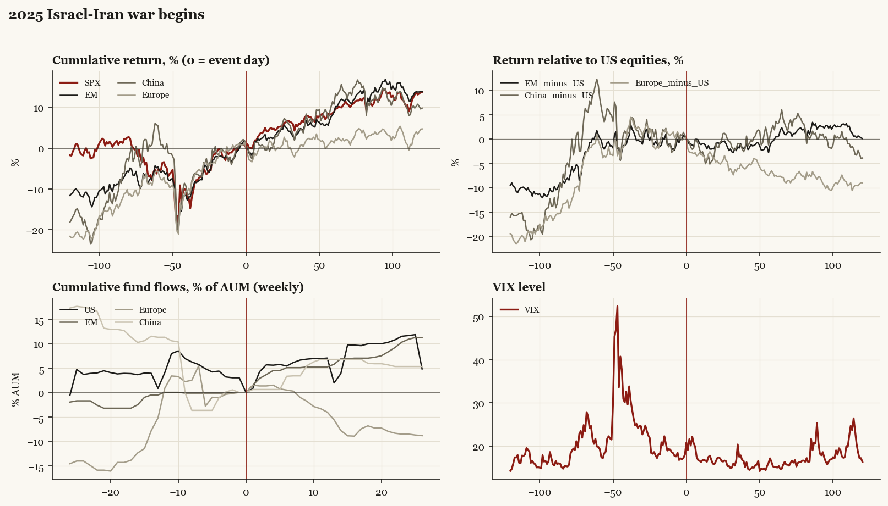

# 2025 Israel-Iran war begins

*Trump2 administration. Outbreak/event 2025-06-13, no buildup window. Surprise; type: third_party.*

[Index](README.md)

## What moved

- Equities ran +5.2% over the 60 trading days into the event.
- The S&P 500 moved +8.9% over the following 60 trading days and +13.7% over 120.
- Cumulative net flows into US equity funds: +1.9% of assets in the 13 weeks after (vs -0.8% in the 13 weeks before).
- Cumulative net flows into emerging-market funds: +5.8% of assets in the 13 weeks after (vs +0.5% in the 13 weeks before).
- Cumulative net flows into Europe funds: -5.6% of assets in the 13 weeks after (vs +5.2% in the 13 weeks before).
- Cumulative net flows into China funds: +6.8% of assets in the 13 weeks after (vs -11.3% in the 13 weeks before).
- Implied volatility moved +1.1 VIX points across the event (from 18.0).
- Oil spike; US ally war preceding US strike

## Detail

| series | runup pre-60d | +20d | +60d | +120d |
|---|---|---|---|---|
| SPX | +5.2% | +4.4% | +8.9% | +13.7% |
| US | +5.4% | +4.1% | +8.9% | +13.7% |
| EM | +4.6% | +3.2% | +8.8% | +13.8% |
| China | -5.5% | +3.1% | +10.8% | +9.8% |
| Taiwan | +10.8% | +4.2% | +11.3% | +14.4% |
| Europe | +5.7% | -0.6% | +1.2% | +4.7% |
| Japan | +2.6% | -2.6% | +8.8% | +12.8% |
| Bonds | -2.3% | -0.7% | +3.1% | +2.4% |
| Gold | +11.8% | -3.1% | +5.8% | +20.3% |
