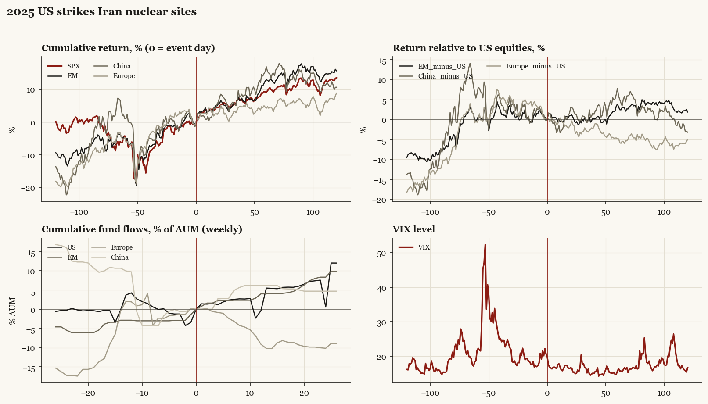

# 2025 US strikes Iran nuclear sites

*Trump2 administration. Outbreak/event 2025-06-22, buildup from 2025-06-13. Telegraphed; type: one_off.*

[Index](README.md)

## What moved

- Equities ran +5.3% over the 60 trading days into the event.
- The S&P 500 moved +9.1% over the following 60 trading days and +13.6% over 120.
- Cumulative net flows into US equity funds: +5.5% of assets in the 13 weeks after (vs -3.7% in the 13 weeks before).
- Cumulative net flows into emerging-market funds: +4.0% of assets in the 13 weeks after (vs +2.9% in the 13 weeks before).
- Cumulative net flows into Europe funds: -10.2% of assets in the 13 weeks after (vs -2.0% in the 13 weeks before).
- Cumulative net flows into China funds: +6.2% of assets in the 13 weeks after (vs -10.0% in the 13 weeks before).
- Implied volatility moved -3.1 VIX points across the event (from 20.6).
- Midnight Hammer night of 06-21/22 ET; ceasefire 06-24 relief rally

## Detail

| series | runup pre-60d | +20d | +60d | +120d |
|---|---|---|---|---|
| SPX | +5.3% | +4.6% | +9.1% | +13.6% |
| US | +5.4% | +4.7% | +9.1% | +13.9% |
| EM | +5.4% | +5.6% | +13.0% | +15.7% |
| China | -1.1% | +7.6% | +16.9% | +10.7% |
| Taiwan | +10.8% | +6.2% | +13.6% | +17.8% |
| Europe | +6.1% | +3.3% | +4.3% | +8.8% |
| Japan | +1.8% | +1.3% | +12.0% | +15.6% |
| Bonds | -0.7% | -0.0% | +2.7% | +1.6% |
| Gold | +11.2% | +1.6% | +8.0% | +23.5% |
