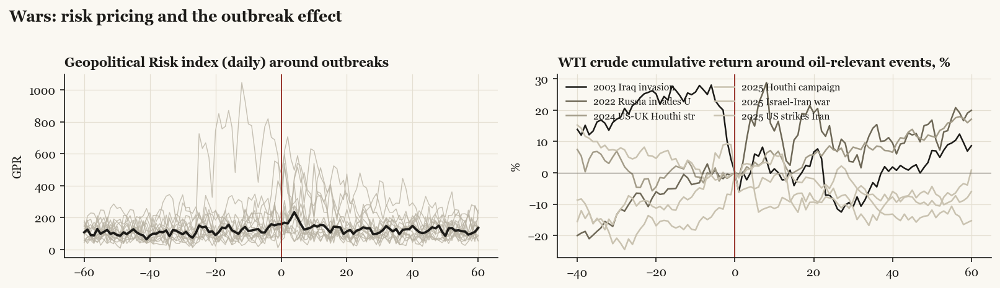

# Wars and military actions: summary

*Every US-relevant military event 2001-2025 through the same event-study lens.*

[Index](README.md)

## The war-puzzle test, event by event

| admin | event | date | kind | telegraphed | spx_buildup | spx_post20 | spx_post60 | oil_post20 | gpr_jump | war_puzzle |
|---|---|---|---|---|---|---|---|---|---|---|
| Bush | Afghanistan war begins | 2001-10-07 | campaign | yes | -2.0 | 3.7 | 9.2 | -11.5 | -27.0 | consistent |
| Bush | Iraq invasion | 2003-03-20 | campaign | yes | -1.3 | 2.0 | 14.3 | 6.6 | 186.7 | consistent |
| Obama | Libya intervention | 2011-03-19 | campaign | yes | -3.1 | 0.5 | -2.6 | 4.6 | 41.8 | consistent |
| Obama | bin Laden raid | 2011-05-02 | one_off | no | -- | -1.2 | -4.2 | -10.0 | 50.3 | consistent |
| Obama | Syria red-line stand-down | 2013-08-31 | threat_resolved | yes | -0.6 | 3.3 | 9.5 | -6.2 | 33.7 | consistent |
| Obama | Anti-ISIS strikes Iraq | 2014-08-08 | campaign | yes | -1.0 | 3.6 | 4.4 | -5.2 | 23.1 | consistent |
| Obama | Anti-ISIS strikes Syria | 2014-09-23 | campaign | yes | -0.6 | -2.1 | 1.5 | -10.0 | -8.6 | mixed |
| Trump1 | Shayrat strike (Syria) | 2017-04-07 | one_off | no | -0.2 | 1.8 | 3.2 | -11.8 | 45.9 | mixed |
| Trump1 | Douma response strikes (Syria) | 2018-04-14 | one_off | yes | 2.0 | 1.9 | 3.5 | 6.9 | 61.3 | mixed |
| Trump1 | Soleimani strike | 2020-01-03 | one_off | no | -- | 0.4 | -22.4 | -23.0 | 158.5 | consistent |
| Biden | Kabul falls / withdrawal | 2021-08-15 | withdrawal | yes | 2.6 | -0.8 | 4.5 | 4.6 | 30.4 | mixed |
| Biden | Russia invades Ukraine | 2022-02-24 | third_party | yes | -8.0 | 5.3 | -9.5 | 19.1 | 238.8 | consistent |
| Biden | Hamas attack / Gaza war | 2023-10-07 | third_party | no | -- | 0.7 | 7.8 | -6.7 | 83.6 | consistent |
| Biden | US-UK Houthi strikes | 2024-01-12 | campaign | yes | 0.9 | 4.9 | 7.6 | 5.7 | 14.3 | mixed |
| Trump2 | Houthi campaign | 2025-03-15 | campaign | no | -- | -4.9 | 5.9 | -9.4 | 29.7 | consistent |
| Trump2 | Israel-Iran war begins | 2025-06-13 | third_party | no | -- | 4.4 | 8.9 | -8.6 | 82.7 | mixed |
| Trump2 | US strikes Iran nuclear sites | 2025-06-22 | one_off | yes | -0.2 | 4.6 | 9.1 | -1.9 | 146.5 | consistent |

spx_buildup = S&P 500 log return from first credible threat to outbreak. war_puzzle marks whether the episode matches the buildup-down/outbreak-up pattern (telegraphed wars) or muted-to-negative initial reaction (surprise events). gpr_jump = change in daily Geopolitical Risk index, event week vs prior month.
