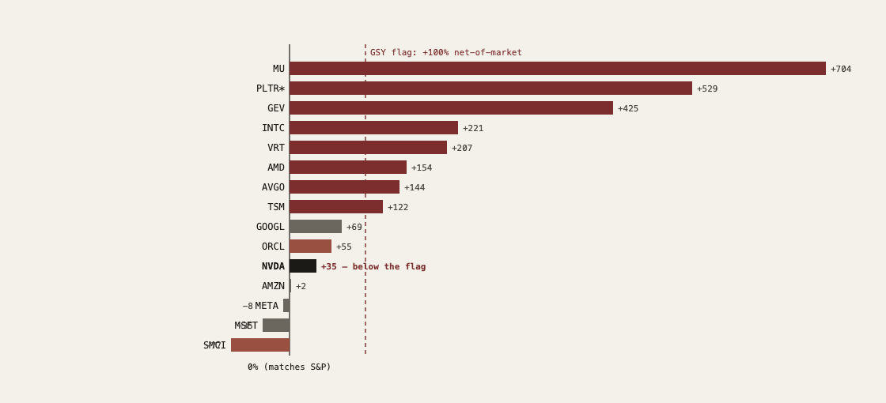

# 27 — The AI capital cycle: where are we, and what breaks the circle?

**The question.** A buildout this large has happened before — railways in the 1840s, electrification and radio in the 1920s, fiber in 1999. The technology was real every time; the capital was destroyed anyway. So I wanted to locate the 2024–26 AI buildout on that same clock and test three things separately, because each can be true or false on its own: (1) are the AI providers actually losing money, and in what sense; (2) is the financing genuinely *circular* — a loop where a chip vendor funds its own customers, who commit to clouds, who buy the chips; and (3) where on the historical cycle does this sit, and what specifically ends it. I built the value-chain map, reconstructed the deal stack from public reporting, and computed the equity internals myself from adjusted closes.

**Why it matters.** "AI is real" and "this is a capital bubble" are not opposing claims — historically they are the *same* claim, and conflating them is how investors lose money in both directions. If the losses live in the heavy-tail subscriber and the financing commitments rather than in the act of serving a token, then the bear case has to be stated precisely or it's wrong. If the fragility concentrates in the leveraged periphery rather than the cash-rich core, then "short AI" is the wrong trade and "know which layer you own" is the right one. And if the cycle turns on a financing refusal rather than a demand revelation, then the thing to watch is a refinancing calendar, not a usage chart.

> Research, not investment advice. Reconstructed lab financials are press estimates (The Information, Bloomberg, Fortune, CNBC, TechCrunch, company filings and newsrooms), not audited statements — directional only. The scenario weights and drawdown ranges are judgemental priors, not derived from a valuation model; the scenarios are *interacting mechanisms*, not a mutually-exclusive partition. The Greenwood-Shleifer-You screen is an industry-portfolio crash predictor; I apply its >100%-net-of-market threshold to single names as a *screen* (it flags candidates, it does not inherit the paper's calibrated crash odds). Equity figures are price/total return to 8 Jun 2026 computed from adjusted closes. Patterns, not predictions.

## What I found, up front

- **"They're losing money" is true in exactly one precise form.** Three layers, and conflating them is the common mistake. *Per token:* gross-margin-positive — OpenAI posted ~33% gross margin in 2025, Anthropic ~40%, both targeting >70% by 2027–29. *The heavy-tail subscriber:* negative by construction — a flat $200/month plan sold against unbounded usage is a free call option on compute (a power user can draw $5,000–$8,000 of compute at API list price on a $200 plan). *All-in:* deeply negative, but as a **choice** while the race runs — until commitments convert it to an obligation. OpenAI carries roughly **$1.15 trillion** of compute commitments against about **$13 billion** of 2025 revenue, and its own reported forecast is losses every year through 2028 (on the order of $74B operating loss in 2028) before a claimed swing to profit by 2030.

- **The circle is real and verifiable edge-by-edge.** Nvidia committed **>$40B of AI equity in the first four months of 2026** — into OpenAI ($30B, after a $100B headline that was cut), and into xAI, CoreWeave and Intel — i.e. it finances a material slice of its own demand, directly and through the chips that collateralise the debt other nodes use to buy more chips. OpenAI's $300B Oracle cloud deal, Microsoft's 27% stake + $250B Azure commitment, the AMD 6-gigawatt deployment with a 160M-share warrant, the $27B Meta/Blue Owl Hyperion SPV, the $12.5B-debt xAI GPU SPV with Nvidia equity inside it — the same expected cash flows are capitalised several times across the chain.

- **The financing has crossed the late-cycle line.** Cash (2023–24) → equity at scale (2025 H1: SoftBank $40B, the CoreWeave IPO) → **debt and SPVs** (2025 H2: data-center debt issuance roughly doubled to ~$182B; the largest private-credit deal ever) → bank debt to the labs themselves and the **first edge cuts** (2026 H1: Mistral's $830M bank facility; Nvidia–OpenAI cut from $100B announced to $30B actual; Stargate re-scoped from $1.4T to ~$600B with an own-to-rent pivot). That cash→equity→debt progression is what the 1847 and 2000 tops did just before they turned.

- **The equity internals say mid-to-late frenzy, and the tell is positional.** On a >100% two-year return *net of the S&P 500*, eight AI names flag the GSY screen — **MU +704, PLTR +529, GEV +425, INTC +221, VRT +207, AMD +154, AVGO +144, TSM +122** points of excess — but **Nvidia does not (+34)**, and Microsoft (−35) and Meta (−8) are already negative. The mania has migrated downstream into memory, power and the application layer while the bellwether shows no blow-off. That is the textbook late-1999 pattern (generals stall, secondaries melt up), and it disciplines the bear case: this is not yet a top.

- **What breaks it is a financing refusal, not a demand collapse — and the periphery breaks first.** Fragility ranks: CoreWeave-tier neoclouds (a $4.2B 2026 refinancing wall at 6–9%, one customer ~62–71% of revenue, collateral whose trailing-edge rental rates fell 50–70%), then Oracle (FCF −$23.7B, record CDS, $638B RPO concentrated in a cash-negative tenant — survives, but is the credit-transmission channel), then OpenAI's funding gap. The FCF-rich hyperscalers and the monopoly chokepoints (TSMC, ASML, the EDA duopoly) are not solvency stories; their risk is multiple compression.

- **An honest contradiction I kept rather than smoothed.** "GPU collateral is collapsing" is only half true: trailing-edge and speculative-vintage capacity deflated 50–70%, but current-generation H100 one-year rental prices *rose ~40%* into 2026 on a genuine shortage. Both are true at different points on the curve — which means the near-term risk is a **refinancing event, not an asset-value event**.

- **Every analog says the same thing.** Telecom 1999: Lucent/Nortel/Cisco extended billions in vendor financing, 33–80% of which went uncollected; <5% of the fiber was ever lit; Cisco survived but fell ~86% and took ~21 years to reclaim its high, while Amazon fell ~94% then won the next decade. Railways 1847: capex hit ~7.3% of GDP (today's AI is ~2%), shares fell ~50%, dividends came in at 1.83% against a 10% dream, and the network still got built. The pattern is invariant: **the technology wins, the first-cycle capital is destroyed, and the eventual equity winners are mostly born in the wreckage.**

**The short version.** This is a real general-purpose technology being financed like a mania. We're in the mid-to-late frenzy: the financing mix has gone late-cycle, the periphery is already flagging crash-risk signals while the core has not, and the trigger to watch is a credit/refinancing refusal — most concretely CoreWeave's 2026 refinancing wall, because it matures on a calendar, not on sentiment. The investable conclusion is positional, not directional: respect the cash-flow-real core, underweight the leveraged periphery, and own the toll-road survivors — not "short AI."

## Method

- **Value-chain map.** A 28-layer semiconductor/AI/power graph (EDA → IP → equipment → foundry → packaging → memory → fabless compute → ODM → neocloud → hyperscaler, plus a power-generation/grid overlay), with typed, weighted edges. Nvidia's heaviest *customer* edges run to its most fragile customers (Super Micro, CoreWeave); its demand is driven by hyperscaler capex and bottlenecked upstream by a single foundry (TSMC) and a 3-player HBM oligopoly.
- **Deal reconstruction.** Every edge in the money map carries a dollar amount and a structure (cash / equity / debt / SPV), each from public company filings, newsrooms, or major-press reporting, with the Nvidia–OpenAI edge shown at $30B actual against the $100B headline that was cut.
- **Equity internals.** Two-year and one-year returns and annualised volatility for a 17-name AI basket plus SPY/QQQ benchmarks, from adjusted closes, screened against the Greenwood-Shleifer-You >100%-net-of-market threshold. The two figures below are generated from that computation.
- **Adversarial pass.** A red-team review of the synthesis forced ~20 corrections (count reconciliations, removal of overstated labels like "Ponzi" and "perfect competition," and the GSY unit-of-analysis caveat above), all folded into the result.

## Figures

## Academic anchors

The cycle literature this leans on, each public: Greenwood, Shleifer & You, *Bubbles for Fama* (JFE 2019) for the crash-risk screen; Pástor & Veronesi, *Technological Revolutions and Stock Prices* (AER 2009) for why a real technology and a bubble coexist; Ofek & Richardson, *DotCom Mania* (JF 2003) for the lockup/supply-event mechanism (watch the AI IPO wave); Teece, *Profiting from Technological Innovation* (1986) for who actually captures the rents when open weights make imitation cheap; Acemoglu, *The Simple Macroeconomics of AI* (2025) for the demand-side reality check; and the Perez / Minsky / Kindleberger frameworks for the installation→frenzy→turning-point arc.
