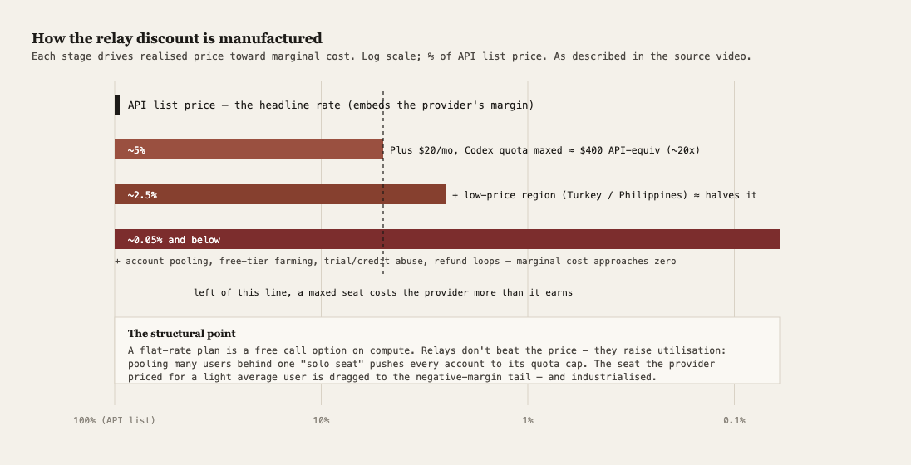
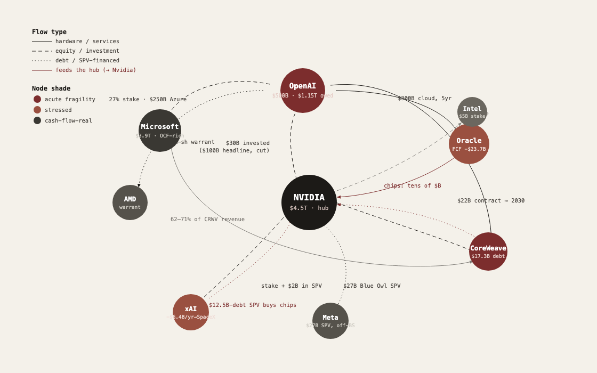
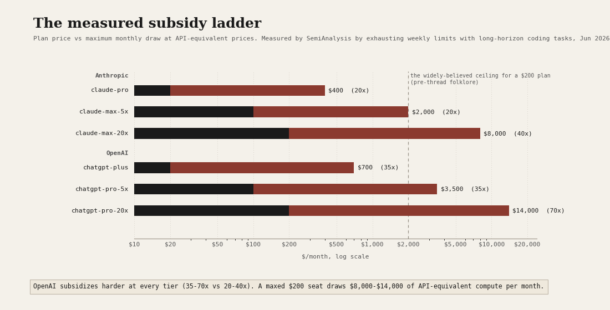
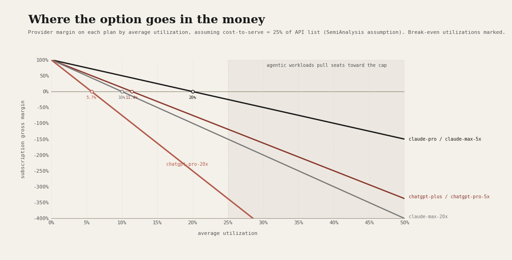
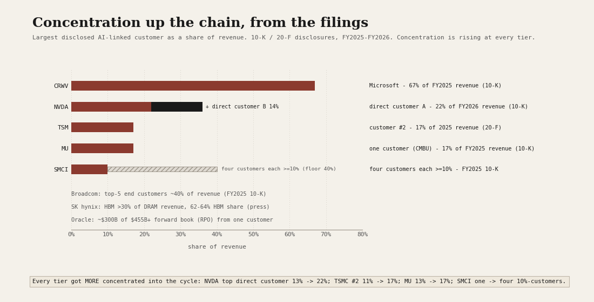
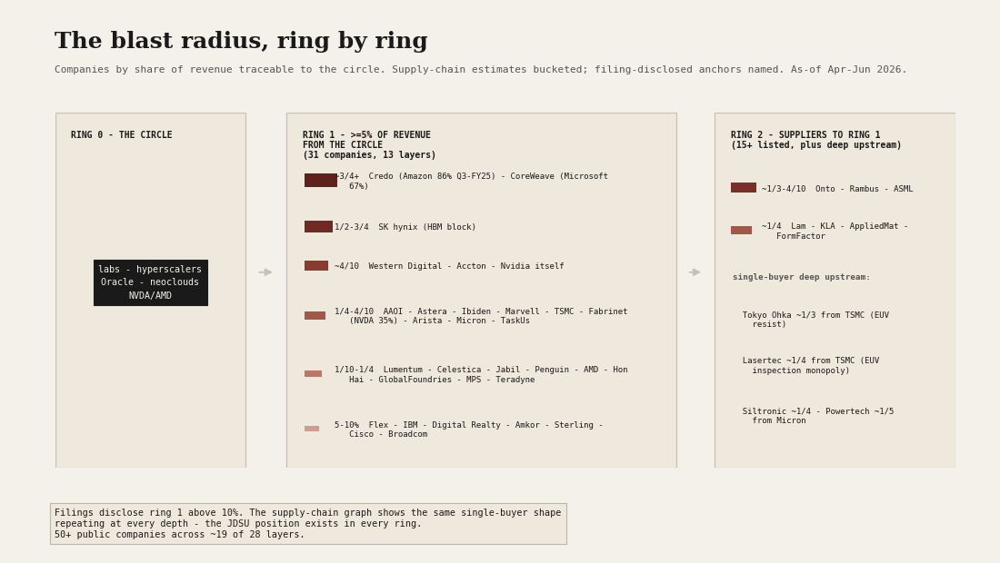
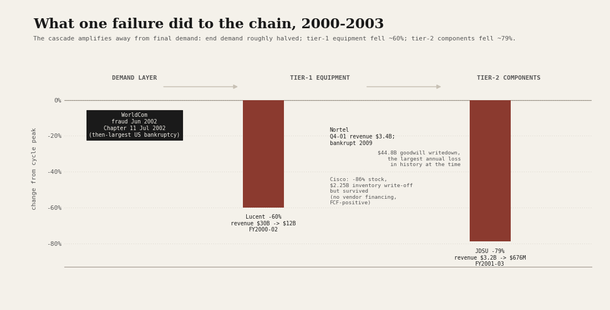

# 27 — The AI capital cycle: where are we, and what breaks the circle?

**The question.** A buildout this large has happened before — railways in the 1840s, electrification and radio in the 1920s, fiber in 1999. The technology was real every time; the capital was destroyed anyway. So I wanted to locate the 2024–26 AI buildout on that same clock and test three things separately, because each can be true or false on its own: (1) are the AI providers actually losing money, and in what sense; (2) is the financing genuinely *circular* — a loop where a chip vendor funds its own customers, who commit to clouds, who buy the chips; and (3) where on the historical cycle does this sit, and what specifically ends it. I built the value-chain map, reconstructed the deal stack from public reporting, processed a field-investigation video on the gray-market resale economy, and computed the equity internals myself from adjusted closes.

**Why it matters.** "AI is real" and "this is a capital bubble" are not opposing claims — historically they are the *same* claim, and conflating them is how investors lose money in both directions. If the losses live in the heavy-tail subscriber and the financing commitments rather than in the act of serving a token, the bear case has to be stated precisely or it's wrong. If the fragility concentrates in the leveraged periphery rather than the cash-rich core, then "short AI" is the wrong trade and "know which layer you own" is the right one. And if the cycle turns on a financing refusal rather than a demand revelation, the thing to watch is a refinancing calendar, not a usage chart.

> Research, not investment advice. Reconstructed lab financials are press estimates (The Information, Bloomberg, Fortune, CNBC, TechCrunch, company filings and newsrooms), not audited statements — directional only. The scenario weights and drawdown ranges are judgemental priors, not derived from a valuation model; the scenarios are *interacting mechanisms*, not a mutually-exclusive partition. The Greenwood-Shleifer-You screen is an industry-portfolio crash predictor; I apply its >100%-net-of-market threshold to single names as a *screen* (it flags candidates, it does not inherit the paper's calibrated crash odds). Equity figures are price/total return to 8 Jun 2026 from adjusted closes. Every claim drawn from the source video below was independently re-verified against public primary sources; where a figure is the video creator's own arithmetic, or an allegation by a competitor, or disputed, I say so inline. Patterns, not predictions.

## What I found, up front

- **"They're losing money" is true in exactly one precise form.** Three layers, and conflating them is the common mistake. *Per token:* gross-margin-positive — OpenAI posted ~33% gross margin in 2025, Anthropic ~40%, both targeting >70% by 2027–29. *The heavy-tail subscriber:* negative by construction — a flat $200/month plan sold against unbounded usage is a free call option on compute. *All-in:* deeply negative, but as a **choice** while the race runs — until commitments convert it to an obligation. OpenAI carries roughly **$1.15 trillion** of compute commitments against about **$13 billion** of 2025 revenue, and its own reported forecast is losses every year through 2028 (on the order of $74B operating loss in 2028) before a claimed swing to profit by 2030.

- **There is a live, industrial market that proves the negative-margin tail is real — and it is being shut down in real time.** A months-long field investigation (a widely-viewed June 2026 Chinese video, cross-checked below against primary sources) documents "relay stations" reselling Western model access at roughly 3–10% of list price. The mechanism is not a cheaper model — it is *utilisation arbitrage*: pooling many users behind one flat-rate "seat" and dragging it to its quota cap. This is the clearest real-world evidence that flat-rate consumer pricing is underwater on heavy use, and it doubles as the channel competitors allege was used to distill their models. Full deep-dive below; it's the heart of this study.

- **The circle is real and verifiable edge-by-edge.** Nvidia committed **>$40B of AI equity in the first four months of 2026** — into OpenAI ($30B, after a $100B headline that was cut), and into xAI, CoreWeave and Intel — i.e. it finances a material slice of its own demand, directly and through the chips that collateralise the debt other nodes use to buy more chips. OpenAI's $300B Oracle cloud deal, Microsoft's 27% stake + $250B Azure commitment, the AMD 6-gigawatt deployment with a 160M-share warrant, the $27B Meta/Blue Owl Hyperion SPV, the $12.5B-debt xAI GPU SPV with Nvidia equity inside it — the same expected cash flows are capitalised several times across the chain.

- **The financing has crossed the late-cycle line.** Cash (2023–24) → equity at scale (2025 H1: SoftBank $40B, the CoreWeave IPO) → **debt and SPVs** (2025 H2: data-center debt issuance roughly doubled to ~$182B; the largest private-credit deal ever) → bank debt to the labs themselves and the **first edge cuts** (2026 H1: Mistral's $830M bank facility; Nvidia–OpenAI cut from $100B announced to $30B actual; Stargate re-scoped from $1.4T to ~$600B with an own-to-rent pivot). That cash→equity→debt progression is what the 1847 and 2000 tops did just before they turned.

- **The equity internals say mid-to-late frenzy, and the tell is positional.** On a >100% two-year return *net of the S&P 500*, eight AI names flag the GSY screen — **MU +704, PLTR +529, GEV +425, INTC +221, VRT +207, AMD +154, AVGO +144, TSM +122** points of excess — but **Nvidia does not (+34)**, and Microsoft (−35) and Meta (−8) are already negative. The mania has migrated downstream into memory, power and the application layer while the bellwether shows no blow-off. That's the textbook late-1999 pattern (generals stall, secondaries melt up), and it disciplines the bear case: this is not yet a top.

- **What breaks it is a financing refusal, not a demand collapse — and the periphery breaks first.** Fragility ranks: CoreWeave-tier neoclouds (terminal balance sheet: 93% liabilities/assets, −$9.1B free cash flow and ~$22B of debt on ~$5B of revenue; a $4.2B 2026 refinancing wall at 6–9%, one customer ~62–71% of revenue, collateral whose trailing-edge rental rates fell 50–70%), then Oracle (free cash flow now −$35.1B on 84% liabilities/assets and ~$130B of debt — deepened from the −$23.7B reported at first publication as the build accelerated — with record CDS and a $638B RPO concentrated in a cash-negative tenant; survives, but is the credit-transmission channel), then OpenAI's funding gap. The FCF-rich hyperscalers and the monopoly chokepoints (TSMC, ASML, the EDA duopoly) are not solvency stories; their risk is multiple compression.

- **Every analog says the same thing.** The technology wins, the first-cycle capital is destroyed, and the eventual equity winners are mostly born in the wreckage.

- **The subscription subsidy is now measured, not inferred.** SemiAnalysis ran the Anthropic and OpenAI plans to the weekly cap; max draw is 20-70x plan price, with break-even utilization as low as 5.7%.
- **Agents are the utilization pump.** Relays dragged seats to 100% utilization illegally; long-horizon agents do the same work natively, so the risk is distribution shift, not one average-user estimate.
- **The retreat is already on tape.** Copilot token billing, Claude Code's Pro-plan test, Codex API-token pricing and OpenAI's Plus-to-Go forecast all point to bifurcation before a public nerf.
- **Filings show concentration rising at every tier:** the first-order stress floors run from -8.5% to -33.5% on a 50% capex cut and up to -67% on a single-payer failure; the 2000 control says the chain amplifies from roughly -60% tier-1 to -79% tier-2, with casualties where concentration, leverage and same-cycle collateral overlap.
- **The radius is 50+ companies, not seven.** The supply-chain graph puts 31 companies at 5%+ of revenue directly from the circle (13 layers) and 50+ across ~19 of 28 layers once the suppliers' suppliers are counted — with the single-buyer shape repeating at every depth (Credo/Amazon 86% at ring 1; Tokyo Ohka and Lasertec via TSMC at ring 2).

---

## The relay-station economy: the negative-margin tail, industrialised

The single richest piece of primary evidence in this study is a months-long field investigation by a Chinese technology creator (LinYi / 林亦), published to YouTube on 5 June 2026, into the gray-market "relay stations" (中转站) that resell access to Western frontier models — ChatGPT, Claude — at a fraction of list price. I transcribed the audio, built a timestamped claim ledger, and then put every load-bearing claim through an independent verification pass against public primary sources. What follows separates **verified fact** from **the creator's own arithmetic** from **disputed figures**, because the distinction is the whole point.

### How the discount is manufactured

The relay price is not a cheaper model hiding behind a proxy. It is the *same* model, reached through a stack of arbitrages, each of which drives the realised price toward the provider's marginal serving cost and then past it:

1. **Subscription-vs-API arbitrage.** Codex is included in a $20/month ChatGPT Plus plan with real five-hour and weekly quotas (OpenAI's own help docs; OpenAI repriced Codex onto an API-token basis on 2 April 2026). A user who fully consumes that quota extracts far more than $20 of API-equivalent usage — the creator's figure is ~$400/month, a ~20x gap he calls "0.5折" (5% of list). *Framing: the **direction** is well-supported — OpenAI itself pegs Codex at ~$100–200/developer/month and press describes the same tier costing "$40 or $400 depending on usage" — but the precise "$400 maxed" and the "20x" multiple are the creator's arithmetic, not a published constant.*
2. **Regional pricing.** Buying the subscription in a low-price region (Turkey ~$11, Philippines ~$16 vs the $20 US list; OpenAI also runs an official ~$4.60 "ChatGPT Go" tier in some markets) roughly halves the cost again. *Verified that official regional price differences exist and that Turkey is ~half; the stacked "0.25折 / 2.5%" is the creator compounding two discounts.*
3. **Account pooling and farming.** Operators pool many subscription accounts behind one endpoint and auto-rotate when one is rate-limited or banned; the cheapest tiers ride free-trial credits, education/startup-program credits, and short-lived "daily-run" accounts. Open-source relay software that implements exactly this pooling/load-balancing architecture is openly distributed on GitHub. *Verified that the software and the architecture exist; the "dozens-to-hundreds of accounts per endpoint" scale is the creator's / the tools' own characterisation, not independent reporting.*

That consumer subscription access can be reused as a programmable API surface is not fringe — it's documented and semi-blessed. When OpenAI launched GPT-5.5 in April 2026 initially behind ChatGPT-subscription auth, Simon Willison published a plugin that reverse-engineers the Codex auth flow to run arbitrary prompts from a subscription, and OpenAI's own staff publicly endorsed "use Codex with your ChatGPT subscription wherever you like." The relay operators simply industrialised that.

### Why this is a unit-economics problem, not a curiosity

The structural point survives even after you strip the gray market away: **a flat-rate plan is a free call option on compute, and the relay economy is what happens when someone exercises the option at scale.** Subscription pricing assumes most users sit well below their quota. Pooling many users behind one "solo seat" pushes every account to its cap — converting the seat the provider priced for a light average user into the negative-margin tail, and doing it industrially.

How deep is that tail? Specialist analysts (SemiAnalysis, via trade press) report that a $200/month Claude Max user *can draw* $5,000–$8,000 of usage in a month at API list price, and that the $20 Pro tier is "roughly break-even on average users but significantly underwater on heavy users." Anthropic itself ran a test removing Claude Code from the $20 Pro tier for new users — corroborating that the heavy tier is a loss-leader. *(Since first publication, SemiAnalysis has measured this directly by maxing out every plan: $8,000 for the $200 Claude tier, $14,000 for the $200 ChatGPT tier — see [The subsidy ledger](#the-subsidy-ledger-who-is-long-the-cheap-tokens-and-who-eats-it-when-they-stop) below.)*

**But carry the rebuttal, because it matters.** A named public critique (Martin Alderson) argues the "$5,000–$8,000" is *retail-API-equivalent value*, not Anthropic's actual cost to serve — which he estimates at closer to ~$500/month (roughly 10% of retail), consistent with analysts modelling internal serving cost at 30–50% of API price. So the honest statement is narrow: **the heavy flat-rate user is gross-margin-negative against the price the provider charges itself for that compute, and the gray market industrialises exactly that user — but "$5–8k of provider cost per user" overstates it; the true cost gap is smaller, and serving a token remains gross-positive on average.** That nuance is the difference between "AI is structurally unprofitable" (false) and "flat-rate consumer pricing has a negative-margin tail that arbitrage attacks" (true).

### The gray market is parasitic, not merely leaky

The cheapness is not clean arbitrage. Independent reporting attributes a large part of it to outright fraud (unpaid post-paid accounts, stolen keys, refund loops) and to model substitution (selling a cheaper or quantised model as the premium one). And the relays themselves prey on their users. A peer-reviewed-track academic study — Liu, Shou, Wen, Chen, Fang & Feng, *"Your Agent Is Mine: Measuring Malicious Intermediary Attacks on the LLM Supply Chain,"* arXiv:2604.08407 (submitted 9 April 2026, targeting ACM CCS 2026) — purchased 28 paid relay routers and collected 400 free ones (428 total) and found:

- **9 routers injected malicious code** into the tool-call JSON the model returns (1 of the 28 paid; 8 of the free);
- **17 routers touched planted AWS canary credentials** — all in the free-router set;
- **1 router drained ETH** from a researcher-owned honeypot wallet key — also a free router.

The honest one-liner: **roughly 1 in 30 paid relays tampered with tool calls, while the credential-theft and wallet-drain incidents occurred in the free-router population.** (A secondary site inflated the loss to "$5 million"; that figure is not in the paper — dropped.) The general risk class is independently well-documented: OWASP catalogues malicious MCP/proxy intermediaries, and in March 2026 a malicious `LiteLLM` PyPI package was caught exfiltrating AWS and crypto credentials. The takeaway for the thesis: this is a structurally unstable, adversarial market — which is *why* it invites the escalating provider and regulatory countermeasures below, and why its cheapness cannot be extrapolated as a stable new price level.

### The same plumbing carries the distillation fight

The relay/router layer is also where the model-theft accusations land — and the connection is not my inference, it's verbatim. In a blog post on 23 February 2026, **Anthropic alleged** that Chinese labs DeepSeek, Moonshot (Kimi) and MiniMax used roughly **24,000 fraudulent accounts and over 16 million exchanges** to distil Claude (per-lab: DeepSeek >150k exchanges, Moonshot >3.4M, MiniMax >13M), and explicitly tied it to "**commercial proxy services which resell access to Claude and other frontier AI models at scale**" — the same relay ecosystem the video investigates. Days earlier, **OpenAI's memo** (12 February 2026) to the U.S. House Select Committee on the CCP alleged DeepSeek used "**obfuscated third-party routers**" to circumvent access controls.

**Framing, firmly:** these are *allegations by direct competitors*, self-published or submitted to an advocacy venue, with no neutral adjudication and no response from the accused labs — and the timing coincides with an AI-chip-export-control debate. State them as "Anthropic alleges / OpenAI's memo asserts," never as established fact. What *is* verified fact is that the statements were made, with those figures, and that DeepSeek separately cut its flagship V4 API price ~75% and left the lower price standing (confirmed against DeepSeek's own API docs). Note too what the video does *not* claim: it describes relay access and resale, **not** training-data capture — the distillation story is a separate, public one that happens to run through the same pipes.

### The providers are fighting back — and that's the tell

If this were a stable equilibrium, the incumbents would tolerate it. They are not. The countermeasures form a clean two-year arc (and should be dated as such, not collapsed into one event):

- **2025:** OpenAI moved API billing to prepaid (≈early 2024) to kill the post-paid "free-meal" wave; Anthropic introduced **weekly rate limits** (announced 28 July 2025, effective late August) with its own stated rationale citing "**sharing accounts and reselling access**"; and per Anthropic's public Transparency Hub it **deactivated ~1.45 million accounts in H2 2025**, with ~52,000 appeals and only ~1,700 overturned.
- **2026:** Anthropic blocked third-party/consumer-OAuth reuse of Claude *subscriptions* (distinct from API), and sent legal requests to open-source projects to remove subscription-calling code (visible as a GitHub pull request titled "anthropic legal requests"); selective KYC appeared on some plan sign-ups; OpenAI enforced OAuth restrictions in April.

Anthropic's own "reselling access" language ties the enforcement directly to the relay phenomenon. The investment reading: **the arbitrage is transient and under active counter-attack.** That cuts two ways — it caps the margin bleed, but it also means the headline usage growth that helps justify the valuations is partly gray-market demand that the providers are themselves switching off.

### What the relay economy tells you about the cycle

Three thesis-level signals fall out of it:

1. **Token prices are collapsing toward marginal cost while capex accelerates** — the dot-com carriers' exact bind. GPT-4-32K listed near $60/M tokens; current frontier input is ~$2.50/M — roughly a 24x decline in input pricing in three years (inference price for *fixed* capability has fallen even faster, on the order of ~50x/year by Epoch AI's measure). The relay market is just the sharpest expression of price racing to cost.
2. **The China substitution is real and fast.** Per OpenRouter's own data, Chinese open-source models grew from ~1.2% of weekly platform tokens in late 2024 to a ~13% one-year average, peaking near 30% in some 2025 weeks. (The widely-quoted "61%" is Chinese models' share *among the top-10 models in a single Feb–Mar 2026 week* — not a full-platform figure, which was ~44% that week; I flag the conflation because it's everywhere.) Western API pricing power is being competed away from below.
3. **The market is bigger than the relay sideshow but governed by the same economics.** The AI-API market is sized around $48.5B (2024) heading to ~$247B (2030) by Grand View Research — a large, fast-growing pool in which realised price is being dragged toward serving cost by competition, open weights, and exactly the kind of arbitrage the relays automate.

The relay-station economy, in one line: **it is the negative-margin tail of flat-rate AI pricing, discovered and industrialised by the market, parasitic enough to be unstable, and already being shut down — which tells you both that the unit economics are real and that the usage they inflate is partly being switched off.**

---

## The circle, quantified

The popular "AI money machine" picture — provider buys GPUs, chip vendor invests in provider, provider commits to a cloud, cloud buys GPUs — is real, and every edge carries a dollar figure and a structure.

Two things are true at once. **First**, Nvidia sits at the centre of a loop in which it finances a material slice of its own demand — directly, through >$40B of equity into OpenAI/xAI/CoreWeave/Intel in four months of 2026, and indirectly, because its chips are the collateral for the debt other nodes raise to buy more of its chips. The same expected AI cash flows are capitalised several times across Nvidia, Oracle, AMD, Microsoft and the private marks. **Second**, the fragility is not uniform: the leverage sits in the periphery (CoreWeave-class neoclouds, Oracle, OpenAI's funding gap), while the FCF-rich hyperscalers and the monopoly chokepoints do not carry it. The circle is real; it is not uniformly fragile; and that asymmetry is the whole investable point.

A structural contradiction I kept rather than smoothed: "GPU collateral is collapsing" is only half true. Trailing-edge and speculative-vintage capacity deflated 50–70%, but current-generation H100 one-year rental prices *rose ~40%* into 2026 on a genuine shortage. The near-term risk is therefore a **refinancing event, not an asset-value event** — the problem is rolling $4.2B of CoreWeave debt at 6–9% when the lender re-underwrites, not GPUs going to zero.

## Where we are on the clock

Stage placement, by the most reliable marker — the financing mix. Cash gave way to equity in 2025 H1, equity to debt and SPVs in 2025 H2, and by 2026 H1 the labs themselves are taking bank debt while the first vendor-financing edges are being cut. That cash→equity→debt progression is precisely what preceded the 1847 railway top and the 2000 telecom top, both of which turned not when demand visibly disappointed but when the *marginal financier repriced*.

The honest disanalogy: by capex-to-GDP, the AI buildout (~2% of US GDP) is roughly double telecom's 2000 peak but far below the railway mania's ~7.3% — so by that single yardstick the frenzy has historical room. By financing maturity, it looks later. I weight financing maturity, because that is what has historically rung the bell — but I flag the disagreement rather than hide it. And Nvidia at ~30x forward earnings is nothing like Cisco at ~130x in 2000; the valuation excess is in the periphery, not the core.

The analogs, briefly: in telecom 1999, Lucent/Nortel/Cisco extended billions in vendor financing of which 33–80% went uncollected, under 5% of the laid fiber was ever lit, Cisco fell ~86% and took ~21 years to reclaim its high while Amazon fell ~94% then won the next decade. In the 1840s railways, capex hit ~7.3% of GDP, shares fell ~50%, dividends came in at 1.83% against a 10% dream — and the network still got built. The pattern is invariant: the technology wins, the first-cycle capital is destroyed, the eventual winners are mostly born in the wreckage.

## How it breaks, and who survives

Four interacting paths, not a partition: (1) a **credit/refinancing refusal** leads — private credit reprices neocloud and Oracle paper, the buildout slows, the periphery falls 60–80% and credit transmits to the broad market; (2) a **demand shortfall** becomes visible first (enterprise ROI disappoints) and equity leads credit down over ~18 months; (3) a **China/commoditisation shock** collapses pricing power further (the relay/open-weights dynamic above); or (4) a **muddle-through productive bubble** where financing stays open long enough for agentic inference demand to grow into the capacity and the periphery corrects name-by-name without a systemic event. A >30% drawdown in the leveraged periphery within eight quarters is more likely than not (CoreWeave and SMCI are already well off their highs); whether it transmits to an index-level event is closer to a coin-flip and hinges almost entirely on the credit channel.

Survivors, mapped onto the dot-com cast: Nvidia is **Cisco** (franchise survives and leads; the multiple is the risk, not the franchise); CoreWeave-tier neoclouds are **Lucent/Nortel** (the vendor financiers that don't make it; their GPUs and data centres become the cheap substrate of the deployment phase); the lab that keeps control from its creditors is **Amazon** (down hard, then compounds); and the biggest equity winner of the deployment phase is probably **the 2028 startup that doesn't exist yet**, renting compute at cents on the dollar from the wreckage. Structural winners regardless: TSMC (the toll road), the EDA/lithography monopolies, and whoever owns distribution and workflow lock-in.

---

## The subsidy ledger: who is long the cheap tokens, and who eats it when they stop

A SemiAnalysis thread of 10 June 2026 turns the "free call option on compute" framing from trade-press folklore into measured data. SemiAnalysis bought one of each Anthropic and OpenAI subscription plan, then ran long-horizon coding tasks until the weekly limit was exhausted. The headline is no longer just "a $200 Claude Max seat can draw $5,000-$8,000" at API list. It is 20-70x measured multiples, with $200 seats drawing $8,000 on Claude Max and $14,000 on ChatGPT Pro.

### The measured option

**Measured fact:** SemiAnalysis measured maximum draw, not average subscriber use. The upgrade is precise: the $5,000-$8,000 Claude Max range becomes a measured $8,000 for `claude-max-20x`, and OpenAI's comparable tier reaches $14,000. The asymmetry is measured too: Anthropic plans sit at 20-40x API-equivalent value, while OpenAI's sit at 35-70x.

The break-even math is the discipline. SemiAnalysis assumes API list carries a 75% gross margin, so cost-to-serve is 25% of API-equivalent value:

`margin(u) = 1 - u * 0.25 * max_spend / price`

For `chatgpt-pro-20x`, the break-even utilization is `200 / (0.25 * 14000) = 0.057`, or 5.7%. At 10% utilization, margin is `1 - 0.10 * 0.25 * 14000 / 200 = -0.75`. That means the seat is already at a negative 75% subscription margin before anything like full utilization. Across the six plans, break-even utilization ranges from 5.7% to 20%.

**Framing:** the subsidy scales with the cost basis. SemiAnalysis assumes 75% API gross margin; the Alderson rebuttal argues internal cost can be closer to 10% of retail, while other analysts model 30-50% of API price. Under any of those bases, the heavy-tail seat is underwater; only the hole size changes.

### Agents are the utilization pump

SemiAnalysis maxed the seats with long-horizon coding agents, which is exactly where mainstream usage is moving. The relay economy industrialised 100% utilization illegally by pooling users behind one seat. Agents do the same economic work natively and legally: they keep working until the quota stops them.

So the average-utilization distribution should drift right over time. I cannot observe it from outside, and neither can anyone else using public data. The honest way to show the risk is a scenario grid, not a point estimate:

| ChatGPT Plus utilization | Annual margin per subscriber | 44M Plus-seat annual margin |
|---:|---:|---:|
| 5% | $135 | $5.9B |
| 10% | $30 | $1.3B |
| 15% | -$75 | -$3.3B |
| 20% | -$180 | -$7.9B |
| 30% | -$390 | -$17.2B |

Those are arithmetic sensitivities, not a forecast. But the mechanism is clear: agents push seats from light use toward heavy use, and the option goes in the money on more of the fleet.

### The retreat has already started

SemiAnalysis tweet 4/4 predicted the quiet exit: labs would withhold new features and models from subscriptions rather than explicitly nerf them, and it would be "interesting to see if Mythos ends up being API only." The tape corroborates it. Microsoft is moving all GitHub Copilot subscribers to token billing starting June 2026. Anthropic briefly removed Claude Code from the $20 Pro plan for new users on 21 April 2026. OpenAI moved Codex to API-token pricing on 2 April 2026. The Information, via Ed Zitron and WSJ reporting, has OpenAI forecasting Plus subscribers falling from 44M to 9M while ChatGPT Go, the $8 ad tier, fills the gap.

There are only two endgames. **Subsidy ends by price:** plans bifurcate, frontier agents go API-only, and heavy users are repriced. **Subsidy ends by cost:** Epoch AI's roughly 50x/year inference deflation catches up fast enough that a $20 plan can profitably serve an Opus-4.8-class model "in the near future." The race is cost deflation against agentic usage growth.

### The rental tape is the live gauge

The missing bridge between the subscription subsidy and the credit event is the GPU rental price. Subsidized flat-rate seats manufacture inference demand; inference demand keeps clusters utilized; utilization supports the rental rate; and the rental rate is the cash yield lenders underwrite against neocloud collateral. That is the chain to watch: cheap seats, then rental yield, then refinancing math.

**Measured fact:** SemiAnalysis's H100 rental index, in its public "The Great GPU Shortage - Rental Capacity" work, is the exact series behind the study's existing "+40% into 2026" claim. H100 one-year contract pricing rose almost 40%, from a low of $1.70/hr/GPU in October 2025 to $2.35/hr/GPU by March 2026. **Framing:** that is not proof that consumer subscriptions drove the move. SemiAnalysis attributes the tightening mostly to frontier training and committed lab demand, and I cannot isolate the subsidy contribution from outside. The honest claim is narrower: if subsidized inference demand is helping hold up utilization at the margin, the rental tape is where that help should show.

The opposite phase matters just as much. SemiAnalysis's earlier AI Neocloud Playbook and ClusterMAX work documented H100 rental price drops accelerating from mid-2024, a cooled-off GPU rental market, and a buyers' market in Hopper-class capacity; the DeepSeek launch gave H200 rates only momentary stabilization. AIMultiple's 2026 cross-provider index across 37 providers puts the H100 cohort median around $2.95/GPU-hour, down from above $7 earlier in the cycle. That is the two-track market: older-vintage and on-demand rates deflated hard, while frontier-generation capacity is tight.

**Press-reported / analyst-estimated tape:** SemiAnalysis reports customers fighting to pay $14/hr/GPU for B200 spot instances on AWS, with some neocloud giants no longer selling single nodes, while estimating OpenAI pays roughly $2.80 per GPU-hour on its first GB200 cluster against TCO of about $2.38/hr at full cluster scale. So the refi question is not "are GPUs worthless?" It is whether the cash yield on the specific collateral vintage still supports the debt stack.

If the subsidy is switched off by repricing or bifurcation, demand revelation prints here first. Watch the H100/B200 one-year contract rate: it is the single number that tells me whether the manufactured demand layer is being switched off.

### The exposure ladder

| Rank | Who | Mechanism when the circle breaks | Severity |
|---:|---|---|---|
| 1 | Subscription-priced agentic tooling users and the heavy-tail prosumer | At the cap, the 25% cost basis implies a 5-17.5x cost load (`max_spend*0.25/price`); at API list, repricing is the full 20-70x. | Highest: direct price shock or feature loss |
| 2 | The relay/gray-market economy | The arbitrage needs cheap subscription seats, account pooling and weak enforcement; enforcement is already killing it. | Instant zero |
| 3 | OpenAI | The subsidy lives in its consumer-heavy revenue line; OpenAI has the deepest multiples, a press-reported -122% adjusted operating margin in Q1 2026, and an already conceded Plus-to-Go migration. | Valuation-narrative shock |
| 4 | App-layer/wrapper startups whose unit economics assume subsidized tokens | Copilot's move shows even the largest coding distributor is abandoning flat-rate economics. | Margin compression and churn |
| 5 | Subsidy-induced inference demand chain | Neoclouds face the $4.2B refinancing wall first; downstream GSY-flagged names such as MU, VRT and GEV then lose a partly manufactured demand signal. | Credit first, equity second |
| 6 | Anthropic | Less exposed by construction: majority-to-~80% business revenue, shallower subsidy at every tier, and already cutting via weekly limits, the Pro/Claude Code test and OAuth blocks. | Material but contained |
| 7 | Nvidia + hyperscalers | The signal slows and multiples compress, but this is not a solvency story for the core. | Multiple compression |

Rank 1 is mechanical: fixed-price option -> agents raise utilization -> the lab withholds the frontier model or charges the API-equivalent price. The user is not suffering a mark-to-market loss. They are losing the product they were buying.

Rank 3 follows from mix: consumer-heavy revenue -> deepest measured subsidy -> external funding need and Plus-to-Go migration. Repricing that base is not a small SKU change — it reprices the growth story investors capitalised.

Rank 5 is the capital-cycle version: subsidized usage flatters inference demand -> that signal supports neocloud refinancing and downstream power, memory and cooling extrapolation -> lenders re-underwrite the artificial part first. The API side of the market is gross-margin-positive and therefore real demand; the subscription side is the manufactured layer — when the circle breaks, the demand that evaporates is precisely the demand the bulls count as proof.

### Verdict

**If the subsidy persists to the bust:** the hit lands first on heavy subscription users, then relays, then OpenAI, then wrapper startups, then the neocloud-led inference chain.

**If the labs bifurcate first:** this is the quiet path. The subsidy decays into API-only frontier access, the cost curve bails out the consumer tier, and the shock never aggregates.

| Plan | Price | Max draw | Multiple | Break-even utilization |
|---|---:|---:|---:|---:|
| claude-pro | $20 | $400 | 20x | 20% |
| claude-max-5x | $100 | $2,000 | 20x | 20% |
| claude-max-20x | $200 | $8,000 | 40x | 10% |
| chatgpt-plus | $20 | $700 | 35x | 11.4% |
| chatgpt-pro-5x | $100 | $3,500 | 35x | 11.4% |
| chatgpt-pro-20x | $200 | $14,000 | 70x | 5.7% |

What to watch: subscription-plan repricings, frontier-model API-only launches such as Mythos, Copilot token-billing fallout, the relay-price index as a live utilization gauge, and the H100/B200 one-year contract rate as the demand-revelation print.

**New since first publication.** SemiAnalysis measured the flat-rate subsidy directly: subscription seats can draw 20-70x monthly price at API list, turning the compute option into a priced exposure ladder.

---

## The circle, decomposed: what the filings disclose

The money map showed the financing edges. I read the circle the other way here — the revenue dependencies, straight out of customer-concentration disclosures in 10-Ks, 20-Fs and quarterlies. The method is deliberately narrow: SEC-style filings generally disclose customers at or above 10% of revenue, so every percentage below is a floor on true exposure. The payer is what matters first in a stress. Nvidia is the special case: its disclosed direct customers are intermediaries, and its FY2026 10-K says some indirect customers individually represent 10% or more, so end-demand concentration is higher than the direct line shows.

| Layer | Name | Disclosed concentration | Trend into the cycle | Source |
|---|---|---:|---|---|
| Neocloud | CoreWeave | Microsoft was approximately 67% of FY2025 revenue; OpenAI added $11.2B backlog | Current-cycle single-payer exposure | CRWV FY2025 10-K; Q1-2025 release |
| Compute | Nvidia | FY2026 direct customers: 22% and 14%; indirect customers estimated at 10%+ individually | 13% in FY2024, then 12%/11%/11% in FY2025, then 22%+14% | NVDA FY2026 10-K |
| Integration | Super Micro | Four customers each at least 10% of FY2025 sales | One 10% customer became four | SMCI FY2025 10-K |
| Foundry | TSMC | Top 10 customers were 78% of 2025 revenue; customer #2 was 17%; HPC was 55% of Q4-2025 revenue | Customer #2 rose 11%, 12%, 17% | TSM 2025 20-F; Q4-2025 results |
| Memory | Micron | One customer was 17% of FY2025 revenue, mainly CMBU | 13% a year earlier, 17% in Q1 FY2026 | MU FY2025 10-K; Q1 FY2026 10-Q |
| Memory | SK hynix | Press-reported 62-64% HBM share; HBM over 30% of DRAM revenue | Press-reported, not filing history | CNBC Oct. 2025; third-party estimates |
| Networking/ASIC | Broadcom | Top 5 end customers about 40% of FY2024 and FY2025 revenue | High and steady | AVGO FY2025 10-K |
| Cloud forward book | Oracle | RPO $455B in Q1 FY2026, up 359%; WSJ-reported roughly $300B OpenAI deal, later study figure about $638B RPO | Forward book ballooned, not current revenue | ORCL Q1 FY2026 results; WSJ reporting |

The trend is the point. Nvidia's disclosed direct concentration rose into FY2026; TSMC's second customer rose from 11% to 17%; Micron's disclosed customer rose from 13% to 17%; Super Micro went from one 10% customer to four. The circle is not diversifying as it scales.

### The full blast radius: rings, not a list

The seven-name matrix is the floor, not the map. Filings disclose large customers at the 10% line, and the existing table is mostly ring 1: companies selling directly into the circle. Anything below that threshold can be economically real and still invisible in the footnote. Anything one step upstream is invisible by design. That means the filing view catches the first set of exposed names, not the full surface.

The ring frame turns the circle into a supply-chain problem. Ring 0 is the labs, hyperscalers, Oracle, neoclouds, and AMD/NVDA as both buyers and suppliers. Ring 1 contains 31 companies with at least 5% of revenue directly tied to ring 0, across 13 of the graph's 28 layers. Ring 2 adds companies with at least 8% of revenue tied to those ring-1 names: at least 15 listed companies, plus the deep upstream set visible around TSMC, Micron, and SK hynix. On the full count, the surface is 50+ public companies across roughly 19 of 28 layers before private suppliers.

The chart uses buckets because supply-chain revenue attribution is estimated. The honest claim is rank and rough size, not decimal precision. Where the estimates overlap filings, the order lines up: CoreWeave, TSMC, Micron, Fabrinet, and Broadcom agree in rank and rough size. The filing and press anchors are the calibration points. Credo put Amazon at 86% of Q3 FY2025 revenue, with the top-3 customers near 88%. Fabrinet disclosed NVIDIA at 35.1% and Cisco at 13.4% of FY2024 revenue. CoreWeave's Microsoft line is 67% of FY2025 revenue. TSMC's customer #2 is 17%, Micron has one 17% customer, and Broadcom's top-5 end customers are about 40%. An independent cross-check helps here: an entity graph built from 25 Bloomberg Intelligence deep-dives — co-mentions only, no supply-chain data — surfaces the same layers (advanced packaging, accelerators, AI energy) and many of the same upstream names, which is what you want two unrelated lenses to do.

The important part is not the list. It is the repeated shape. Every layer has its own upstream chain, so the same shock arrives by different routes. Tokyo Ohka feels it through TSMC wafer starts. Powertech feels it through Micron packaging volumes. Onto and Lasertec feel it through equipment capex. The buyer changes, the mechanism changes, but the single-buyer pattern keeps recurring. Credo/Amazon in ring 1 becomes Tokyo Ohka/TSMC or Powertech/Micron in ring 2. The JDSU position exists at every depth.

That matters for the stress arithmetic that follows. The tables below understate the surface by construction: they price ring 1 only. The ring map says the exposed surface is wider, and the 2000 case says outer rings fall harder and later, because order books, capex schedules, and inventory delay the hit before amplifying it.

### The stress arithmetic: minus 50%, and minus one player

These are first-order arithmetic floors — no inventory burn, no pricing reset, no credit reflex. The 50% cut is an assumed stress, not a forecast. One worked example: TSMC disclosed HPC at 55% of Q4-2025 revenue; a 50% cut to that exposed block is 27.5% of total revenue before second-round effects.

| Name | -50% capex cut: first-order revenue at risk | Basis |
|---|---:|---|
| CoreWeave | -33.5% | 67% Microsoft exposure in CRWV FY2025 10-K |
| TSMC | -27.5% | 55% HPC share in TSMC Q4-2025 results |
| Super Micro | at least -20% | Four 10%+ customers in SMCI FY2025 10-K |
| Broadcom | -20% | Top 5 about 40% in AVGO FY2025 10-K |
| Nvidia | -18% floor | Two direct customers were 36% in NVDA FY2026 10-K |
| Micron | -8.5% floor | One 17% customer in MU FY2025 10-K |

| Name | One-player failure: first-order hit | Basis |
|---|---:|---|
| CoreWeave | -67% | Largest payer stops, per CRWV FY2025 10-K |
| Nvidia | -22% floor | Largest direct customer, per NVDA FY2026 10-K |
| TSMC | -17% | Customer #2, per TSM 2025 20-F |
| Micron | -17% | CMBU customer, per MU FY2025 10-K |
| Super Micro | at least -10% | Largest of four not separately sized |
| Oracle | up to about $300B of RPO | Forward-book event first, revenue event later, per WSJ-reported OpenAI deal |
| SK hynix | HBM block exposed | Press-reported HBM over 30% of DRAM revenue, tied to one buyer's roadmap |

History says the lower tiers overshoot this arithmetic, because inventory, double-ordering and credit unwind after the first customer stops.

### 1999-2003: when the demand layer failed, the chain amplified it

The verified sequence starts with WorldCom: fraud was discovered in June 2002, including an initial $3.8B of improper entries under SEC investigation, and Chapter 11 followed in July 2002 as the then-largest U.S. bankruptcy. Lucent then shows the equipment-tier hit: American Affairs puts revenue at roughly $30B in FY2000 and roughly $12B in FY2002, about a 60% fall, with vendor financing central; Lazonick and March put fiscal-2000 revenue at $41.4B including later-divested units; Lucent was gone as an independent by 2006. Nortel's Q4-2001 revenue was $3.4B, Light Reading reported; investigators later found roughly $3B of revenue improperly booked from 1998 to 2000, and Nortel filed bankruptcy in January 2009.

The component tier fell harder. JDS Uniphase revenue went from $3.2B in FY2001 to $1.1B in FY2002 to $676M in FY2003, a 79% two-year collapse per Light Reading, and the New York Times reported the $44.8B July 2001 goodwill writedown, part of the largest annual loss in history at the time. Cisco took a $2.25B inventory write-off in the April 2001 quarter, cut 8,500 jobs, and its stock fell about 86%, per CNET/CIO and the existing study record. But Cisco had the survivor traits — positive free cash flow, no vendor-financing receivables, and a franchise that lived, even though it took about 21 years to reclaim its high. The earlier ledger's other tells still matter: 33-80% of vendor financing went uncollected across the telecom set, and under 5% of laid fiber was lit.

**The amplification lesson:** end demand roughly halved; tier-1 equipment fell about 60%; tier-2 components fell about 79%. The further a supplier sits from final demand, and the more concentrated and levered it is, the more the realized loss overshoots the first customer cut.

### The mapping, and the worst case by tier

| 2000 role | 2026 occupant | Why |
|---|---|---|
| Leveraged buildout layer | OpenAI funding gap and neoclouds | CoreWeave has 67% Microsoft revenue and the study's $4.2B refi wall |
| Levered vendor-financier | Oracle and neoclouds, not Nvidia | Oracle builds at -$35.1B FCF (84% liabilities/assets) for one tenant; Nvidia used over $40B of equity and has the Cisco-like balance sheet |
| Customer-concentrated components | SK hynix HBM, Micron, Super Micro | HBM over 30% of DRAM revenue; Micron 17% customer; SMCI four 10%+ customers |
| Survivor profile | Nvidia, TSMC, hyperscalers | Cash-rich, diversified, or toll-road assets |

Who is WorldCom? In this cycle it is the leveraged, creatively financed demand layer: OpenAI's funding gap plus the neoclouds whose collateral and revenues are priced off the same AI buildout. Who is Lucent? Oracle and the neoclouds: Oracle is carrying -$35.1B FCF while building for one cash-negative tenant, and the neoclouds sit closer to the collateral unwind. It is explicitly not Nvidia. Nvidia manufactures demand with more than $40B of equity into customers, but that is equity from a cash-rich balance sheet, not receivables leverage.

Who is JDSU? The single-buyer supplier tier: SK hynix's HBM block, Micron's 17% customer, and Super Micro's four 10% customers. The lower-tier worst case is therefore not just the first-order -20% to -67% revenue hit at concentrated names. The 2000 control says the realized number overshoots when single-customer concentration, leverage and collateral priced off the same demand overlap.

### Verdict

**On a 50% capex cut:** the first-order floors run from -8.5% at Micron to -33.5% at CoreWeave, with Nvidia at an -18% direct-customer floor and TSMC at -27.5% on HPC.

**On a single-player failure:** CoreWeave is the outright casualty risk at -67% of revenue from one payer; TSMC and Micron shrink but survive at -17%; Oracle's forward book deflates before its P&L because the hit is up to about $300B of RPO first.

**The historical base rate:** the chain amplifies. Tier-2 overshoots. Survivors are the unlevered diversified names; casualties cluster where one customer, debt and same-cycle collateral meet.

| Name | Largest AI customer | -50% scenario | One-player-fails scenario | 2000 analog | Survives? |
|---|---|---:|---:|---|---|
| CRWV | Microsoft 67% | -33.5% | -67% | Leveraged demand layer | At-risk |
| NVDA | Direct customer 22%; two direct 36% | -18% floor | -22% floor | Cisco-like core | Yes |
| TSM | Customer #2 17%; HPC 55% | -27.5% | -17% | Toll road survivor | Yes-diminished |
| MU | One CMBU customer 17% | -8.5% floor | -17% | Component tier | Yes-diminished |
| SMCI | Four 10%+ customers | at least -20% | at least -10% | Concentrated integrator | At-risk |
| AVGO | Top 5 about 40% | -20% | Not separately disclosed | Diversified component tier | Yes-diminished |
| ORCL | OpenAI about $300B RPO | Forward-book stress | Up to about $300B RPO | Vendor-financier | Yes-diminished |
| SK hynix | HBM block tied to Nvidia roadmap | Not filing-sized | HBM over 30% of DRAM exposed | JDSU-like block | Yes-diminished |

What I watch from here is simple: RPO concentration, the next 10-K concentration footnotes, and the refinancing calendar already flagged in the study. If those move together, the circle is no longer just concentrated — it is transmitting.

---

## Method

- **Value-chain map** — a 28-layer semiconductor/AI/power graph with typed, weighted edges; Nvidia's heaviest customer edges run to its most fragile customers (Super Micro, CoreWeave), its demand is driven by hyperscaler capex, and it is bottlenecked upstream by a single foundry (TSMC) and a 3-player HBM oligopoly.
- **Deal reconstruction** — every money-map edge carries a dollar amount and a structure (cash/equity/debt/SPV) from public filings, newsrooms and major-press reporting; the Nvidia–OpenAI edge is shown at $30B actual against the $100B headline that was cut.
- **Equity internals** — two-year/one-year returns and volatility for a 17-name AI basket plus SPY/QQQ, from adjusted closes, screened against the Greenwood-Shleifer-You >100%-net-of-market threshold. The two figures are generated from that computation.
- **Video verification** — the source video's audio was transcribed and claim-ledgered, then every load-bearing claim was independently checked against public primary sources (six clusters, each web-verified and adversarially refuted); inline framing throughout distinguishes verified fact from creator arithmetic from allegation from disputed figure.
- **Adversarial pass** — a red-team review of the synthesis forced ~20 corrections (count reconciliations, removal of overstated labels, the GSY unit-of-analysis caveat above), all folded in.
- **Subscription-subsidy ledger** — SemiAnalysis's measured plan caps are converted into break-even utilization and fleet sensitivities using the 75% API gross-margin assumption, while separating measured max draw from unobservable average utilization.
- **Filing dependency matrix plus control-case stress test** — I combined customer-concentration disclosures, first-order revenue-at-risk arithmetic, and the 1999-2003 telecom cascade; all figures come from named filings, company releases, press-reported items explicitly labeled as such, or the study's already-carried historical ledger.

## Sources & verification (selected primary)

- **Subscription / Codex economics:** OpenAI Help Center (Codex in Plus/Pro, weekly quotas); Simon Willison, *"Using GPT-5.5 via Codex"* (subscription-auth reverse-engineering, Apr 2026); SemiAnalysis-cited heavy-user economics via trade press; Martin Alderson, *"No, it doesn't cost Anthropic $5k per Claude Code user"* (the rebuttal).
- **Anthropic enforcement:** Anthropic Transparency Hub (1.45M deactivations / 52k appeals / 1.7k overturned, H2 2025); TechCrunch, *"Anthropic unveils new rate limits…"* (28 Jul 2025) + Anthropic's announcement; The Register / TechCrunch on the third-party-subscription block; the OpenCode "anthropic legal requests" GitHub PR.
- **Relay security:** Liu et al., *"Your Agent Is Mine: Measuring Malicious Intermediary Attacks on the LLM Supply Chain,"* arXiv:2604.08407 (2026); OWASP MCP/agentic risks; OX Security on the malicious `LiteLLM` PyPI package (Mar 2026).
- **Distillation allegations:** Anthropic, *"Detecting and preventing distillation attacks"* (23 Feb 2026); Rest of World / TechCrunch / FDD on OpenAI's House Select Committee memo; DeepSeek API pricing docs (V4 ~75% cut).
- **Market structure:** OpenRouter *State of AI* data (arXiv:2601.10088) and weekly rankings; Grand View Research (AI-API market size); Epoch AI (inference price trends).
- **The video:** LinYi / 林亦, *"大模型中转站，凭啥这么便宜?"* ("LLM relay stations: how are they so cheap?"), YouTube, 5 Jun 2026.
- **Subscription subsidy measurement:** SemiAnalysis X thread, 10 Jun 2026; The Information / Ed Zitron / WSJ on OpenAI's Plus-to-Go migration and Q1 2026 adjusted operating margin; Copilot, Codex and Claude Code repricing or withholding reports.
- **GPU rental tape:** SemiAnalysis, *"The Great GPU Shortage — Rental Capacity"* (H100 one-year contract index) plus its AI Neocloud Playbook and ClusterMAX work; AIMultiple cross-provider GPU price index (2026).
- **Customer concentration and cascade sources** — CRWV, NVDA, TSM, MU, SMCI, AVGO and ORCL filings/releases; WSJ-reported Oracle/OpenAI forward book; CNBC/third-party HBM estimates; American Affairs and Lazonick on Lucent; Light Reading on Nortel and JDSU; the New York Times on JDSU's writedown; CNET/CIO on Cisco; SEC/Wikipedia record on WorldCom.
- **Blast radius:** supply-chain revenue estimates (Bloomberg SPLC) fused with a curated 28-layer graph, presented as buckets and validated against the filing anchors above; a Bloomberg Intelligence deep-dive entity graph as an independent cross-check; Credo concentration per its filings and Q3-FY2025 press coverage; Fabrinet FY2024 10-K.

## Academic anchors

Greenwood, Shleifer & You, *Bubbles for Fama* (JFE 2019) for the crash-risk screen; Pástor & Veronesi, *Technological Revolutions and Stock Prices* (AER 2009) for why a real technology and a bubble coexist; Ofek & Richardson, *DotCom Mania* (JF 2003) for the lockup/supply-event mechanism (watch the AI IPO wave); Teece, *Profiting from Technological Innovation* (1986) for who captures the rents when open weights make imitation cheap; Acemoglu, *The Simple Macroeconomics of AI* (2025) for the demand-side reality check; and the Perez / Minsky / Kindleberger frameworks for the installation→frenzy→turning-point arc.
