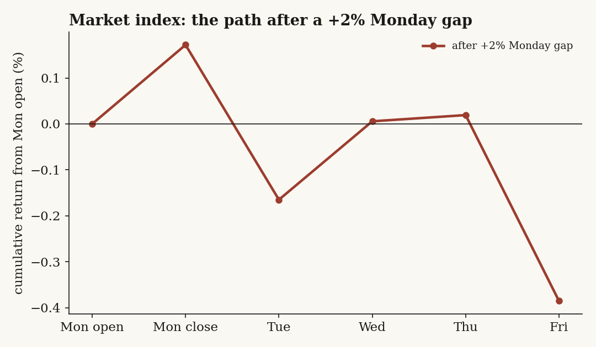
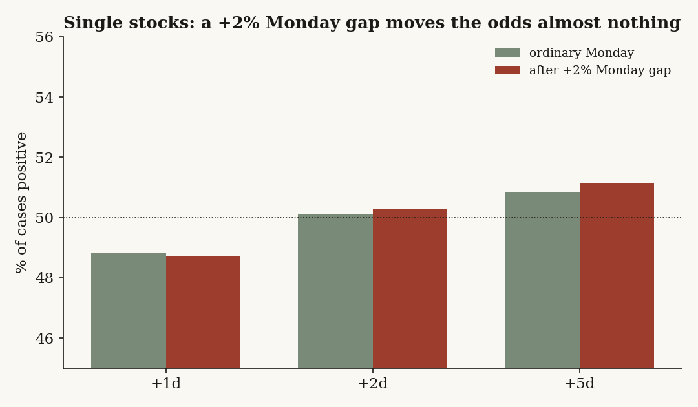
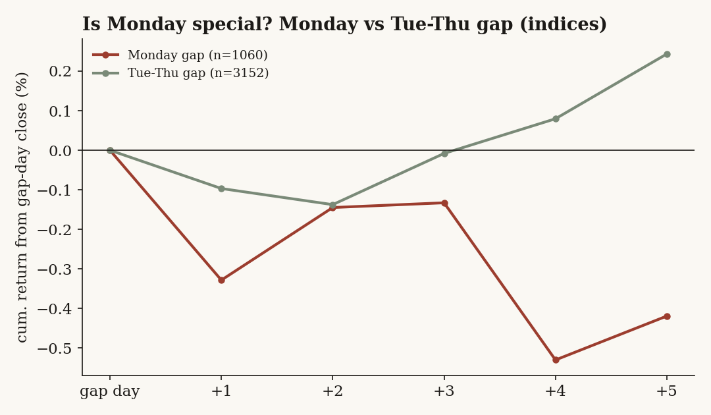
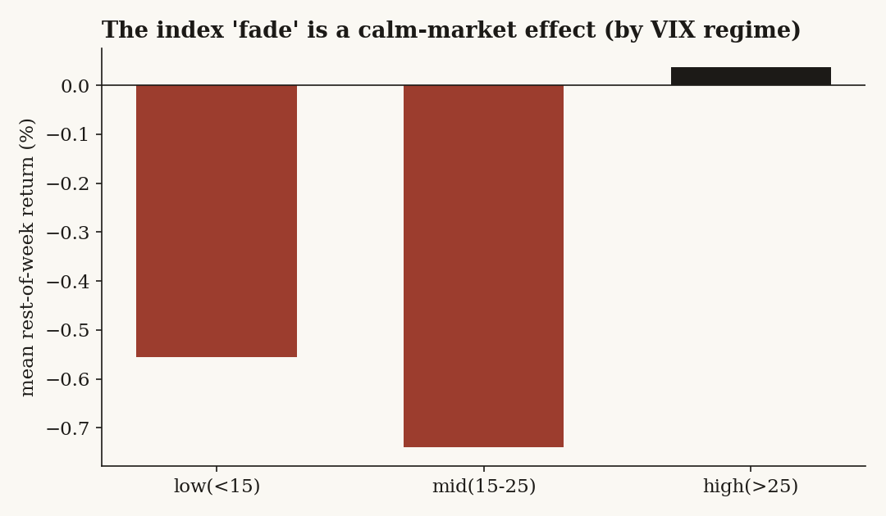
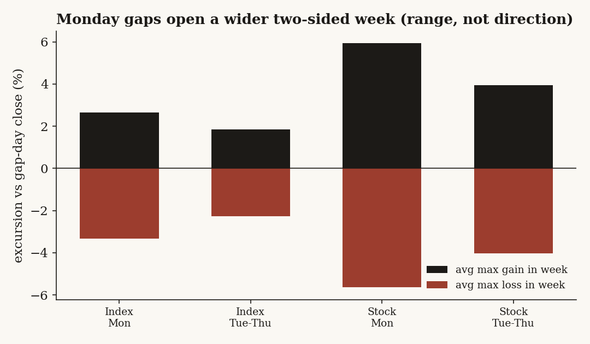

# 28 — Monday's +2% open: does a strong start mean the week follows through?

**The question.** When a market opens a Monday up 2% or more above Friday's close, does that tell you anything about the rest of the week — does the move keep going, fade back, or mean nothing at all? *Why it matters:* the trading-floor reflex is "strong open, money's coming in, ride it." If that reflex is right there's an easy trade; if it's wrong, a lot of people are paying to learn it every Monday.

## What I found (the short version)

- **It means almost nothing.** A +2% Monday open is not a follow-through signal — not for stocks, not for indices.
- **Single stocks: a coin flip.** Across 67,808 of these Mondays, the rest of the week is up 49% of the time — the same as an ordinary Monday. With that many events, that's a confident "no signal," not a small sample.
- **Indices: a faint Tuesday give-back, but it doesn't hold up.** The one effect I could find lives almost entirely in the 2008 and 2020 crises. Take those two years out and it's gone.
- **"Monday" isn't special.** A +2% gap behaves the same whether it lands on a Monday or a Wednesday — in direction *and*, once you measure over the same number of days, in size. So this is a *gap* story, not a *weekend* story.
- **The only thing it reliably tells you: expect a wide, two-sided week.** Roughly ±4% of swing in both directions. More volatility — not a higher close.

I went in hoping for a clean little edge. I didn't get one. The honest result is a null, and a fairly emphatic one.

## What I expected, and how I'd know I was wrong

The folklore has a real mechanism behind it: a big Monday gap is the market reacting to weekend news, and the story is supposed to keep developing — more buyers Tuesday, momentum into Friday. That's the **continuation** hypothesis (H1). The opposite, equally plausible story is **reversal**: a 2% pop is an over-reaction that bleeds back as cooler heads trade against it. And the boring third option is **nothing**: the gap is just the market's normal move, and the rest of the week is whatever the rest of the week was always going to be.

So the null I set out to kill (H0) is simple: *after a +2% Monday open, the rest of the week looks like any other week.* What would prove H0 wrong is equally simple — the forward days should beat (continuation) or lag (reversal) what those same names do on an ordinary Monday, by more than noise. If a +2% Monday is no different from a normal Monday, there is nothing here.

I lead with my own data on purpose. There's a long literature on a "Monday effect" (historically *negative* Monday returns), but I'm not testing that — I'm conditioning on a *positive* open and asking about the days that follow, and the only honest referee for that is the tape.

## How I checked it, and why each piece

Two legs, one method, because "all the markets" pulls in two very different objects.

- **The index/ETF leg** answers the headline "is there a market pattern." Here a +2% Monday gap is *rare* — a broad index almost never opens up 2%. So I leaned on the longest history I could get (daily open/high/low/close from a licensed market-data terminal, back to 1997 for the major funds). That alone matters: on a 10-year window the S&P proxy has just **4** qualifying Mondays; with the deep history it has **21**. Four events can't tell you anything; twenty-one at least starts to.
- **The single-stock leg** is where the statistical muscle is. A +2% Monday gap is common for an individual name, so the sample is huge — and that lets me give a *confident* answer instead of shrugging at a small n.

A few choices I want to flag, because they're where these studies usually go wrong:

- **Survivorship.** I used a US equity universe that *keeps delisted companies* (the ones that blew up, got bought, or went to zero). If you only study names that are still trading today, you quietly delete the disasters and every forward return looks too good. About 16% of my events come from names that later delisted — they're in, on purpose.
- **No look-ahead.** Every "was this name liquid enough" and "what's its trend" check uses only data from *before* the Monday in question. The gap, the liquidity screen, the moving averages — all lagged.
- **One Monday = one observation.** A market-wide rip on a single Monday makes dozens of country funds gap 2% at once. Those aren't 30 independent facts; they're one fact wearing 30 coats. So all my error bars are *clustered by date* — a crowded Monday counts once, not thirty times. This is the single most important honesty knob in the whole study, and it's where the flashier-looking results later fell apart.
- **Bad ticks.** A few micro-cap "gaps" are really stock splits or data errors that imply +400% in a week. For the single-stock averages I trim the extreme 1% on each tail so a handful of garbage prints don't masquerade as a finding.

## The data

- **Universe — index/ETF leg:** 47 instruments — US broad indices (S&P, Dow, small-cap, equal-weight, mid-cap proxies), all 11 US sectors, 20+ single-country / regional funds, plus bonds and commodities. Source: licensed market-data terminal, daily OHLC, **1997–2026** for the deep names (sectors and country funds from ~2002), back-adjusted so splits and dividends don't fake a gap. **1,060** Monday +2% open-gaps.
- **Universe — single-stock leg:** a survivorship-aware US equity panel of ~15,000 names (delisted companies retained), **2016–2026**, daily OHLC from the internal warehouse, with a point-in-time liquidity screen (trailing dollar-volume and price, both lagged). **67,808** Monday +2% open-gaps across **5,708** names; ~16% of events come from names that later delisted.
- **Regime overlay:** a daily volatility index (1990–2026) to split events into calm / mid / crisis.
- One transform throughout: the gap is `open ÷ prior-close − 1`, computed *within* each name's own continuous series, so the seam between deep history and recent data never manufactures a fake jump.

## What the data looks like first

Start with the simplest possible picture: take every +2% Monday gap in the index leg and plot the average path from Monday's open through Friday's close (figure below). If "strong open → follow-through" were true, this line would climb. It doesn't. It barely moves — a tiny drift up into Monday's close, then a small sag. The eyeball verdict, before any statistics: not much here.



That's the whole study in one chart, really. The rest is me trying to find an edge hiding inside it, and mostly failing.

## The findings

### Finding 1 — There is no "gap and go"

**What I expected.** If the gap carries momentum, the strong open should keep running *during Monday itself* — open green, close greener.

**How I measured it.** For every event, Monday's open-to-close return (`close ÷ open − 1`), summarized with date-clustered error bars.

```
gap   = open / prev_close - 1          # the event: >= +2% on a Monday
mon_oc = close / open - 1              # does Monday itself keep going?
```

**What the data shows.** Single stocks close the gap day essentially flat: median **+0.02%**, up exactly **50.1%** of the time. Indices hold a whisker more (median +0.13%, 52.7% up) but the confidence interval straddles zero. The opening pop neither runs nor fully reverses on the day.

**Verdict: null.** No intraday continuation worth the name.

### Finding 2 — No rest-of-week momentum, and the one index "fade" is fragile

**What I expected.** Even if Monday's own session is a wash, maybe the move develops over Tuesday–Friday (continuation), or bleeds back (reversal).

**How I measured it.** From Monday's *close*, the return to each later session and to Friday's close, plus the next-day return on its own.

**What the data shows.** Single stocks drift a flat **−0.05%** median from Monday close to Friday, up **49.3%** of the time — a coin flip, error bars across zero at every horizon. Indices give back a little, and almost all of it lands the *next day*: Tuesday averages **−0.33%**.

That index Tuesday number looked, at first, like my one real result — its clustered interval just barely excludes zero. Then I tried to break it, and it broke. **Pull out 2008 and 2020** and the Tuesday move shrinks to **−0.14%** with an interval that now includes zero; those two crisis years were carrying the whole thing. Collapse the data to **one observation per date** (the honest unit, since crisis Mondays light up many funds at once) and it weakens to t = −1.4. And it's the *only* one of roughly eight outcomes I looked at that crossed the 0.05 line — adjust for having looked at eight things and it stops being significant at all.

**Verdict: null for stocks; a fragile, crisis-only tilt for indices — not a standing effect.**

### Finding 3 — The gap tells you almost nothing an ordinary Monday doesn't

This is the test that actually settles the question. Forget absolute returns — does the +2% gap shift the odds *relative to a normal Monday in the same names?*

**How I measured it.** Forward %-positive after a gap Monday, against the forward %-positive of *all* Mondays for the same universe.

**What the data shows.** They're the same. After a gap, single stocks are positive **48.7 / 50.3 / 51.1%** at +1 / +2 / +5 days; on an ordinary Monday it's **48.8 / 50.1 / 50.8%**. The bars are the same height (figure).



When a skeptic re-ran this from scratch on a tighter, more liquid basket, it sharpened *why* the null holds rather than denting it. On a momentum-heavy sample the raw gap returns *do* run a bit hot — but only because **+2% gap-up Mondays cluster on broad up-market days.** Control for the market's move that same day (subtract each date's all-Monday average) and the stock-specific excess is **≈ 0 at every horizon.** In plain terms: a stock that gaps +2% on Monday will tend to do whatever the *market* does the rest of the week, because it gapped *with* the market — but the gap tells you nothing extra about *that stock.*

**Verdict: null.** With 68,000 events, "no information" is a conclusion, not a shrug.

### Finding 4 — "Monday" isn't special — it's a gap, on any day

**What I expected.** The whole premise is that *Monday* is different — the weekend lets news pile up, so a Monday gap should behave unlike a midweek gap.

**How I measured it.** I compared +2% gaps that landed on a Monday against the same-size gaps on Tuesday–Thursday, same names, same method.

**What the data shows.** They're indistinguishable in direction (single stocks p = 0.99; indices p = 0.32). A Monday gap *looked* like it produced a wider-swinging week — but that's a trap I nearly fell into: a Monday has up to four trading days left before Friday, a Thursday has one. Measure the swing over a fair, **fixed four-session window** and the Monday-vs-midweek difference in both the up-range and the down-range **collapses** (indices: up-range gap −0.44%, p = 0.07; down-range 0.00%, p = 0.97; stocks p = 0.69 / 0.87). The "wider Monday week" was a calendar artifact, not a property of Mondays.



**Verdict.** The weekend adds nothing. Whatever a +2% gap means, it means the same on any weekday.

### Finding 5 — Where a direction *would* show up (exploratory, mostly not significant)

I sliced the index events every way I could — by sector vs country, by volatility regime, by trend, by gap size — to see if a fade hides in some corner. Honest disclaimer first: of 72 conditioning cells, only **4** have an error bar that clears zero. So read this as texture, not as established effects.

With that caveat, *if* a +2% Monday gap ever fades, it's: in **international / country funds** (the only slice where the fade is individually significant); in **calm markets** (and it flips to neutral-or-*up* in a high-volatility crisis — those are relief rallies, not fades); in **counter-trend** setups (a name below its 200-day average — a bear-market bounce); and it scales with gap size. None of it is stable enough to trade.



## Did I just find noise?

That was the whole back half of the work, and the answer mostly is "the noise was the finding."

- **The single-stock null is robust.** It holds whether I trim the extreme returns at 0.5%, 1%, 2% or 5%, and whether I use means, medians or hit-rates. Every interval straddles zero. (Robust nulls are the easy case — there's nothing fragile to break.)
- **The index fade failed three separate stress tests** — crisis-year removal, one-obs-per-date, and a multiple-comparisons adjustment — described in Finding 2. Any one of them moves its interval across zero.
- **Out of sample / threshold sensitivity.** The single-stock coin flip is stable across gap thresholds from 1.5% to 5%. The index fade gets *larger* at bigger gaps, but on a handful of crisis-clustered events.
- **The two-sided range is real and not an artifact** once measured over a fair window (Finding 4): every gap week, Monday or not, swings hard both ways.

## Steelman the rivals, then test them

- **"It's continuation, you just measured it wrong."** Then forward returns should beat an ordinary Monday. They don't (Finding 3): same hit-rate to the decimal. Rejected.
- **"It's reversal."** Then forward returns should *lag* a normal Monday and the next-day fade should be robust. For stocks there's no lag at all; for indices the fade evaporates outside 2008/2020 (Finding 2). Rejected as a standing effect.
- **"There's a stock-specific signal, it's just drowned out."** This is the strongest rival, and it's the one the de-drift test was built to kill: subtract the market's same-day move and the stock-specific excess is ≈ 0 (Finding 3). What looks like a signal is the stock riding the market it gapped with.

## The answer, in the data

**Does a +2% Monday open predict the rest of the week? No — for single stocks a confident no; for indices a fragile, crisis-only maybe that I won't lean on.** "Monday" carries no special information; it's a gap like any other. The single reliable consequence is a **wide, two-sided week** — which answers the literal question ("what happens the rest of the trading days?") with "a lot of movement, in both directions, netting to roughly nothing."

**Indices / ETFs — +2% Monday gap (n = 1,060).** "Sig?" = does the date-clustered 95% interval exclude zero.

| Outcome | Median | Mean | % positive | sig? |
|---|---|---|---|---|
| Monday open→close | +0.13% | +0.17% | 52.7% | no |
| Next day (Tue) | −0.17% | −0.33% | 45.2% | yes, but fragile* |
| Rest of week (Mon→Fri) | −0.01% | −0.34% | 48.7% | no |
| Following week | +0.29% | +0.20% | 53.1% | no |
| Biggest gain reached in week | +1.76% | +2.66% | 84.5% | — |
| Biggest drop reached in week | −2.10% | −3.33% | (only 11.5% avoid) | — |

\*Crisis-driven: ex-2008/2020 mean −0.14% (interval includes 0); one-obs-per-date t = −1.4; fails a multiple-comparisons adjustment.

**Single stocks — +2% Monday gap (n = 67,808; means trimmed at 1/99%).**

| Outcome | Median | Mean | % positive | sig? |
|---|---|---|---|---|
| Monday open→close | +0.02% | +0.12% | 50.1% | no |
| Next day (Tue) | −0.05% | +0.00% | 48.7% | no |
| Rest of week (Mon→Fri) | −0.06% | +0.00% | 49.3% | no |
| Following week | +0.42% | +0.51% | 52.5% | no |
| Biggest gain reached in week | +3.79% | +5.94% | 90.6% | — |
| Biggest drop reached in week | −3.90% | −5.64% | (only 9.2% avoid) | — |

Not one directional outcome clears the bar for single stocks. The only "yes" cells anywhere are the mechanical range rows and the fragile pooled index Tuesday fade.



## Caveats (and which way they'd bias things)

- **Index events are rare and correlated.** Twenty-one S&P Mondays in 28 years; the sector/country sub-findings rest on tens of *effective* observations, so I read them as suggestive. This makes me *less* able to detect a small index edge — but the single-stock leg, where power is high, agrees there's nothing.
- **Single-stock window is 2016–2026.** It includes 2018, 2020, 2022 stress but not 2008. The deep-history leg covers 2008; both say the same thing, which is reassuring.
- **Crypto is excluded.** It trades through the weekend, so a "Monday gap" there is a different animal and would muddy the comparison.
- **Returns are price-only, no trading costs.** Costs would only make any apparent edge *worse*, so they can't rescue a null.
- **Distributional null, not a promise about your next Monday.** "No edge on average over 68,000 events" does not mean a given Monday can't run; it means you can't *systematically* bet on it.

## Reproducing it

The whole study is one definition plus a handful of forward look-ups. Event and outcomes, in pseudocode on any name's daily OHLC series sorted by date:

```python
prev_close = close.shift(1)
gap        = open / prev_close - 1
is_event   = (weekday == "Mon") & (gap >= 0.02) & liquid_as_of_prior_day

# outcomes, all anchored to the event row:
mon_open_to_close = close / open - 1
fwd_k             = close.shift(-k) / close - 1          # k = 1..5 sessions
rest_of_week      = friday_close / close - 1             # same calendar week
mfe / mae         = max(high[t+1..]) , min(low[t+1..])   # within the week

# inference: collapse to date-level means, then bootstrap by RESAMPLING DATES
# (one crowded Monday counts once). single-stock means winsorized at 1/99%.
```

The two non-obvious honesty knobs, both of which changed conclusions: **cluster on date** (turned the index fade from "significant" into "fragile") and **measure range over a fixed horizon** (turned "Monday weeks are wider" into a calendar artifact). The base-rate test — compare the gap Monday to *all* Mondays in the same names, then subtract each date's market move — is what converts "no effect" from a hopeful shrug into a measured result. Charts use the full universes above (47 funds; 5,708 stocks), not a hand-picked basket.

## References & where this goes next

Builds on the cross-sectional and event-study machinery from **study 07** (intraday decision-time, the open→close decomposition), **study 18** (Computex event study, the placebo-date discipline), and **study 09** (activist-short drift, the "is it just a random day in the same names" control). It lands in the same place those did: the honest, well-powered answer to "is this short-horizon pattern tradable?" is usually *no*, and saying so clearly is the point. **Next:** condition the same machinery on *gap-down* Mondays (does fear behave differently from greed?), and on earnings-driven vs macro-driven gaps.
