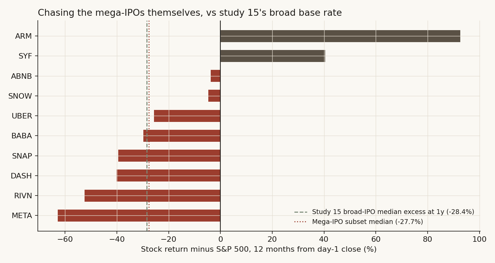

# 28 — SpaceX vs the TRUMP coin: does the biggest-ever sale of a story mark the top of its market?

**The question.** On January 17, 2025, the biggest memecoin launch in history went live, and within three days its host market printed all-time highs it has never seen again. On June 12, 2026 — today, as I write this — the biggest IPO in history starts trading. Same setup: a record-sized, retail-saturated, story-driven capital event at the peak of enthusiasm. So I wanted to know: is the SpaceX IPO the stock-market version of the TRUMP coin? Does an event like this drain the market around it, and does it mark the top?

This matters for a position: if the analogy holds, the week SpaceX lists is the week to reduce risk, not add it.

## Summary of results

- The TRUMP coin launch really did mark the top of its market, almost to the day. Solana printed its all-time high two days after launch and Bitcoin three days after. Neither has traded higher since (SOL is still 77% below that print as of June 2026).
- The mechanism was mechanical, not psychological: the event was enormous *relative to its host market*. TRUMP's fully diluted value peaked at roughly half of Solana's own market cap (and about 2.0% of the entire crypto asset class), and peak-day trading ran at 6.5x the chain's normal volume.
- SpaceX cannot repeat that *flow* mechanism. The $75B raise is about 0.10% of US equity market cap and about 7% of one ordinary day's trading. As a liquidity shock it is two orders of magnitude smaller.
- But as a *stock* of value, SpaceX at the indicated $170 open would be 3.1% of all US equities — a bigger share of its asset class than TRUMP ever was of crypto. The TRUMP pattern lives on at the asset level, not the market level: 4.25% free float, a scarcity premium, and a supply calendar (study 24) that multiplies tradable shares 9.4x within six months.
- GameStop, the control case, completes the dose-response line. At its January 2021 peak GME was just 0.05% of US equities, and even with short interest at 140% of float its squeeze dented the S&P only -3.3% for nine sessions (forced de-grossing) before full recovery. Small relative to the class: no lasting market damage. But the stock itself fell 88% in 16 sessions once the supply constraint resolved — the same vertical-then-collapse shape as TRUMP.
- Mega-IPOs do carry market-level information. Across the 34 largest US-listed IPOs since 1996, the NASDAQ's median return over the following 12 months was +4.9%, against +16.0% for all days in the same era. Only 0.8% of random 34-date draws look that bad. 59% of these IPOs were followed by a 20%+ index drawdown within a year, against a 36% base rate.
- And fame does not buy the *stock* out of the chase deficit. Cross-checked like-for-like against study 15's broad base rate (760 IPOs: -28.4% median one-year excess vs SPY, 19% beat), the ten data-available mega-IPOs ran -27.7% vs the S&P with 20% beating — the same deficit, from an independent sample and era. The damage is front-loaded (-32.3% at six months, twice the broad base), landing exactly in the unlock window; measured against the NASDAQ these names trade in, the one-year deficit is -37.9%.
- The signal is clustering, not causation: issuers sell the most stock when the window is hottest, so record IPOs land late in cycles. Drop the five IPOs from the first half of 2000 and half the deficit disappears.
- Verdict: **No on the market mechanism, conditional yes on the timing signal, and yes at the asset level.** SpaceX will not vacuum the market the way TRUMP did — but the share itself carries the low-float mania architecture, and the *fact that this deal was possible at all* — at 94x revenue, four times oversubscribed, in a record $160B IPO-pipeline year — has historically been the property of late-cycle markets.

## What I expected, and what would prove me wrong

The null (H0): a mega-IPO is just a big day at the office. The market absorbs it, forward returns after these events look like forward returns after any other day, and the TRUMP analogy is a coincidence of two assets that were going to top anyway.

The alternative (H1): record capital events cluster at sentiment peaks — either because they *drain* buying power from everything else (the TRUMP mechanism), or because issuers time the sale to maximum enthusiasm (the selection mechanism). Either way, forward returns after them should be measurably below the base rate.

What would prove me wrong: if forward index returns after the largest IPOs are indistinguishable from the unconditional distribution, the analogy is dead and the answer to the user-facing question is "ignore the noise, size SpaceX on its own merits."

A one-line prior worth naming: issuance timed to sentiment is an old result (Baker and Wurgler built a sentiment index partly out of IPO activity). Our own study 22 found that *aggregate* equity issuance fails as a market-timing signal (0 of 12 annual tests). So this study tests something narrower: not total issuance, but the handful of record-sized single events.

## How I checked it

Four tests, from the known case to the open question:

1. **The template.** Rebuild the TRUMP coin event study from daily exchange data: did the launch actually mark the top of its host market, and what happened to the assets around it?
2. **The base rate.** Take the 34 largest US-listed IPOs from 1996-2024 and measure index returns 1, 3, 6 and 12 months after each, against the unconditional distribution over the same era. Bootstrap the medians. Then try to kill the result twice (drop the dot-com cluster; condition the base rate on an equally hot tape).
3. **The scale test, two ways.** Compare each event to its host market both as a *stock* (instant value as a share of the whole asset class — including TRUMP against all of crypto, and SpaceX at $135 and at the indicated $170 against all US equities) and as a *flow* (trading shock against the host's daily turnover). If TRUMP was a whale in a pond and SpaceX is a whale in the ocean, the flow mechanism does not transfer no matter what the charts rhyme like.
4. **The control case.** GameStop, January 2021: a low-float scarcity vertical that was *tiny* relative to its asset class. If the scale logic is right, GME should have crushed its own holders without leaving a mark on the broad market — a prediction the data can check. It also supplies the third member of the low-float family that study 24's SpaceX float model belongs to.
5. **The study 15 cross-check.** Study 15 measured the IPO *chase* — buying the day-1 close — across 760 ordinary IPOs and found it loses badly to the index. If this study's mega-IPOs are a different breed (famous, institutional, underwritten by the best), maybe they escape that base rate. Recompute study 15's exact trade on the mega-IPO sample itself and find out.

The identification problem, out loud: with n=34 events that cluster in time, I cannot cleanly separate "mega-IPOs cause weak markets" from "mega-IPOs happen when markets are about to be weak." I don't try to. For the practical question — should the SpaceX listing change your risk posture? — the two stories give the same answer, and I say which one the data favors in Finding 4.

## Data

| Series | Source | Range | Notes |
|---|---|---|---|
| TRUMP, SOL, BTC, ETH daily OHLCV | Binance spot (public klines API) | listing/Oct 2024 - Jun 2026 | TRUMP listed on Binance Jan 19, 2025 |
| Memecoin basket: DOGE, SHIB, PEPE, WIF, BONK | Binance spot | Oct 2024 - Jun 2026 | equal-weight, indexed to Jan 16, 2025 |
| NASDAQ Composite daily closes | macrotrends (public dataset endpoint) | Feb 1971 - Jun 2026 | primary index for the base-rate test |
| S&P 500 daily closes | macrotrends | Dec 1927 - Jun 2026 | independent cross-check |
| Mega-IPO sample | hand-built from contemporaneous press + filings | 1996-2024 | all 34 US-listed IPOs with base proceeds >= ~$2.8B; SPACs, direct listings and closed-end funds excluded |
| GameStop daily OHLCV | macrotrends (public dataset endpoint) | Jun 2011 - Jun 2026 | split-adjusted prices (4-for-1, Jul 2022); volume in unadjusted shares |
| Mega-IPO stock histories (10 names) | macrotrends per-stock pages | from each IPO - Jun 2026 | every sample name with from-IPO daily data on the free tier (2012+ vintage): META, BABA, SYF, SNAP, UBER, SNOW, ABNB, DASH, ARM, RIVN |
| On-chain launch-weekend stats | Helius, Chainalysis (via NYT/CNBC), DefiLlama | Jan 2025 | cited, not recomputed |
| Scale constants | Cboe, Siblis Research, Mordor Intelligence, contemporaneous reports | 2021-2026 | US equity mcap ~$72T (2026) / ~$50T (2021); US daily notional $1.1T (2025); total crypto mcap peak ~$3.8T (mid-Jan 2025); GME short interest ~140% of float (Jan 2021) |

The 34-name sample is the full universe at this size threshold, not a selection — every US-listed operating-company IPO I could document at $2.8B+ of base proceeds is in [data/mega_ipos.csv](data/mega_ipos.csv), foreign dual-listings flagged. Proceeds figures mix base-deal and greenshoe-inclusive numbers depending on the contemporaneous source; ranking, not precision, is what matters here, and the notes column says which is which.

Coinbase's 2021 direct listing is deliberately excluded from the sample (it raised no primary capital) but deserves its one line: it hit the tape on April 14, 2021 — the exact day Bitcoin printed its first 2021 cycle top.

## Finding 1 — the TRUMP launch marked its host market's top, almost to the day

*What I expected.* The folklore says TRUMP "killed the cycle." Folklore needs numbers, so I rebuilt the window from exchange data.

*How I measured it.* Daily highs and closes from Binance; everything indexed to January 16, 2025, the last quiet day before the Friday-night launch.

```python
basket = (px / px.loc["2025-01-16"]).mean(axis=1) * 100   # DOGE/SHIB/PEPE/WIF/BONK, eq-wt
sol_peak  = sol_high["2024-10-01":"2025-06-30"].idxmax()  # -> 2025-01-19, $295.83
btc_peak  = btc_high["2024-10-01":"2025-03-31"].idxmax()  # -> 2025-01-20, $109,588
```

*What the data shows.*


- TRUMP launched Friday January 17 and peaked near $75 on Sunday January 19 (the Binance daily high printed $77.24), a top-ten fully-diluted market cap in under 72 hours.
- Solana — the chain it lives on — printed its all-time high of $295.83 on January 19, two days after launch. It has never traded there again; as of June 2026 it sits 77% lower.
- Bitcoin printed its then-all-time high of $109,588 on January 20, inauguration day, three days after launch, then fell 30% to the April 2025 low.
- The memecoin basket tells the sharpest story. It had already rolled over from its December 8, 2024 peak (158 on my index). On launch weekend it briefly popped to 111 — and that pop, printed on January 17, was the last high it ever made. It was 59 a month later, 40 three months later, and sits at 17 in June 2026.

*Why (the mechanism).* The launch was a liquidity vacuum, and the on-chain numbers are explicit. Solana DEX volume hit $28.2B and then $39.2B on January 19-20 against a roughly $6B/day baseline — the peak day exceeded the previous all-time daily record across all blockchains combined. Stablecoin float on the chain grew 72% in six days ($6.15B to $10.6B) as fresh cash bridged in. Traders sold what they held to buy the new thing: existing memecoins bled while TRUMP went vertical, which is why the basket's launch-weekend "pop" was already a fade in relative terms. And the wealth transfer was savage — roughly 810,000 wallets were underwater within three weeks (Chainalysis data reported by the NYT), about $2B of losses against roughly $6.6B of realized gains for insiders and early buyers. Half the buyers had never owned a Solana asset before; 47% created their wallet the same day they bought.

*What I checked.* The peaks use intraday highs, not closes (Binance listed TRUMP mid-day on the 19th, so closes understate the extremes — my first pass got this wrong by 40%). The basket's December top means TRUMP did not *start* the memecoin decline; it terminated the last bounce of an already-rolling complex. I keep the claim precise: the launch marked the final top of SOL, BTC, and the memecoin basket's last local high, within a three-day window.

*Verdict.* **Confirmed.** The event marked the cycle top of its host market to within days, and the mechanism — capital rotating out of everything else into the new listing — is visible in volume, stablecoin float, and the basket's failure to ever recover.

## Finding 2 — after the 34 biggest IPOs, the market's next 12 months were bad — reliably so

*What I expected.* If record listings cluster at sentiment peaks, the index should do worse than usual after them, and the gap should grow with horizon (tops take months to resolve).

*How I measured it.* For each IPO's first trading day, NASDAQ Composite forward returns at 21/63/126/252 trading days, against the distribution of the same forward returns from every trading day 1996-2025. Then a 10,000-draw bootstrap: how often does the median of 34 random days look as bad as the median of the 34 IPO days?

```python
fwd[h] = px[i + h] / px[i] - 1                      # per event, h in {21,63,126,252}
base   = all_days_1996_2025_same_horizons            # unconditional comparison
boot   = [median(choice(base_12m, 34)) for _ in range(10_000)]
p      = mean(boot <= median(event_12m))             # -> 0.008
```

*What the data shows.*


| Horizon | After mega-IPOs (median) | All days (median) | IPO %positive | Base %positive |
|---|---|---|---|---|
| 1 month | +1.6% | +1.7% | 62% | 63% |
| 3 months | +3.9% | +4.1% | 68% | 68% |
| 6 months | +6.3% | +7.9% | 59% | 72% |
| 12 months | **+4.9%** | **+16.0%** | **59%** | **77%** |

Nothing happens for a month. Nothing happens for a quarter. The gap opens at six months and yawns at twelve: an 11-point median shortfall, and the bootstrap says only 0.8% of random 34-day draws produce a median that low. Drawdowns say the same thing more vividly — the median worst peak-to-trough fall in the 12 months after a mega-IPO was -29.8% against -16.5% for random days, and 59% of these IPOs saw a 20%+ index drawdown within a year against a 36% base rate.

*A concrete example instead of an abstraction.* If you had sold the NASDAQ at the close of each of these 34 first trading days and bought back a year later, you would have skipped a median +4.9% — and dodged the year after PetroChina (-60%), Infineon (-59%), MetLife (-57%), AT&T Wireless (-45%), Visa (-33%) and Rivian (-29%).

*What I checked.* The S&P 500 — a different index from a different builder — gives the same answer: +2.2% median at 12 months against +12.1% base, events at the 25th percentile. That is the independent cross-check; the result is not an artifact of one tech-heavy index.

*Verdict.* **Confirmed, with the caveat that the events overlap.** Several of the 34 share calendar windows (three IPOs in December 2020 alone), so the effective number of independent events is smaller than 34 and the bootstrap p-value flatters the result. The direction survives; the precision is softer than 0.008 sounds.

## Finding 3 — the signal is clustering at cycle ends, not the IPO doing damage

*What I expected.* If the deficit in Finding 2 is real, it should be concentrated where mega-IPOs bunch together — issuers all rushing the same hot window — rather than spread evenly.

*How I measured it.* Sort the 34 events by their forward 12-month return and look at the calendar. Then re-run the test without the worst cluster.


*What the data shows.* The red tail is a roll call of cycle peaks. Five of the 34 — Infineon (March 2000), MetLife (April 2000), PetroChina (April 2000), AT&T Wireless (April 2000), China Unicom (June 2000) — landed within four months of the dot-com top. Blackstone listed in June 2007, weeks before the August credit cracks and four months before the October 2007 top. Visa's record deal priced into the teeth of 2008. DiDi and Rivian bracketed the November 2021 NASDAQ top — Rivian, the second-biggest raise in the sample, listed nine days before the exact peak.

Drop the five H1-2000 names and the median 12-month return improves from +4.9% to +9.3% (69% positive). Half the deficit is one cluster. That is not a weakness of the finding — it *is* the finding: record IPOs do not trickle out evenly, they stampede into the best windows, and the best windows are late.

*Why (the mechanism).* Nobody prices the largest deal in history into a weak tape. A record raise requires record enthusiasm — four-times-oversubscribed books, retail tranches, index-inclusion hype. Those conditions are, definitionally, what the late stage of a cycle looks like. The IPO is the thermometer, not the fever.

*What I checked — the strongest rival.* "You've just rediscovered that markets were hot, and hot markets mean-revert." If that were the whole story, *any* day with an equally hot trailing tape should show the same weak forward returns. It does not. The median mega-IPO arrived with the NASDAQ up 26.6% over the prior year; taking *all* days since 1996 with trailing returns at least that hot (n=2,140), the median forward 12-month return is +14.7% with 76% positive — barely below the unconditional +16.0%, and three times the mega-IPO events' +4.9%. A hot tape alone was not bearish. A hot tape *plus a record-sized exit* was. The rival fails on its own numbers.

*Verdict.* **Conditional.** Mega-IPOs are a late-cycle symptom with real forward information beyond simple momentum, but the effect is driven by clusters, and a single IPO in isolation is a weak signal.

## Finding 4 — the dose makes the poison: SpaceX is huge as a stock, tiny as a flow

*What I expected.* For the analogy to bite hard, SpaceX would need to be big relative to its host market the way TRUMP was. The honest answer turned out to be two answers, depending on whether you measure the *stock* of value created or the *flow* of money moved.

*How I measured it.* Each event two ways: instant value as a share of the whole host asset class, and trading shock as a share of the host's daily turnover.

```text
Stock (value vs the whole class)
  TRUMP peak FDV / its host chain (SOL)   ~ $75B / ~$140B  = ~54%
  TRUMP peak FDV / ALL crypto             ~ $75B / ~$3.8T  = ~2.0%   (circulating: 0.4%)
  SpaceX at $135 / all US equities        = $1.77T / ~$72T = 2.5%
  SpaceX at $170 / all US equities        = $2.22T / ~$72T = 3.1%
  GME close peak / all US equities (2021) ~ $24B / ~$50T   = 0.05%

Flow (trading shock vs the host tape)
  TRUMP peak-day DEX volume / baseline    ~ $39.2B / ~$6B  = ~6.5x
  SpaceX raise / one day's traded value   = $75B / ~$1.1T  = 6.8%
  GME peak day / US tape (approx)         ~ $32B / ~$600B  = ~5%
```


*What the data shows — the stock side first, because it surprised me.* Measured against the whole asset class, SpaceX is actually the *bigger* mania: at the indicated $170 open it would be 3.1% of all US equities (2.5% even at the $135 banker price), instantly a top-seven company, where TRUMP's fully diluted value peaked at about 2.0% of the entire crypto market (and only 0.4% counting just the circulating coins). A brand-new line on the board worth 2-3% of everything, priced in a weekend or a morning, is the same class of event in both markets. GME never came close — 0.05% of US equities at its peak close.

*Now the flow side, which is where the analogy dies.* TRUMP's launch traded 6.5 *times* its host chain's normal daily volume and was priced at half the host chain's market cap — a whale in a pond; the marginal dollar physically left everything else on Solana. SpaceX's $75B raise is 6.8 *percent* of one ordinary day's US equity dollar volume (Cboe: $1.1T average daily notional in 2025), and the $22.5B retail tranche is about two percent of a single day's tape. The US market is the ocean; whatever SpaceX does to it, it will not do it by draining liquidity.

*Why it matters — the dose-response line.* Put the three events on one axis of "size relative to host" and the market outcomes line up like a dose-response curve. GME (0.05% of the class, even with 140%-of-float short interest) dented the S&P -3.3% for nine sessions through forced de-grossing, then the market made new highs. TRUMP (2% of the class, 54% of its host chain) terminally topped its market. SpaceX sits between on the stock measure and far below both on the flow measure — big enough to *embody* the cycle, far too small to *end* it.

*What I checked.* The constants are the soft spot, so they are sourced and rounded against me: US market cap $69T (Siblis, Jan 2026) to $75T+ (April 2026) — I use $72T; daily notional $1.1T (Cboe 2025 average); total crypto market cap ~$3.8T at its mid-January 2025 peak (Mordor Intelligence's year-to-date peak figure, printed the same days as the launch); US market cap ~$50T in early 2021. Halve any of them and no conclusion moves an order of magnitude.

*Verdict.* **The drain mechanism does not transfer; the asset-class footprint does.** If SpaceX coincides with a market top, it will be as a symptom (Finding 3), not a cause (Finding 1's mechanism). What the share itself does is Finding 5's question.

## Finding 5 — the low-float family: TRUMP, GameStop and SpaceX share one supply architecture

*What I expected.* The user-facing worry behind this study is really about the share, not the index: SpaceX is coming public with 4.25% of its shares tradable (study 24's number from the S-1). TRUMP launched with 20% of supply circulating. GameStop in January 2021 had short interest at 140% of its float — more shares sold short than existed to trade. Three different markets, one architecture: huge headline value, tiny effective supply, reflexive retail demand. I expected the price pattern after the vertical to rhyme, and to depend on what happens to supply next.

*How I measured it.* Index each name to 100 at its peak close and walk forward 130 trading days; pull the squeeze-week spillover and recovery from the index data already in this study; take the SpaceX supply calendar from study 24.

```python
gme_path   = gme_close.loc["2021-01-27":] / 86.88 * 100     # -88.3% by session 16
trump_path = trump_close.loc["2025-01-19":] / peak * 100    # -84% by mid-April
spx_dent   = spx["2021-01-25":"2021-01-29"].min() / spx.asof("2021-01-22") - 1   # -3.3%
```


*What the data shows.* GameStop closed at $347.51 (split-adjusted $86.88) on January 27, 2021, traded $483 intraday the next morning, and sixteen sessions later had lost 88.3% of its value. TRUMP took about three months to do the same. Both spent essentially the whole 130-day window far below the -14.7% line that study 24's filtered large-IPO comps put at six months. The broad market barely noticed GME: the S&P fell 3.3% (NASDAQ -3.5%) in the squeeze week as hedge funds de-grossed — the one real transmission channel a small event has — and recovered to its pre-squeeze level in nine sessions.

*The difference between the two decay paths is the supply story.* GME echo-squeezed — back to 87% of its peak close on June 9, 2021 — because its float never grew; covering ended, but scarcity stayed, so the mania could re-ignite (AMC, the sister name, made its own all-time high that same week of June 2021). TRUMP never echoed: its supply *grew on a schedule* — the first insider unlock (40 million tokens, 4% of supply, ~$311M) hit in April 2025, followed by daily drip releases — so every bounce met new sellers. One-year-later scores: GME at 27% of its peak close, TRUMP at 11%.

*Where SpaceX sits in the family.* SpaceX's supply path is the TRUMP path, not the GME path, and it is contractual: study 24's model has lock-up releases at days 70/90/105/120/135 and a day-180 cleanup that takes potential tradable supply to roughly 9.4x the IPO float — about 40% of basic shares — within six months. A buyer at the $170-175 indicated open is paying a 26-30% scarcity premium over a banker price that credible outside valuations (Morningstar $780B, Damodaran $1.25-1.3T) already call 1.4-2.3x rich, for a float that is scheduled to multiply by nine. The scarcity that supports the premium has an expiry date.

*What I checked.* GME prices are split-adjusted (4-for-1, July 2022); the unadjusted prints quoted match the contemporaneous record ($347.51 close, $483 intraday). The 140%-of-float short interest is the figure used in the academic and regulatory post-mortems, not a forum number. And one case is one case: GME enters this study as a control for the scale logic and a second decay path, not as a sample.

*Verdict.* **Confirmed at the asset level.** Low-float verticals revert hard once supply normalizes, and SpaceX's supply normalizes on a published calendar. The TRUMP analogy fails for the market (Finding 4) but holds for the share.

## Finding 6 — cross-check with study 15: fame does not buy you out of the chase deficit

*What I expected.* [Study 15](../15-ipo-chase/) measured what happens when you buy an IPO at its first day's close — the price retail can actually get — across 760 US IPOs: a median one-year excess return of -28.4% versus SPY, with only 19% of names beating the market (-15.4% and 25% at six months). But that sample is the 2022-onward vintage, dominated by small and micro-cap listings. A reasonable objection to using it on SpaceX: *these* deals are different — famous franchises, top-tier underwriters, institutional books. Maybe mega-IPOs escape the chase deficit. I expected them to do at least somewhat better than the broad base rate. They don't.

*How I measured it.* Study 15's exact trade, run on this study's own sample: buy each mega-IPO at its day-1 close, hold six and twelve months, measure against both the S&P 500 (study 15's benchmark family) and the NASDAQ (the index these names mostly trade in). Ten of the 34 names have from-IPO daily data on the free tier (everything listed 2012 or later and still trading): META, BABA, SYF, SNAP, UBER, SNOW, ABNB, DASH, ARM, RIVN.

```python
day1   = first_close_with_volume(stock)        # skip the offer-price placeholder row
excess = stock[h] / day1 - index[h] / index[day1]        # h in {126, 252} days
# subset medians vs S&P:    6m -32.3% (20% beat), 12m -27.7% (20% beat)
# subset medians vs NASDAQ: 6m -33.0% (20% beat), 12m -37.9% (20% beat)
# study 15 broad (vs SPY):  6m -15.4% (25% beat), 12m -28.4% (19% beat)
```

*What the data shows.*



| Chase from day-1 close | Mega-IPOs vs S&P (n=10) | Mega-IPOs vs NASDAQ (n=10) | Study 15 broad base, vs SPY (n=760) |
|---|---|---|---|
| 6-month median excess | **-32.3%** | -33.0% | -15.4% |
| 6-month % beating index | 20% | 20% | 25% |
| 12-month median excess | **-27.7%** | -37.9% | -28.4% |
| 12-month % beating index | 20% | 20% | 19% |

Like-for-like, the twelve-month numbers are nearly identical: -27.7% for the mega-IPOs against -28.4% for study 15's broad zoo, with the same one-in-five hit rate. The most institutional, most underwritten, most famous deals of the era earned the *same* chase deficit as the micro-cap junk — that is the cross-check's headline. Two differences are real, though. The mega-IPO damage is front-loaded: at six months the subset is already -32.3% (twice the broad base's -15.4%), which is exactly the lock-up window where Finding 5 says the float multiplies. And against the NASDAQ — the index a SpaceX buyer would otherwise own — the deficit is -37.9%.

Eight of ten lost to the market in year one, several catastrophically: META -63% excess vs the S&P (the famous 2012 halving), RIVN -52%, DASH -40%, SNAP -39%, BABA -30%, UBER -26%. The two winners are instructive: ARM (+93%) rode the 2023-24 AI repricing, and SYF (+40%) was the sample's *least* famous deal — a spun-off consumer lender nobody chased. Median absolute returns were -16.7% at six months and -18.4% at a year, against an unconditional NASDAQ 12-month median of +16%: buying the median mega-IPO at its first close cost about 34 points versus just owning the index.

*Why (mechanism).* This is Findings 2 and 5 compounding at the level of one trade. The index itself runs below base rate after these events (Finding 2), and the stock carries the low-float architecture — day-1 prices set on a sliver of float at peak fame, then unlock supply arriving for months (Finding 5), which is why the deficit is deepest in the first six months. The fame that fills a record order book is exactly what guarantees the day-1 buyer overpays; SYF, with no fame to price in, is the exception that fits the rule.

*What I checked.* The era differs (2012-2023 here vs 2022+ there) — two independent vintages landing on the same number is the point of a cross-check, not a flaw in it. The subset omits DiDi — delisted within a year of its IPO, down roughly 87% — plus the 2000-era disasters (AT&T Wireless, Agere, Infineon), so the data-availability cut *flatters* the mega-IPO side; the true historical medians are worse than the table. Dividends are excluded on both legs (hurts the high-yield names' showing slightly; direction against my conclusion, magnitude small at these horizons).

*Verdict.* **Study 15 confirmed on an independent sample — and sharpened.** Same trade, different era, different names: the like-for-like medians agree within a point. Quality, fame and underwriting do not repeal the chase base rate; they just concentrate the losses into the first six months, where the unlocks live. Study 15's warning applies to SpaceX without a discount.

## Did I just find noise?

Four ways this could be nothing, and what the checks said:

1. **Overlapping events.** Conceded above — effective n < 34, true p-value softer than 0.008. Direction unchanged across two independent indexes.
2. **One regime driving everything.** Tested — ex-2000 the deficit halves but persists (+9.3% vs +16.0%). The 2007, 2021 mini-clusters point the same way.
3. **Hot-tape mean reversion.** Tested with the conditional base rate — fails as a full explanation (+14.7% hot-tape base vs +4.9% events).
4. **Sample construction.** The threshold (~$2.8B) was set by data availability, not chosen to flatter the result; every qualifying deal I could document is in. Adding Lyft ($2.3B, 2019) or Twitter ($1.8B, 2013) — the next names down — would not change the sign at 12 months (NASDAQ was up modestly after Twitter; flat-to-down after Lyft).

What I could not test: only 34 events exist at this size. This is a structurally-rare-event study, like several before it in this repo, and the rare-event n is capped by reality. The honest read is "strong directional evidence, wide confidence bands."

## The answer, in the data

**Is SpaceX the TRUMP coin of the stock market? No on the market mechanism, conditional yes on the clock, yes on the share's own architecture.**

| Question | Answer | Median | Average | %Positive/%Hit |
|---|---|---|---|---|
| Did TRUMP mark its host market's top? | **Yes** — SOL ATH +2 days, BTC ATH +3 days, basket's last high on launch day | SOL -77% / basket -83% since | — | 0% of the three made a later high |
| How big was TRUMP vs the whole crypto market? | **~2.0% of everything** (FDV at peak); 0.4% circulating | $75B / $3.8T | — | vs ~54% of its host chain |
| How big is SpaceX vs all US equities? | **2.5% at $135; 3.1% at the indicated $170** — a larger class share than TRUMP's | $1.77T / $2.22T vs $72T | — | instant top-seven US company |
| Do mega-IPOs precede weak markets? | **Yes at 12m** (n=34) | +4.9% vs +16.0% base | -0.8% vs +13.9% base | 59% pos vs 77% base; p≈0.008 (overlap-flattered) |
| Is it just a hot tape? | **No** | hot-tape base +14.7% | — | 76% pos — rival fails |
| Does it survive ex-2000? | **Weakened, yes** | +9.3% (n=29) | — | 69% pos |
| Can SpaceX drain the market like TRUMP? | **No** | raise = 0.10% of mcap, 6.8% of one day's volume | — | vs TRUMP's ~54% of host mcap, 6.5x host volume |
| Did GME (0.05% of its class, 140% SI/float) hurt the broad market? | **Barely** — de-grossing only | S&P -3.3%, NASDAQ -3.5% in the week | — | recovered in 9 sessions |
| Do low-float verticals revert? | **Yes, hard** | GME -88% in 16 sessions; TRUMP -84% in 3 months | — | 1y later: GME 27%, TRUMP 11% of peak |
| 20%+ index drawdown within 12m of a mega-IPO? | **Elevated** | max-dd -29.8% vs -16.5% | — | 59% vs 36% base |
| Does study 15's chase deficit hold for mega-IPOs? | **Yes — same deficit, front-loaded** (n=10, 2012-2023) | 12m vs S&P -27.7% (study 15: -28.4%); 6m -32.3% (study 15: -15.4%) | abs -18.4% at 12m | 20% beat vs 19% broad |

**What this means for the live event.** SpaceX listing today is not a sell-everything signal — a single IPO is a weak timer and the market will not be drained by it. But hold the two levels apart. *Market level:* the context — the biggest raise ever at 94x revenue, four times oversubscribed, a 30% retail tranche, OpenAI filing four days before it, a forecast record $160B IPO year — is the cluster forming, and clusters are what carried the 12-month deficit; the year after days like this has historically been below-average and drawdown-prone. *Asset level:* a buyer at the $170-175 indicated open takes the TRUMP-coin architecture personally — a 26-30% scarcity premium, on a 4.25% float, over a price already 1.4-2.3x credible fair-value marks, with tradable supply scheduled to reach 9.4x the float by day 180 (study 24). The two low-float precedents in this study gave back 73-89% of their peak within a year, and the chase base rate for the most famous deals — study 15's trade, recomputed on this sample — is a median -27.7% against the S&P over the first year (-37.9% against the NASDAQ), with eight of ten losing and the worst of it landing in the first six months. Position for chop at the index level, treat day-one euphoria as the thermometer reading, and respect the unlock calendar before sizing the share itself.

## Caveats

- n=34, overlapping windows; the bootstrap p-value overstates precision. Direction of bias: against significance claims, toward humility.
- Proceeds figures mix base and greenshoe-inclusive numbers from contemporaneous press; first-trade dates are correct to within a day or two for the 1990s names. At 6-12 month horizons this cannot flip results.
- The TRUMP on-chain statistics (DEX volume, stablecoin float, wallet P&L) are cited from Helius/Chainalysis/DefiLlama reporting, not recomputed from chain data.
- Crypto comparators trade 24/7 on many venues; Binance prints differ slightly from CoinGecko composites (TRUMP peak $77.24 vs $73.43). I use one venue consistently.
- The class-share ratios in Finding 4 lean on four sourced approximations (US market cap ~$72T in 2026 and ~$50T in 2021; US daily notional $1.1T; total crypto ~$3.8T at the mid-January 2025 peak). Each is rounded conservatively and none is load-bearing at the order-of-magnitude level where the conclusions live. Comparing TRUMP's *fully diluted* value to asset-class market caps overstates TRUMP's true footprint (the circulating share was 0.4%) — the bias runs against my own "SpaceX is the bigger class-share" point, which survives it.
- GameStop is one control case, not a sample; its 140%-of-float short interest is the figure from the academic and regulatory post-mortems. GME prices are split-adjusted; quoted unadjusted prints match the contemporaneous record. The squeeze-week S&P dip has other candidate causes (it was also a heavy earnings week); nine sessions to recovery bounds how much weight the de-grossing story can carry either way.
- SPCX had priced ($135, $75B, $1.77T) but had not opened when this was written on listing day; indications were $174-175, roughly 30% above the IPO price — the $170 scenario in Finding 4 is that indication, not a fill. First-close data and the day-one verdict belong to a follow-up.

## Reproducibility

- [pull_data.py](pull_data.py) — fetches the Binance and index series from public endpoints. Note: the macrotrends endpoints (index histories and the GameStop series, extracted from its stock-price-history page) sit behind a bot wall that may require a browser-like fetch; the exact snapshots used are committed under [data/](data/).
- [run_study.py](run_study.py) — all five tests, every figure, every number in this document; writes [results.json](results.json), [ipo_event_returns.csv](ipo_event_returns.csv) (per-event index forward returns, both indexes, all horizons) and [megaipo_chase_returns.csv](megaipo_chase_returns.csv) (per-name day-1-close chase returns, absolute and index-excess).
- The governing statistic, in one line: `p = mean([median(sample(base_12m, 34)) for 10k draws] <= +4.9%) = 0.008`.

## Postscript — day one, in the data (added after the June 12, 2026 close)

The study shipped before the first trade; the close arrived the same evening. Two questions could now be answered with prints instead of indications: how does SpaceX's day one rank against the other mega-IPOs, and did the TRUMP-style vacuum show up anywhere?

**Day one against the family.** SPCX opened at $150 (well below the $174-175 pre-open indications) and closed at $160.95, up 19.2% from the $135 offer — a $2.11 trillion close. Against the ten mega-IPOs from Finding 6, that pop is *below* the median:

| Name (IPO year) | Day-1 pop, offer to close | Stock 12m later (abs) | 12m excess vs S&P |
|---|---|---|---|
| Airbnb (2020) | +112.8% | +24.7% | -3.8% |
| Snowflake (2020) | +111.6% | +27.4% | -4.7% |
| DoorDash (2020) | +85.8% | -13.0% | -40.1% |
| Snap (2017) | +44.0% | -26.4% | -39.4% |
| Alibaba (2014) | +38.1% | -31.9% | -29.8% |
| Rivian (2021) | +29.1% | -67.3% | -52.4% |
| ARM (2023) | +24.7% | +117.6% | +92.6% |
| **SpaceX (2026)** | **+19.2%** | ? | ? |
| Facebook (2012) | +0.6% | -34.2% | -62.8% |
| Synchrony (2014) | 0.0% | +49.4% | +40.4% |
| Uber (2019) | -7.6% | -23.9% | -25.6% |

The restrained pop (median of the ten: ~+27%) is consistent with the deal's design: a 30% retail tranche fed the demand that normally chases the open, and the price was fixed before the roadshow. Day-1 pop size has no reliable relationship with year-one outcome in this family — the two biggest poppers went roughly flat-to-fine, the flattest opener (Facebook) was the worst year-one hold.

**The vacuum found its pond.** The study's scale logic (Finding 4) said SpaceX cannot drain a $72T market but is enormous relative to its *sector*. Day one delivered exactly that split. The broad tape was up — S&P +0.5%, NASDAQ-100 +0.6%, Russell 2000 +0.9% — while every listed space pure-play was hit, hard:

| Space pure-play | Day-1 move | Market cap |
|---|---|---|
| Firefly Aerospace (FLY) | **-19.1%** | $5.1B |
| AST SpaceMobile (ASTS) | **-14.4%** | $32.4B |
| Intuitive Machines (LUNR) | -13.1% | $6.7B |
| Redwire (RDW) | -11.5% | $3.4B |
| EchoStar (SATS) | -11.0% | $33.1B |
| BlackSky (BKSY) | -9.9% | $1.2B |
| Planet Labs (PL) | -8.8% | $11.1B |
| Procure Space ETF (UFO) | -7.0% | — |
| Rocket Lab (RKLB) | -6.9% (on a Nasdaq-100 inclusion day) | $61.7B |
| Iridium (IRDM) | -5.2% | $5.0B |
| Viasat (VSAT) | -3.5% | $9.6B |
| Globalstar (GSAT) | -0.5% | $10.5B |
| *Reference: S&P +0.5%, NASDAQ-100 +0.6%, Russell 2000 +0.9%* | | |

Cap-weighted, the listed space complex fell about 9% — roughly $17B of market value — on a day the index rose. And the dominance ratio explains why: those eleven names sum to about $180B, so SpaceX at $2.11T is **11.7x its entire listed sector** — it instantly *is* about 92% of the listed space asset class. TRUMP at peak was 54% of its host chain's value; SpaceX's grip on its own pond is larger. Before today, the pure-plays carried a scarcity premium as the only listed ways to own space; that premium died at 9:30 this morning, the same way the memecoin complex's "only way to own the moment" premium died the weekend TRUMP launched. (Read-through competition is part of it too — the worst-hit large name, AST SpaceMobile, is Starlink's most direct rival — but Firefly and Intuitive Machines don't compete with Starlink and fell just as hard.)

**What this changes.** Nothing in the verdict, one thing in the watch list. The market-level call (no drain — Finding 4) was confirmed on day one: the index didn't blink. The host-market call (the vacuum hits the pond, not the ocean — Finding 1's mechanism) was also confirmed; the pond just turned out to be the space sector, precisely as the dose-response line predicted. The new watch item: if the TRUMP template runs its course, the space pure-plays' relative highs are behind them, while the unlock calendar (70/90/105/120/135/180 days — roughly late August through mid-December 2026) now applies the TRUMP-style scheduled-supply decay to SPCX itself. One day is one day; the six-month marks from Finding 6 (-32.3% median excess for mega-IPOs) come due in December.

Day-one tape committed at [data/day_one_tape.csv](data/day_one_tape.csv) (closes, day moves, market caps as of June 12, 2026).

## Sources and forward pointers

- Helius, "$TRUMP's Historic Weekend on Solana" (on-chain launch statistics); Chainalysis wallet P&L via NYT (Feb 9, 2025) and CNBC (May 6, 2025); Reuters and BBC contemporaneous launch coverage; Token Unlocks / contemporaneous coverage of the April 2025 TRUMP unlock schedule.
- SpaceX deal terms: Reuters pricing coverage (June 11, 2026); S-1 financials and the float/unlock model as analyzed in study 24; Cboe "2025 U.S. Equities Year in Review" (daily notional); Siblis Research / Visual Capitalist (US market cap); Mordor Intelligence (total crypto market cap, early-2025 peak).
- GameStop: daily prices via macrotrends; short-interest-vs-float figure (~140%) per the post-episode academic and regulatory reviews; AMC June 2, 2021 all-time high per contemporaneous coverage.
- IPO sample: contemporaneous NYT, Washington Post, LA Times, MarketWatch, Insurance Journal and SEC filings per deal.
- **Builds on** [study 15](../15-ipo-chase/) (the IPO-chase base rate — independently confirmed here on the mega-IPO sample: like-for-like one-year medians agree within a point, with the mega damage front-loaded into the six-month unlock window), [study 22](../22-equity-issuance-top-signal/) (aggregate issuance does *not* time tops — this study's narrower event-level claim is the surviving piece), and [study 24](../24-spacex-ipo-quality-model/) (the SpaceX-specific float/unlock model; its supply calendar is the trade plan this study's clock sits behind). The three prior studies and this one now form one consistent ladder: aggregate issuance has no timing signal (22), supply waves are warnings rather than triggers (15's regime check — its GFC false positive matches this study's "conditional" grade), record single events lean bearish at 12 months (28), and the listed share itself is the reliably bad part of the trade (15 broad, 24 filtered, 28 mega — three samples, one sign).
- **Next:** a day-one follow-up once SPCX has a close — and the cluster watch: if OpenAI and Anthropic price into the same window, Finding 3 says the clock matters more than any single deal.
