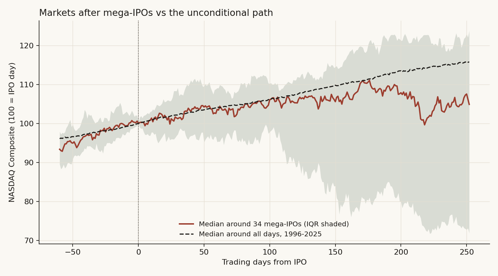
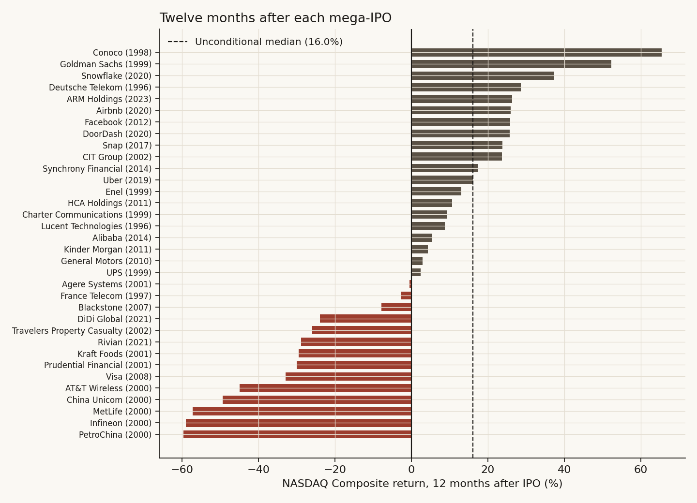
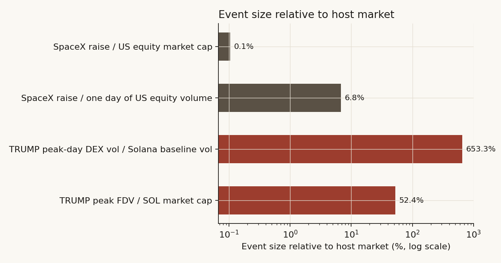

# 28 — SpaceX vs the TRUMP coin: does the biggest-ever sale of a story mark the top of its market?

**The question.** On January 17, 2025, the biggest memecoin launch in history went live, and within three days its host market printed all-time highs it has never seen again. On June 12, 2026 — today, as I write this — the biggest IPO in history starts trading. Same setup: a record-sized, retail-saturated, story-driven capital event at the peak of enthusiasm. So I wanted to know: is the SpaceX IPO the stock-market version of the TRUMP coin? Does an event like this drain the market around it, and does it mark the top?

This matters for a position: if the analogy holds, the week SpaceX lists is the week to reduce risk, not add it.

## Summary of results

- The TRUMP coin launch really did mark the top of its market, almost to the day. Solana printed its all-time high two days after launch and Bitcoin three days after. Neither has traded higher since (SOL is still 77% below that print as of June 2026).
- The mechanism was mechanical, not psychological: the event was enormous *relative to its host market*. TRUMP's fully diluted value peaked at roughly half of Solana's own market cap, and peak-day trading ran at 6.5x the chain's normal volume.
- SpaceX cannot repeat that mechanism. The $75B raise is about 0.10% of US equity market cap and about 7% of one ordinary day's trading. As a liquidity shock it is two orders of magnitude smaller.
- But mega-IPOs do carry information. Across the 34 largest US-listed IPOs since 1996, the NASDAQ's median return over the following 12 months was +4.9%, against +16.0% for all days in the same era. Only 0.8% of random 34-date draws look that bad. 59% of these IPOs were followed by a 20%+ index drawdown within a year, against a 36% base rate.
- The signal is clustering, not causation: issuers sell the most stock when the window is hottest, so record IPOs land late in cycles. Drop the five IPOs from the first half of 2000 and half the deficit disappears.
- Verdict: **No on the mechanism, conditional yes on the timing signal.** SpaceX will not vacuum the market the way TRUMP did, but the *fact that this deal was possible at all* — at 94x revenue, four times oversubscribed, in a record $160B IPO-pipeline year — has historically been the property of late-cycle markets.

## What I expected, and what would prove me wrong

The null (H0): a mega-IPO is just a big day at the office. The market absorbs it, forward returns after these events look like forward returns after any other day, and the TRUMP analogy is a coincidence of two assets that were going to top anyway.

The alternative (H1): record capital events cluster at sentiment peaks — either because they *drain* buying power from everything else (the TRUMP mechanism), or because issuers time the sale to maximum enthusiasm (the selection mechanism). Either way, forward returns after them should be measurably below the base rate.

What would prove me wrong: if forward index returns after the largest IPOs are indistinguishable from the unconditional distribution, the analogy is dead and the answer to the user-facing question is "ignore the noise, size SpaceX on its own merits."

A one-line prior worth naming: issuance timed to sentiment is an old result (Baker and Wurgler built a sentiment index partly out of IPO activity). Our own study 22 found that *aggregate* equity issuance fails as a market-timing signal (0 of 12 annual tests). So this study tests something narrower: not total issuance, but the handful of record-sized single events.

## How I checked it

Three tests, from the known case to the open question:

1. **The template.** Rebuild the TRUMP coin event study from daily exchange data: did the launch actually mark the top of its host market, and what happened to the assets around it?
2. **The base rate.** Take the 34 largest US-listed IPOs from 1996-2024 and measure index returns 1, 3, 6 and 12 months after each, against the unconditional distribution over the same era. Bootstrap the medians. Then try to kill the result twice (drop the dot-com cluster; condition the base rate on an equally hot tape).
3. **The scale test.** Compare the size of each event to the market that had to absorb it. If TRUMP was a whale in a pond and SpaceX is a whale in the ocean, the mechanism does not transfer no matter what the charts rhyme like.

The identification problem, out loud: with n=34 events that cluster in time, I cannot cleanly separate "mega-IPOs cause weak markets" from "mega-IPOs happen when markets are about to be weak." I don't try to. For the practical question — should the SpaceX listing change your risk posture? — the two stories give the same answer, and I say which one the data favors in Finding 4.

## Data

| Series | Source | Range | Notes |
|---|---|---|---|
| TRUMP, SOL, BTC, ETH daily OHLCV | Binance spot (public klines API) | listing/Oct 2024 - Jun 2026 | TRUMP listed on Binance Jan 19, 2025 |
| Memecoin basket: DOGE, SHIB, PEPE, WIF, BONK | Binance spot | Oct 2024 - Jun 2026 | equal-weight, indexed to Jan 16, 2025 |
| NASDAQ Composite daily closes | macrotrends (public dataset endpoint) | Feb 1971 - Jun 2026 | primary index for the base-rate test |
| S&P 500 daily closes | macrotrends | Dec 1927 - Jun 2026 | independent cross-check |
| Mega-IPO sample | hand-built from contemporaneous press + filings | 1996-2024 | all 34 US-listed IPOs with base proceeds >= ~$2.8B; SPACs, direct listings and closed-end funds excluded |
| On-chain launch-weekend stats | Helius, Chainalysis (via NYT/CNBC), DefiLlama | Jan 2025 | cited, not recomputed |

The 34-name sample is the full universe at this size threshold, not a selection — every US-listed operating-company IPO I could document at $2.8B+ of base proceeds is in [data/mega_ipos.csv](data/mega_ipos.csv), foreign dual-listings flagged. Proceeds figures mix base-deal and greenshoe-inclusive numbers depending on the contemporaneous source; ranking, not precision, is what matters here, and the notes column says which is which.

Coinbase's 2021 direct listing is deliberately excluded from the sample (it raised no primary capital) but deserves its one line: it hit the tape on April 14, 2021 — the exact day Bitcoin printed its first 2021 cycle top.

## Finding 1 — the TRUMP launch marked its host market's top, almost to the day

*What I expected.* The folklore says TRUMP "killed the cycle." Folklore needs numbers, so I rebuilt the window from exchange data.

*How I measured it.* Daily highs and closes from Binance; everything indexed to January 16, 2025, the last quiet day before the Friday-night launch.

```python
basket = (px / px.loc["2025-01-16"]).mean(axis=1) * 100   # DOGE/SHIB/PEPE/WIF/BONK, eq-wt
sol_peak  = sol_high["2024-10-01":"2025-06-30"].idxmax()  # -> 2025-01-19, $295.83
btc_peak  = btc_high["2024-10-01":"2025-03-31"].idxmax()  # -> 2025-01-20, $109,588
```

*What the data shows.*


- TRUMP launched Friday January 17 and peaked near $75 on Sunday January 19 (the Binance daily high printed $77.24), a top-ten fully-diluted market cap in under 72 hours.
- Solana — the chain it lives on — printed its all-time high of $295.83 on January 19, two days after launch. It has never traded there again; as of June 2026 it sits 77% lower.
- Bitcoin printed its then-all-time high of $109,588 on January 20, inauguration day, three days after launch, then fell 30% to the April 2025 low.
- The memecoin basket tells the sharpest story. It had already rolled over from its December 8, 2024 peak (158 on my index). On launch weekend it briefly popped to 111 — and that pop, printed on January 17, was the last high it ever made. It was 59 a month later, 40 three months later, and sits at 17 in June 2026.

*Why (the mechanism).* The launch was a liquidity vacuum, and the on-chain numbers are explicit. Solana DEX volume hit $28.2B and then $39.2B on January 19-20 against a roughly $6B/day baseline — the peak day exceeded the previous all-time daily record across all blockchains combined. Stablecoin float on the chain grew 72% in six days ($6.15B to $10.6B) as fresh cash bridged in. Traders sold what they held to buy the new thing: existing memecoins bled while TRUMP went vertical, which is why the basket's launch-weekend "pop" was already a fade in relative terms. And the wealth transfer was savage — roughly 810,000 wallets were underwater within three weeks (Chainalysis data reported by the NYT), about $2B of losses against roughly $6.6B of realized gains for insiders and early buyers. Half the buyers had never owned a Solana asset before; 47% created their wallet the same day they bought.

*What I checked.* The peaks use intraday highs, not closes (Binance listed TRUMP mid-day on the 19th, so closes understate the extremes — my first pass got this wrong by 40%). The basket's December top means TRUMP did not *start* the memecoin decline; it terminated the last bounce of an already-rolling complex. I keep the claim precise: the launch marked the final top of SOL, BTC, and the memecoin basket's last local high, within a three-day window.

*Verdict.* **Confirmed.** The event marked the cycle top of its host market to within days, and the mechanism — capital rotating out of everything else into the new listing — is visible in volume, stablecoin float, and the basket's failure to ever recover.

## Finding 2 — after the 34 biggest IPOs, the market's next 12 months were bad — reliably so

*What I expected.* If record listings cluster at sentiment peaks, the index should do worse than usual after them, and the gap should grow with horizon (tops take months to resolve).

*How I measured it.* For each IPO's first trading day, NASDAQ Composite forward returns at 21/63/126/252 trading days, against the distribution of the same forward returns from every trading day 1996-2025. Then a 10,000-draw bootstrap: how often does the median of 34 random days look as bad as the median of the 34 IPO days?

```python
fwd[h] = px[i + h] / px[i] - 1                      # per event, h in {21,63,126,252}
base   = all_days_1996_2025_same_horizons            # unconditional comparison
boot   = [median(choice(base_12m, 34)) for _ in range(10_000)]
p      = mean(boot <= median(event_12m))             # -> 0.008
```

*What the data shows.*



| Horizon | After mega-IPOs (median) | All days (median) | IPO %positive | Base %positive |
|---|---|---|---|---|
| 1 month | +1.6% | +1.7% | 62% | 63% |
| 3 months | +3.9% | +4.1% | 68% | 68% |
| 6 months | +6.3% | +7.9% | 59% | 72% |
| 12 months | **+4.9%** | **+16.0%** | **59%** | **77%** |

Nothing happens for a month. Nothing happens for a quarter. The gap opens at six months and yawns at twelve: an 11-point median shortfall, and the bootstrap says only 0.8% of random 34-day draws produce a median that low. Drawdowns say the same thing more vividly — the median worst peak-to-trough fall in the 12 months after a mega-IPO was -29.8% against -16.5% for random days, and 59% of these IPOs saw a 20%+ index drawdown within a year against a 36% base rate.

*A concrete example instead of an abstraction.* If you had sold the NASDAQ at the close of each of these 34 first trading days and bought back a year later, you would have skipped a median +4.9% — and dodged the year after PetroChina (-60%), Infineon (-59%), MetLife (-57%), AT&T Wireless (-45%), Visa (-33%) and Rivian (-29%).

*What I checked.* The S&P 500 — a different index from a different builder — gives the same answer: +2.2% median at 12 months against +12.1% base, events at the 25th percentile. That is the independent cross-check; the result is not an artifact of one tech-heavy index.

*Verdict.* **Confirmed, with the caveat that the events overlap.** Several of the 34 share calendar windows (three IPOs in December 2020 alone), so the effective number of independent events is smaller than 34 and the bootstrap p-value flatters the result. The direction survives; the precision is softer than 0.008 sounds.

## Finding 3 — the signal is clustering at cycle ends, not the IPO doing damage

*What I expected.* If the deficit in Finding 2 is real, it should be concentrated where mega-IPOs bunch together — issuers all rushing the same hot window — rather than spread evenly.

*How I measured it.* Sort the 34 events by their forward 12-month return and look at the calendar. Then re-run the test without the worst cluster.



*What the data shows.* The red tail is a roll call of cycle peaks. Five of the 34 — Infineon (March 2000), MetLife (April 2000), PetroChina (April 2000), AT&T Wireless (April 2000), China Unicom (June 2000) — landed within four months of the dot-com top. Blackstone listed in June 2007, weeks before the August credit cracks and four months before the October 2007 top. Visa's record deal priced into the teeth of 2008. DiDi and Rivian bracketed the November 2021 NASDAQ top — Rivian, the second-biggest raise in the sample, listed nine days before the exact peak.

Drop the five H1-2000 names and the median 12-month return improves from +4.9% to +9.3% (69% positive). Half the deficit is one cluster. That is not a weakness of the finding — it *is* the finding: record IPOs do not trickle out evenly, they stampede into the best windows, and the best windows are late.

*Why (the mechanism).* Nobody prices the largest deal in history into a weak tape. A record raise requires record enthusiasm — four-times-oversubscribed books, retail tranches, index-inclusion hype. Those conditions are, definitionally, what the late stage of a cycle looks like. The IPO is the thermometer, not the fever.

*What I checked — the strongest rival.* "You've just rediscovered that markets were hot, and hot markets mean-revert." If that were the whole story, *any* day with an equally hot trailing tape should show the same weak forward returns. It does not. The median mega-IPO arrived with the NASDAQ up 26.6% over the prior year; taking *all* days since 1996 with trailing returns at least that hot (n=2,140), the median forward 12-month return is +14.7% with 76% positive — barely below the unconditional +16.0%, and three times the mega-IPO events' +4.9%. A hot tape alone was not bearish. A hot tape *plus a record-sized exit* was. The rival fails on its own numbers.

*Verdict.* **Conditional.** Mega-IPOs are a late-cycle symptom with real forward information beyond simple momentum, but the effect is driven by clusters, and a single IPO in isolation is a weak signal.

## Finding 4 — SpaceX cannot mechanically do what TRUMP did

*What I expected.* For the analogy to bite hard, SpaceX would need to be big relative to its host market the way TRUMP was. I expected it not to be close, and it is not close.

*How I measured it.* Event size over host-market size, both for stock (market cap) and flow (daily traded value).

```text
TRUMP peak FDV  / SOL market cap        ~ $73B / ~$140B  = ~52%
TRUMP peak-day DEX volume / baseline    ~ $39.2B / ~$6B  = ~6.5x
SpaceX raise / US equity market cap     = $75B / ~$72T   = 0.10%
SpaceX raise / one day's traded value   = $75B / ~$1.1T  = 6.8%
```



*What the data shows.* TRUMP, at peak, was priced at half its host chain's entire market cap, and its launch traded 6.5 times the chain's normal daily volume. SpaceX's $75B — the largest raise in market history — amounts to one-thousandth of US equity market cap and seven percent of one ordinary trading day's dollar volume (Cboe puts 2025 average daily notional at $1.1T). The $22.5B retail tranche, the part most directly "drained" from other holdings, is about two percent of a single day's tape.

*Why it matters.* The TRUMP mechanism was a small pond absorbing a whale: prices of everything else fell because the marginal dollar physically left them. The US equity market is the ocean. SpaceX's raise, index flows and all, is rounding error against $72T of stock and $1.1T of daily turnover. Whatever SpaceX does to the market, it will not do it by draining liquidity.

*What I checked.* The constants are the soft spot, so they are sourced and rounded against me: US market cap $69T (Siblis, Jan 2026) to $75T+ (April 2026) — I use $72T; daily notional $1.1T (Cboe 2025 average). Halve the market-cap estimate and double the raise and the conclusion does not move an order of magnitude.

*Verdict.* **The mechanism does not transfer.** If SpaceX coincides with a top, it will be as a symptom (Finding 3), not a cause (Finding 1's mechanism).

## Did I just find noise?

Four ways this could be nothing, and what the checks said:

1. **Overlapping events.** Conceded above — effective n < 34, true p-value softer than 0.008. Direction unchanged across two independent indexes.
2. **One regime driving everything.** Tested — ex-2000 the deficit halves but persists (+9.3% vs +16.0%). The 2007, 2021 mini-clusters point the same way.
3. **Hot-tape mean reversion.** Tested with the conditional base rate — fails as a full explanation (+14.7% hot-tape base vs +4.9% events).
4. **Sample construction.** The threshold (~$2.8B) was set by data availability, not chosen to flatter the result; every qualifying deal I could document is in. Adding Lyft ($2.3B, 2019) or Twitter ($1.8B, 2013) — the next names down — would not change the sign at 12 months (NASDAQ was up modestly after Twitter; flat-to-down after Lyft).

What I could not test: only 34 events exist at this size. This is a structurally-rare-event study, like several before it in this repo, and the rare-event n is capped by reality. The honest read is "strong directional evidence, wide confidence bands."

## The answer, in the data

**Is SpaceX the TRUMP coin of the stock market? No on mechanism, conditional yes on what it tells you about the clock.**

| Question | Answer | Median | Average | %Positive/%Hit |
|---|---|---|---|---|
| Did TRUMP mark its host market's top? | **Yes** — SOL ATH +2 days, BTC ATH +3 days, basket's last high on launch day | SOL -77% / basket -83% since | — | 0% of the three made a later high |
| Do mega-IPOs precede weak markets? | **Yes at 12m** (n=34) | +4.9% vs +16.0% base | -0.8% vs +13.9% base | 59% pos vs 77% base; p≈0.008 (overlap-flattered) |
| Is it just a hot tape? | **No** | hot-tape base +14.7% | — | 76% pos — rival fails |
| Does it survive ex-2000? | **Weakened, yes** | +9.3% (n=29) | — | 69% pos |
| Can SpaceX drain the market like TRUMP? | **No** | raise = 0.10% of mcap, 6.8% of one day's volume | — | vs TRUMP's 52% of host mcap |
| 20%+ index drawdown within 12m of a mega-IPO? | **Elevated** | max-dd -29.8% vs -16.5% | — | 59% vs 36% base |

**What this means for the live event.** SpaceX listing today is not a sell-everything signal — a single IPO is a weak timer and the market will not be drained by it. But the *context* — the biggest raise ever at 94x revenue, four times oversubscribed, a 30% retail tranche, OpenAI filing four days before it, a forecast record $160B IPO year — is the cluster forming, and clusters are what carried the 12-month deficit. The base rates say: the year after days like this has historically been below-average and drawdown-prone. Position for chop, respect study 24's unlock calendar, and treat any day-one euphoria as the thermometer reading, not the forecast.

## Caveats

- n=34, overlapping windows; the bootstrap p-value overstates precision. Direction of bias: against significance claims, toward humility.
- Proceeds figures mix base and greenshoe-inclusive numbers from contemporaneous press; first-trade dates are correct to within a day or two for the 1990s names. At 6-12 month horizons this cannot flip results.
- The TRUMP on-chain statistics (DEX volume, stablecoin float, wallet P&L) are cited from Helius/Chainalysis/DefiLlama reporting, not recomputed from chain data.
- Crypto comparators trade 24/7 on many venues; Binance prints differ slightly from CoinGecko composites (TRUMP peak $77.24 vs $73.43). I use one venue consistently.
- SPCX had priced ($135, $75B, $1.77T) but had not opened when this was written on listing day; pre-open indications were roughly 30% above the IPO price. First-close data and the day-one verdict belong to a follow-up.

## Reproducibility

- [pull_data.py](pull_data.py) — fetches every series from public endpoints (Binance klines; macrotrends index histories). Note: the index endpoints sit behind a bot wall that may require a browser-like fetch; the exact snapshots used are committed under [data/](data/).
- [run_study.py](run_study.py) — all three tests, every figure, every number in this document; writes [results.json](results.json) and [ipo_event_returns.csv](ipo_event_returns.csv) (per-event forward returns, both indexes, all horizons).
- The governing statistic, in one line: `p = mean([median(sample(base_12m, 34)) for 10k draws] <= +4.9%) = 0.008`.

## Sources and forward pointers

- Helius, "$TRUMP's Historic Weekend on Solana" (on-chain launch statistics); Chainalysis wallet P&L via NYT (Feb 9, 2025) and CNBC (May 6, 2025); Reuters and BBC contemporaneous launch coverage.
- SpaceX deal terms: Reuters pricing coverage (June 11, 2026); S-1 financials as analyzed in study 24; Cboe "2025 U.S. Equities Year in Review" (daily notional); Siblis Research / Visual Capitalist (US market cap).
- IPO sample: contemporaneous NYT, Washington Post, LA Times, MarketWatch, Insurance Journal and SEC filings per deal.
- **Builds on** [study 15](../15-ipo-chase/) (the IPO-chase base rate), [study 22](../22-equity-issuance-top-signal/) (aggregate issuance does *not* time tops — this study's narrower event-level claim is the surviving piece), and [study 24](../24-spacex-ipo-quality-model/) (the SpaceX-specific float/unlock model; its supply calendar is the trade plan this study's clock sits behind).
- **Next:** a day-one follow-up once SPCX has a close — and the cluster watch: if OpenAI and Anthropic price into the same window, Finding 3 says the clock matters more than any single deal.
