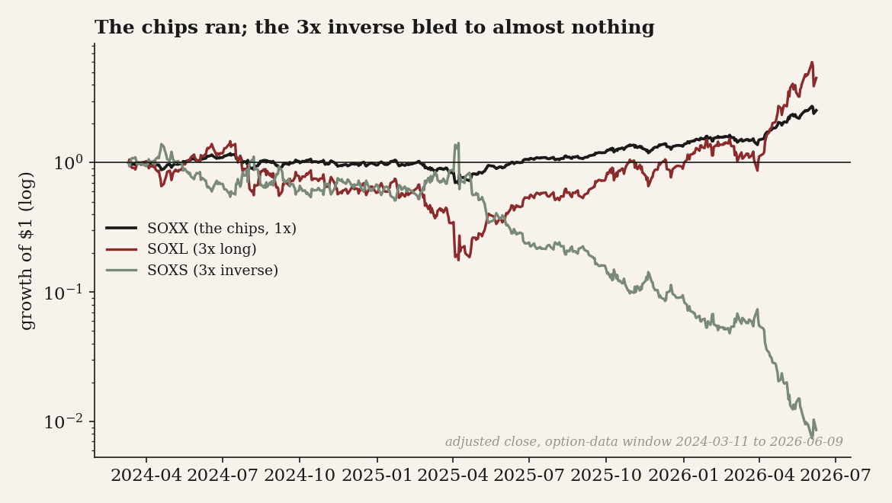
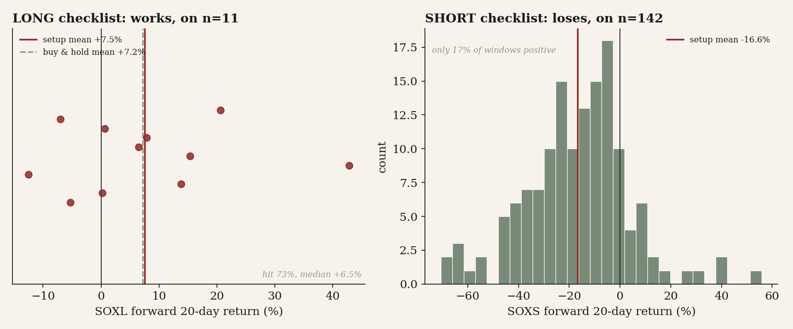
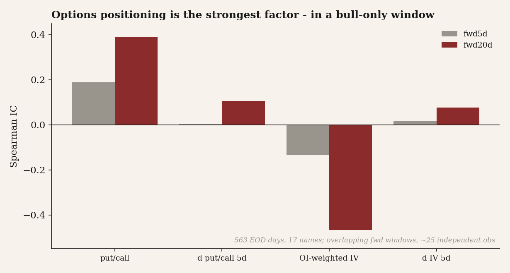
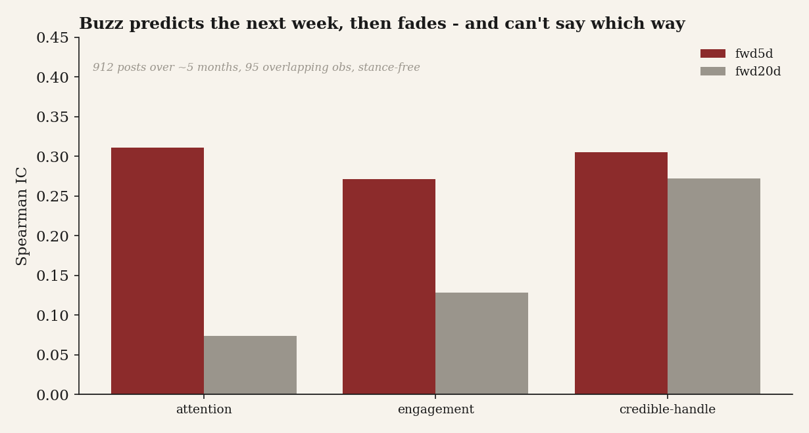

# 29 - A semis entry signal: can a checklist time the chips, or is it just a tidy way to stay disciplined?

## What I found (the short version)

- I tried to build a clean entry signal for the semis complex, and the honest product turned out to be much smaller than the pitch. It is a disciplined checklist, not a fitted alpha.
- The daily long-entry checklist looks promising but fires only 11 times in ten years. Forward-20-day mean +7.55%, median +6.51%, hit 72.7%, with a signal Sharpe of 0.49 against buy-and-hold's 0.27. Suggestive, not bankable, because eleven events is a hint and not a track record.
- The short side, expressed by buying the inverse ETF on a breakdown setup, does not just fail to add edge. It actively bleeds. Forward-20-day mean -16.65%, hit 16.9%, max drawdown -100%, across 142 events. Most of that is the inverse ETF decaying underneath a bull, not a timing miss.
- Options positioning is the strongest single factor by raw information coefficient (put/call ratio +0.389, OI-weighted implied vol -0.467 against forward-20-day index returns). But it is fitted to a one-sided bull, sits stale at the live edge, and its effective independent sample is closer to ~25 than the ~490 rows suggest.
- Social attention reads forward over the next week (Spearman IC +0.31 at five days, n=95) but it is buzz, not direction, and it rests on about five months of overlapping data.
- Verdict: Conditional, and the condition is honesty about what it is. Keep the checklist as a discipline that bolts onto the [study 21](../21-semis-risk-model/) risk dial, treat the two factors as context indicators, and do not trade the short side through an inverse ETF.

> Research and backtested. No live capital, no audited track record. Returns are point-to-point on adjusted closes with idealized fills. A live version pays spread, slippage, and the daily decay built into leveraged and inverse ETFs, so real results would print worse than every number here. Three of the model's intended inputs (a regime/size dial, a credit confirmation, and a realtime order-flow read) are not in this backtest, because they were never captured historically. What you see below is the daily skeleton only.

## What I expected, and how I'd know I was wrong

The folk belief is that semis are timeable if you stack enough confirmation. Trend up, volatility coiled, price breaking out on volume, sentiment hot. Get the stack to line up and you have your entry. Invert it and you have your exit. The stronger version of the claim is that you can trade both directions of it, going long the leveraged ETF on the green light and long the inverse ETF on the red one, and harvest the swings.

That mixes three different claims that deserve to be tested apart. \"A confirmation stack marks sane entries\" is plausible and modest. \"That stack beats buy-and-hold on risk-adjusted return\" is a much bigger claim. And \"you can short this complex through an inverse ETF on the same logic\" is a claim about a product, not about a signal, and the product has costs the signal never sees.

My honest guess going in was modest. The long checklist marks sane spots to add but earns nothing real over just holding the ETF, the inverse-ETF short loses, and the two supporting factors are weak or regime-bound. I would know I was wrong if the long setup fired often enough to trust (dozens of independent events, not a handful) and beat buy-and-hold on a deflated Sharpe, which is just a Sharpe ratio knocked down for the fact that I tried more than one rule and could have gotten lucky. I would know I was wrong on the short side if it actually made money net of the inverse ETF's decay. And I would know I was wrong on the factors if their information coefficients (the rank correlation between today's signal and the return that follows) held up after I corrected for overlapping windows and a one-directional market. If the entry signal genuinely timed the chips, the long side would not rest on eleven events and the short side would not bleed.

The plain prior behind all that. Classic technical entry rules usually survive on the trend they ride, not on timing alpha, and inverse leveraged ETFs are structurally bad vehicles to hold. So I expected the long side to look fine mostly because semis went up, and the short side to be a trap.

This is the natural sibling of [study 21 (the semis risk overlay)](../21-semis-risk-model/). That one asked whether a trend dial earns its keep and found it is an airbag. It smooths the ride, worst drawdown -43% to -30%, without lifting risk-adjusted return (Sharpe edge +0.07, with a confidence interval straddling zero). Study 21 was the risk dial. This is the entry trigger that would sit on top of it. It also leans on the practical lesson from [study 19 (shorting the semis)](../19-shorting-the-semis/), that fading a hot chip complex pays nothing, and on the regime backdrop from [study 27 (the AI capital cycle)](../27-ai-capital-cycle/) and [study 16 (narrow leadership)](../16-narrow-leadership-and-the-index/). Semis are a high-beta, late-cycle group, and the short-via-inverse-ETF failure below is what happens when you fight that kind of bull with a decaying instrument.

There is one signal I need to reconcile honestly against [study 05 (news-sentiment)](../05-news-sentiment-signal/), because at first glance they seem to disagree. Study 05 found that a news-sentiment stance tag is reactive, a momentum mirror, with backward IC +0.145 against a forward +0.049 and a long-short spread of nothing. My social finding here is a different animal. It measures attention, how much the complex is being talked about, count and reach, with no bull/bear stance attached, and that attention reads forward at IC +0.31 over the next week. Those two facts sit together comfortably. Short-horizon attention leading next-week returns is an attention effect, not a sentiment forecast. It says nothing about which way the move goes, only that something is happening. Study 05's \"stance is reactive\" verdict is intact. I am measuring volume of talk, not direction of talk, and I keep that distinction sharp throughout.

## How I checked it, and why each piece

Three tests, each aimed at one of the three claims, and each built so the obvious confound has somewhere to show up.

The **entry checklist** runs on ten years of daily adjusted closes (2016-05-18 to 2026-06-08) for the semis index and its 3x long and 3x inverse ETFs. Every rule is computed only from data available that day, so there is no look-ahead. The long setup is a textbook coil-and-release recipe; the short setup is its mirror. The identification problem here is the bull market. Any long-side win could just be owning a rising 3x ETF, so I benchmark against buy-and-hold and deflate the Sharpe for the fact that I tried two sides. Daily prices are also the only thing this test sees. The deployed model has three more inputs (a regime/size dial, a credit confirmation, a realtime order-flow read) that were never captured historically, so forcing them in would be a backfill fiction. I grade the daily skeleton and leave the live gates for forward testing.

The **options-positioning factor** aggregates end-of-day option open interest and implied volatility across the 17 SOXX holdings that carry liquid options, over 2024-03-11 to 2026-06-09, into a daily put/call ratio and an OI-weighted implied vol plus their five-day changes. Then it ranks each against forward index returns with a Spearman information coefficient. Spearman because option data has fat tails and non-linear kinks that a Pearson correlation would mishandle. The identification problem is overlap. A 20-day forward window measured every day reuses 19 of 20 days of the next observation, so the headline n is nowhere near the count of independent looks. I correct for that explicitly rather than letting the raw n flatter the t-stat.

The **social-attention factor** counts dated posts on the semis complex per day, with a reach-weighted and a credibility-weighted variant, z-scores each on a trailing sixty days so a quiet December and a loud February sit on the same scale, and runs the same Spearman IC against forward returns. The identification problem is reverse causality. Posting spikes on the same days price spikes, so a naive same-day correlation would just rediscover that loud days are big days. The strictly-forward framing, signal today against the return over the next 5 or 20 days, is what separates \"attention leads price\" from \"attention coincides with price,\" and I test the coincident version as a rival.

## The data

Universe first. The price test covers the semis index and its 3x long and 3x inverse ETFs over ten years. The options test covers 17 major SOXX holdings that carry liquid options (NVDA, AVGO, AMD, TXN, QCOM, MU, ADI, LRCX, KLAC, AMAT, MRVL, NXPI, MCHP, INTC, MPWR, ARM, ASML), 563 option-days. The social test covers 912 dated posts on the complex across about five months, 114 post-days.

- Daily adjusted closes for the index and its leveraged and inverse ETFs, from a warehouse, 2016-05-18 to 2026-06-08, transformed into the trend, compression, breakout, volume and blow-off rules.
- End-of-day option open interest and implied vol for the 17 names, from a warehouse, 2024-03-11 to 2026-06-09, aggregated to a daily complex-level put/call ratio, OI-weighted implied vol, and their five-day changes.
- Dated posts tagging the semis names, from a scraper feed, 2025-12-04 to 2026-04-30, transformed into daily attention, summed impressions, and a credibility-weighted count, each z-scored on a trailing 60 days.

## What the data looks like first

Before any rule, look at what the complex actually did over the window I have option data for. From early 2024 into mid-2026, semis ran one of the cleanest bull markets in the tape. The unleveraged index (SOXX) climbed steadily. The 3x leveraged version (SOXL) climbed far more, which is what leverage does on the way up. And the inverse leveraged version (SOXS), the instrument the short side of any entry model would use, did what inverse leveraged ETFs do in a sustained uptrend. It decayed, more or less monotonically, toward the floor.



*Figure (complex-path.png): I plotted growth of $1 in SOXX (the chips, 1x), SOXL (3x long) and SOXS (3x inverse) over the option-data window (2024-03-11 to 2026-06-09) on a log scale, so the inverse ETF's slow bleed shows up as a downhill line instead of a flat smear pinned near zero. That decay is the main reason the short side never had a chance, so I wanted to show it rather than just claim it.*

Inverse leveraged ETFs reset daily, so in a trending-up market that daily reset compounds against the holder. Even a correctly-timed bearish moment hands you an instrument that is itself bleeding the entire time you hold it. When I report below that the SOXS short setup lost -16.65% on average over twenty days, the setup is only part of the story. The vehicle was sinking underneath it regardless.

A long-side signal in this window is graded against a roaring tailwind, which is why I lean on the deflated Sharpe and flag the one-regime caveat rather than celebrate the level of returns. A short-side signal is graded against a structural headwind built into the only vehicle available to express it. Neither is the signal's fault, but both are load-bearing for reading the numbers honestly.

## The findings

### Finding 1 - The checklist works on the long side, barely, and the short side actively loses

I expected the daily rules to carry no forward edge: long-side returns after a setup look like buy-and-hold, and short-side returns are zero. The alternative I was testing is that a textbook entry recipe (uptrend plus volatility compression plus volume-confirmed breakout, with a blow-off filter) buys a real coil-and-release and beats just owning the ETF, while a mirror-image breakdown rule earns on the way down. What would have proved me wrong on the long side is a setup mean at or below buy-and-hold, or a hit rate near 50%. On the short side, positive returns after breakdowns. My prior was that the long side would look fine mostly because semis went up, and the short side would be a trap.

Every rule is computed from same-day data only. A long setup fires when the index is in an uptrend, has been in a volatility squeeze, then breaks out on heavy volume without being blown off. I then measure the 3x-long ETF's forward 5-day and 20-day return from the setup date. A short setup fires on a breakdown or failed breakout inside a downtrend or an overbought rollover. I measure the 3x-inverse ETF's forward returns, which is the long-the-inverse expression of going short.

```
uptrend     = close > SMA50 > SMA200
compression = 20d Bollinger bandwidth in bottom 25th pctile of trailing 252, held within 10d
breakout    = close >= prior-20d high
vol_confirm = volume >= 1.5 * avg20 volume
not_blowoff = RSI14 < 80 AND close < 70% above 200dma
LONG_setup  = uptrend AND compression AND breakout AND vol_confirm AND not_blowoff  -> 3x-LONG fwd 5d/20d
SHORT_setup = (close <= prior-20d low OR failed_breakout) AND (close < SMA50 OR overbought_rollover) -> 3x-INVERSE fwd
grade(WEAK) = n>=8 AND mean20>0 AND hit20>=0.50 ; grade(EDGE) adds n>=20, hit>=0.55, SR>buy_hold, DSR>=0.60
```

The long setup fired 11 times in ten years. Forward 5d: mean -0.09%, median +0.62%, hit 63.6%. Forward 20d: mean +7.55%, median +6.51%, hit 72.7%, worst drawdown across the events -12.54%. Signal Sharpe 0.4874 against buy-and-hold's 0.2667, and a deflated Sharpe of 0.9383. So the long side beats buy-and-hold on Sharpe and the 20-day numbers lean clearly positive, but on eleven observations. The short setup fired 142 times. Forward 5d: mean -5.65%, median -6.03%, hit 33.8%. Forward 20d: mean -16.65%, median -15.57%, hit 16.9%, worst drawdown -100.00%, signal Sharpe -0.7984, deflated Sharpe 0.0. The breakdown rule fired 142 times and was wrong about five times out of six at the 20-day horizon.



*Figure (checklist.png): left, the 11 long events shown as a strip with the setup mean and the buy-and-hold mean marked, so you can see how thin the sample is and how far the events sit above zero (median +6.51%). Right, a histogram of the 142 short events, piled up well below zero (median -15.57%) with a long left tail running down toward the -100% drawdown.*

The long side is a coil-and-release. A tight Bollinger squeeze inside an uptrend means realized volatility has compressed, and a volume-confirmed break of the 20-day high is the release. When that fires in a complex that spent 2024-26 grinding higher, the next month tends to run. The short side fails for a structural reason that has nothing to do with whether the breakdown call was right. Take a concrete window: the index falls 5% on day one, then rises 5.26% the next to return to flat, a net index move of zero. The 3x inverse gains 15% day one (to 1.15), then loses 3 x 5.26% = 15.8% day two, landing at 0.968, a 3.2% loss while the index went nowhere. Stack twenty such days in a complex that keeps recovering and the inverse vehicle compounds toward zero. That is exactly the -100% drawdown tail. The breakdown rule sometimes flagged a real dip, but holding the inverse ETF for 20 days through the bounce surrendered everything.

The rival I most wanted to rule out is \"the long side is just owning the 3x ETF in a bull.\" If that were the whole story, the setup Sharpe would match buy-and-hold. It doesn't: signal Sharpe 0.4874 against 0.2667, and the 72.7% hit rate is above the unconditional base rate the bull alone would give. The setup mean (+7.55%) barely clears the buy-and-hold mean (+7.21%), so the edge is almost entirely in the lower volatility of the entries, not a higher average return. So there is a sliver of timing on top of the trend, but it is a sliver on n=11. On the short side I checked whether the failure was a bad rule or a bad vehicle. The breakdown rule fired plausibly (142 times, concentrated in real pullbacks), but the loss is monotone with holding period (fwd5 -5.65% worsening to fwd20 -16.65%), which is the decay signature of the ETF, not a timing miss that would mean-revert.

Verdict: conditional on the long side, no on the short side. The long side's fwd20 Sharpe beats buy-and-hold and the deflated Sharpe of 0.9383 actually clears the 0.60 grading bar. The grade is WEAK only because the setup fired 11 times, below the n>=20 threshold the EDGE rule needs, so I trust the level far less than the number suggests. Short side: NONE, fwd20 mean -16.65%, hit 16.9%, deflated Sharpe 0.0, n=142. The honest product is a disciplined checklist, not a fitted alpha.

### Finding 2 - Options positioning is the strongest single factor, but it is bull-bound, stale, and its effective sample is ~25 not ~490

I expected options positioning to carry no forward information on the complex. The put/call ratio and implied-vol level are coincident risk gauges, so their correlation with forward returns should be zero. The alternative is that positioning is mildly contrarian. When the crowd buys protection (high put/call) and vol is cheap, the next leg tends up; when vol is expensive the local top is near. My prior was modest, maybe an absolute IC around 0.1 to 0.2, because positioning is the one factor with real academic pedigree (the put/call ratio as a contrarian gauge, the vol-risk-premium term) but not a clean trade. What would have proved me wrong is a forward IC indistinguishable from zero once windows are de-overlapped, or a sign that flips on a sample split.

Four daily complex-level signals aggregated across the 17 names, ranked against forward returns with a Spearman IC, n>=30 required before scoring anything. The honest count is the overlap correction. 490 daily rows of a 20-day forward window is closer to 490/20 ~ 25 independent looks.

```
for each trading day d:
  pc_ratio  = sum(put_open_interest over the 17 names) / sum(call_open_interest)
  oi_w_iv   = open-interest-weighted mean implied vol across the names
  d_pc_5    = pc_ratio[d] - pc_ratio[d-5]
  d_iv_5    = oi_w_iv[d]  - oi_w_iv[d-5]
for horizon h in {5, 20}:
  fwd_ret[d] = SOXX_close[d+h]/SOXX_close[d] - 1
  IC = spearman(signal[d], fwd_ret[d])      # report only if n >= 30
# honest SE uses n_eff = n_obs / h, NOT n_obs (overlap correction)
```

The level signals carry the information; the change signals do not. At 20 days the put/call ratio scores +0.389 (n=490) and OI-weighted implied vol scores -0.467 (n=542) against forward SOXX returns, the best absolute IC in the whole study. By the grading convention I use in this series (an absolute IC of 0.10 or more) that earns an EDGE label, though I will spend the rest of this section explaining why the label oversells it. At 5 days the same signals are weaker but same-signed: pc_ratio +0.188 (n=505), oi_w_iv -0.135 (n=557). The 5-day change signals are essentially noise (d_pc_5 +0.004, d_iv_5 +0.016), and even the 20-day changes are modest (d_pc_5 +0.106, d_iv_5 +0.077). It is the standing level of positioning, not its recent move, that lines up with what comes next. SOXL mirrors SOXX almost exactly (fwd20 pc_ratio +0.389, oi_w_iv -0.485), so this is not an ETF artifact.



*Figure (options-ic.png): the four options signals against forward SOXX returns at 5 and 20 days. The level signals (put/call, OI-weighted IV) tower over the near-zero change signals, and the gap widens at 20 days. The footnote carries the caveat that matters most: the IV 20-day t-stat collapses from about 12 at the naive n=542 to about 2.5 once I re-price the standard error for roughly 27 independent looks rather than 542.*

The mechanism is contrarian positioning. When the put/call ratio is high, the crowd has already bought downside protection: the fear is in the price and the path of least resistance is up. When OI-weighted implied vol is high, options are expensive, which historically marks local tops because everyone has already paid up for the move; when vol is cheap, the complex tends to grind higher. Concretely, on a day when the 17 names collectively show a heavy put skew and implied vol has bled lower, the model reads that as washed-out fear plus cheap insurance and leans constructive on SOXX over the next month, and over 2024-26 that read was right more often than not. The honest gloss is that this is the same story told twice. A high put/call ratio and cheap vol are cousins, both saying the crowd is defensive while strength keeps coming.

I stress-tested the EDGE grade three ways. First, overlap. Re-pricing the standard error with an effective n of about 490/20 ~ 25 instead of 490 drops the put/call t from about 9.3 (naive n=490) to about 2.0, and the IV t from about 12 (naive n=542) to about 2.5 (effective n ~ 27). The signal survives the 5% threshold but only just, so I refuse to call it clean. Second, the ETF-artifact rival is ruled out: SOXL reproduces the SOXX ICs to within 0.02 (pc_ratio identical at +0.389, oi_w_iv -0.485 against -0.467), so it is not a quirk of one instrument. Third, the rival I most wanted to kill, that the put/call ratio is just inverse implied vol repackaged. The two point the same way, which is suspicious, but they are not the same signal. At 20 days inverse-vol's effective long IC (+0.467) beats put/call's (+0.389) by 0.078, yet at 5 days the put/call ratio (+0.188) beats inverse-vol (+0.135). If pc_ratio were a pure restatement of IV the ranking would be stable across horizons. It is not, so positioning is partly distinct from the vol-premium story, but I cannot fully separate them on 25 effective looks, and I say so.

Verdict: conditional EDGE. The factor is the strongest in the study by raw IC (best absolute IC = 0.467, SOXX fwd20) and the sign is economically sensible and consistent across 5d and 20d and across SOXX and SOXL. But it is conditional on three things the grade alone hides. A one-sided 2024-26 bull with no real bear to test the contrarian sign against. End-of-day positioning that sits about 8 days stale at the live edge. And an effective independent sample of about 25 rather than 490, which pushes the de-overlapped t-stats down to roughly 2.0 to 2.5. A real positioning dial, not a tradable timing trigger.

### Finding 3 - Social attention predicts the next week, weakly and only as buzz

I expected attention on semis names to have no forward content, an IC indistinguishable from zero. The alternative is that a burst of posting leads price over a short horizon because attention front-runs flow. My prior was weak-positive. Short-horizon attention should predict a few days out, because people pile in after they post, but buzz with no bull/bear label should not predict direction at any longer horizon and should look like a momentum mirror, not a forecast. What would have proved me wrong is an IC near zero at fwd5, or the IC surviving strongly past 20 days, which would suggest a slow real-information channel rather than a fast attention channel.

Three daily, stance-free series, z-scored on a trailing 60 days, ranked against forward SOXX returns with a Spearman IC, n>=30 required. The framing is strictly forward to separate \"attention leads price\" from \"attention coincides with price.\"

```
# daily, stance-free, per trading day d over semis names
attention[d]      = count(posts tagging a semis name on d)
eng_attention[d]  = sum(impressions on those posts)
smart_activity[d] = credibility-weighted post count   # each post weighted by a handle-credibility score
z[d] = (x[d] - mean(x[d-60:d])) / std(x[d-60:d])           # 60d trailing z-score
for h in (5, 20):
    fwd[d] = SOXX_close[d+h] / SOXX_close[d] - 1
    IC = spearman(z_signal, fwd)   # report only if n >= 30
grade = EDGE if max|IC| >= 0.10 else WEAK if >= 0.05 else NONE
```

At five days all three signals point the same way and clear the EDGE threshold: raw attention +0.311 (n=95), summed impressions +0.271, and the credibility-weighted count +0.305. Louder weeks on the complex tend to be up weeks over the following five sessions, by a modest but consistent rank correlation. The story changes at twenty days. Raw attention collapses to +0.074 and impressions fade to +0.128, while only the credibility-weighted count holds at +0.272. Put those two horizons next to each other and the decay, not the headline grade, is what I actually take away. The edge lives almost entirely in the next week, and the only thing that survives a month is the count weighted toward credible handles, which is the closest this stance-free layer gets to a slow-information channel. The sample is thin and overlapping: 912 dated posts across 2025-12-04 to 2026-04-30, 114 post-days, 95 overlapping return observations.



*Figure (social-ic.png): each social signal against forward SOXX returns at 5 and 20 days. All three clear the 0.10 EDGE line at five days, but raw attention and impressions fall back toward zero by twenty days while the credibility-weighted count holds. The footnote keeps the thin sample in view: about five months of posts, 95 overlapping observations, stance-free.*

Attention front-runs flow on a short fuse. Picture a week when a cluster of posts on the big names pushes the daily post count well above its trailing-60-day mean. Those posts are the leading edge of retail and fast-money interest that takes a few sessions to actually buy, so SOXX drifts up over the next week. By day 20 the buzz has dissipated, the flow it heralded has already been absorbed, and fresh price action is driven by things the earlier buzz knew nothing about, so the IC washes to +0.07. The reason the credibility-weighted count survives to twenty days is that a credible-handle post is more likely to carry durable information, a real supply-chain read, than a generic mention, so its content keeps mattering after the crowd's noise has faded. This is attention, not direction. None of the three series knows whether the buzz is bullish or bearish, so the positive sign is \"louder complex leads higher complex in this bull window,\" not a signed call.

The load-bearing rival is reverse causality, that attention just spikes on big up-days and the edge is coincident, not predictive. Two numbers rule it out. First, the signal is measured against strictly forward returns, so a same-day pop cannot enter the score. Second, the horizon structure is exactly wrong for a coincident artifact. A coincident effect would not decay with horizon the way a forward-prediction effect does. If buzz merely tagged along with same-day moves, the fwd5 and fwd20 ICs would be similar noise, not +0.311 falling to +0.074. The decay is the signature of a real but short-lived lead. I also reconciled against study 05. That study measured stance (bullish/bearish tone) and found it backward-looking, while this measures attention (count and buzz) and finds a short forward lead. A stance-free count predicting next week is fully consistent with short-horizon attention, and says nothing about whether tone is predictive, so the two do not contradict.

Verdict: conditional yes, a context indicator only. The grade is EDGE on the IC rule (best absolute IC = 0.311, fwd5 attention, n=95; credibility-weighted fwd5 +0.305, fwd20 +0.272), but the edge is short-horizon, stance-free, and built on about five months of data with 95 overlapping observations. With an effective independent sample near 19 non-overlapping five-day blocks, +0.31 is roughly one to one-and-a-half standard errors from zero, so EDGE here is a label from the grading convention, not a claim of statistical significance. It informs the read as a temperature gauge, not a standalone entry trigger.

## Did I just find noise?

Probably, in part, and the honest answer is to say where.

The long checklist rests on 11 events in ten years. The deflated Sharpe of 0.94 clears the 0.60 grading bar, but it is computed on those same eleven points, so I trust the level far less than the number suggests. Forward 20-day windows overlap, so even those eleven are not eleven independent draws. A single bad cluster could erase the edge. I report it as WEAK and call it a hint, not a track record, precisely because the effective independent sample is a handful and the n=11 fails the EDGE rule's n>=20 bar.

The options factor has the same overlap problem at scale. The headline n of about 490 overstates the evidence by roughly 20x. The honest independent sample is about 25, and the de-overlapped t-stats are only about 2.0 for the put/call ratio and about 2.5 for implied vol. One outlier cluster or one regime break could push that under 2. I also tested eight options ICs (four signals across two horizons) and six social ICs (three signals across two horizons), and I headline the largest of each, so both top numbers are partly max-picks inflated by the search, the options one most of all since it produced the study's best absolute IC.

The social factor is the thinnest: about five months of posts, 95 overlapping observations, an effective independent n near 19. A single buzz cluster in one strong earnings week could carry most of the fwd5 IC, and with 114 post-days I cannot rule that out. The one genuinely encouraging detail, the credibility-weighted count holding at fwd20, is also the cell most likely to be a small-sample fluke, because it is the result that most flatters the \"credible handles carry information\" story.

And costs. Every number here is gross. The long checklist's eleven events make slippage minor, but it is still gross. The short side's -100% drawdown is on an instrument with the daily decay I showed earlier, which a live position pays every day. Net of costs, every grade gets worse, never better.

## The answer, in the data

**Conditional, and the condition is honesty about what it is.** This is not a system that times the chips. It is a disciplined checklist with one suggestive-but-thin long edge, a short side that should not be traded through an inverse ETF at all, and two supporting factors that show real information but each under a caveat heavy enough to keep them off a trigger.

| Component | Horizon | Median | Mean / IC | % positive (hit) | n | Grade |
|---|---|---:|---:|---:|---:|---|
| Long checklist (SOXL) | fwd 5d | +0.62% | -0.09% | 63.6% | 11 | WEAK |
| Long checklist (SOXL) | fwd 20d | +6.51% | +7.55% | 72.7% | 11 | WEAK |
| Short setup (SOXS) | fwd 5d | -6.03% | -5.65% | 33.8% | 142 | NONE |
| Short setup (SOXS) | fwd 20d | -15.57% | -16.65% | 16.9% | 142 | NONE |
| Options: put/call ratio | SOXX fwd 20d (IC) | - | +0.389 | - | 490 | EDGE |
| Options: OI-weighted IV | SOXX fwd 20d (IC) | - | -0.467 | - | 542 | EDGE |
| Social: attention count | SOXX fwd 5d (IC) | - | +0.311 | - | 95 | EDGE |
| Social: credible-handle count | SOXX fwd 20d (IC) | - | +0.272 | - | 95 | EDGE |

*For the directional setups the \"Mean / IC\" column is the mean forward return; for the four factor rows (marked \"IC\") it is the Spearman information coefficient, not a return. \"% positive\" applies only to the directional setups. Effective independent samples for the IC factors are materially smaller than the n shown because of overlapping forward windows, roughly 25 for the options factor and well under 95 for social. The EDGE labels follow the series grading rule (absolute IC of 0.10 or more) and are not claims of statistical significance on the effective sample.*

So, side by side. The long checklist is suggestive, not bankable: fwd-20-day mean +7.55%, hit 72.7%, signal Sharpe 0.49 against buy-and-hold's 0.27, but on n=11 with a deflated Sharpe of 0.94 that clears the grading bar yet rests on far too few events to trust. The short via inverse ETF is a clean no: fwd-20-day mean -16.65%, hit 16.9%, deflated Sharpe 0.0, max drawdown -100%. Options positioning is real but regime-bound: best fwd-20-day IC +0.39 and -0.47, but one bull, end-of-day staleness of about 8 days, effective sample about 25. Social attention is real but thin and stance-free: best fwd-5-day IC +0.31, decaying by 20 days except the credibility-weighted count at +0.27, on about 5 months and about 95 overlapping observations.

## Caveats (and which way they'd bias things)

- The long edge rests on 11 events in ten years. The deflated Sharpe of 0.94 clears the grading bar but is computed on those same eleven points, so the WEAK grade comes from the tiny sample failing the n>=20 EDGE rule, not from a low DSR. Bias: optimistic.
- Forward 20-day windows overlap everywhere, so the headline n's overstate the evidence (about 20x for the options factor, about 5x for social). Bias: optimistic, all the IC t-stats are inflated.
- The whole 2016-2026 price window and the 2024-26 factor windows are dominated by a semis bull. The long side has barely been tested in a sustained bear, the contrarian options sign may invert in a real drawdown, and the social positive sign is regime-coloured. Bias: optimistic in a bull, unknown in a bear.
- The short result is as much about the inverse-ETF vehicle (leverage decay) as about the breakdown rule, so \"the short rule is useless\" would over-claim. The honest statement is that this expression of it is useless. Bias: would understate the rule's information if read as a verdict on the rule itself.
- Options data is end-of-day and roughly 8 days stale at the live edge, so the live edge is materially worse than the in-sample IC. Bias: optimistic.
- Social is stance-free and could be carried by one buzz cluster. The credibility-weighted count leans on a handle-credibility score that, if mis-calibrated, most exposes the one signal that survives to fwd20. Bias: optimistic and fragile.
- All numbers are gross of costs and slippage; net would be worse, never better. The backtest is also the daily skeleton only, missing the three live-only gates, so the deployed checklist is not what was tested here.

## Reproducing it

Everything here is reproducible from daily adjusted closes plus two daily factor feeds, with no privileged data. The logic, not the plumbing:

```
# 1. Entry checklist (daily adjusted closes, 3x long + 3x inverse ETFs)
uptrend     = close > SMA50 > SMA200
compression = 20d Bollinger bandwidth in bottom 25th pctile of trailing 252, held within 10d
breakout    = close >= prior-20d high ;  vol_confirm = volume >= 1.5 * avg20
not_blowoff = RSI14 < 80 AND close < 70% above 200dma
LONG  = uptrend AND compression AND breakout AND vol_confirm AND not_blowoff -> 3x-LONG fwd 5d/20d
SHORT = (close <= prior-20d low OR failed_breakout) AND (close < SMA50 OR overbought_rollover) -> 3x-INVERSE fwd
score = mean/median/hit of fwd returns ; compare signal Sharpe to buy&hold ; deflate Sharpe for n_trials=2

# 2. Options positioning (17 option-carrying SOXX holdings, end-of-day OI + IV)
pc_ratio = sum(put_OI)/sum(call_OI) ; oi_w_iv = OI-weighted mean IV ; d_pc_5, d_iv_5 = 5d changes
for h in {5,20}: IC = spearman(signal[d], SOXX_fwd_ret[d, h])   # n>=30
honest_SE: n_eff = n_obs / h   # overlap correction, NOT n_obs

# 3. Social attention (stance-free post counts on the complex)
attention = post count ; eng_attention = sum impressions ; smart_activity = credibility-weighted post count
z[d] = (x[d]-mean(x[d-60:d]))/std(x[d-60:d])
for h in {5,20}: IC = spearman(z_signal, SOXX_fwd_ret[d, h])   # n>=30
```

The four figures in this study are regenerated from the shipped aggregates by `build_figures.py` in this folder, which reads only the public-market and reproduced-backtest files under `data/` and writes `complex-path.png`, `checklist.png`, `options-ic.png` and `social-ic.png`. No warehouse access, so a reader can rebuild every chart from the folder alone.

The three live-only gates the model uses in production (a regime/size dial, a credit-spread confirmation, and a realtime order-flow read) are excluded from every backtested number, because none was captured historically and forcing them in would be a backfill fiction. The honest backtest grades the daily skeleton; the live gates are graded only in the scorecard and flagged for forward testing.

## References & where this goes next

This study is the entry-trigger sibling of [study 21 (the semis risk-overlay model)](../21-semis-risk-model/). Study 21 is the risk dial that makes the ride smoother; this is the \"is now a sane place to add?\" question that would sit on top of it. It leans on [study 19 (shorting the semis)](../19-shorting-the-semis/) for the practical lesson that fading a hot chip complex pays nothing, draws regime context from [study 27 (the AI capital cycle)](../27-ai-capital-cycle/) and [study 16 (narrow leadership)](../16-narrow-leadership-and-the-index/), and reconciles against [study 05 (the news-sentiment signal)](../05-news-sentiment-signal/), where stance was reactive while the attention measured here leads by a week (a different signal, not a contradiction).

The product worth keeping is the checklist as a discipline, not a buy button. Bolt it onto the study 21 risk dial and treat the two factors as context indicators rather than triggers. The clear next steps: a stance pass over the social feed (an LLM stance label would turn attention into direction and let me test it against study 05's reactive-sentiment finding head to head), a fresher options read that closes the end-of-day staleness, and the only thing that would really move the long verdict, a longer sample that finally contains a real semis bear, so eleven events can grow into a number worth trusting.
