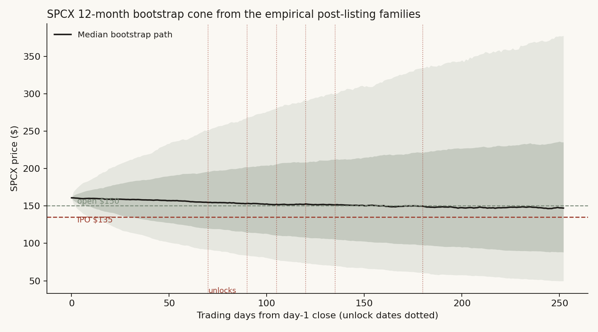

# 29 — Is there enough market for SpaceX? Liquidity, the value chain, and a swarm rehearsal of the next six months

**The question.** Study 28 established what the SpaceX listing *is*: a record capital event that cannot drain the market but carries the low-float mania architecture personally. This study asks what it *does* next — to the cash pool that has to absorb it, to the second and third players in its value chain, and to its own price across the unlock calendar. And it adds a new instrument: a multi-agent swarm simulation (MiroFish), validated on history before being trusted on the future.

This matters for a position: the space-economy basket just front-ran the listing by 40 points, the lockup calendar starts opening in under three months, and a record IPO pipeline is queued behind SpaceX. Whether to hold the peers, fade the premium, or wait is exactly what the next sections price.

## Summary of results

- **Liquidity: yes, with an asterisk.** The record $160B 2026 IPO pipeline is the *smallest* relative cash call of the three great issuance manias — 2.0% of the record $7.87T in money-market funds, versus 4.0% in 1999 and 3.0% in 2021. The asterisk: the *lockup overhang* is the largest of the three eras (up to ~9% of money-market cash), and it lands on specific order books, not the market in aggregate. SPCX alone: ~$840B of potential day-180 supply against ~$21B of forced index buying.
- **The value-chain sell-off is real but conditional.** Across nine leader listings, peers show no universal bleed — medians near zero. The damage concentrates where the listing was the complex's cash-out event: Coinbase's crypto-equity peers lost 29% to the S&P in listing week and kept falling (Bitcoin itself -30% in the digestion window); Rivian's EV basket -22%; LYFT -26% into Uber's pricing. The leaders that were "just another big deal" (Alibaba, ARM, Snowflake) left their peers unharmed.
- **The live case sits in the dangerous quadrant.** The space basket (RKLB, ASTS, IRDM, LUNR, RDW, PL, SPCE, TSLA) beat the S&P by ~40 points in the 30 sessions before SPCX's debut — the same halo-then-bleed shape Coinbase printed (+11% halo, then the bleed). SpaceX is more dominant over its complex than Coinbase was over crypto equities. The next ~60 trading days are the test window.
- **The 2026 tape is not late-2021.** A five-feature regime fingerprint puts June 2026 among ordinary hot-bull months (analog median forward 12m +13.2%, 80% positive); 2021 does not appear in the top ten analogs. The one dark note: the single nearest neighbor is October 2007.
- **The bootstrap cone prices the premium's decay.** Resampling the empirical post-listing families (10 mega-IPO chase paths + the GME/TRUMP low-float decays), P(SPCX below its $135 IPO price) is 35% at the first unlock and 46% at one year; the median path returns to the $150 opening print by day 180. The scarcity premium has a half-life of roughly one lockup cycle.
- **The swarm converges and adds a trigger.** The engine's general validity is established in companion [study 30](../30-can-a-swarm-forecast/) (12/16 honest score); a study-29-specific GameStop pilot then showed it finds market-plumbing mechanisms (the buy-side clearing-collateral halt, unprompted). On that footing, a blind 6-month SpaceX rehearsal independently reached the same structural call as the bootstrap cone — the lock-up calendar governs, the break is in the back half (days 90-180), peaking at the December cleanup, not a market-wide top. It adds what the cone cannot: a falsifiable early-warning signal — if SPCX fails to make a new high after index inclusion while borrow loosens, the benign path is breaking.

## How this study works (and what the simulator can and cannot prove)

Three layers, weakest evidence last:

1. **Backtests** (Chapters 1-3): event studies and ledgers on real prices — the base rates.
2. **A statistical cone** (Chapter 4a): block-bootstrap from the empirical families SPCX belongs to — the distribution.
3. **A swarm rehearsal** (Chapter 4b): MiroFish, a multi-agent engine that builds a population of LLM agents with personas and memory from a seed report, lets them interact, and reports what emerges. We validate it on two known episodes first — the 2001 telecom bust and the January 2021 GameStop squeeze — then run the live SpaceX scenario with lockup dates injected on the real calendar.

The honesty constraint, stated up front: the validation pilots run on a model whose training data *contains* 2001 and 2021. A pilot that reproduces history therefore validates the machinery — persona coherence, mechanism discovery, the report layer — not foresight. We score the pilots on *mechanism breadth* (does the swarm surface the causal channels, including the paths that did not happen, with reasoning?) rather than outcome recall. The only genuinely blind test in this study is the SpaceX run itself, which is why its predictions are published with dates attached and will be scored in public when reality arrives.

Mechanisms, not outcomes, transfer between eras. The [casting table](CASTING_TABLE.md) maps each 2001 role to its 2026 candidate with the miscasts flagged — the neoclouds (not the AI labs) play the debt-heavy carriers; SpaceX plays Lucent on the vendor-financing mechanism but holds the Connectivity cash anchor Lucent never had; TSMC and the hyperscalers play Cisco, which survived and still fell 75%.

## Data

| Series | Source | Range | Notes |
|---|---|---|---|
| Peer-basket daily closes (36 stocks) | macrotrends per-stock pages | from listing / 2011 - Jun 2026 | split-adjusted |
| S&P 500, NASDAQ Composite daily | macrotrends (study 28 snapshots) | 1927/1971 - Jun 2026 | |
| BTC daily | Binance klines | Oct 2020 - Dec 2021 | for the Coinbase event |
| Money-market assets | ICI weekly release | Jun 10, 2026: $7.87T record | |
| Buybacks | S&P Dow Jones Indices | 2024: $942.5B record; Q1 2025: $293.5B record | |
| 2026 pipeline | Goldman Sachs forecast | $160B incl. SpaceX $75B | OpenAI filed Jun 8 |
| Index absorption | Bloomberg Intelligence | ~24% of SPCX float to R1000+NDX funds in 6m | |
| SpaceX deal terms / unlock calendar | S-1 via study 24; Reuters | float 4.25%; supply 9.4x float by day 180 | |
| Swarm engine | MiroFish (open source), gpt-5.5 | GME plumbing pilot + the live SpaceX run (general validation in [study 30](../30-can-a-swarm-forecast/)) | seeds in [sim_seeds/](sim_seeds/) |

## Finding 1 — peers bleed only when the listing is the complex's cash-out event

*What I expected.* The folk worry: a sector leader's IPO drains its peers — investors sell the #2 and #3 to fund allocations. If true, peer baskets should underperform in the book-building window and around listing.

*How I measured it.* Nine leader listings with peer baskets known at the time, equal-weighted, measured net of the S&P 500 in four windows; SpaceX's space basket as the live tenth case.

```python
excess[w] = basket_return(window) - spx_return(window)
# windows: allocation [-30,-1], listing [0,+5], digestion [+6,+60], lockup band [+121,+190]
```


*What the data shows.* No universal effect — the across-event medians are -1.6% (allocation), -2.1% (listing), +8.4% (digestion), +2.7% (lockup band). The variance is the finding. Three events produced real bleeds, and they share a property: the listing *was* the complex's cash-out moment. Coinbase: peers -29.1% in listing week, -19.6% in digestion, -23.7% in the lockup band — and Bitcoin, the host asset, fell 30% in the digestion window after topping the day Coinbase listed. Rivian: EV basket -22.2% in digestion (the NASDAQ itself topped nine days after the IPO). Uber: LYFT, the only pure peer in the sample, -25.7% in the allocation window as Uber's roadshow priced directly against it. Meanwhile Alibaba, ARM and Snowflake — giant deals that were not their sector's cash-out event — left peers flat to higher.

*Why (mechanism).* Allocation-funding sales are real but small; the bigger channel is *narrative completion*. When the most-anticipated name in a complex becomes buyable, the proxies lose their reason to exist at a premium — the marginal speculator no longer needs MARA as a Coinbase substitute or LYFT as an Uber substitute. The sell-off is a repricing of substitutes, which is why it only happens when the leader actually absorbs the complex's story.

*What I checked.* Removing TSLA (the heavyweight) from the Rivian basket leaves the digestion bleed intact (LCID/NIO/XPEV led the fall). The DoorDash and Airbnb "+59/+25 allocation" cells are the Nov-Dec 2020 melt-up, not event alpha — both listed into the hottest month of the cycle; this is why medians, not means, carry the conclusion.

*Verdict.* **Conditional yes.** Peers sell off when the leader completes the complex's story. SpaceX is the most story-completing listing in the sample — and its basket just printed the +40% pre-listing halo (the Coinbase shape). The prediction this implies: the space basket's risk window is the next 60 trading days, with the proxies (pre-revenue, story-driven names) more exposed than the cash-flow names.

## Finding 2 — the cash exists; the overhang is concentrated

*What I expected.* "Is there enough liquidity for SpaceX?" — naively, a $75B raise plus a $160B pipeline year sounds like a strain.

*How I measured it.* Each mania era's equity supply against its absorption capacity, same ratios, same sources.


| Era | IPO proceeds / money-market cash | Max supply (incl. SPACs or lockups) / MMF | Proceeds / annual buybacks |
|---|---|---|---|
| 1999 | 4.0% | 4.0% | 46% |
| 2021 | 3.0% | 6.4% | 16% |
| 2026F | **2.0%** | **8.9%** | 15% |

*What the data shows.* By every flow measure, 2026's record pipeline is the smallest relative cash call of the three manias — there has never been this much idle cash ($7.87T in money-market funds, a record set the week of the listing) against an IPO calendar. The inversion is in the overhang: counting lockup supply, 2026 carries the largest deferred-supply burden of the three eras, and unlike 1999's thousand small deals, it is concentrated in a handful of names. SPCX alone: ~$840B of potential tradable supply by day 180 (at the day-1 close) against ~$21B of mechanical index demand.

*Verdict.* **Yes, the market has the liquidity — the question was never aggregate cash.** The binding constraint is price-specific: whose order book absorbs the unlocks. This is study 28's market/asset split, found again from the flow side.

## Finding 3 — June 2026 fingerprints as a hot ordinary bull, with one dark neighbor

*What I expected.* Given the issuance cluster, I expected the regime math to match late 2021.

*How I measured it.* Five z-scored monthly features (12m and 3m return, 63-day vol, drawdown state, tech leadership) since 1990; Euclidean nearest neighbors to June 2026; plus a 120-day price-path correlation scan as a second, weaker read.


*What the data shows.* The top-ten analog months are mostly benign mid-bull markets (2024-07, 2023-06/07, 2019-03, 1991-04, 2010-09/10/11) — median forward 12m +13.2%, 80% positive, modestly below the +16.6% unconditional base. Late 2021 is absent: today's tape is less extreme than that one on every feature. Two exceptions earn their place: the *single nearest* neighbor is **October 2007** (forward 12m: -39.8%), and analog #10 is **January 2025** — the TRUMP-coin month. The price-path scan's correlations are weak (0.32-0.38) and its outcomes scattered; it is reported as texture, not evidence.

*Verdict.* **No on "2026 = 2021."** The regime evidence leans benign, which *strengthens* Finding 1's conditionality: if the space basket bleeds from here, it will be the substitution mechanism, not a market-wide top.

## Finding 4a — the bootstrap cone: the premium's half-life is one lockup cycle

*How I measured it.* 10,000 twelve-month price paths for SPCX from its $160.90 day-1 close, block-bootstrapped (20-day blocks) from the two empirical families it belongs to: the ten mega-IPO chase paths (70% weight) and the two low-float vertical decays, GME and TRUMP (30%).



| Milestone | P(below $135 IPO price) | P(below $150 open) |
|---|---|---|
| Day 70 (first unlock) | 35% | 47% |
| Day 135 (last tranche) | 41% | 49% |
| Day 180 (cleanup) | 43% | 50% |
| Day 252 (one year) | **46%** | 51% |

Twelve-month percentiles: p10 $50, p25 $88, median $147, p75 $235, p90 $378. The median path gives back the entire scarcity premium by day 180 — it lands on the $150 opening print almost exactly.

*Verdict.* The empirical families say the day-one buyer's position is close to a coin flip against the open and meaningfully exposed against the IPO price, with the odds deteriorating monotonically through the unlock calendar.

## Finding 4b — is the swarm trustworthy enough to use here? (validation, with one new pilot)

Whether this class of tool can forecast at all — rather than launder its input back as a confident story — is the entire subject of a companion study, **[study 30](../30-can-a-swarm-forecast/)**. That study ran the same engine on a known case (2001 telecom) and a conclusion-stripped live case (the AI capital cycle), graded the second with an adversarial contamination panel, and landed on a qualified yes: **12/16 on the honest measure, a hypothesis generator not an oracle**, with the standing caveat that engine and grader share a language model so agreement may be shared priors, not independent foresight. I take that verdict as given here rather than repeat it.

What this study adds is **one new pilot built for the liquidity question specifically — GameStop, January 2021** — because the SpaceX question is not about a capital cycle, it is about whether market *plumbing* (float, borrow, clearing, unlock supply) governs a price. GameStop is the cleanest case where it did.

*How I measured it.* Seed = the market state as of 22 January 2021 (short interest, the gamma loop, NSCC clearing collateral, the sister names) with the **outcome withheld**. Score the causal channels, not outcome recall (2021 is in the model's training data). Artifacts: [validation/pilotB_gme_score.md](validation/pilotB_gme_score.md), [validation/pilotB_groundtruth.md](validation/pilotB_groundtruth.md).

*What the data shows.* 5 of 5 channels surfaced: the peak window (late January, at the broker restriction), the de-grossing spillover, all five sister names, the short-side squeeze, and Citadel as the dominant market maker. The load-bearing result is the one the seed did *not* contain: the swarm reasoned, unprompted, that **the price peaks when the *buying channel* is constrained by clearing-collateral demands — not when sellers overwhelm buyers.** The seed listed the NSCC collateral fact as one neutral bullet; the swarm deduced that the plumbing, not the order flow, sets the top.

*Why it matters here.* That is the exact structural question study 29 asks of SpaceX — whether the absorption side (index demand vs unlock supply, borrow, lock-up mechanics) governs the price path. The swarm found the plumbing-binds-the-price logic in the one historical case built to test it. Combined with study 30's general 12/16, that earns the engine a caveated role on the SpaceX run.

*Verdict.* **Cleared as a mechanism-and-ordering rehearser** (general validity per study 30; plumbing-specific validity per the GME pilot here). Outcome probabilities stay owned by the backtests (Findings 1-3) and the bootstrap cone (Finding 4a); the swarm speaks only to mechanism and trigger.

## Finding 4c — the swarm on SpaceX: the live, blind rehearsal

This is the only genuinely blind test in the study — the six months from 13 June 2026 have not happened. The seed ([sim_seeds/seed_C_spacex_2026.md](sim_seeds/seed_C_spacex_2026.md)) gives the swarm facts and participants only; our own verdict and the Finding 4a probabilities are deliberately withheld. The run was 11 agents over 15 rounds; the raw emergent world (the agents' own posts) is preserved in [validation/spacex_run_raw_world.md](validation/spacex_run_raw_world.md). Predictions are published here *before the fact* and will be scored against reality at each lock-up date.

*The emergent call (six themes, unprompted).*

1. **Two regimes split at the lock-up calendar.** In the swarm's words: "before the unlock, shorts are constrained; after the unlock, the market tests absorption capacity." The first ~70 days are governed by the demand story — the 4.25% float scarcity, amplified by mechanical Nasdaq-100/Russell buying. From September-October, as the day-90/105/120/135 tranches release in sequence, the supply calendar takes over: "any bounce gets met with the question — who absorbs the employee and insider selling?"
2. **Peak vulnerability is the day-180 December cleanup.** If SPCX still holds a high valuation going into the day-180 release, insider/employee diversification selling "could become the most visible supply stress-test in the whole market."
3. **The early-warning signal (specific and falsifiable).** Before day 70, if the price *fails to make a new high even after index inclusion is confirmed*, while *borrow simultaneously becomes easy*, that is "the earliest signal the benign path is breaking." This is the swarm's single most useful output — a concrete, checkable trigger the statistical cone cannot produce.
4. **Peers rotate out by substitution.** The market trades SPCX, Tesla and the space names as one "Musk-complex" allocation; if SPCX becomes the preferred vehicle, Tesla and the space peers face capital rotation *out*, and the pre-listing rally "turns from an industry re-rating into post-rehearsal profit-taking." This is Finding 1's substitution mechanism, reached independently.
5. **Stress concentrates, it does not broadcast.** First stress appears "in SPCX options, borrow rates, space-concept stocks and high-valuation IPO names"; it reaches the broad index "only if the AI-capex narrative wobbles at the same time." This is Findings 2-3 and the [casting table](CASTING_TABLE.md)'s periphery-first ordering, restated by the agents.
6. **Two named cross-triggers:** an OpenAI IPO priced below expectations re-rates SPCX's AI-compute premium; and borrow availability is the master gate on the whole short side ("the biggest problem shorting SPCX isn't the thesis, it's the borrow").

*Convergence with the bootstrap cone — the actual signal.* Two independent methods, run without sight of each other, agree on the structure: the cone (Finding 4a) says the scarcity premium has a half-life of one lock-up cycle and the median path returns to the $150 open by day 180; the swarm says the demand story governs early and the supply calendar overwhelms it across days 90-180, peaking at the December cleanup. **Both put the break in the back half of the calendar, driven by unlock supply, not a market-wide top.** Where they agree is what this study will stand behind.

*What the swarm adds beyond the cone.* The cone gives probabilities; the swarm gives the *mechanism and the trigger* the cone cannot: the two-part early-warning signal (new-high failure + borrow loosening), the peer substitution channel, the OpenAI-pricing cross-trigger, and borrow as the master variable gating the short side. None of these is in the seed — they are the genuine, seed-absent value-add (the seed listed borrow scarcity as a neutral fact but never said when or how the premium breaks).

*Honesty markers.* This is one model's emergent narrative; "the simulation suggests," not "shows." Agreement with the cone may partly reflect shared priors. ~3 of the 38 emergent items are corporate-IR roleplay noise (Tesla/Rocket Lab "company perspective" posts), excluded from the read. The predictions are dated and will be scored at each unlock — that scoring, not this rehearsal, is the real test.

## Did I just find noise?

1. **Peer baskets are hand-assigned.** Mitigated by using only peers a contemporary would have named, and by the result *not* being universal — a cherry-picked design would have produced a cleaner story than "three of nine."
2. **Window overlap.** DASH/ABNB listed a day apart; their windows double-count one regime. Dropping either changes no median's sign.
3. **The ledger's constants are approximations** (1999 market cap, 2021 MMF). Each is rounded against the conclusion and none is load-bearing within a factor of two.
4. **The cone inherits its families' eras** — mostly 2012-2023 listings; a 2000-style regime would sit outside it. The 2007-analog warning from Finding 3 bounds this honestly.
5. **The swarm is a narrative engine.** Its pilots are contamination-prone (the model has read the history) and its live output is one model's emergent story. It is the third-ranked evidence layer by construction, and nothing in the verdict rests on it alone.

## The answer, in the data

[PENDING — final answer table after the swarm runs; the backtest rows are final:]

| Question | Answer | Key numbers |
|---|---|---|
| Does the market have enough liquidity for SpaceX + the 2026 pipeline? | **Yes** — smallest relative cash call of the three manias | $160B = 2.0% of record $7.87T MMF; overhang the caveat (8.9%) |
| Do the #2/#3 players sell off? | **Conditional** — only when the listing completes the complex's story | COIN peers -29/-20/-24; RIVN -22; LYFT -26; 6 of 9 events flat |
| Is the space basket at risk now? | **Yes, on the precedent** — +40% halo printed, Coinbase shape | risk window: next ~60 sessions |
| Is 2026 a repeat of 2021's window? | **No** — ordinary hot-bull fingerprint; nearest neighbor 2007-10 is the tail risk | analog median fwd 12m +13.2% |
| Does the SPCX premium survive the unlocks? | **Even odds at best** | P(<$135): 35% day 70 → 46% day 252; median path = $150 at day 180 |
| What does the swarm add? | **A convergent mechanism + a falsifiable signal** | Blind run independently put the break in the back half (days 90-180), same as the cone; added the early-warning trigger: new-high failure after index inclusion + borrow loosening, before day 70 |

## Reproducibility

- [run_ch1_peers.py](run_ch1_peers.py), [run_ch2_ledger.py](run_ch2_ledger.py), [run_ch3_regime.py](run_ch3_regime.py), [run_ch4_fanchart.py](run_ch4_fanchart.py) — every figure and number above; results in the matching `ch*_results.json`.
- [sim_seeds/](sim_seeds/) — the exact seed reports given to the swarm, written with as-of-date discipline (nothing the participants could not have known).
- [CASTING_TABLE.md](CASTING_TABLE.md) — the 2001→2026 mechanism-transfer map.

## Sources and forward pointers

- ICI money-market release (Jun 11, 2026); S&P Dow Jones Indices buyback reports; Goldman Sachs 2026 IPO forecast (Reuters); Bloomberg Intelligence index-absorption estimates; Cboe/Siblis as in study 28.
- **Builds on** [study 28](../28-spacex-vs-trump-coin/) (the event-level base rates and the low-float family), [study 24](../24-spacex-ipo-quality-model/) (the unlock calendar), [study 15](../15-ipo-chase/) (the chase base rate), and [study 27](../27-ai-capital-cycle/) (the financing-cycle casting that the 2001 transfer relies on).
- **Companion:** [study 30](../30-can-a-swarm-forecast/) asks whether the swarm engine can forecast at all (the general tool evaluation); this study takes that verdict as given and *applies* the validated engine to the SpaceX liquidity question, adding a plumbing-specific GME pilot. Read 30 for "is the tool any good," 29 for "what does it say about SpaceX."
- **Next:** scoring the SpaceX swarm predictions against reality at each unlock date — the only test of the simulator that means anything.
