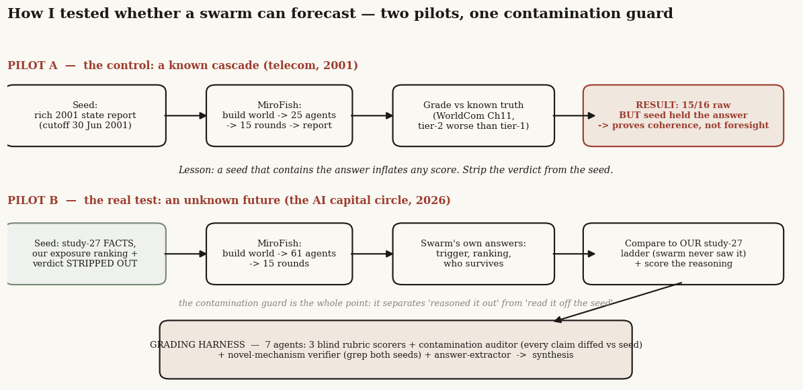
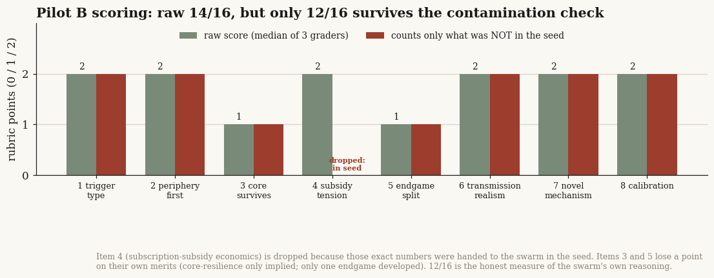
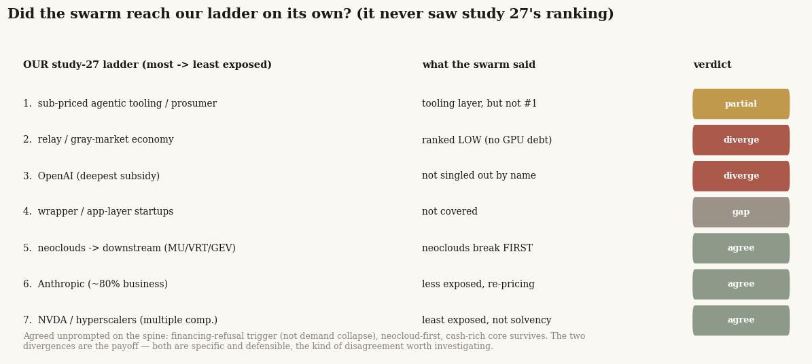

# 30 — Can an agent swarm forecast a capital cycle? Backtesting a "predict-the-future" engine

**The question.** There is a class of open-source tool that claims to predict the future by simulation: feed it documents, it spawns hundreds of AI agents with personalities and memory, lets them interact for a while, and writes up what "happened." I wanted to know whether one of these — a swarm-simulation engine built on a published multi-agent framework — can actually forecast a financial cascade, or whether it just launders its input back out as a confident-sounding story. So I ran it twice: once on a case where I already know the answer, and once on a live question I had just spent a long study working out myself.

**Why it matters.** If a swarm can independently reason from facts to a correct exposure ranking, it is a cheap second opinion worth having before you take a position. If it mostly restates whatever you fed it, it is a confidence machine — the most dangerous kind of research tool, because the output *looks* like corroboration. The difference between those two is not visible in the report itself. You have to test for it on purpose.

> Research, not investment advice. This is a tool evaluation, not a market call. The simulation outputs below are exactly that — simulations — and where they happen to agree with my earlier work, I treat that as a hypothesis to investigate, never as evidence that either is right. The engine ran on gpt-5.5; that the engine and my earlier study share a model family matters for one of the conclusions, and I flag it where it does. The forecasts are patterns a machine produced, not predictions I endorse.

## What I found, up front

- **The naive test is a trap.** On the case where I handed the engine a rich briefing, it scored 15 out of 16 against the known outcome. That number is almost meaningless: the briefing already *contained* the answer, so a high score measures reading comprehension, not foresight. Catching this is the whole study.
- **So I built a harder test.** For the live question I stripped my own conclusions out of the briefing — the engine got the facts but not my ranking or my verdict — and then graded its reasoning with a panel that checks every claim back against the briefing. Only what the engine could not have copied counts.
- **On the honest measure it scored 12 out of 16.** Good, not magic. It independently reached the spine of my earlier study — the trigger is a *financing refusal, not a demand collapse*, the leveraged periphery breaks first, the cash-rich core survives as a valuation story rather than a solvency one.
- **The two places it disagreed with me are the most useful output.** It ranked the gray-market "relay" economy as *low* risk where I had ranked it high, with a specific reason I cannot easily dismiss; and it refused to single out the one company I had named. Both are concrete, testable disagreements.
- **It surfaced a sharper mechanism than I had.** Buried in the agent chatter was a clean account of *how* the financing refusal actually fires — a next-generation chip launch collapses the resale value of last year's chips, lenders cut how much they will lend against that collateral, and the refinancing fails. That is a better-specified version of my own trigger.
- **The catch that caps all of it:** the engine and my study were both produced by the same kind of language model. When two systems with the same training agree, that agreement might be a shared habit of thought, not two independent roads to the truth. So this earns a narrow slot — a hypothesis generator — and nothing more.

---

## What I actually tested, and how I avoided fooling myself

The tool — MiroFish, an open-source engine built on the OASIS multi-agent social-simulation framework — takes seed documents, builds a knowledge graph from them, gives each entity in the graph an AI "persona" with memory, runs them as a little social network for a set number of rounds, and then a final agent writes a report on what the simulated world did. I drove the whole thing from its API so every run was identical except for what I changed on purpose.

The trap with any tool like this is obvious once you say it out loud: if your seed document already says "the loser will be the heavily indebted middle of the chain," then a report that concludes exactly that has told you nothing. It read your mind because you wrote it down. So the experiment has to be built so that the answer is *not* in the input, and the grading has to check, claim by claim, that the output went beyond the input.

That is the spine of this study: two pilots, and a grading harness whose main job is to catch contamination.



## Pilot A — the control, and the lesson that rebuilt the whole test

I started where you should always start: a case where the future is already known. I wrote the engine a state-of-the-world briefing for the US telecom sector dated 30 June 2001 — carriers that had borrowed heavily to lay fiber, equipment makers that had lent their own customers the money to buy gear, component suppliers one more layer out — and asked it to simulate the next eight quarters. We know what happened next: WorldCom went bankrupt in 2002 in what was then the largest Chapter 11 in US history; the equipment makers Lucent and Nortel were gutted while Cisco survived; and the component layer fell *harder* than the equipment makers above it.

The engine got all of it. WorldCom fails on debt plus accounting plus lost confidence; Lucent and Nortel bleed through their customer-financing books while Cisco rides out the storm on a clean balance sheet; the component tier takes the amplified hit. Against my pre-written scorecard that is 15 out of 16.

And then I did the thing that makes this a study instead of a press release: I read my own briefing again, line by line, against the report. Almost every "prediction" was already sitting in the seed. I had told it WorldCom's margins were the ones analysts couldn't reconcile. I had told it Cisco had the healthiest balance sheet. I had told it the component demand was carrier spending "passed through two layers of inventory." The engine had not forecast the cascade. It had faithfully re-told a cascade I handed it.

That is not a failure of the tool — its synthesis was coherent and, to its credit, it refused to invent the specific fraud details it hadn't been given. But it is a fatal flaw in the *test*. A 15 here proves the plumbing works and the engine is internally honest. It says nothing about whether it can see a future you don't already know. The only fix is to take the answer out of the seed.

## Pilot B — the real test: a future I had worked out but not given away

The live question was the one from my own [study 27](../27-ai-capital-cycle/): the 2026 "AI capital circle," where a chip vendor funds its own customers, who commit to clouds, who buy the chips. In that study I had built a ranked exposure ladder — who gets hurt worst when the circle breaks — and concluded the break comes from a *financing refusal*, not a collapse in demand.

For Pilot B I gave the engine the **facts** of that world — the financing edges, the disclosed customer concentrations, the measured subscription economics, the 50-company blast radius, an analyst brief, the historical analogs — and I deleted my **conclusions**. No ranked ladder. No verdict on the trigger. The prediction request even listed the four candidate triggers as an open question, so the engine had to *pick*, not copy. Sixty-one agents, fifteen rounds. Then I asked it the same questions I had answered myself, and compared.

One honest wrinkle: the engine's final write-up step hit the language model's daily usage cap before it could compile a tidy report, so what I graded is the raw simulated world — about a hundred posts and comments from the agents — rather than a polished document. That cost it points on tidiness (it never compiled a single clean ranking), and I let it.

### How I graded it without grading myself

I did not eyeball it. I ran a seven-agent panel: three independent scorers working blind to each other, an auditor whose only job was to take every load-bearing claim in the output and decide whether it was already in the seed, a verifier that searched both seed files for any "novel" mechanism the report claimed (to check it was really absent), and an extractor that pulled out the engine's actual answers as neutral data. Then one more agent synthesized the panel. The score that counts is not the raw rubric total — it is the total *after* dropping every item the auditor found pre-loaded in the seed.



The raw median across the three scorers was 14 of 16. The auditor then flagged that one of those items — the subscription-subsidy economics — was lifted straight from the seed, where I had written the exact numbers. Drop it. Two more items lost a point on their own merits: the engine only *implied* that the core survives rather than saying it, and it developed only one of the two ways the subsidy could unwind. **The honest, contamination-adjusted score is 12 of 16.** The auditor's blunt summary: about 65% of the load-bearing content was restatement of the seed.

So two-thirds of the output was an echo. The question is whether the other third is worth anything. It is.

### Where the swarm reached my conclusions on its own

On the parts the seed did *not* contain — the trigger, the ordering, who survives — the engine reasoned to the same spine I had.



It picked **financing refusal over demand collapse** as the trigger, in almost the words I had used: demand and price shocks are "amplifiers, not the primary trigger." It put the **leveraged neoclouds first** in the firing line, with the right mechanism — a mismatch between how long their assets last, how long their customer contracts run, and how long their debt runs. And it kept the **cash-rich core** (the dominant chipmaker, the foundry, the hyperscalers) out of the solvency story, calling their risk a re-rating, not a failure. None of that was in the seed. That is the engine reasoning, not copying.

### Where it disagreed — the part actually worth having

Two clean divergences, and both are specific enough to act on.

First, it ranked the **gray-market relay economy as low risk**, where I had ranked it second-from-the-top. Its reason is hard to wave away: the relay operators don't owe anyone money for GPUs and haven't signed long data-center leases, so when the squeeze comes their losses look like lost customers and banned accounts, not insolvency. That is a real distinction I had blurred. Second, it **refused to name the single company** I had singled out as carrying the deepest subsidy, staying at the category level. Where I had pointed a finger, it declined for lack of a clean basis. A skeptic playing my own game back at me.

### The mechanism it had that I didn't

The best thing it produced was buried in a single comment. My study said the trigger is "a financing refusal" and rather left it there. The swarm said *how*: a next-generation accelerator launches, which collapses the resale value of the previous generation's chips; lenders, who hold those chips as collateral, cut how much they'll lend against them; and *that* — not any change in demand — is what makes the refinancing fail. It even coined the line that "2026-financeable does not prove 2027-refinanceable." A grep of both seed files confirms none of that machinery was in the input. That is a sharper, more monitorable version of my own trigger, handed to me by a simulation.

## Did I just find noise? The check that matters most

The one explanation I cannot fully kill is the one that should worry any user of these tools. **The engine and my study 27 were both produced by the same family of large language model.** When two systems share their training, agreement between them is cheap — it can mean they share a habit of reasoning, not that they independently found the truth. Structured-credit and project-finance thinking ("watch the collateral, watch the duration mismatch") is exactly the kind of pattern any capable model carries. So the swarm agreeing with me on "financing refusal, periphery first" is genuinely *not* corroboration that either of us is correct. It is, at most, evidence that the conclusion is the natural one to reach from these facts — which is worth knowing, but is a much weaker claim.

This is why the divergences and the novel mechanism matter more than the agreements. A shared prior explains why two models would reach the *same* answer. It does not explain a model reaching a *different*, specific, defensible answer (the relay economy) or a *better-specified* one (the collateral-haircut trigger). Those are the places the tool added something a mirror could not.

## The answer, in the data

**Can an agent swarm forecast a capital cycle? Conditional yes — as a hypothesis generator, not as evidence.** It cleared the honest bar (12 of 16) on a question whose answer I had withheld; it reached the right spine on its own; and it produced two specific disagreements and one sharper mechanism that are worth investigating on their own merits. But two-thirds of its output was an echo of the seed, its headline deliverable never compiled, and its agreement with me may be a shared-training artifact rather than independent insight. That is a real tool with a narrow, honest use — and a loud warning label.

| Test | What I measured | Result |
|---|---|---|
| Pilot A (known answer in seed) | raw rubric vs known 2001 outcome | 15 / 16 — but invalid (seed held the answer) |
| Pilot B (answer stripped from seed) | raw median of 3 blind graders | 14 / 16 |
| Pilot B, contamination-adjusted | dropping every item pre-loaded in the seed | **12 / 16** |
| Share of output that was seed restatement | auditor, claim by claim | ~65% |
| Independent agreements with study 27 | trigger, periphery-first, core survives | 3 of 3 on the spine |
| Useful divergences | relay-economy rank; refusing to name one name | 2, both specific |
| Genuinely novel mechanisms (grep-confirmed absent from seed) | verifier across both seed files | 5, best = collateral-haircut trigger |

## Caveats, each with its direction

- **Shared-model correlation inflates the apparent agreement.** The engine and study 27 share a model family, so the three "agreements" overstate how much independent confirmation this is. Treat the agreements as weak and the divergences as the signal.
- **The polished report never compiled** (daily usage cap), so I graded raw agent chatter. This *understates* the tool at its best — a clean run would likely produce the ranking it failed to compile here — but it also means the headline deliverable genuinely wasn't there.
- **Signal-to-noise was poor.** Roughly two-thirds of the agent comments were corporate-PR role-play ("we don't comment on...") that added nothing. A real workflow needs to filter hard.
- **One engine, two cases, small N.** This is a probe, not a survey of the tool category. It tells you this engine, on these two questions, behaved this way.
- **I wrote both the seed and the rubric.** I tried to be adversarial against myself (that is what the panel is for), but the test was designed by the person whose conclusions were on trial.

## How I'd reproduce it

The method, not the plumbing:

```
1. Pick a case whose outcome you ALREADY know (the control).
   Write a seed that contains the setup but NOT the outcome.
   Run engine -> grade vs known truth -> then DIFF the seed against the report.
   If the report just restates the seed, your test is contaminated. Fix the seed.

2. For the live question, write a seed of FACTS ONLY.
   Strip out: your ranking, your verdict, your chosen trigger.
   Phrase the prediction request as an open menu, so the engine must choose.

3. Grade with a panel, not your own eye:
   - 3 blind scorers on a pre-registered rubric
   - 1 auditor: for each claim, is it already in the seed? (drop those)
   - 1 verifier: grep the seed for every "novel" mechanism claimed
   - score = rubric total AFTER dropping seed-contaminated items

4. The agreements are suspect if grader and subject share a model family.
   Weight the DIVERGENCES and the seed-absent mechanisms.
```

The engine itself: MiroFish (a public GitHub project, `666ghj/MiroFish`), built on the OASIS multi-agent social-simulation framework from CAMEL-AI, run on gpt-5.5 via an OpenAI-compatible endpoint, driven entirely through its REST API (build graph → spawn agents → run rounds → report). The two seeds, the two pre-registered rubrics, and the grading-panel outputs live with the working notes behind this study.

## References & forward pointer

Builds directly on [study 27 — the AI capital cycle](../27-ai-capital-cycle/), which supplied both the live question and the ranked ladder this tool was tested against. The telecom control draws on the public record of the 2000–2003 collapse (WorldCom's bankruptcy, the Lucent/Nortel/Cisco split, the JDS Uniphase write-down). The engine is MiroFish (`github.com/666ghj/MiroFish`); the underlying simulation framework is OASIS, from CAMEL-AI; both runs used gpt-5.5. Next: if the tool earns continued use, the test to run is whether its *divergences* (here, the relay-economy ranking) hold up against independent data — the only way to tell a useful contrarian from a confident one.
