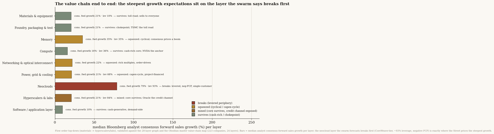
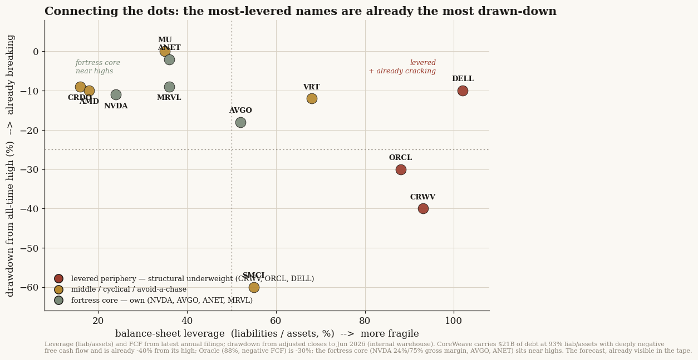
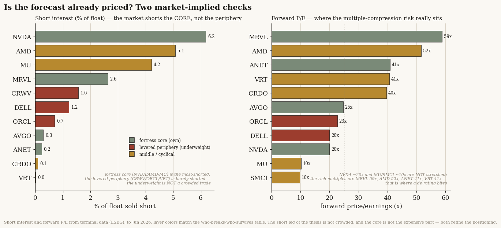

# 30 — The LLM players' endgame: a swarm-simulation forecast of who breaks and who survives

**The question.** My [study 27](../27-ai-capital-cycle/) mapped the 2026 "AI capital circle" — the loop where a chip vendor funds its own customers, who commit to clouds, who buy the chips — and argued it eventually breaks. This study asks the next, harder thing: *what actually happens to the LLM players when it does?* OpenAI, Anthropic, xAI, the hyperscalers, the neoclouds, the chipmakers — who breaks, who survives, when does it happen, and how does the subscription subsidy end? Instead of reasoning it out myself again, I handed the facts to a "predict-the-future" simulation engine — MiroFish, which spawns hundreds of AI agents and lets them play the situation forward — and let it produce the forecast.

**Why it matters.** "The bubble bursts" is useless as a forecast. "Which layer takes the loss, in what order, triggered by what, on roughly what calendar" is something you can position around. And the *path* matters more than the verdict: if the break comes from a financing refusal, you watch a refinancing calendar; if it comes from demand drying up, you watch usage. Those are opposite trades. So I wanted a forecast that names the trigger, ranks the casualties, and dates the move.

> Research, not investment advice. This is a **simulation**, not a market call. A swarm of language-model agents produced the forecast below; I report it because it is specific and testable, not because I endorse it. Before trusting any of it, read the last section — I backtested the engine on a case whose answer was already known, and the honest confidence is "good hypothesis generator," not "oracle." The engine ran on gpt-5.5. Every figure it produced is a pattern a machine generated, not a prediction I stand behind.

## The forecast, up front

- **The circle holds for about 18 months, then snaps in 2028 H1 — from a financing refusal, not a demand collapse.** The engine's base case: expansion continues through 2027 H1, financing conditions tighten in 2027 H2, and the break lands in 2028 H1 when lenders refuse to roll over the debt behind the most leveraged players. Falling demand and falling prices are "amplifiers, not the primary trigger."
- **The leveraged neoclouds break first; the cash-rich core survives.** Ranked most-to-least exposed: the CoreWeave-tier GPU-rental clouds, then the build-to-order hosting middle, then subscription-priced AI tooling without clear payback, then the component chain, then the labs, and — least exposed — the chipmaker, the foundry, and the hyperscalers, whose risk is a lower valuation, not insolvency.
- **No single lab is forecast to fail.** The engine pointedly declined to name OpenAI (or anyone) as *the* casualty, framing lab risk through subscription economics rather than a hard solvency call. Anthropic shows up as already re-pricing, not breaking.
- **The subscription subsidy ends by re-pricing, not by demand dying.** Quotas, concurrency caps, context limits, and a migration to usage-based billing — the "subsidy boundary being redefined." The flat $20/$200 all-you-can-eat plan is what goes away, not the demand.
- **The sharpest thing it produced was the trigger mechanism itself.** A next-generation chip launches, which collapses the resale value of last year's GPUs; lenders who hold those chips as collateral cut how much they'll lend against them; the lease cash flow no longer covers the debt; the refinancing fails. "2026-financeable does not prove 2027-refinanceable." That is a more monitorable trigger than my own study's vaguer "financing refusal."
- **How much to trust it:** on a backtest whose answer I hid from the engine, its forecast scored 12 of 16, with about two-thirds of its output just echoing the facts I fed it, and a real risk that its agreement with my own work is a shared-model habit rather than independent insight. Treat every line above as a hypothesis to test, weighted toward the two places it surprised me.

---

## The forecast: a financing refusal in 2028 H1, not a demand collapse

I gave the engine the facts of the AI circle — the financing edges, the disclosed customer concentrations, the measured subscription economics, the 50-company supply graph, the historical analogs — and asked it an open question: does the system break in the next eight quarters, and if so, what triggers it (a financing refusal? a demand shortfall? a price collapse? something else)? I deliberately did *not* give it my own answer. It had to choose.

It chose financing refusal, and it put a calendar on it.

The base case runs in three phases. Through **2027 H1** the buildout keeps going — capex and commitments run on, nothing breaks. In **2027 H2** the financing gets harder: lenders start re-underwriting, and the terms they offer against GPU collateral get tighter. Then in **2028 H1** the break: at the most leveraged players, the refinancing is simply refused. In the engine's words, demand shortfalls and price shocks are "amplifiers, not the primary trigger" — the thing that actually fires is in the credit channel.

This matters because it tells you what to watch. Not a usage chart. A refinancing calendar.

## Who breaks, who survives

The forecast is not "everyone gets hurt." It is a clear ordering, and the order is the point.

**The leveraged neoclouds break first.** The CoreWeave-tier GPU-rental clouds carry a mismatch the engine kept returning to: their assets (chips that age fast), their customer contracts (often one big tenant), and their debt (short, secured on those chips) all run on different clocks. When the refinancing window opens in 2027 and the collateral has cheapened, that mismatch turns from a valuation problem into a liquidity problem. The build-to-order hosting providers — the squeezed middle — go with them, re-rated from above as the flagship tenants move to hyperscalers.

**The middle gets stressed but mostly lives.** Subscription-priced AI tooling without clear payback feels it early, through renewal pressure and margins. The component chain — memory, advanced packaging, networking — takes order cancellations and a concentration re-rating one step behind the clouds. And the labs themselves sit here, not at the top: the engine framed their risk through the subscription subsidy, not as a solvency event, and notably refused to single out any one of them. Anthropic it described as already re-pricing and enforcing, not failing.

**The cash-rich core survives — as a valuation story, not a solvency one.** The dominant chipmaker, the foundry, and the hyperscalers absorb the shock through lower multiples, not through any question of going under. One hyperscaler it flagged as positioned to need its lab partner less over time, through its own models and its own chip.

**The contrarian call:** the gray-market "relay" economy — the resellers that arbitrage subscription access — *survives the financial break*, because it owes no one money for GPUs and signed no long data-center leases. Its losses look like banned accounts and lost customers, not insolvency. My own study 27 had ranked that layer as highly exposed; the engine disagreed, with a reason I can't easily dismiss.

## How the subscription subsidy ends

The engine was clear that the flat-rate subsidy does not end because demand falls. It ends because the providers re-price it. The path it traced: heavy and agentic users (and the relay operators) arbitrage the flat plans into quasi-wholesale compute; the providers respond with quota caps, concurrency limits, context-window limits, model routing, and a migration toward usage- and token-based billing — the "subsidy boundary being redefined." It pointed to the moves already on the tape (a major coding tool shifting to token billing, premium coding pulled from the cheap tier) as the early signs. The takeaway for the labs: subscription revenue stops being treated as smooth, dependable revenue, and the tools that can't show real workflow payback face the earliest renewal pressure.

## The mechanism it had that my own study didn't

The single most useful thing the simulation produced was buried in the agent chatter, and it sharpens my own work. Study 27 said the trigger is "a financing refusal" and rather left it there. The swarm said *how*: a next-generation accelerator launches, which collapses the resale value of the previous generation's chips; the lenders who hold those chips as collateral cut their loan-to-value; the cash the cloud earns renting them no longer covers the debt; and *that* is what makes the refinancing fail — with no change in demand required. It coined the line "2026-financeable does not prove 2027-refinanceable." That is a concrete, monitorable trigger (watch chip-launch cadence and GPU resale/rental values), where mine was a vaguer abstraction. A simulation handed me a better-specified version of my own thesis.

It surfaced four more mechanisms in the same vein, all worth investigating: the triple-duration mismatch as a risk distinct from demand; "take-or-pay coverage of depreciation plus debt" as the real test for a neocloud's solvency; the relay economy's distinct loss-type; and power-equipment project-finance as a second, non-GPU channel through which the same stress travels.

## How much to trust this — I backtested the engine first

Here is the part that keeps this honest, and it is why everything above is "the simulation forecasts," never "I forecast."

Before trusting the engine on a future I can't check, I ran it on a past I can: the 2001 telecom collapse, where the outcome is known (WorldCom's bankruptcy, the equipment makers gutted while Cisco survived, the component tier falling hardest). On a first pass it nailed all of it — but when I diffed my own briefing against its report, I had *handed it the answer* in the setup. A high score there measured reading comprehension, not foresight. So for this study's live forecast I stripped my own conclusions out of the input, posed the trigger as an open question, and graded the output with a panel of independent agents whose main job was to check every claim back against what I'd fed in — anything the engine could have simply copied doesn't count.

On that honest measure the forecast scored **12 of 16**. Good, not magic. Two-thirds of the engine's output was a restatement of the facts I gave it; only the remaining third — the trigger choice, the ordering, the survivors, and the novel mechanisms — is the engine's own reasoning. And the deepest caveat is one I can't fully clear: the engine and my own study 27 were built on the same family of language model, so their agreement on "financing refusal, periphery first, core survives" might be a shared habit of thought rather than two roads to the truth. That is exactly why the two places it *disagreed* with me — the relay economy surviving, and refusing to name a single lab — are worth more than the places it agreed.

## The value chain, end to end: who breaks and who survives

This replaces the old flat watch-list with the full chain as it actually flows — materials and toolmakers at the head, foundry and memory in the middle, fabless silicon and interconnect through neoclouds and hyperscalers, ending at the software seats that have to pay for all of it. We validated the membership and ordering against our internal 28-layer value-chain graph and the Obsidian master value-chain map (223 companies across 24 flow-ordered layers), then collapsed it to the nine reader-facing layers below so each one is a coherent break-or-survive unit rather than a bag of tickers. Every figure traces to the study datapack; the management view on each layer is drawn from the most recent earnings calls in our corpus. The leverage, free cash flow, gross margin and consensus forward growth are latest-annual terminal figures from an internal market-data warehouse; a handful of micro-cap and foreign-filed names (and the unprofitable neoclouds, which have no meaningful P/E) carry blanks where terminal coverage or the metric itself is not available, marked with a dash.

The load-bearing finding reads the same down the entire chain: the swarm's break order runs periphery-first, core-last. The leveraged, negative-cash-flow edge — neoclouds above all, plus the one credit-channel hyperscaler (ORCL) — snaps first when financing refuses; the cash-rich core (fabless silicon, foundry, the big four hyperscalers, software) absorbs the same shock as a demand air-pocket and outlasts it. The tension that makes this a study rather than a list is that the analyst consensus prices the steepest forward growth onto exactly the layers the swarm says break first. The richest forward-growth numbers in the whole chain — NBIS +553%, MU +197%, CRWV +147% — sit on the weakest balance sheets, so the names with the furthest to fall if financing stalls are also the names carrying the highest expectations. That pattern repeats layer by layer below: wherever the Street's growth assumption is most aggressive, it tends to be sitting on the most cyclically or financially exposed name in the layer.

### Materials & equipment (the picks-and-shovels)
The toolmakers, EDA software and specialty materials that every chip in the circle must pass through before a single GPU ships — the chain's chokepoint upstream of foundry.

| Ticker | Leverage | FCF $bn | Gross margin | Fwd P/E | Consensus fwd sales growth |
|---|---|---|---|---|---|
| ASML | 61% | +6.3 | 52.8% | 41.8 | 20.6% |
| LRCX | 54% | +3.8 | 48.7% | 34.3 | 26.1% |
| AMAT | 44% | +3.8 | 48.7% | 33.7 | 17.6% |
| KLAC | 71% | +3.2 | 60.9% | 36.9 | 11.7% |
| ARM | 23% | +0.6 | 97.5% | 147.5 | 21.7% |
| SNPS | 41% | -14.8 | 77.0% | 28.6 | 37.2% |
| CDNS | 46% | +1.2 | 86.4% | 42.1 | 17.0% |
| TEL | 50% | +0.9 | 35.2% | 16.7 | 13.4% |
| KEYS | 48% | +1.0 | 62.1% | 32.1 | 28.1% |
| CRDO | 10.1% | - | 68.0% | 35.2 | 81.8% |
| ENTG | 53% | +0.3 | 44.6% | 34.3 | 7.8% |
| NVMI | - | - | - | - | - |

This is the survive end of the spectrum: high gross margins (ASML, KLAC, SNPS, CDNS, ARM all 53-97%), tool-and-license business models with little disclosed leverage, and a one-step-removed position that lets them keep selling into whoever is still building. When the circle's financing refuses, the squeeze here is cyclical, not existential — order timing slips and a memory-cost or China-DUV air-pocket bites, but the picks-and-shovels do not break with the leveraged neoclouds. The exceptions to watch are the smaller, single-application names: CRDO (81.8% consensus growth, riding hyperscaler AEC demand) and ENTG (carrying net leverage near 3.8x with thin 7.8% growth). The swarm read: cash-rich core that outlasts a refusal, taking the demand hit a year late rather than going to zero.

Analyst-consensus read: the Street prices solid-but-modest growth here (mostly 8-28%), and the one outsized number — CRDO at 81.8% — sits squarely on the layer's most cyclically exposed, single-customer-concentrated name, exactly the kind of optimism the swarm flags.

Management view: across these calls, management strikes a confident capex stance — ASML guided 2026 sales no lower than 2025 and Lam raised its industry equipment forecast to roughly $140bn citing AI-driven gate-all-around, HBM and advanced-packaging demand, with KLA and Applied echoing high-teens/20%+ equipment growth into a second-half-weighted 2026.

### Foundry, packaging & test
The contract-manufacturing spine of the chain: the layer that actually fabricates, packages and electrically tests every AI accelerator the layers above it design and the layers below it equip.

| Ticker | Leverage | FCF $bn | Gross margin | Fwd P/E | Consensus fwd sales growth |
|---|---|---|---|---|---|
| TSM | 24% | +26.0 | 59% | - | - |
| INTC | 46% | -2.9 | 34.8% | 83.3 | -1.5% |
| APH | 63% | +3.4 | 37.2% | 26.8 | 44.7% |
| TER | 33% | +0.4 | 58.2% | 47.5 | 40.3% |
| GFS | 30% | +1.4 | 24.4% | 35.0 | 6.7% |
| TSEM | 12% | +0.1 | 23.2% | 58.2 | 20.7% |

On the break/survive spectrum this layer sits firmly on the survive side: it is the chokepoint everyone must pay, with sticky long-term wafer agreements and pricing power, so a financing refusal upstream reaches it last and as a volume air-pocket, not a solvency event. The swarm read is "squeezed, not broken" — utilization and ASP wobble through a downturn, but the cash-rich leaders absorb it, while the most exposed names are the loss-making turnaround (INTC, whose foundry still runs an operating loss and leans on outside strategic funding) and the smaller, single-program test/specialty shops. The Street is pricing real forward growth here, but unevenly — heaviest on the AI-test and connector names (TER +40.3%, APH +44.7%) rather than on the core foundries, and INTC carries an 83.3 fwd P/E against a -1.5% consensus sales decline. Management view: TSM management guided capex sharply higher and framed AI accelerator revenue doubling again, INTC management held capex flat while leaning on roughly $20bn of outside strategic funding to keep the foundry build going, and Teradyne and Amkor management both flagged AI/HPC demand now dominating their mix.

### Memory (HBM/DRAM)
The supply of HBM stacks and DRAM/NAND that AI accelerators are bolted to — the layer that converts the compute layer's order book into shipped bits, sitting one node behind fabless silicon.

| Ticker | Leverage | FCF $bn | Gross margin | Fwd P/E | Consensus fwd sales growth |
|---|---|---|---|---|---|
| MU | 34.6% | 0.54 | 39.8% | 10.4 | 197.1% |
| WDC | 60% | +1.5 | 38.8% | 30.6 | 35.2% |
| NTAP | 87% | +0.9 | 70.7% | 19.6 | 7.9% |
| SIMO | - | - | - | - | - |

On the break/survive spectrum this layer is cyclical-squeezed rather than fragile: MU carries only modest leverage (34.6%) but thin trailing FCF ($0.54bn), so a financing refusal that froze AI capex would hit it through volume and price, not a balance-sheet wall. The SWARM read puts memory among the early-to-feel-it names — demand is single-end-market concentrated on the same hyperscaler/neocloud buyers the swarm says break first — but cash-generative incumbents like MU survive the cycle even as the multiple compresses. The analyst-consensus read is the key tension: the Street prices the second-highest forward growth in the whole chain onto MU (197.1%), stacking peak expectations on exactly the volume-and-price-cyclical name most exposed to a buyer-financing stall. Management view: Micron management struck the most aggressive posture — record revenue, all 2026 HBM volume and pricing locked under multiyear contracts, and capex raised $2bn to $20bn to fund the HBM and 1-gamma ramps; WDC management cut net debt to a net-cash position and cited firm purchase orders through 2026 with LTAs out to 2028.

### Compute — fabless AI silicon
The design houses that architect the GPUs, custom accelerators and DSPs the whole circle runs on — the highest-value node, one step downstream of foundry and memory.

| Ticker | Leverage | FCF $bn | Gross margin | Fwd P/E | Consensus fwd sales growth |
|---|---|---|---|---|---|
| NVDA | 23.9% | 115.9 | 71.1% | 19.6 | 82.0% |
| AVGO | 52.5% | 20.1 | 67.9% | 24.7 | 65.7% |
| AMD | 18.1% | 6.0 | 49.5% | 49.2 | 15.7% |
| MRVL | 35.8% | 3.4 | 51.0% | 63.9 | 40.2% |
| QCOM | 58% | +2.2 | 55.4% | 19.1 | -4.1% |

When the circle's financing refuses, this layer is the most insulated in the chain: NVDA, AVGO and AMD pair high gross margins (49-71%) with large positive FCF and modest leverage, so they survive a capex air-pocket on their own balance sheets rather than the customers'. The exposure is indirect demand risk, not solvency risk — fabless names get squeezed if neoclouds and hyperscalers cut orders, but none breaks the way a levered, single-customer periphery name does. The SWARM read: core silicon bends but does not break; MRVL is the soft spot given its custom-silicon concentration in a few hyperscaler programs.

Analyst-consensus read: yes, the Street prices high forward growth here (NVDA +82%, AVGO +66%, MRVL +40%), but unlike the periphery that growth sits on cash-generative, low-leverage balance sheets — not the most fragile names.

Management view: across the layer the stance is uniformly capex-and-demand-up — NVDA management says demand exceeds supply with no digestion phase, AVGO management cites a backlog above $73bn with AI revenue set to roughly double, AMD management guides data-center growth above 60% in 2026, and MRVL management points to a multi-year custom-silicon agreement with a major hyperscaler.

### Networking & optical interconnect
The wires and light between the GPUs — transceivers, optical components, lasers and the deposition/process gear behind them — the connective tissue that lets a training cluster behave as one machine.

| Ticker | Leverage | FCF $bn | Gross margin | Fwd P/E | Consensus fwd sales growth |
|---|---|---|---|---|---|
| LITE | 73% | +0.0 | 28.0% | 54.9 | 80.5% |
| COHR | 45% | +0.0 | 35.2% | 44.9 | 21.5% |
| MKSI | 69% | +0.4 | 46.7% | 25.9 | 22.2% |
| AAOI | - | - | - | - | - |
| VECO | 33% | +0.0 | 40.0% | 27.2 | 15.3% |

On the break/survive spectrum this is a squeezed-but-survivable middle layer: not the leverage-and-negative-FCF profile that snaps first, but cyclical and demand-derivative — its order book is a direct echo of the same hyperscaler capex the swarm sees pausing. The MiroFish read is that networking gets cut second, not first: if neoclouds and memory break on financing refusal, optical bookings hollow out one quarter later, with the highest-multiple, thinnest-margin name (LITE, 28% gross, 54.9x) most exposed to the air-pocket.

The Street is pricing the steepest growth onto exactly that fragility: analyst consensus has LITE at +80.5% forward sales — multiples of COHR (+21.5%) or MKSI (+22.2%) — so the richest growth assumption sits on the most cyclically exposed name.

On the management view, Lumentum guided to record revenue with operating margin stepping to 30-31%, citing 200G laser pricing power, a $400m+ OCS backlog and multi-hundred-million CPO orders already booked for 2027 — management's stance is unambiguously demand-up and capacity-led, the mirror image of the swarm's pause.

### Power, grid & cooling
The energy-and-thermal backbone: turbines, transformers, grid build-out, utilities/nuclear, and the power-and-cooling gear that sits between the grid and the racks — the layer that ultimately gates how much compute can be plugged in.

| Ticker | Leverage | FCF $bn | Gross margin | Fwd P/E | Consensus fwd sales growth |
|---|---|---|---|---|---|
| VRT (Vertiv) | 67.7% | 1.35 | 36.3% | 44.0 | 35.5% |
| BE (Bloom Energy) | 83% | -0.1 | 29.6% | 89.1 | 83.8% |
| MPWR (Monolithic Power) | 16% | +0.2 | 55.2% | 60.9 | 31.9% |
| GEV (GE Vernova) | 82% | +4.2 | 20.1% | 49.5 | 19.5% |
| CEG (Constellation) | 75% | -0.1 | 42.5% | 20.5 | 28.5% |
| PWR (Quanta) | 64% | +1.2 | 15.0% | 47.9 | 23.0% |
| GE (General Electric) | 86% | +7.2 | 35.0% | 39.5 | 6.0% |
| NEE (NextEra) | 74% | -1.7 | - | 20.9 | 13.7% |

When the circle's financing refuses, most of this layer survives: regulated utilities and nuclear (NEE, SO, DUK, CEG) carry through-cycle cash flows, and the equipment names ride record multi-year backlogs rather than spot AI orders. The squeeze points are the cyclical, single-end-market exposures — VRT (highest leverage here, AI-cooling-levered) and BE (negative operating margin, story-priced at 89x) — which the swarm tags as squeezed-not-broken if hyperscaler capex stalls.
The Street is pricing aggressive growth precisely onto the most exposed names: BE +83.8% and VRT +35.5% consensus forward sales growth sit on the layer's weakest balance sheet and worst margin, respectively.
Management is uniformly bullish: Vertiv management guided 2026 sales +28% on record backlog and "robust AI-driven demand" while accelerating capacity investment; GE Vernova management raised guidance on a $163bn backlog with data-center electrification orders already exceeding all of last year — capex-up, demand-up, no financing strain flagged.

### Neoclouds (GPU-as-a-service)
The middlemen who buy the silicon, rack it, and rent compute by the hour — they sit between the chipmakers and the labs, and they fund that gap with debt.

| Ticker | Leverage | FCF $bn | Gross margin | Fwd P/E | Consensus fwd sales growth |
|---|---|---|---|---|---|
| BABA | 44% | -14.6 | 39.8% | 18.1 | 10.0% |
| DLR | 54% | -1.7 | 58.0% | 81.6 | 10.4% |
| CRWV | 93.2% | -9.05 | 71.7% | - | 146.8% |
| NBIS | 63% | -3.6 | 68.6% | - | 553.4% |
| APLD | - | - | - | - | - |

This is the layer the swarm flags first. CoreWeave carries 93.2% leverage and -$9.05bn free cash flow, Nebius runs a -115.5% operating margin, and both lean on a thin set of anchor tenants — the textbook break profile if the circle's financing refuses. Cash-rich BABA and the contracted-backlog REIT DLR are the survivors here; the pure-play neoclouds are the fragile edge MiroFish expects to snap before the core.

The analyst-consensus read is the study's sharpest tension: the Street prices the highest forward growth onto the most exposed names — NBIS +553% and CRWV +147% — so the optimism sits exactly where the balance sheets are weakest.

On the management view: CRWV management guided 2026 capex up to $30-35bn (doubling power to 1.7 GW) against a $66.8bn backlog while conceding near-term margins are compressed by deploying ahead of revenue — capex and demand pinned to financing that has to keep flowing.

### Hyperscalers & labs (end demand)
The terminal demand node of the whole chain: the buyers whose capex budgets fund every upstream layer, so when financing refuses here the refusal propagates backward through neoclouds, memory and compute.

| Ticker | Leverage | FCF $bn | Gross margin | Fwd P/E | Consensus fwd sales growth |
|---|---|---|---|---|---|
| GOOGL | 30% | +51.8 | 59.7% | 25.5 | 20.9% |
| MSFT | 45% | +41.2 | 68.8% | 20.6 | 16.9% |
| AMZN | 50% | -10.9 | 50.3% | 26.1 | 15.0% |
| META | 41% | +18.1 | 82.0% | 17.7 | 25.9% |
| ORCL | 83.6% | -35.07 | 65.8% | 22.7 | 32.7% |

On the break/survive spectrum this layer is mostly the survivor side: GOOGL, MSFT, AMZN and META carry fortress gross margins (50-82%) and self-fund builds from operating cash. The clear exception is ORCL, which sits on 83.6% leverage and -$35bn free cash flow to chase data-center demand — debt-funded, not cash-funded, and therefore the one name here exposed if the circle's financing dries up. The SWARM read fits: cash-rich core absorbs a financing freeze and can even slow capex at will, while ORCL is the periphery-style break risk inside the "core" layer.

The analyst-consensus read shows the same tension as the chain overall — the Street prices its highest forward growth (ORCL +32.7%, META +25.9%) onto names with the weakest balance sheet (ORCL) rather than the safest.

Management view: across recent calls MSFT, GOOGL and AMZN management struck a uniformly demand-outstrips-supply, capex-up stance — Microsoft management flagged $37.5bn quarterly capex with AI demand exceeding capacity, Alphabet management guided 2026 capex to $175-185bn, and Amazon management pointed to roughly $125bn cash capex on AI infrastructure; we have no earnings-call coverage in our corpus for META or ORCL in this layer.

### Software / application layer
The end of the chain: enterprise SaaS and IT-services firms that monetize AI by selling it as a feature into existing seats, the layer that ultimately must pay for everything upstream.

| Ticker | Leverage | FCF $bn | Gross margin | Fwd P/E | Consensus fwd sales growth |
|---|---|---|---|---|---|
| IBM | 79% | +8.8 | 58.2% | 25.0 | 5.8% |
| CRM | 47% | +8.9 | 77.7% | 13.0 | 11.0% |
| ACN | 52% | +4.9 | 31.9% | 11.4 | 6.2% |
| ADBE | 61% | +7.5 | 89.3% | 8.7 | 9.6% |
| NOW | 50% | +1.5 | 77.5% | 22.7 | 21.9% |

On the break/survive spectrum this layer is the most insulated: 58-89% gross margins, asset-light models, and no GPU debt load mean the financing refusal that snaps the leveraged periphery does not hit them on the balance sheet. The SWARM read places software among the survivors of the circle, with the caveat that demand softens second-hand if the neocloud/AI-buildout customers that now fund seat expansion retrench. The analyst-consensus read is muted relative to upstream: forward growth here tops out at NOW's 21.9% versus the triple-digit consensus printed on the names the swarm says break first (NBIS +553%, MU +197%, CRWV +147%), so the Street is not pricing the AI boom into the layer that survives it. Management commentary supports the durable-but-unspectacular framing: IBM management guided to mid-single-digit revenue and 12bn-plus free cash flow with no GPU-style capex burden, Salesforce management framed Agentforce as monetizing "digital labor" inside existing accounts, and ServiceNow management raised its AI commitment target and authorized a 5bn buyback rather than leaning on external financing.

### End to end, the chain says the same thing three ways
Read down all nine layers, three independent lenses converge on one break order. The financials concentrate the fragility in a handful of names: CRWV (93.2% leverage, -$9.05bn FCF) and NBIS in neoclouds, plus the credit-channel hyperscaler ORCL (83.6% leverage, -$35bn FCF) — debt-funded edges surrounded by a cash-rich core (NVDA +$116bn FCF, the big-four hyperscalers, foundry, software) that self-funds through a freeze. The analyst consensus stacks its steepest forward growth onto those very names — NBIS +553%, MU +197%, CRWV +147%, BE +84%, LITE +81%, CRDO +82% — so the layers most exposed to a financing refusal are also the ones with the furthest to fall if the growth they are priced for fails to arrive. And management, layer by layer, is uniformly capex-up and demand-outstrips-supply, with the most leveraged builders (CoreWeave, Vertiv, Oracle) explicitly pinning that build to financing that has to keep flowing. Financials, consensus and the calls all point the same way: the periphery breaks first, the core last — which is precisely the SWARM verdict, a financing-refusal trigger that snaps the leveraged, single-tenant, negative-cash-flow edge while the cash-rich core absorbs the demand shock a year late. Research, not investment advice.

## Is the forecast already priced? A market-implied check

A forecast that only tells you what the market already believes is not an edge — it is a paraphrase of the price. So before I let the own-core / underweight-periphery pair stand, I asked the harder question of it: is this view *already in the tape*? I pulled the market-implied snapshot for the names in the circle — short interest as a percent of float, forward and trailing P/E, distance from the all-time high — and looked for where the forecast disagrees with the price, because that is the only place a forecast pays.

The first thing the snapshot does is invert the lazy version of this trade. **The visible bearish positioning sits on the core, not on the periphery I want to underweight.** Short interest as a percent of float is structurally higher on the fortress-core names (mean 3.68% — NVDA 6.18%, AMD 5.08%, MU 4.21%, MRVL 2.63%, AVGO 0.29%) than on the short-leg periphery (mean 0.87% — DELL 1.22%, ORCL 0.70%, VRT 0.01%, plus CRWV 1.56%). The names the forecast wants to be short carry far less borrowed-stock bearishness than the names it wants to own. On positioning alone, the underweight is *contrarian*, not consensus. Two honest caveats keep me from over-claiming. CRWV's low 1.56% sits on a 2025 IPO with small float and lockups, so it plausibly understates bearish demand expressed through avoidance and options — and the stock is already −48% from its high on that low number. And high core short interest is not proof the Street is betting against NVDA: a mega-cap's 6.18% is equally consistent with index, basket, and convertible-arb hedging flow the snapshot can't decompose. The clean reading survives only for the liquid, easy-to-borrow names — ORCL (0.70%) and DELL (1.22%) have no float or lockup excuse, so their low short interest is genuine evidence of little bearish positioning.

The valuation channel tells a different story, and it is a correction to my own study. **The multiple-compression risk does not sit where I warned loudest.** NVDA at ~20x forward is the *cheapest* multiple in the complex despite being the central name — the study over-warned on it. The rich multiples that actually have to be defended are MRVL ~59x, AMD ~52x, ANET ~41x, and VRT ~41x. And MU ~10x and SMCI ~10x forward are not "cheap to own" so much as the market already pricing a cyclical/credibility discount — though I have to flag that MU's 10.2x forward sits against a 46.3x trailing, so the cheapness is an earnings-trough artifact, not a stretched price being marked down.

| Ticker | Short int % float | Fwd P/E | From ATH | What it tells us |
|---|---:|---:|---:|---|
| NVDA | 6.18% | 20.0x | −11% | Most-shorted, cheapest multiple — not the stretched name |
| AVGO | 0.29% | 24.7x | −23% | Core, barely shorted, reasonable multiple |
| ANET | 0.23% | 40.9x | −15% | Rich multiple to defend, almost no short |
| MRVL | 2.63% | 58.8x | −9% | Highest forward multiple — compression risk lives here |
| MU | 4.21% | 10.2x | 0% | Trough multiple at the high; cyclical discount priced |
| SMCI | n/a | 9.7x | −60% | Already broken; cheap on a credibility discount |
| CRWV | 1.56% | n/a | −48% | Already down hard on low short interest — mostly in the price |
| ORCL | 0.70% | 22.7x | −30% | Low short, modest fall — not yet a refi casualty |
| DELL | 1.22% | 20.0x | −21% | Liquid, easy-borrow, genuinely uncrowded short |
| VRT | 0.01% | 40.6x | −12% | Rich multiple, essentially no short interest |

So the verdict on consensus is **partly priced, on one of the two channels.** It is in the *price* for the already-broken names — CRWV is −48% from its high, SMCI −60%, ORCL −30% — and in the cheap forward multiples the market has already stamped on MU and SMCI. The relative-value gradient the forecast leans on is, to that extent, in the tape. But it is *not* in the positioning: the short leg is uncrowded in borrowed stock, decisively so for the liquid names. The cleanest un-priced edge is **ORCL** — only −30%, 0.70% short, 22.7x forward — a name the market has not yet treated as a refinancing casualty. The honest counterweight is that the already-broken names (CRWV, SMCI) are mostly in the price, so they are a structural underweight dated to the refi window, not a fresh short. One coverage gap to declare: clean consensus forward-growth estimates were not available in this pull, so this rests on short interest, forward multiples, and the price tape — not on a growth-expectations check. None of it overturns the pair; it sharpens it — own the cash-rich core the market is shorting, underweight the still-uncrowded periphery, and put the un-priced weight on Oracle.

## The answer, in the forecast

**What happens to the LLM players when the circle breaks?** On this simulation's base case: the leverage in the periphery breaks first, in 2028 H1, triggered by a collateral-value squeeze on a refinancing calendar rather than a collapse in demand; the cash-rich core survives with compressed multiples; no single lab is forecast to fail; and the all-you-can-eat subscription is re-priced out of existence rather than abandoned. Hold it as a scenario to monitor, not a certainty.

| Forecast dimension | The simulation's call |
|---|---|
| Trigger | Financing/refinancing refusal (credit channel), **not** demand collapse |
| Timing | Expansion to 2027 H1 → tightening 2027 H2 → break 2028 H1 |
| Breaks first | Leveraged neoclouds (duration mismatch), then build-to-order hosting |
| Stressed, survives | Sub-priced tooling, component chain, the labs (subsidy not solvency) |
| Survives | NVDA / hyperscalers / TSMC (multiple compression); relay economy (no GPU debt) |
| Subsidy endgame | Re-priced away (quotas, usage billing), not killed by weak demand |
| Sharpest mechanism | Next-gen chip → old-GPU resale collapse → collateral haircut → refi refused |
| Confirmed end to end | Across 9 value-chain layers, financials + analyst consensus + earnings calls converge on the swarm's break order; most-levered names (CRWV 93%, ORCL 84%) already most drawn-down, cash-rich core near highs |
| Research positioning | Pair, not a chase: own the cash-rich core / underweight the levered periphery into the 2027 H1 refi window (ORCL the cleaner leg) |
| Already priced? | Partly — consensus on valuation (NVDA ~20x cheapest; MU/SMCI ~10x already discounted), contrarian on positioning (short interest highest on the core, lowest on the short-leg periphery); un-priced edge = ORCL |
| Confidence | 12/16 on a hidden-answer backtest; ~65% echo; shared-model caveat; priced-in check on a single SI/multiples snapshot |

## Caveats, each with its direction

- **This is a simulation, and the engine shares a model family with my own prior work.** Its agreements with study 27 may overstate independent confirmation; weight the divergences, not the echoes.
- **About two-thirds of the output restated the facts I supplied.** The genuinely new content is the trigger mechanism and the two contrarian calls — treat the rest as well-organized input, not forecast.
- **The run didn't compile a single polished report** (a usage limit cut it off), so the ranking above is reconstructed from the raw simulated world. A cleaner run would likely sharpen it; it would not change the spine.
- **One engine, one live question.** This is a forecast from a tool with a known, limited track record (one backtest), not a consensus.

## How it was produced

The engine is **MiroFish** (`github.com/666ghj/MiroFish`), an open-source swarm-simulation tool built on the **OASIS** multi-agent framework from CAMEL-AI, run on **gpt-5.5**. I drove it through its API: it builds a knowledge graph from the seed facts, gives each entity an agent persona with memory, runs them as a simulated social network for fifteen rounds, and reports what the world did. The forecast seed contained only facts (the financing edges, disclosed concentrations, measured subscription economics, the supply graph, historical analogs) with my study-27 conclusions removed; the prediction request posed the trigger as an open menu so the engine had to choose. Grading used a panel of independent agents (blind scorers, a contamination auditor that diffs every claim against the seed, a novel-mechanism verifier, an extractor). The named financials and the market-implied check (leverage, free cash flow, gross margin, short interest as a percent of float, forward P/E, and the Bloomberg analyst-consensus forward growth) come from terminal-grade data in an internal market-data warehouse; the financing-refusal trigger and the exposure ordering are the engine's, and the financial cross-checks are mine. The end-to-end value chain was assembled from an internal 28-layer value-chain graph, validated against a master value-chain map of 223 companies across 24 flow-ordered layers, then collapsed to nine reader-facing layers; the management view on each layer is drawn from the most recent earnings-call transcripts in our corpus (coverage gaps flagged inline, e.g. no transcript for Meta or Oracle). The seeds, the rubrics, and the grading outputs live with the working notes behind this study.

## References & forward pointer

Builds directly on [study 27 — the AI capital cycle](../27-ai-capital-cycle/), which supplied the facts and the question this forecast answers. The telecom backtest draws on the public record of the 2000–2003 collapse. The engine is MiroFish (`github.com/666ghj/MiroFish`); the framework is OASIS (CAMEL-AI); both runs used gpt-5.5. Next: the real test of a forecast like this is whether its *contrarian* calls (the relay economy surviving; the collateral-haircut trigger) hold up against independent data as 2027 unfolds — that is what separates a useful second opinion from a confident echo.
