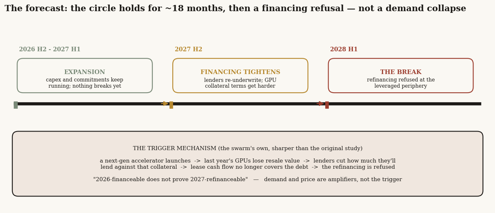
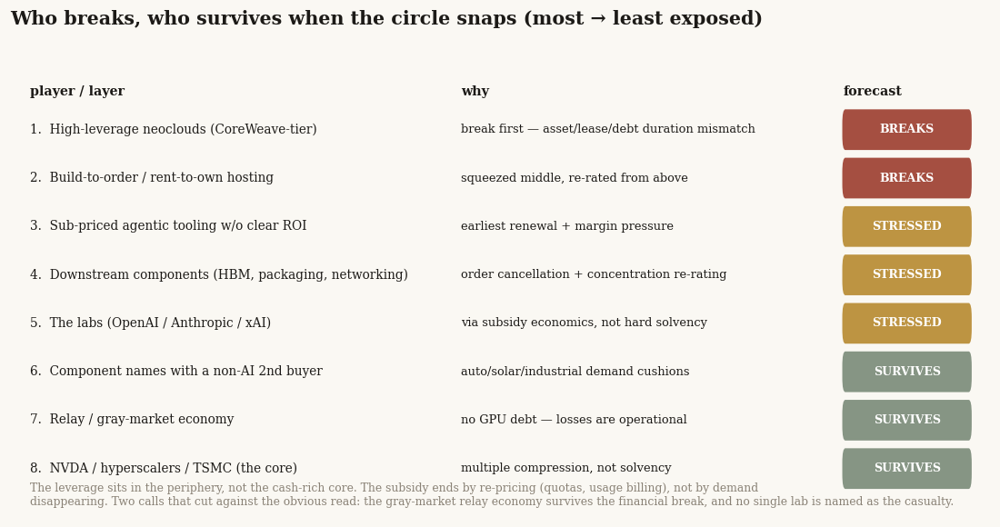
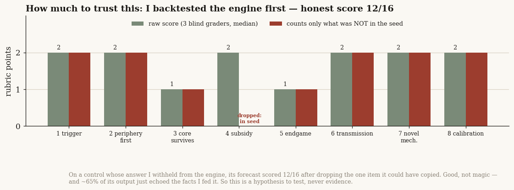

# 30 — The LLM players' endgame: a swarm-simulation forecast of who breaks and who survives

**The question.** My [study 27](../27-ai-capital-cycle/) mapped the 2026 "AI capital circle" — the loop where a chip vendor funds its own customers, who commit to clouds, who buy the chips — and argued it eventually breaks. This study asks the next, harder thing: *what actually happens to the LLM players when it does?* OpenAI, Anthropic, xAI, the hyperscalers, the neoclouds, the chipmakers — who breaks, who survives, when does it happen, and how does the subscription subsidy end? Instead of reasoning it out myself again, I handed the facts to a "predict-the-future" simulation engine — MiroFish, which spawns hundreds of AI agents and lets them play the situation forward — and let it produce the forecast.

**Why it matters.** "The bubble bursts" is useless as a forecast. "Which layer takes the loss, in what order, triggered by what, on roughly what calendar" is something you can position around. And the *path* matters more than the verdict: if the break comes from a financing refusal, you watch a refinancing calendar; if it comes from demand drying up, you watch usage. Those are opposite trades. So I wanted a forecast that names the trigger, ranks the casualties, and dates the move.

> Research, not investment advice. This is a **simulation**, not a market call. A swarm of language-model agents produced the forecast below; I report it because it is specific and testable, not because I endorse it. Before trusting any of it, read the last section — I backtested the engine on a case whose answer was already known, and the honest confidence is "good hypothesis generator," not "oracle." The engine ran on gpt-5.5. Every figure it produced is a pattern a machine generated, not a prediction I stand behind.

## The forecast, up front

- **The circle holds for about 18 months, then snaps in 2028 H1 — from a financing refusal, not a demand collapse.** The engine's base case: expansion continues through 2027 H1, financing conditions tighten in 2027 H2, and the break lands in 2028 H1 when lenders refuse to roll over the debt behind the most leveraged players. Falling demand and falling prices are "amplifiers, not the primary trigger."
- **The leveraged neoclouds break first; the cash-rich core survives.** Ranked most-to-least exposed: the CoreWeave-tier GPU-rental clouds, then the build-to-order hosting middle, then subscription-priced AI tooling without clear payback, then the component chain, then the labs, and — least exposed — the chipmaker, the foundry, and the hyperscalers, whose risk is a lower valuation, not insolvency.
- **No single lab is forecast to fail.** The engine pointedly declined to name OpenAI (or anyone) as *the* casualty, framing lab risk through subscription economics rather than a hard solvency call. Anthropic shows up as already re-pricing, not breaking.
- **The subscription subsidy ends by re-pricing, not by demand dying.** Quotas, concurrency caps, context limits, and a migration to usage-based billing — the "subsidy boundary being redefined." The flat $20/$200 all-you-can-eat plan is what goes away, not the demand.
- **The sharpest thing it produced was the trigger mechanism itself.** A next-generation chip launches, which collapses the resale value of last year's GPUs; lenders who hold those chips as collateral cut how much they'll lend against them; the lease cash flow no longer covers the debt; the refinancing fails. "2026-financeable does not prove 2027-refinanceable." That is a more monitorable trigger than my own study's vaguer "financing refusal."
- **How much to trust it:** on a backtest whose answer I hid from the engine, its forecast scored 12 of 16, with about two-thirds of its output just echoing the facts I fed it, and a real risk that its agreement with my own work is a shared-model habit rather than independent insight. Treat every line above as a hypothesis to test, weighted toward the two places it surprised me.

---

## The forecast: a financing refusal in 2028 H1, not a demand collapse

I gave the engine the facts of the AI circle — the financing edges, the disclosed customer concentrations, the measured subscription economics, the 50-company supply graph, the historical analogs — and asked it an open question: does the system break in the next eight quarters, and if so, what triggers it (a financing refusal? a demand shortfall? a price collapse? something else)? I deliberately did *not* give it my own answer. It had to choose.

It chose financing refusal, and it put a calendar on it.

The base case runs in three phases. Through **2027 H1** the buildout keeps going — capex and commitments run on, nothing breaks. In **2027 H2** the financing gets harder: lenders start re-underwriting, and the terms they offer against GPU collateral get tighter. Then in **2028 H1** the break: at the most leveraged players, the refinancing is simply refused. In the engine's words, demand shortfalls and price shocks are "amplifiers, not the primary trigger" — the thing that actually fires is in the credit channel.

This matters because it tells you what to watch. Not a usage chart. A refinancing calendar.

## Who breaks, who survives

The forecast is not "everyone gets hurt." It is a clear ordering, and the order is the point.

**The leveraged neoclouds break first.** The CoreWeave-tier GPU-rental clouds carry a mismatch the engine kept returning to: their assets (chips that age fast), their customer contracts (often one big tenant), and their debt (short, secured on those chips) all run on different clocks. When the refinancing window opens in 2027 and the collateral has cheapened, that mismatch turns from a valuation problem into a liquidity problem. The build-to-order hosting providers — the squeezed middle — go with them, re-rated from above as the flagship tenants move to hyperscalers.

**The middle gets stressed but mostly lives.** Subscription-priced AI tooling without clear payback feels it early, through renewal pressure and margins. The component chain — memory, advanced packaging, networking — takes order cancellations and a concentration re-rating one step behind the clouds. And the labs themselves sit here, not at the top: the engine framed their risk through the subscription subsidy, not as a solvency event, and notably refused to single out any one of them. Anthropic it described as already re-pricing and enforcing, not failing.

**The cash-rich core survives — as a valuation story, not a solvency one.** The dominant chipmaker, the foundry, and the hyperscalers absorb the shock through lower multiples, not through any question of going under. One hyperscaler it flagged as positioned to need its lab partner less over time, through its own models and its own chip.

**The contrarian call:** the gray-market "relay" economy — the resellers that arbitrage subscription access — *survives the financial break*, because it owes no one money for GPUs and signed no long data-center leases. Its losses look like banned accounts and lost customers, not insolvency. My own study 27 had ranked that layer as highly exposed; the engine disagreed, with a reason I can't easily dismiss.

## How the subscription subsidy ends

The engine was clear that the flat-rate subsidy does not end because demand falls. It ends because the providers re-price it. The path it traced: heavy and agentic users (and the relay operators) arbitrage the flat plans into quasi-wholesale compute; the providers respond with quota caps, concurrency limits, context-window limits, model routing, and a migration toward usage- and token-based billing — the "subsidy boundary being redefined." It pointed to the moves already on the tape (a major coding tool shifting to token billing, premium coding pulled from the cheap tier) as the early signs. The takeaway for the labs: subscription revenue stops being treated as smooth, dependable revenue, and the tools that can't show real workflow payback face the earliest renewal pressure.

## The mechanism it had that my own study didn't

The single most useful thing the simulation produced was buried in the agent chatter, and it sharpens my own work. Study 27 said the trigger is "a financing refusal" and rather left it there. The swarm said *how*: a next-generation accelerator launches, which collapses the resale value of the previous generation's chips; the lenders who hold those chips as collateral cut their loan-to-value; the cash the cloud earns renting them no longer covers the debt; and *that* is what makes the refinancing fail — with no change in demand required. It coined the line "2026-financeable does not prove 2027-refinanceable." That is a concrete, monitorable trigger (watch chip-launch cadence and GPU resale/rental values), where mine was a vaguer abstraction. A simulation handed me a better-specified version of my own thesis.

It surfaced four more mechanisms in the same vein, all worth investigating: the triple-duration mismatch as a risk distinct from demand; "take-or-pay coverage of depreciation plus debt" as the real test for a neocloud's solvency; the relay economy's distinct loss-type; and power-equipment project-finance as a second, non-GPU channel through which the same stress travels.

## How much to trust this — I backtested the engine first

Here is the part that keeps this honest, and it is why everything above is "the simulation forecasts," never "I forecast."

Before trusting the engine on a future I can't check, I ran it on a past I can: the 2001 telecom collapse, where the outcome is known (WorldCom's bankruptcy, the equipment makers gutted while Cisco survived, the component tier falling hardest). On a first pass it nailed all of it — but when I diffed my own briefing against its report, I had *handed it the answer* in the setup. A high score there measured reading comprehension, not foresight. So for this study's live forecast I stripped my own conclusions out of the input, posed the trigger as an open question, and graded the output with a panel of independent agents whose main job was to check every claim back against what I'd fed in — anything the engine could have simply copied doesn't count.

On that honest measure the forecast scored **12 of 16**. Good, not magic. Two-thirds of the engine's output was a restatement of the facts I gave it; only the remaining third — the trigger choice, the ordering, the survivors, and the novel mechanisms — is the engine's own reasoning. And the deepest caveat is one I can't fully clear: the engine and my own study 27 were built on the same family of language model, so their agreement on "financing refusal, periphery first, core survives" might be a shared habit of thought rather than two roads to the truth. That is exactly why the two places it *disagreed* with me — the relay economy surviving, and refusing to name a single lab — are worth more than the places it agreed.

## The answer, in the forecast

**What happens to the LLM players when the circle breaks?** On this simulation's base case: the leverage in the periphery breaks first, in 2028 H1, triggered by a collateral-value squeeze on a refinancing calendar rather than a collapse in demand; the cash-rich core survives with compressed multiples; no single lab is forecast to fail; and the all-you-can-eat subscription is re-priced out of existence rather than abandoned. Hold it as a scenario to monitor, not a certainty.

| Forecast dimension | The simulation's call |
|---|---|
| Trigger | Financing/refinancing refusal (credit channel), **not** demand collapse |
| Timing | Expansion to 2027 H1 → tightening 2027 H2 → break 2028 H1 |
| Breaks first | Leveraged neoclouds (duration mismatch), then build-to-order hosting |
| Stressed, survives | Sub-priced tooling, component chain, the labs (subsidy not solvency) |
| Survives | NVDA / hyperscalers / TSMC (multiple compression); relay economy (no GPU debt) |
| Subsidy endgame | Re-priced away (quotas, usage billing), not killed by weak demand |
| Sharpest mechanism | Next-gen chip → old-GPU resale collapse → collateral haircut → refi refused |
| Confidence | 12/16 on a hidden-answer backtest; ~65% echo; shared-model caveat |

## Caveats, each with its direction

- **This is a simulation, and the engine shares a model family with my own prior work.** Its agreements with study 27 may overstate independent confirmation; weight the divergences, not the echoes.
- **About two-thirds of the output restated the facts I supplied.** The genuinely new content is the trigger mechanism and the two contrarian calls — treat the rest as well-organized input, not forecast.
- **The run didn't compile a single polished report** (a usage limit cut it off), so the ranking above is reconstructed from the raw simulated world. A cleaner run would likely sharpen it; it would not change the spine.
- **One engine, one live question.** This is a forecast from a tool with a known, limited track record (one backtest), not a consensus.

## How it was produced

The engine is **MiroFish** (`github.com/666ghj/MiroFish`), an open-source swarm-simulation tool built on the **OASIS** multi-agent framework from CAMEL-AI, run on **gpt-5.5**. I drove it through its API: it builds a knowledge graph from the seed facts, gives each entity an agent persona with memory, runs them as a simulated social network for fifteen rounds, and reports what the world did. The forecast seed contained only facts (the financing edges, disclosed concentrations, measured subscription economics, the supply graph, historical analogs) with my study-27 conclusions removed; the prediction request posed the trigger as an open menu so the engine had to choose. Grading used a panel of independent agents (blind scorers, a contamination auditor that diffs every claim against the seed, a novel-mechanism verifier, an extractor). The seeds, the rubrics, and the grading outputs live with the working notes behind this study.

## References & forward pointer

Builds directly on [study 27 — the AI capital cycle](../27-ai-capital-cycle/), which supplied the facts and the question this forecast answers. The telecom backtest draws on the public record of the 2000–2003 collapse. The engine is MiroFish (`github.com/666ghj/MiroFish`); the framework is OASIS (CAMEL-AI); both runs used gpt-5.5. Next: the real test of a forecast like this is whether its *contrarian* calls (the relay economy surviving; the collateral-haircut trigger) hold up against independent data as 2027 unfolds — that is what separates a useful second opinion from a confident echo.
