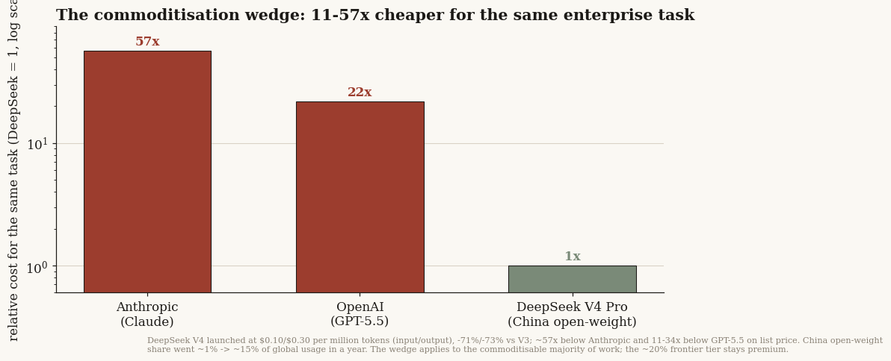
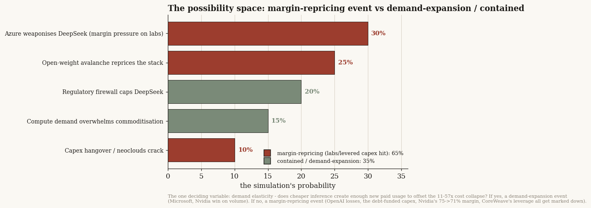

# 31 — Microsoft adopts DeepSeek: has the China-commoditisation shock reached the center of the Western stack?

**The question.** For 18 months the cheap-Chinese-model story was something that happened to other people's customers — DeepSeek taking share in Africa and the Middle East, a price war inside China. Then in June 2026 it arrived at the one place that matters most: Microsoft, the largest enterprise distributor of AI *and* OpenAI's biggest customer and backer, began testing a fine-tuned DeepSeek model as a low-cost option inside Copilot. So I wanted to answer three things with real numbers: how big is the cost gap actually; who in the market wins and who breaks if enterprises route to cheap open weights; and — because a reader asked it directly — which companies are betting the most borrowed money on AI capex, and is that capex outrunning the revenue that's supposed to pay for it.

**Why it matters.** The bear case on AI has always had two versions that get conflated. One says *demand* disappears (enterprises decide AI isn't worth it). The other says the *margin* disappears (the technology works fine, but its price collapses to cost). They call for opposite trades. This event is a clean test of which one is real — and the answer changes who you'd own and who you'd avoid. It also puts a number on a risk the whole market is carrying: hundreds of billions of debt-funded data-center capex underwritten on the assumption that premium-priced compute stays scarce.

> Research, not investment advice. Every financial figure here is traced to a specific SEC filing (10-K / 20-F cash-flow statements for capex; 424B / 8-K prospectuses for the debt and equity raises) or to a dated source noted inline. The scenario probabilities are a multi-agent simulation's output, labelled as such — a distribution to watch, not my forecast. Builds on [study 27](../27-ai-capital-cycle/) (which named the commoditisation break-path) and [study 30](../30-llm-players-forecast/) (which argued the subsidy *re-prices* rather than dies).

## What I found, up front

- **The cost gap is real, large, and structural — roughly one to two orders of magnitude.** DeepSeek V4 Pro lists at ~11–34× cheaper than GPT-5.5 and ~57× cheaper than Anthropic; it launched at $0.10/$0.30 per million tokens (input/output), down 71–73% from V3. Chinese open-weight models went from ~1% to ~15% of global usage in a year, with weekly token volume briefly overtaking the US.
- **This is a margin event, not a demand event — so far.** AI usage isn't falling; Copilot seats passed 20 million while Microsoft shopped for cheaper models. What's being repriced is the *gross margin at the model layer* and the pricing power of the closed-model vendors. That is exactly study 30's "demand stays, supply re-prices" shape.
- **The premise that "Microsoft is cutting capex" is false — and the filings prove it.** Microsoft is *accelerating*: capex +45% to $64.6B in FY2025, the first nine months of FY2026 already $80B (+69%), guided to ~$190B for calendar 2026. The "DeepSeek-driven pause" was a disputed analyst channel-check from February 2025, refuted by the 10-K. Microsoft is the prudent *contrast*: the only big spender self-funding the build, with debt actually falling.
- **The real ROI risk sits in the debt-funded builders, and capex is badly outrunning revenue there.** Oracle grew capex +209% on +8% revenue (free cash flow turned negative); Alphabet +74% on +15%; Amazon +59% on +12%; Meta +87% on +22%. The pure-plays are the sharpest: CoreWeave and Applied Digital are building on 9%-plus junk-rate debt against tiny revenue. If inference pricing softens, stranded-capex and refinancing risk concentrate precisely there — not at Microsoft.
- **A simulation of the shock splits 65/35 toward a margin-repricing outcome**, and names the single deciding variable: demand elasticity. Does cheaper inference create enough new paid usage to absorb a 57× price cut? If yes, everyone keeps winning on volume; if no, the losses, the leverage, and the premium-compute multiples all get marked down.

---

## The event, dated

**On 16 June 2026, Axios reported [confirmed]** that Microsoft is testing a fine-tuned, Azure-self-hosted version of DeepSeek V4 as a lower-cost alternative to OpenAI *and* Anthropic models inside **Copilot Cowork**, which is simultaneously moving to usage-based ("Copilot Credits", $0.01/credit) pricing; Microsoft is also evaluating xAI and Meta open models for the same slot, with a decision expected within weeks. Copilot EVP Charles Lamanna is on the record: *"users who do hundreds of tasks a week… the costs can go very high."* Our own corpus carries the same story (note dated 19 June 2026).

It sits at the end of a tight arc: the original DeepSeek shock (Jan 2025, V3/R1 at a fraction of GPT-4's training cost) → DeepSeek V4 released 26 Apr 2026 at $0.10/$0.30 per M tokens → US enterprises switching, DeepSeek ranked #1 on Ramp's corporate-spend panel by new paying customers (Jun 2026) → "unlimited AI usage is ending" as Coinbase, Salesforce, Walmart and Amazon move to token-cost management (13 Jun) → DeepSeek closes a $7.4B round at a ~$50B valuation, Tencent/CATL-led, to keep funding the price war (17 Jun) → OpenAI's 2025 ~$38.5B net loss disclosed (18 Jun).

The reason this datapoint is load-bearing: it is the moment the commoditisation stops being an emerging-markets share story and becomes a *sourcing decision at the largest Western distributor*, which happens to be OpenAI's biggest customer and ~$13B shareholder.

## How big is the wedge

The price gap is one to nearly two orders of magnitude, and it is self-inflicted by DeepSeek, not a temporary promo: at the V4 launch it set API fees to $0.10/$0.30 per million tokens (−71%/−73% vs V3) and added a 75% developer discount. Put concretely: a frontier task that costs ~$1 of Anthropic tokens costs about **2 cents** on DeepSeek, and ~3–9 cents on GPT-5.5. That extends a multi-year deflation (frontier input ~$60/M → ~$2.50/M in three years), with analysts in our corpus flagging sub-$0.01/M by 2027.

The share data moves just as fast: Chinese open-weight models went from ~1% of global usage a year ago to ~15% by late 2025 — a ~15× jump — and roughly 40% of that usage is high-intensity professional work (coding, design), not toy queries. For one week in late April 2026, China's weekly token calls (7.94T, +82% week-on-week) actually overtook the US (3.26T). The honest bound: this is list price on the *commoditisable majority* of work; the ~20% of frontier tasks stay premium, and effective enterprise cost includes fine-tuning and hosting overhead. But the burden of proof has flipped onto the incumbents to justify a premium.

## Who is betting the most borrowed money — and is capex outrunning revenue?

This is the part a reader asked for directly: a table of who's raising capital to fund the AI buildout, what it's for, and whether capex is growing faster than the revenue meant to justify it. Every row is from SEC filings. Two things the filings forced me to correct are flagged below — they matter.

**The AI capex-financing table (2025–26, ordered by money raised)**

| Company | Raised (type) | What for (per filing) | Revenue growth | CapEx growth | Funding tell |
|---|---|---|---:|---:|---|
| **Amazon** | **~$81.7B** debt (senior notes, 4 offerings) | "general corporate purposes" — *not* data-center-earmarked | +12.4% | **+58.8%** | all debt |
| **Alphabet** | **$64.6B** debt (senior notes; LT debt $12B→$49B) | "general corporate purposes" | +15.1% | **+74.1%** | debt — *and* bought back $45.7B of stock |
| **Oracle** | **$43.0B** debt (two bond deals) | "general corporate purposes… capital expenditures"; CIP = data-center compute | +8% | **+209%** | debt; **FCF now negative (−$0.4B)** |
| **Meta** | **$30B** bond + **~$27B off-balance-sheet** Hyperion JV (Blue Owl SPV) | bond "general purposes"; JV builds the Louisiana AI campus | +22.2% | **+87.1%** | bond on-book, JV leverage off-book |
| **CoreWeave** | **~$13.3B** (debt @9–9.25% + $1.49B IPO) | GPU/compute equipment (term loans filing-stated) | +167.9%¹ | +18.5% (cash) | junk-rate debt; **$6.7B 2026 maturity wall** |
| **Nebius** | **~$11.65B** convertibles + equity | "data center development, AI infrastructure" (earmarked) | +479%¹ | +404%¹ | convertibles, small base |
| **Dell** | **~$8.5B** debt | "general purposes" + refinancing 2026 notes — **no AI earmark** | +18.8% | **−0.7%** | the arms-dealer: capex *falling* |
| **Applied Digital** | **~$4.5B+** debt @9.25% (earmarked) + preferred | build the Ellendale AI campus leased to CoreWeave | +5.5% | **+381%** | single anchor tenant = CoreWeave |
| **Microsoft** | **none — self-funded** | cloud + AI infrastructure | +14.9% | **+45.1%** | OCF $136B > capex $64.6B; **debt falling 4 yrs** |

¹ CoreWeave/Nebius growth is off a tiny base; read with the base effect in mind.

The pattern is unambiguous and it *is* the ROI risk. Capex is growing several times faster than revenue at every aggressive name, and the aggression is debt-funded. Oracle is the sharpest single case — capex up 209% on 8% revenue, free cash flow gone negative — and the pure-play infrastructure names (CoreWeave, Applied Digital) are the most fragile: building almost entirely on high-cost debt against revenue that is tiny or barely growing, with the whole thesis resting on anchor-tenant demand holding. **That is the exact spot a commoditisation shock attacks** — if cheap open weights soften inference pricing, the premium-GPU scarcity that underwrites this debt weakens, and the refinancing math breaks here first.

**Two corrections the filings forced — and why they sharpen the thesis:**

1. **Microsoft is not the "first domino" cutting capex.** It is accelerating (FY26 nine-month capex $80B, +69%; ~$190B guided for 2026) and is the *only* name self-funding from operating cash flow with falling debt. The "pause" story was a February-2025 analyst channel-check (TD Cowen, alleging cancelled leases after the original DeepSeek shock), publicly disputed by Microsoft and refuted by the subsequent filings. Where the China risk *does* show up at Microsoft is in monetisation — the shift of Copilot to metered "Credits" pricing — and in pushing incremental leverage *off* its balance sheet (finance leases; the BlackRock/GIP AI Infrastructure Partnership JV), not in cutting the build. The right read is that Microsoft is *de-risking the funding method*, not the spend.
2. **Alphabet did not raise ~$80B in equity.** It raised $64.6B in *debt* and was a net *buyer* of its own stock ($45.7B repurchased). The bonds say "general corporate purposes," not "for data centers" — the AI link is the +74% capex line and the 2026 guidance, not a stated use of proceeds. Across the hyperscalers, only Nebius and Applied Digital explicitly earmark proceeds for AI data centers; the rest is contextual.

## Who wins, who breaks

| Player | Direction | Mechanism | Financial anchor |
|---|---|---|---|
| **Microsoft** | **Bullish** | Wins both legs: substituting cheaper models in Copilot strips third-party model margin out of cost (it drops to Azure margin), and it still holds OpenAI's equity upside, so diversifying consumption doesn't forfeit it | FY25 sales $281.7B, GM 68.8%, FCF $41.2B; OpenAI paid it $17.2B in 2025; ~$13B stake marked ~$228B |
| **OpenAI** | **Bearish** | Loses distribution exclusivity at its most important channel; Copilot routes to cheapest-per-token, removing the captive-demand cushion at the worst possible time | 2025 net loss ~$38.5B on ~$13B revenue (~8× 2024); Q1'26 op-loss $9.3B |
| **Anthropic** | **Bearish** | The 57× undercut is measured *against it*; the Axios note names Anthropic specifically as a substitution target; export-control friction pushes allied buyers toward open weights | private; confidential S-1 filed 1 Jun forces cost disclosure into the price reset |
| **Western API pricing power** | **Bearish** | A price-floor reset, not a one-vendor event: the largest distributor validating a Chinese open-weight model anchors every closed API to an 11–57×-cheaper alternative | enterprises (Coinbase/Salesforce/Walmart) already routing to cheaper models |
| **Nvidia / compute chain** | **Mixed** | Two-sided: cheaper inference grows total tokens (Jevons; NVDA inference-chip share rose 66%→74%), but commoditised open weights on cheaper silicon erode the premium-compute mix — and the first crack is already in the margin | FY (Jan-26) sales $215.9B, FCF $115.9B, but **gross margin 75.0%→71.1% y/y** |
| **Neoclouds (CoreWeave/Nebius)** | **Bearish (tail)** | Leveraged premium-GPU fleets underwritten on scarce high-priced compute; an efficiency shock attacks that underwriting at the root — and these are the most cash-negative, most leveraged names | CRWV FY25 −$1.2B net loss, −$9.1B FCF, $21.6B debt on $3.3B equity (~6.5× D/E) |

## The possibility space

I seeded a multi-agent simulation with the facts above (and nothing else — no verdict) and asked it to forecast the *distribution* of futures over 2026 H2–2027 H2, not a single base case.

It split ~65/35 toward a margin-repricing outcome: **Azure weaponises DeepSeek to pressure lab pricing (30%)**, **open-weight avalanche reprices the whole stack (25%)**, **regulatory firewall caps Chinese-model adoption in the West (20%)**, **compute demand overwhelms the price cut (15%)**, **capex hangover and the neoclouds crack (10%)**. Across all five it kept the same shape we found by hand — Microsoft wins, the closed-model vendors and the levered capex are what get repriced, Nvidia is the insulated-but-margin-pressured middle.

Its one deciding variable is the right one: **demand elasticity.** *Does cheaper inference create enough new paid usage to offset a 57× price collapse?* If yes, this is a demand-expansion event and Microsoft and Nvidia keep winning on volume. If no, it is a margin-repricing event — and OpenAI's losses, the debt-funded capex, Nvidia's slipping gross margin, and CoreWeave-style leverage all get marked down together.

## The link to studies 27 and 30

Study 27 named the *path* (Chinese open-weight pricing could break Western model-layer economics); study 30 named the *mechanism* (the cost shock re-routes demand rather than killing it — "demand stays, margin compresses"); **study 31 is the event** — the path arriving at the center of the Western stack, and the mechanism made literal: Microsoft adopting cheaper supply while Copilot seats grow past 20 million. The clean hook is study 30's "Microsoft needs OpenAI less": OpenAI's $38.5B 2025 loss against the $17.2B it paid Microsoft means Microsoft is simultaneously OpenAI's largest backer *and* now its substituter — which lets it defend Copilot margins without forfeiting the equity upside.

## The answer, in the data

**Has the China-commoditisation shock reached the center of the Western stack? Yes — and it presents as a margin event, not a demand event.** The cost gap is real (11–57×) and accelerating (1%→15% global share in a year; DeepSeek #1 on US enterprise-spend panels); the largest Western distributor is now pricing its own product against it; AI usage keeps growing while model-layer pricing power erodes. The market impact is bullish for the distributor that captures the saving (Microsoft), bearish for the closed-model vendors whose pricing power is the thing being reset (OpenAI, Anthropic), mixed for the compute franchise (Nvidia: units up, premium margin cracking), and a leveraged tail risk for the debt-funded builders (Oracle, the neoclouds) where capex has badly outrun revenue. The user's instinct was right that this threatens AI capex ROI — but the threat lands on the borrowers, not on self-funded Microsoft.

| Dimension | The read |
|---|---|
| Nature of the shock | Margin-repricing, not demand-destruction (usage still rising) |
| Cost wedge | 11–34× vs GPT-5.5; ~57× vs Anthropic; DeepSeek V4 $0.10/$0.30 per M tokens |
| Biggest ROI risk | Debt-funded builders where capex ≫ revenue: Oracle (+209%/+8%), CoreWeave, Applied Digital |
| The contrast | Microsoft — self-funded, accelerating capex, de-risking via monetisation, *not* cutting |
| Simulation distribution | ~65% margin-repricing / ~35% contained-or-demand-expansion |
| The deciding variable | Demand elasticity — does cheap inference create enough new usage to absorb a 57× cut? |

## Caveats, each with its direction

- **List price vs effective cost.** The 11–57× are list-price API comparisons; real enterprise economics include fine-tuning, hosting, and the ~20% frontier tier that stays premium. *Overstates the gap on total spend.*
- **The cuts are partly subsidy.** DeepSeek's $7.4B raise explicitly funds the build; the sub-$0.01/M projection assumes the price war continues. *Today's wedge overstates the long-run unsubsidised gap — this re-prices, it does not prove a permanent moat (the study-30 point).*
- **Panels, not audited totals.** OpenRouter/Ramp are panels; weekly token spikes are volatile and partly promotional. The "~30% peak" share is a noisy upper bound. *Overstates the level.*
- **Usage share ≠ value or quality share.** Cheap tokens inflate volume faster than value; the frontier-capability gap (~6 months by some lab views) is real. *Overstates the threat to the premium tier.*
- **Simulation, not evidence.** The scenario probabilities are one multi-agent run; the engine shares a model family with this analysis, so its agreement may be a shared prior. Treat as a distribution to watch.

## Watch-list (what confirms or breaks this)

- **The Copilot Cowork decision** — does a fine-tuned DeepSeek/open-weight model actually ship as an option, and at what default-routing share? *The single confirm/falsify event.*
- **DeepSeek's next price move** post-raise — deeper cuts (subsidy thesis) or stabilisation (moat thesis)?
- **Nvidia gross margin** — does it keep sliding past 71.1% (premium-mix erosion) or stabilise on Rubin volume (Jevons winning)?
- **Neocloud refinancing** — CoreWeave's 2026 maturity wall and Oracle's negative FCF against any softening in GPU rental rates.
- **Enterprise-spend panels** — does DeepSeek hold #1 by new paying customers, or fade as a June spike?

## Method & sources

Capex and financing figures are from SEC EDGAR — 10-K/20-F consolidated cash-flow statements for capex ("purchases of property and equipment"), and 424B prospectuses / 8-K exhibits for the debt and equity raises and their stated use of proceeds; each row's filing is identified in the working notes. The event timeline, the pricing wedge, and the usage-share path are corroborated against dated notes in an internal research corpus and the live record (Axios, WSJ/FT, OpenRouter/a16z, Ramp). The market-impact map pairs those facts with terminal-grade financials. The possibility-space distribution is the output of MiroFish (`github.com/666ghj/MiroFish`), an open-source multi-agent simulation engine built on the OASIS framework, run on gpt-5.5, seeded with the facts above and the verdict withheld; it is reported as a simulation, not a forecast I endorse — and its track record (see [study 30](../30-llm-players-forecast/)) is "reproduces the consensus spine, skips the per-company detail," so it is used here only for the scenario *distribution*, not the financials.

## References & forward pointer

Builds on [study 27 — the AI capital cycle](../27-ai-capital-cycle/) (the commoditisation break-path) and [study 30 — the LLM players' endgame](../30-llm-players-forecast/) (the subsidy re-prices rather than dies; "Microsoft needs OpenAI less"). The forward test is the watch-list above — above all, whether DeepSeek actually ships in Copilot and whether cheaper inference grows the pie fast enough to keep this a volume story rather than a margin one.
