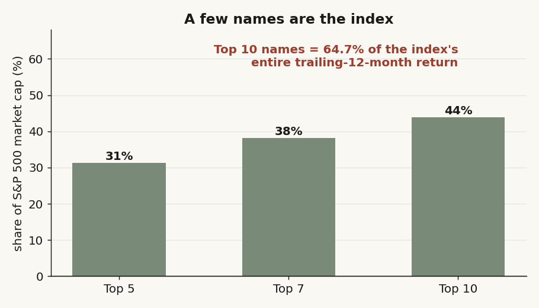
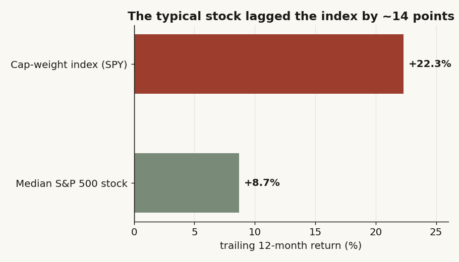
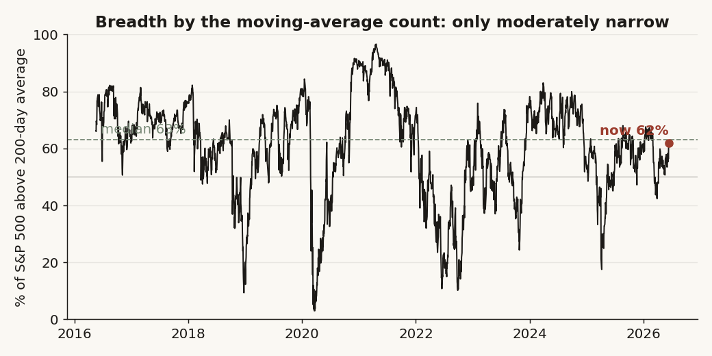
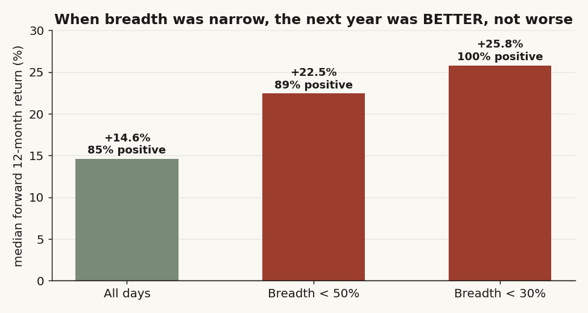
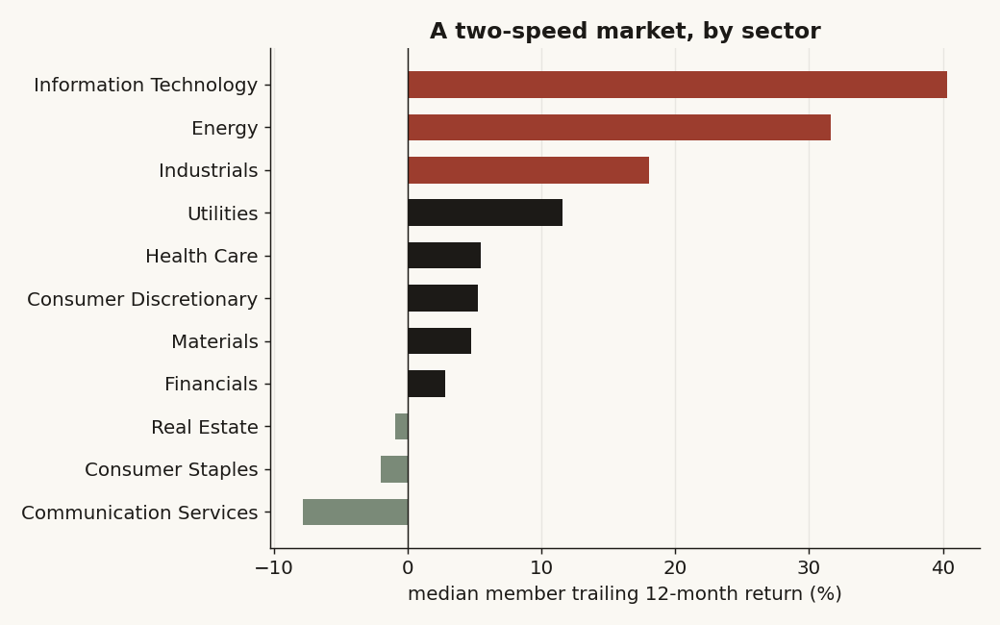
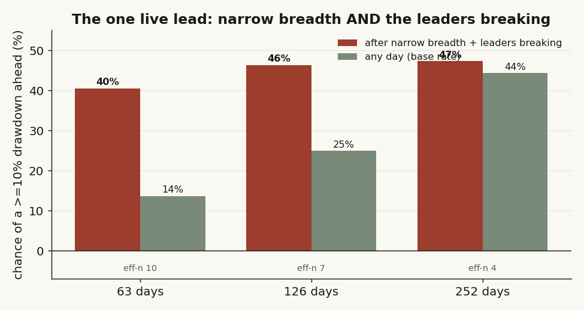

# 33 — Is the market held up by too few stocks? And if so, is a crash coming?

**The question.** The index keeps making highs, but it feels like only a handful of giant names are doing the work while the average stock limps along. So: how narrow is it really — and does narrow, top-heavy leadership actually warn that a broad drop is coming when people finally take profits in the winners? *Why it matters:* "it's all just seven stocks, this has to end badly" is one of the most repeated lines in markets right now. If it's a real timing signal, you'd want to be lightening up. If it isn't, acting on it has a cost.

## What I found (the short version)

- **The "few stocks hold it up" part is true — emphatically.** The 10 biggest names are ~44% of the whole index, the index trades like only ~39 equal-weight stocks, and those 10 names delivered **65% of the index's entire last-12-month return.** The median stock returned **+8.7%** while the index returned **+22.3%**. The typical stock really is being left behind.
- **The "so a crash is coming" part does not hold up.** I tested it directly. When breadth was narrow, the next year was *better* than average, not worse: with under half the index above its 200-day line, the next 12 months returned **+22.5%** (median), positive **89%** of the time. Below 30% above the 200-day, it was **+25.8%** and positive **100%** of the time.
- **Narrow breadth was a false alarm for drawdowns.** "Under half above the 200-day" was followed by a 10%-plus drop within a year **35%** of the time — *less* often than the 41% base rate. As a warning bell it rang, and mostly nothing happened.
- **It's a two-speed market, not a collapsing one.** AI chips, AI-power/electrification (GE Vernova, Vertiv, the electrical-build names), and a few sectors are flying; software, consumer, fintech, and — interestingly — the merchant power-generation names are the laggards.
- **The one lead I couldn't kill (but couldn't confirm):** narrow breadth *plus the leaders themselves breaking down* tripled the near-term drawdown odds (40% vs 14% over the next quarter). But I only have ~10 independent windows in the clean data, so it misses the significance bar. It's the one piece worth chasing with more history.

I went in sympathetic to the bearish read. The descriptive half supports it; the predictive half doesn't. The honest verdict is a **conditional no**: this is fragility, not a countdown.

## What I expected, and how I'd know I was wrong

There's a sensible story behind the worry. If an index only rises because five or ten mega-caps rise, then the "generals" are marching without the "troops," and when the generals tire there's nothing underneath to catch the fall. Call that the **breadth-warning** hypothesis (H1): narrow breadth should be followed by weaker, more drawdown-prone returns.

The null I set out to kill (H0): *narrow breadth tells you nothing useful about what the index does next.* And the way I'd know H1 was right is concrete — after narrow-breadth days, the forward returns should be lower, and the drawdowns deeper and more frequent, than after ordinary days, by more than noise.

I'll say up front where my prior landed before I ran it, because it colors nothing — the test is the test. The published base-rate work on this (the cleanest one tracks forward returns after deep breadth washouts) finds those moments were, on average, *bullish* a year out. That's one line of context, not my evidence. My evidence is my own tape, below.

## How I checked it, and why each piece

The trap in any breadth study is **survivorship**: if you measure "how many stocks are above their average" using only the companies that still exist today, you've quietly deleted everyone who got dropped, bought, or went to zero — and breadth looks healthier than it was. So the first job was getting the membership right, then being honest about where my prices run out.

- **Point-in-time membership.** I rebuilt the actual S&P 500 roster on every date — the names that were *in the index that day*, not today's list projected backwards — from a public historical-constituents dataset (membership back to 1996). About 500 names a day; ~990 distinct names pass through the window.
- **One honest data wall.** My clean daily prices for the *whole* membership only go back to **2016**. Before that, my coverage of the full roster — especially names that later delisted — drops below the level I'd trust for a breadth count. I could have papered over it; instead I measured it and drew the line at 2016. The cost is real and I'll keep flagging it: the clean window holds only about three genuine drawdowns (late-2018, the 2020 COVID crash, the 2022 bear), so the predictive test is small by construction.
- **No look-ahead.** A stock's 200-day average on a given day uses only prices up to that day; a name with fewer than 200 days of history simply isn't counted that day (it's not secretly scored "below"). The classic mistakes here are centering the average or counting a name before it had enough history — both lagged out.
- **Counting honestly.** Overlapping forward windows (today's "next 12 months" shares 11 months with tomorrow's) make a sample look bigger and more significant than it is. So every confidence interval is built on *non-overlapping* windows and block-bootstrapped, and I report the **effective number of independent windows** next to every claim. With ~10 of those at the one-year horizon, I refuse to call anything a confirmed signal — that restraint is the point.
- **I double-checked the wild numbers.** Some 12-month returns looked impossible — Micron up ~300%, SanDisk up ~700%. I checked them against outside quotes. They're real: 2026 has had a violent melt-up in memory and AI-chip names. That *is* the concentration story, not a glitch, so those names stay in.

## The data

- **Universe.** The S&P 500, point-in-time, ~500 names per day, ~990 distinct names over the window, reconstructed from a public historical-constituents dataset. Delisted/acquired names are retained for every date they were actually members.
- **Prices.** Daily split-adjusted closes from my market-data warehouse, clean for the full membership from **2016-05** to **2026-06**. Index reference: the cap-weight S&P 500 ETF and its equal-weight sibling (for the concentration ratio).
- **Layers.** Two ways of grouping the names: the 11 standard sectors (full coverage), and an AI value-chain taxonomy I maintain — chips, AI-power/electrification, software, hyperscalers — so I can see *which* engine is carrying the index. Positioning add-ons (short interest broadly; listed-options skew on the mega-cap leaders only) are used where coverage exists and flagged where it doesn't.

## What the data looks like first

Before any test, three pictures set the scene.

**The index is a few names.** The 10 largest are ~44% of market cap — but the sharper number is the *return* share.



**And the typical stock is being left behind.** The median member made a third of what the index made.



**Yet by the plain moving-average count, breadth is only middling — not washed out.** About 59% of names sit above their 200-day line, around the 39th percentile of the last decade. Narrow-ish, not extreme.



That gap — *extreme by concentration, only middling by the moving-average count* — is the whole story. "Narrow" is mostly a cap-weight-and-leadership fact, not a "barely any stock is in an uptrend" fact.

## The findings

### Finding 1 — Concentration is extreme, and it's a return story more than a weight story.

- *What I expected & why.* If a few names drive everything, their share of the index's *return* should dwarf their share of its *weight*.
- *How I measured it.* Per name, weight × return, summed for the top cohort over the index total; plus the Herfindahl "effective number of stocks" = 1 / Σ(weightᵢ²).

```
top10_cap_share   = sum(weight_top10)                       # 43.9%
effective_N       = 1 / sum(weight_i**2)                    # 38.8  (of 503)
top10_return_share= sum(w_i * r_i for top10) / index_return # 64.7%
```

- *What the data shows.* Top-10 cap share 43.9%; effective-N **38.8** (the S&P 500 trades like ~39 equal-weight names); top-10 share of the trailing-year return **64.7%**.
- *Why.* A handful of trillion-dollar names plus a real earnings/AI melt-up in chips. Concrete: two names alone (a memory maker up ~300%, a storage spin-out up ~700% on the year) move the whole index needle.
- *What I checked.* It doesn't depend on the 2016 wall — it's a present-day snapshot from current weights.
- *Verdict.* **Confirmed.** The index is genuinely top-heavy.

### Finding 2 — The median stock badly lagged the index.

- *What I expected & why.* The flip side of cap-weighted concentration: the average stock should trail the index.
- *What the data shows.* Median member trailing-12-month return **+8.7%** vs the index's **+22.3%** — a ~14-point gap.
- *Verdict.* **Confirmed.** "Most stocks aren't really participating" is true on returns.

### Finding 3 — But by the moving-average count, breadth is only moderately narrow.

- *What the data shows.* ~59% of names above their 200-day average, 39th percentile of the 2016+ range; breadth actually bottomed in spring and recovered. Not a washout.
- *Verdict.* **Confirmed, and it reframes the worry.** The narrowness lives in cap-weight and leadership, not in a collapse of stocks-in-uptrends.

### Finding 4 — Narrow breadth did NOT predict a drop. It preceded *above-average* returns.

This is the heart of it.

- *What I expected & why.* H1 says low breadth → weaker, more drawdown-prone forward returns.
- *How I measured it.* Tag each day by the % of members above their 200-day average; measure the index's *next* 12-month return and its worst drawdown over that year; compare the narrow-breadth days to all days, on non-overlapping windows.

```
narrow = pct_above_200 < 50          # and a deeper cut, < 30
fwd_252 = spy[t+252]/spy[t] - 1
compare median(fwd_252 | narrow) vs median(fwd_252 | all)   # block-bootstrap CI
```

- *What the data shows.* The opposite of the warning. Under 50% above the 200-day: next-year median **+22.5%**, positive **89%** of the time. Under 30%: **+25.8%**, positive **100%**. All-days baseline: **+14.6%**, 85%.



- *Why (mechanism).* Low breadth tends to show up *after* a scare, near washed-out levels that mean-revert — so you're often buying fear, not selling a top.
- *What I checked.* As a drawdown alarm it's worse than useless: "under 50% above the 200-day" was followed by a 10%-plus fall within a year **35%** of the time vs a **41%** base rate, and a 20%-plus fall **3.5%** vs **14.6%**. The signal fired and mostly nothing bad happened.
- *Verdict.* **Null — H1 rejected.** Narrow breadth, on its own, is not a drawdown timer; if anything it leaned bullish.

### Finding 5 — It's a two-speed market, not a sick one.

- *How I measured it.* Median 12-month member return and % above the 200-day, per sector and per AI value-chain layer.
- *What the data shows.* Leaders: Information Technology, Energy, Industrials by sector; chips, and the **AI-power/electrification** layer (GE Vernova +95%, Vertiv +175%, the electrical-construction names; MYR Group, a smaller pure-play, +160%) by value chain. Laggards: software, consumer, fintech — and, notably, the merchant **power-generation/IPP** names, which have already rolled over (0% above their 200-day, negative on the year) even as the power-*equipment* names soar.



- *Verdict.* **Confirmed.** The weakness is concentrated in rate-sensitive/software/consumer corners and one corner of the power trade — not a broad breakdown.

### Finding 6 — The one lead worth chasing: narrow breadth AND the leaders breaking.

- *What I expected & why.* The real mechanism in the worry isn't "few names lead" — it's "few names lead *and then those names roll over.*" So I conditioned on both: narrow overall breadth **and** the top-15 names falling below their own 200-day line.
- *What the data shows.* The largest effect in the whole study. Over the next quarter, a 10%-plus index drawdown happened **40%** of the time after this combined signal vs a **14%** base rate — roughly triple.



- *What I checked.* Honesty kills the headline: only ~10 independent windows, and it misses the multiple-comparisons-adjusted bar. Pushing the test back to 2010 on a (survivorship-biased, so directional-only) panel keeps the effect (~28% vs 12%) and lifts it to ~19 independent windows — tantalizing, not proof.
- *Verdict.* **Conditional / unconfirmed.** The best lead, underpowered by my clean sample. This is the thing a few more real crashes would settle.

## Did I just find noise?

The headline here is a *null*, so "noise" cuts the other way — I tried to make a bearish signal appear and couldn't. I swept the breadth threshold from 30% to 60% (no level flips it bearish), swapped the simple average for an exponential one (same answer), and built every confidence interval on non-overlapping windows with the effective-n shown. Nothing about "narrow breadth is bearish" survives. The only thing that even flickers is Finding 6, and I've already flagged it as underpowered.

## Rivals I tried, and how they failed

- **"Index makes a high while breadth fades" (the classic divergence).** Tagged every such episode; the next-12-month return inside one was **+13.6%** median — basically the base rate. No timing edge.
- **"Concentration itself is the danger."** Sorted by the equal-weight-vs-cap-weight ratio and by effective-N; the most-concentrated days were followed by **+15.3%** median, 93% positive. Concentration didn't predict fragility either.
- **"It works, you just need the big crashes."** Fair — and I can't fully rule it out, because my clean window starts in 2016 and skips 2000 and 2008. That's the live alternative I'm conceding, not dodging (see caveats).

## The answer, in the data

**Is the market held up by too few stocks?** Yes — clearly. **Does that mean a crash is coming?** No, not as a timing signal — *conditional* at most, and only through the "leaders actually break" channel I couldn't confirm. Narrow, concentrated breadth describes a market with a thin cushion and a lot riding on a few names. It is a statement about *fragility and margin of safety*, not a date.

| What I tested | Median fwd 12m | Average | % positive | Verdict |
|---|---|---|---|---|
| All days (baseline) | +14.6% | +13.9% | 84.7% | — |
| Breadth < 50% above 200-day | +22.5% | +21.6% | 89.1% | Narrow ≠ bearish |
| Breadth < 30% above 200-day | +25.8% | +28.9% | 100.0% | Narrow ≠ bearish |
| Index-high + fading breadth | +13.6% | +10.7% | 80.5% | No edge |
| Most concentrated (low equal/cap) | +15.3% | +16.9% | 93.4% | No edge |
| Narrow **+ leaders breaking** (drawdown odds, 1q) | 40% vs 14% base | — | — | Lead, underpowered |

Concentration verdict: **Yes** (top-10 = 44% cap, 65% of return, effective-N ~39). Median-stock-lags verdict: **Yes** (+8.7% vs +22.3%). Crash-timing verdict: **No / Conditional.**

## Caveats (and which way they bias things)

- **The 2016 wall.** My clean breadth history starts in 2016, so the predictive test misses 2000 and 2008 — exactly the regimes where a "leaders break" signal would have the most to bite on. Direction of bias: this makes me *under*-powered to find a real crash signal, so my "no" is cautious, not triumphant. It's why Finding 6 stays open.
- **Small independent sample.** ~10 non-overlapping one-year windows. Good enough to reject easy claims (narrow = bearish), not to confirm a subtle one.
- **Positioning is partial.** Short interest covers most large names; listed-options skew really only covers the mega-cap leaders, so the "are they crowded?" read is suggestive, not definitive (it came back: lowly shorted, but not euphoric).
- **Concentration is a snapshot.** The return-share and effective-N numbers are current; I'm not claiming a clean multi-decade concentration time series.

## Reproducibility

The breadth count, per day, member-only, no look-ahead:

```python
# prices: long frame [date, ticker, close]; members: [date, ticker] point-in-time
ma200 = (prices.sort_values("date")
                .groupby("ticker")["close"]
                .transform(lambda s: s.rolling(200, min_periods=200).mean()))
above = (prices["close"] > ma200)                      # NaN where <200d history -> excluded
day = (above[members_mask]                             # members only
         .groupby(prices["date"]).mean() * 100)        # % of members above their 200-day
```

The combined "leaders breaking" signal (Finding 6):

```python
narrow      = pct_above_200 < 50
leaders_brk = top15_pct_above_200 < 50                 # top 15 by cap, same 200-day rule
signal      = narrow & leaders_brk
dd_rate     = (fwd_maxdd_63d[signal] <= -0.10).mean()  # vs unconditional base rate
# CIs on non-overlapping windows; effective-n reported beside every number
```

Figures: the six PNGs in `figures/`, built from the point-in-time breadth panel and forward-return panel. Full pipeline (membership build, panel construction, the bootstrap/FDR machinery, the adversarial re-test) lives in the private research repo; this writeup is method-and-findings only.

## References & forward pointer

- Point-in-time S&P 500 membership: the public `fja05680/sp500` historical-constituents dataset.
- Context on breadth washouts being bullish-on-average a year out: practitioner base-rate studies on the %-above-200-day indicator (used as one line of prior, not as evidence).
- **Builds on** the size-conditioned, survivorship-aware method from studies 01, 05, and 28 (count honestly, cluster by date, kill your own signal).
- **Next:** the live lead in Finding 6 needs the 2000 and 2008 crashes to settle. That's a delisted-inclusive deep-history pull — the planned follow-up, where "narrow breadth *and* the generals break" finally gets a fair test.
