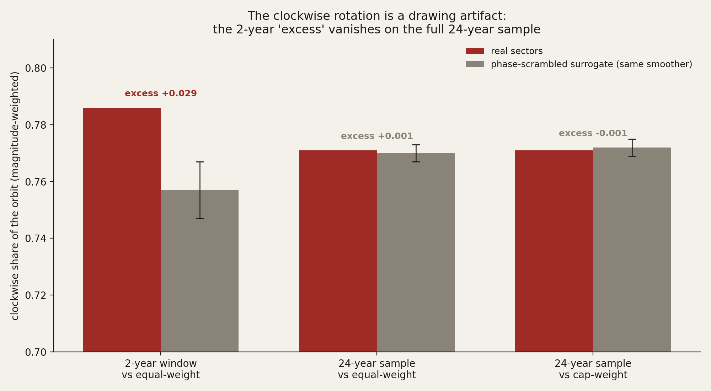
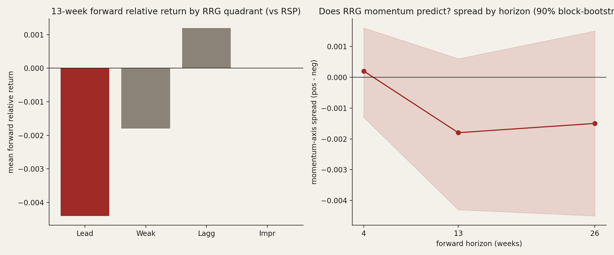
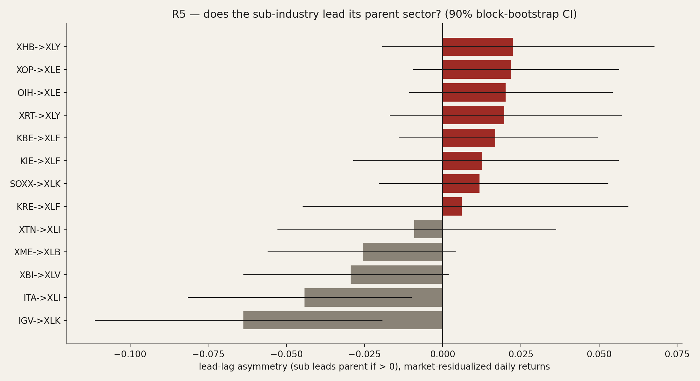
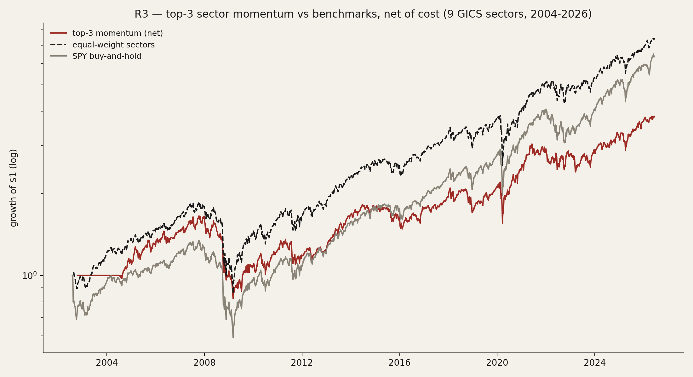

# 34 — Rotation mechanics: is the "rotation graph" real, and can you trade it?

Every trader has seen the picture: the Relative Rotation Graph, where sectors drift clockwise through four quadrants — Leading, Weakening, Lagging, Improving — and the advice writes itself: ride the ones in the top-right, dump the ones rolling into the bottom-left. I wanted to know whether that rotation is actually *there* in the prices, or whether it's a trick of the drawing. And if money really does move between sectors in an orderly way, can you trade it — at the headline-sector level, or down where the action supposedly starts first, in the sub-industries?

This is a sibling to [study 20](../20-sector-rotation/), which asked whether the cyclical-vs-defensive *switch* pays (it doesn't). Here I go after the specific tools people actually use — the rotation graph, the "semis lead tech" lead-lag, and cross-sectional momentum — and put each one through the test it usually skips.

## What I found

- **The clockwise rotation is mostly a drawing artifact.** Plot any smoothed line against its own rate-of-change and it orbits clockwise — a random walk does it too. On 24 years of data the real sectors rotate clockwise no more than a phase-scrambled fake pushed through the identical smoother (0.771 vs 0.770; p=0.37). An early two-year cut *did* show a small real excess — it evaporated when I used the full sample. Sample size, not signal.
- **The quadrant tells you nothing about tomorrow.** Which quadrant a sector sits in doesn't predict its next 1–6 months of relative return. If anything the "Leading" quadrant — the one you're told to buy — has the *worst* forward return (mild mean-reversion), though it's not significant.
- **Sub-industries don't reliably lead their parent sector.** The famous "semis lead tech" shows up with the right sign but fails the significance bar (p=0.23); across 13 pairs it's a coin flip, and a couple actually *lag*.
- **Momentum doesn't rescue it.** Buying the top-3 sectors by 6-month relative strength earns a lower Sharpe (0.43) than just holding the equal-weight basket (0.59) or the index (0.53); the long-short loses money. Going granular (sub-industries) *looks* better in-sample (0.66) — but the probability that win is overfit is 90%.
- **So the whole popular rotation toolkit is a null.** It's a useful *picture* of where things stand; it is not a clock you can set a trade by. The honest payoff is knowing that — and seeing why the present market's narrowness (the AI-capex concentration) is the real risk, which I come back to at the end.

> Research / backtested. No live capital, no audited track record. "Money flow" is read as **relative price strength** — the price footprint of demand — not literal fund creation/redemption, which isn't in the data.

## What I wondered, and how I'd know if it's real

The rotation story has a clean null and a clean alternative, so it's testable.

- **H0 (it's a drawing):** the clockwise orbit is a geometric by-product of how the graph is built — you'd see the same rotation in random data run through the same recipe — and a sector's quadrant carries no information about its future.
- **H1 (it's real flow):** sectors rotate clockwise *more* than a spectrum-matched random series, the quadrant predicts forward relative returns, the granular names lead the headline ones, and a simple ranking rule beats just holding the basket.
- **What would prove H1:** a clockwise rate above a same-recipe surrogate; a positive, significant forward return for the "momentum-up" quadrants; a significant sub-industry lead that survives the constituent overlap; and a momentum rule that beats buy-and-hold after costs and survives an overfitting test.

I lean on exactly two outside ideas, each one line, because they sharpen the test. First, the rotation graph is just a level (relative strength) plotted against its own change — and a level-vs-its-derivative plot orbits clockwise for *any* oscillating series, which is why the right null isn't "shuffle the returns" but "scramble the phases and run the identical smoother." Second, Hou's (2007) information-diffusion idea — big, watched names lead small, neglected ones — is what a real sub-industry lead would look like, and it tells me to measure the *asymmetry* of the lead, not the raw correlation (because the sub-industry sits *inside* its parent, so they co-move by construction).

## How I built it

**The picture (the rotation graph).** For each sector I take its price relative to a benchmark, smooth it into an "RS-Ratio" (how strong it is, centered at 100), and take the smoothed change of that into "RS-Momentum" (whether it's gaining or losing). High-high is Leading, high-falling is Weakening, low-low is Lagging, low-rising is Improving. This is the standard construction; I kept the same 12-week smoothing throughout so the null sees the exact same recipe.

**The benchmark choice matters.** I measure relative strength against the *equal-weight* market as the primary lens, not the cap-weight index, because one sector (technology) is now ~30% of the cap-weight index — so "tech is leading vs the index" is partly tech leading *itself*. Equal-weight is the typical-stock yardstick. (Same reasoning study 20 used.)

**The identification problem, named out loud.** Two traps sink most rotation analysis, and each finding below disarms one. (1) The clockwise orbit is mechanical, so I compare to a phase-randomized surrogate through the same smoother — not a naive shuffle. (2) A sub-industry like semis is *inside* its parent sector, so a raw "lead" is just inclusion; I strip the common market first, then test the lead *asymmetry*, which cancels the symmetric overlap. Every confidence interval is a moving-block bootstrap, because weekly relative returns are autocorrelated and overlap.

## The data

Everything is daily split-adjusted closing prices from a private price warehouse — no fundamentals, no holdings, prices only.

| Group | What | Count | Window |
|---|---|---|---|
| GICS sectors | the 11 sector funds (9 with clean history to 2002; real-estate and communications split out later, 2015/2018) | 11 | 2002–2026 (9-sector panel 2004+) |
| Sub-industries | semis, software, banks, regional banks, insurance, biotech, aerospace/defense, homebuilders, oil E&P, oil services, metals, retail, transports | 13 | 2002–2026 (most from 2006) |
| Equal-weight | the equal-weight market + nine equal-weight sector funds | 10 | 2003–2026 |
| Benchmarks | cap-weight index, equal-weight index, Nasdaq-100 | 3 | 1997–2026 |

36 funds, ~24 years. The headline tests run on the 9 sectors with the longest clean history (so the bear markets of 2008, 2011, 2018, 2020 and 2022 are all in the sample); the full 11 and the sub-industries come in for the granularity tests.

## Finding 1 — the clockwise rotation is a drawing artifact

- **What I expected & why.** If money really rotates, sectors should circle the graph clockwise *more* than chance. But I was suspicious from the start: RS-Momentum is just the *change* in RS-Ratio, so I'm plotting a line against its own slope, and that orbits clockwise for almost anything. The honest test is whether the *real* clockwise-ness beats a fake series with the same wiggle run through the same smoother.
- **How I measured it.** For each weekly step I take the cross-product of consecutive position vectors — its sign is the spin direction (negative = clockwise), its size downweights the noisy near-center points. I pool that across the 9 sectors, then build 500 surrogates by phase-randomizing each sector's relative-strength series (same power spectrum, scrambled timing) and pushing each through the identical 12-week smoother. The question: is the real clockwise share above the surrogate's?

```text
x, y          = RS_Ratio-100, RS_Momentum-100        # position in the graph
cross_t       = x[t-1]*y[t] - y[t-1]*x[t]            # <0 => clockwise step
clockwise     = sum(|cross| where cross<0) / sum(|cross|)   # magnitude-weighted
surrogate     = phase_randomize(rel_strength) -> same 12-wk smoother -> clockwise   # x500
```

- **What the data shows.** Over the full sample (1,142 weeks, 2004–2026) the real clockwise share is **0.771**; the surrogate averages **0.770 ± 0.003**. The excess is **+0.001** — nothing (z=0.38, p=0.37 vs equal-weight; −0.001 vs the cap-weight index). About 77% of the orbit is mechanically clockwise for *any* autocorrelated series, and real sectors add nothing on top.



- **The trap I nearly fell into.** An early two-year window (2024–2026) showed the real share at 0.786 vs a surrogate 0.757 — a +0.029 excess that *looked* real (p=0.01). It did not survive the full sample. That was one bull-market regime's worth of noise, and it's exactly the kind of small-sample mirage the surrogate is built to catch.
- **Verdict.** **Null.** The signature clockwise rotation is a property of the smoother, not of money flow.

## Finding 2 — the quadrant doesn't predict the future

- **What I expected & why.** Set aside the spin; maybe *where* a sector sits still helps. The playbook says buy Leading and Improving (the momentum-up half), avoid Weakening and Lagging. If that's real, the momentum-up quadrants should earn a positive forward relative return.
- **How I measured it.** For each sector-week I record its quadrant, then its actual relative return over the next 4, 13 and 26 weeks (sector return minus benchmark return). Pool, group by quadrant, and bootstrap the spread between the momentum-up and momentum-down halves with a block matched to the horizon.
- **What the data shows.** Flat at one month and faintly *negative* at one and two quarters — never significant. The momentum-axis spread is +0.0002 at 4 weeks (p=0.45), −0.0018 at 13 weeks (p=0.11), −0.0015 at 26 weeks (p=0.19). And the ordering is backwards: the **Leading** quadrant — the one you're told to ride — has the *worst* 13- and 26-week forward relative return (−0.44%, −0.74%); Lagging is the least bad. That's mild relative-strength mean-reversion, real in sign but not significant.



- **What I checked.** Same picture against the cap-weight index (all insignificant), so it isn't a benchmark choice.
- **Verdict.** **Null.** Position carries no usable forward signal; if anything the popular advice is mildly backwards.

## Finding 3 — sub-industries don't reliably lead their parent sector

- **What I expected & why.** This is the one I most wanted to be real: the idea that semis turn before tech, regional banks before financials, homebuilders before discretionary — so the granular name is an early warning for the sector. The snag is that semis are *inside* the tech fund, so they co-move by construction; a naive lead is just that overlap.
- **How I measured it.** Strip the common market from both (regress each on the index, keep the residual), then compute the lead *asymmetry*: how much the sub-industry today correlates with the parent tomorrow, minus the reverse. The symmetric overlap cancels in that difference; only a genuine lead survives. Block-bootstrap for significance, daily and weekly, across 13 pairs.

```text
e_sub = residual(sub_returns  on market)      # strip the common market
e_par = residual(par_returns  on market)
lead  = corr(e_sub[t], e_par[t+1]) - corr(e_par[t], e_sub[t+1])   # >0 => sub leads
```

- **What the data shows.** A coin flip. Pooled mean asymmetry ≈ 0; 8 of 13 pairs lean "sub leads" daily, 9 of 13 weekly, but almost none clear the bar. "Semis lead tech" (SOXX→XLK) is positive but insignificant (p=0.23 daily, 0.30 weekly). The only *significant* daily results point the wrong way — software and aerospace/defense slightly *lag* their parents. No consistent direction survives both daily and weekly.



- **What I checked.** The overlap proxy runs as high as 0.86–0.89 (oil services / E&P inside energy), which is exactly why I used the asymmetry rather than the raw correlation; even so, nothing robust appears.
- **Verdict.** **Null.** No dependable sub-industry lead, including the one everyone quotes.

## Finding 4 — momentum doesn't rescue it (and the one in-sample win is overfit)

- **What I expected & why.** Cross-sectional momentum is a genuinely separate, well-documented effect, so it deserved its own shot even after Findings 1–2. Rank the sectors by trailing 6-month relative strength (skipping the last month), hold the top 3, rebalance monthly, pay 20 bps a trade. Does it beat just holding the basket?
- **How I measured it.** The ranking rule above, net of cost, against two benchmarks (equal-weight sectors, buy-and-hold index), with the full honest-first battery: a perfect-foresight ceiling (rank by *future* return — the best you could ever do), a random-timing placebo (same trades, shuffled dates), a deflated Sharpe for the 9-config search, and a probability-of-overfitting test.

```text
signal = price[t-1mo] / price[t-7mo] - 1       # 6-mo momentum, 1-mo skip
hold   = top 3 of N, equal weight, rebalanced every 4 weeks, 20 bps/trade
test   = vs equal-weight & vs index; placebo (shuffle dates); PBO; deflated Sharpe
```

- **What the data shows.** At the sector level it *loses*: Sharpe 0.43 vs 0.59 for the equal-weight basket and 0.53 for the index; the long-short version actually loses money (−0.22); and the timing doesn't beat a random reshuffle of the same allocations (placebo p=0.14). Going granular to the 13 sub-industries *looks* better — Sharpe 0.66, beating both benchmarks and marginally the placebo (p=0.076), so the "granularity helps" hunch is directionally true. But the probability that win is overfit is **0.90**. The in-sample edge is config-selection luck, not a durable signal. (The high deflated Sharpe only certifies the return is positive versus zero; it says nothing about beating the index, and the overfitting test is what kills it.)



- **What I checked.** Perfect foresight could earn Sharpe 2.6–3.5 here, so the *opportunity* exists — you just can't capture it with a causal rule. That's the whole story of the study in one line.
- **Verdict.** **Null at the sector level; conditional-but-overfit at the sub-industry level.**

## Did I just find noise? (the checks, gathered)

The point of the design is that each finding is its own robustness test. The clockwise result is measured *against* a same-recipe random surrogate, not in a vacuum. The forward-return and lead-lag results carry block-bootstrap intervals that account for overlap. The momentum result is run net of cost, against two benchmarks, past a random-timing placebo, and through a formal overfitting test — and the one configuration that beat the benchmark is the one the overfitting test flags hardest. The early two-year clockwise "signal" that vanished on the full sample is the cleanest reminder of why none of this is taken at face value.

## The answer, in the data

**Is the rotation graph real?** No — the rotation is a drawing artifact, and the position carries no forward signal. **Do sub-industries lead their sectors?** No, not dependably. **Can you trade sector momentum?** No at the headline level; the granular version is an in-sample mirage. The popular sector-rotation toolkit is a useful picture and a poor signal.

| Test | What it claims | Verdict | The number |
|---|---|---|---|
| Clockwise rotation (R1) | money circles the graph | **Null** | excess +0.001 over surrogate, p=0.37 |
| Quadrant predicts (R2) | Leading/Improving outperform | **Null** | spread −0.0018 at 13w, p=0.11 |
| Sub-industry lead (R5) | granular leads headline | **Null** | semis→tech p=0.23; pooled ≈ 0 |
| Sector momentum (R3) | top-N beats buy-and-hold | **Null** | Sharpe 0.43 < 0.53 index |
| Sub-industry momentum (R4) | granularity rescues it | **Overfit** | Sharpe 0.66 but PBO 0.90 |

Five tests, one lesson: you can draw the rotation, but you can't set a clock by it.

## So what — where the real risk is

If you can't time the rotation, the question that matters for a portfolio is which way the tape is actually leaning — and right now that's a concentration story, not a rotation one. ([Study 33](../33-market-breadth/) measures that narrowness directly and finds it real but not a datable crash signal: fragility, not a timer.) The same prices say something the rotation graph can't: leadership is unusually narrow, and the narrowness is tied to one thing, the AI-data-center build-out.

Two facts frame it. The market's biggest names are roughly a third of the whole index — so "the market" is increasingly a bet on a handful of AI-exposed names. And those names are also carrying the economy: in the official national accounts, business investment in information-processing equipment and software has been most of recent *quarterly* GDP growth on a gross basis (an analyst tally put it near 74% in early 2026). That number is widely overstated — it's gross of the imported chips and servers that subtract from GDP, so the genuine *domestic* contribution is far smaller, roughly a quarter of it (on the order of 0.3 percentage points a quarter), and the headline only looks enormous because the rest of the economy was soft. In *level* terms this investment is about 1% of GDP, not the economy.

But the direction is not in doubt: growth, the index, and the consumer wealth effect have all been routed through the same narrow channel. So the fragility isn't whether sectors rotate on schedule — it's that the handful of names driving the index, the earnings, and the GDP print are the same names, financed increasingly off-balance-sheet. If that build-out slows, the unwind would rotate in a very particular order — semis first, then power and electrical equipment, then networking, cooling and data-center landlords, then the broad industrials, with the hyperscalers as the hinge. That ordered, concentration-driven move is the rotation worth watching, and it's the subject of [study 27](../27-ai-capital-cycle/) (the capital cycle) and study 31 (the commoditisation shock). This study's contribution is the clean negative that clears the ground: the *generic* rotation tools won't see it coming, because they don't carry signal in the first place.

## Caveats

- **Prices, not flows.** "Money flow" here is relative price strength, not fund creation/redemption. The direction of any bias is unknown but the same convention study 20 uses.
- **No holdings to purge.** The sub-industry lead-lag uses the asymmetry trick to cancel the symmetric overlap, but without constituent weights I can't fully remove it; residual contamination would, if anything, *inflate* an apparent lead — and I still found none, so the null is on the safe side.
- **The full 11-sector panel is short.** Real-estate and communications funds only date to 2015 and 2018, so the longest tests use the 9 original sectors; the 11-sector results are a post-2018 extension and noted as such.
- **The GDP figures are public national-accounts data**, reproduced with their own caveats (gross vs net of imports, the denominator effect when growth is near zero); they frame the closing risk, they are not this study's tested result.

## Reproducibility

The rotation graph and its null, in the form that produced Finding 1:

```python
rs        = 100 * sector_close / benchmark_close
rs_ratio  = 100 + 3 * zscore(rs, window=12)          # weekly, ~one quarter
rs_mom    = 100 + 3 * zscore(rs_ratio.diff(), 12)
# quadrant = sign(rs_ratio-100), sign(rs_mom-100)
# null: phase-randomize log(rs).diff(), rebuild rs, SAME 12-wk smoother, recompute clockwise
```

Universe, windows, the full chapter code (kill-test, forward-value, lead-lag, momentum with deflated-Sharpe/PBO), and the data behind every figure are in the study notebook. Every confidence interval is a moving-block bootstrap; the momentum backtest charges 20 bps per rebalance and is benchmarked against a random-timing placebo.

## References & forward pointer

Builds on [study 20](../20-sector-rotation/) (the cyclical/defensive switch and the size cut) and [study 16](../16-narrow-leadership-and-the-index/) and [study 33](../33-market-breadth/) (breadth as a timing signal, both nulls). The closing risk connects to [study 27](../27-ai-capital-cycle/) (the AI capital cycle) and study 31 (the China-commoditisation shock). Outside ideas used, one line each: the relative-rotation-graph construction (de Kempenaer); industry information-diffusion lead-lag (Hou, 2007); the perfect-foresight ceiling and cost/timing-error discipline (Stangl et al., 2009; Molchanov & Stangl, 2024); the deflated Sharpe and probability of backtest overfitting (Bailey & López de Prado, 2014).
