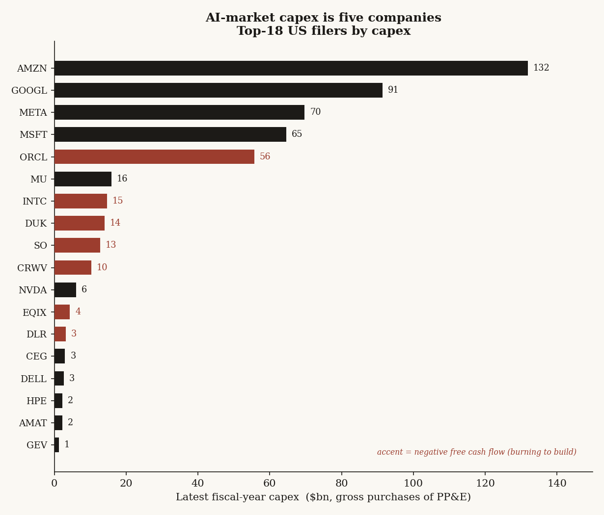
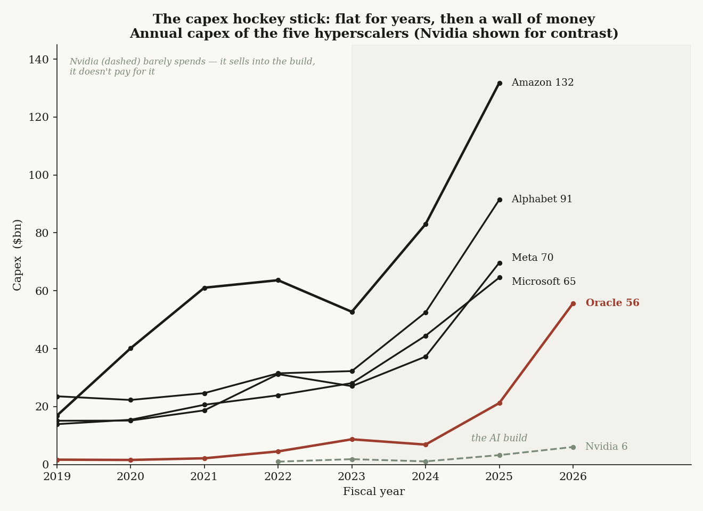
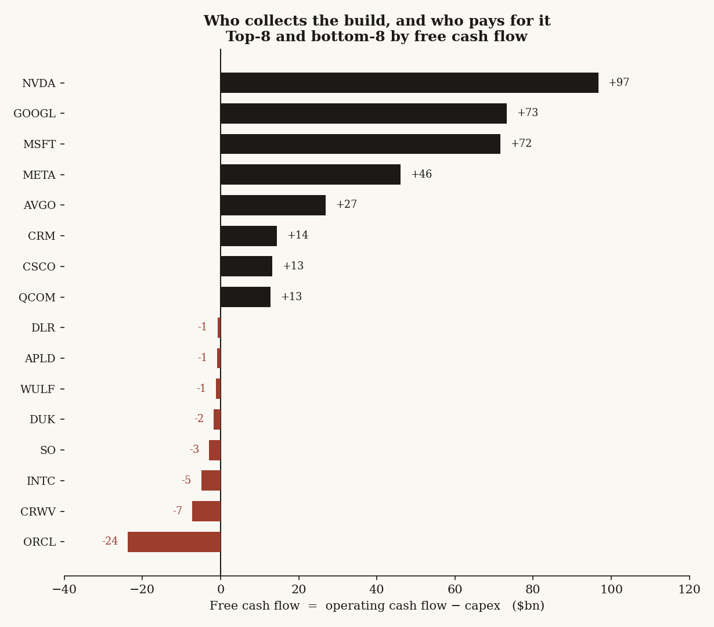
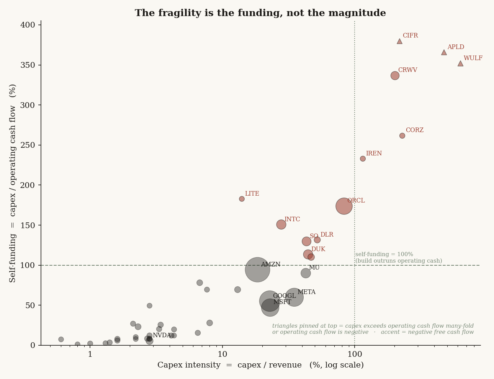
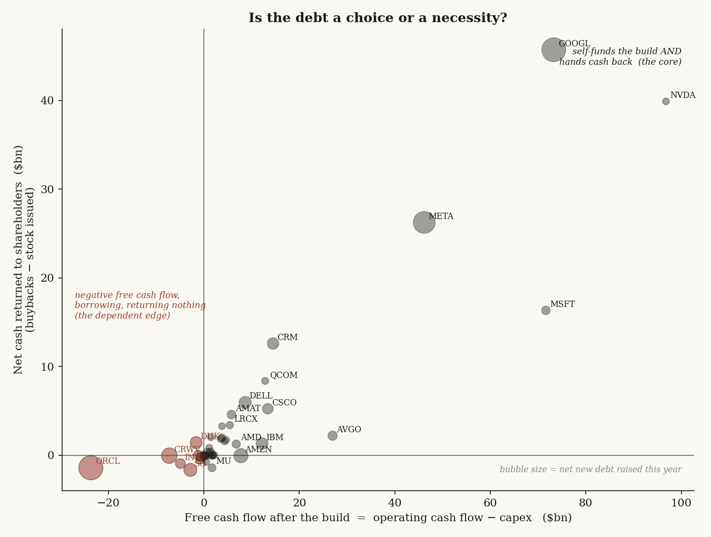
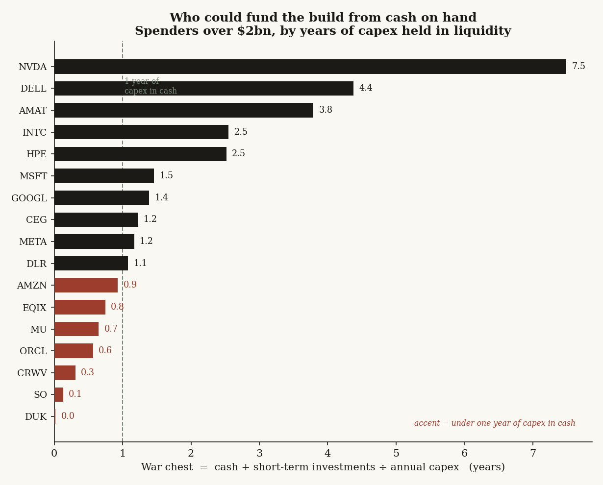
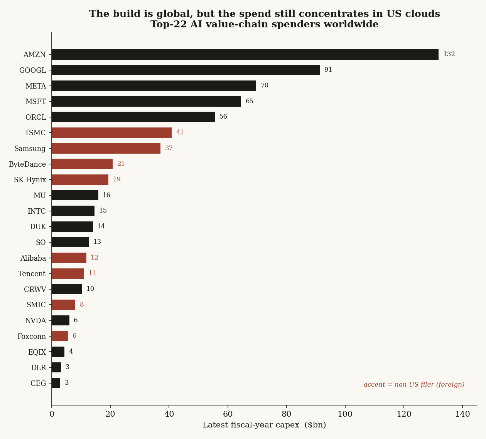
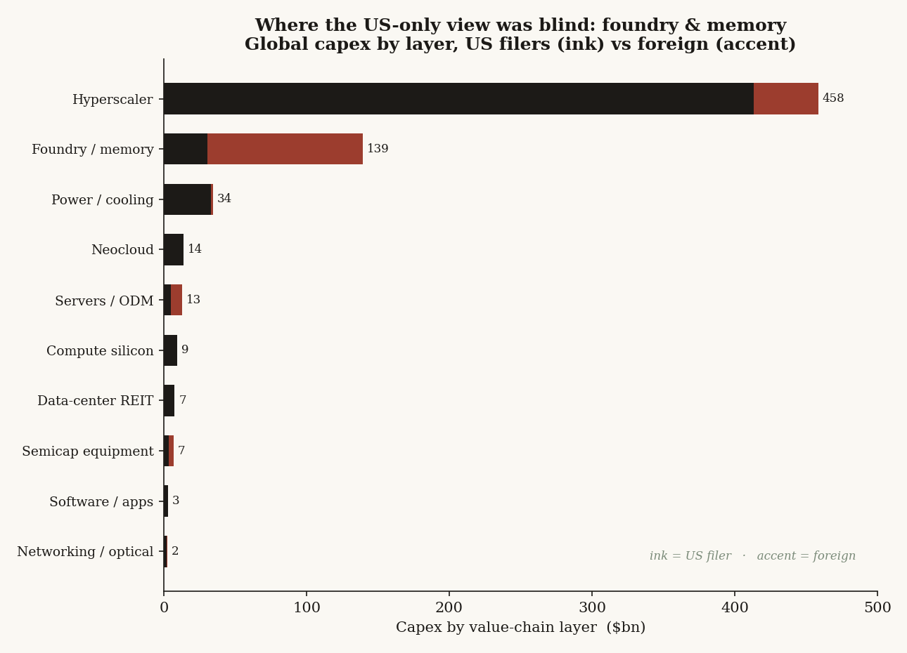
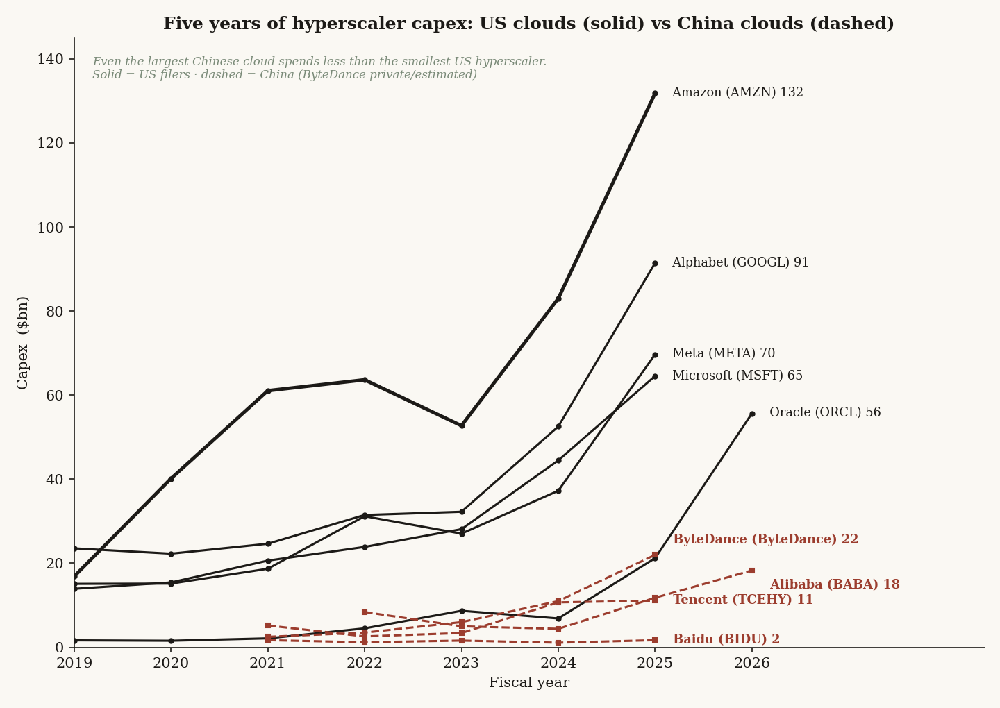
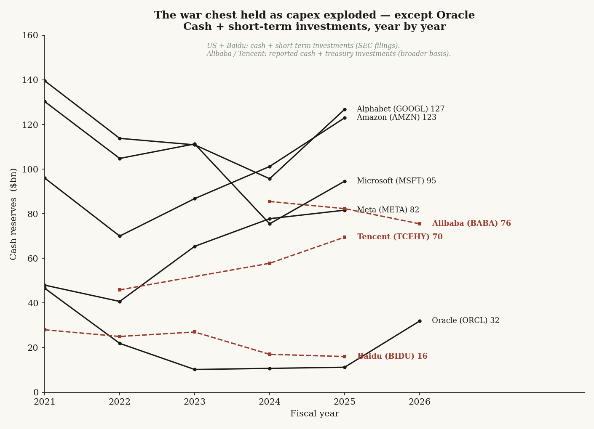

# 35 — AI capex by company: who is actually paying for the build, and how exposed are they?

**The question.** Everyone says "the AI capital cycle." But a cycle made of *whom*? I wanted the real number, company by company: who is spending the capex, how fast it is growing, and — the part that actually decides who survives a downturn — whether each company is paying for the build out of its own cash or out of someone else's balance sheet.

**Why it matters.** If the AI buildout is a broad boom shared across the whole value chain, a wobble is survivable — lots of shoulders carry it. If instead the spend is a handful of names, and the people most stretched to fund it are a small debt-financed edge, then the risk is concentrated and nameable. You can watch it. That changes how you'd hedge an AI-exposed book.

## Summary of results

- Across **45 US-listed companies** spanning the whole AI value chain, latest-fiscal-year capex totals **about $520bn**. It is not a broad boom. The **top five names are 79% of it**; Amazon alone is a quarter.
- The five are the hyperscalers — **Amazon $132bn, Alphabet $91bn, Meta $70bn, Microsoft $65bn, Oracle $56bn**. Their combined capex grew **+73% in one year**, from $238bn to $413bn.
- Everyone else barely spends. Fabless silicon (Nvidia, Broadcom, AMD) and software (Palantir, Salesforce) run capex **under 3% of revenue** and throw off huge free cash flow. They *monetize* the build; they don't pay for it.
- The fragility is not the size of the spend — it is **how it's funded**. The cash-rich core self-funds (Microsoft, Alphabet, Meta, Nvidia all print double-digit-billions of free cash flow even after the build). The danger sits in a small edge that spends **more than its entire operating cash flow**: Oracle (−$24bn free cash flow), CoreWeave (capex 3.4× operating cash), and the neoclouds (capex 2–6× revenue, several with negative operating cash flow).
- **Following the cash (the deeper cut): in aggregate the build pays for itself.** The 45 names generated **$910bn of operating cash against $520bn of capex — a $390bn surplus** — and still returned **$182bn to shareholders**. Even the five biggest spenders self-fund (hyperscaler operating cash $588bn vs $413bn capex). "AI is a credit bubble" fails at the aggregate.
- **The debt is a choice for the core, a necessity for the edge.** Alphabet added **$37bn of net new debt — the same as Oracle** — but Alphabet also returned $46bn to shareholders and earned +$73bn free cash flow, while Oracle returned nothing and burned −$24bn. The tell that separates them: returning cash while building. Just **7 of 45 are debt-funded** (Oracle, three neoclouds, a data-center REIT, and two regulated utilities); strip the utilities and the AI-build set is five names, only one of them a mega-cap. The war chest agrees: Nvidia holds 7.5 years of capex in cash, the core 1–1.5, Oracle 0.6, CoreWeave 0.3.
- **Going global (16 foreign giants added): the true total is ~$687bn across 61 companies** ($520bn US, $167bn foreign). Concentration softens exactly as the first cut predicted — the top-five US clouds fall from 79% of the US table to **60% of the global total** — but they still lead: only TSMC ($41bn) and Samsung ($37bn) crack the top tier, and the whole Chinese cloud sector (Alibaba+Tencent+Baidu+ByteDance ≈ $45bn) is **out-spent by the US hyperscalers ~9 to 1.** The one thing the US-only view badly missed: **foundry & memory is the real #2 layer at $139bn and 78% offshore** — the chips are made where the US filings can't see.
- **Five-year funding history + the credit angle:** across FY2021–25 the US hyperscalers' cash reserves *held or grew* even as capex went vertical — they funded the build from a rising tide of operating cash and **never issued equity; they bought stock back.** The financing instrument is a credit signal: investment-grade names (every US + China hyperscaler) borrow cheap on their own name, while the junk-rated/unrated edge (CoreWeave, the miners, Nebius, IREN) must pledge GPUs for high-coupon secured debt or sell equity. **Equity issuance in this build is the distress tell, not strength.** Oracle is the canary — buybacks cut to zero, cash drained, $37bn of new debt, one downgrade (BBB) from junk.
- **Verdict: conditional.** "AI capex" as a market-wide phenomenon is a myth — it is a handful of US clouds plus the Asian fabs that supply them, and in aggregate the spenders pay for it out of cash with a surplus. The systemic risk is narrow and nameable: Oracle and the neoclouds, the AI-build names funding with outside money (debt for Oracle and CoreWeave, equity raises for the smaller neoclouds) while burning cash, on the thinnest cushions.

This builds on study [27 — the AI capital cycle](../27-ai-capital-cycle/) (which priced the *blast radius* of a capex cut) and study [30 — LLM players forecast](../30-llm-players-forecast/) (which mapped the break-order). Here I do the thing under both: put a real, sourced capex number on every company and ask who can pay for what they started.

## What I expected, and how I'd know if I was wrong

The loose consensus you hear is that "the whole AI supply chain is spending hand over fist." My prior was the opposite, and sharper:

- **H0 (the thing I'm testing against):** capex is spread reasonably across the value chain — many layers, many names, each carrying a meaningful slice. A broad, shared boom.
- **H1 (what I expected to find):** capex is brutally concentrated in the demand layer (the hyperscalers), the rest of the chain spends little and instead *collects* the spend as revenue, and the real stress is a small set of names funding the build with debt and equity rather than cash.

What would have proven me wrong: if no single layer held more than ~40% of capex, if the top five names were under half the total, or if the self-funding picture were uniformly stretched (everyone burning cash, not just a fringe). Any of those would say "broad fragile boom" and kill H1. Let's see what the filings say.

## How I checked it

Capex has no "AI" label in any filing, so I went to the one place every US company has to report the cash it spent on plant and equipment: **SEC EDGAR**, the XBRL company-facts API. For each company I pulled three lines straight from the audited cash-flow and income statements:

- **capex** — cash paid for property, plant and equipment (`PaymentsToAcquirePropertyPlantAndEquipment` and its tag siblings; some firms tag it `PaymentsToAcquireProductiveAssets`, a REIT tags it `PaymentsToDevelopRealEstateAssets`).
- **revenue** — total net revenue.
- **operating cash flow** — net cash from operating activities.

From those three I built the only three lenses that matter:

| lens | formula | what it tells you |
|---|---|---|
| **magnitude** | capex, and capex YoY | how big the spend is, and how fast it's ramping |
| **intensity** | capex / revenue | how capex-heavy the business model is |
| **self-funding** | capex / operating cash flow | >100% means the build outruns the cash the business throws off — it's funded by the balance sheet |
| **free cash flow** | operating cash flow − capex | negative = burning cash to build |

**One method choice worth explaining.** I used each company's latest *full fiscal year*, not a trailing-twelve-month figure. Cash-flow-statement items in a 10-Q are reported year-to-date (cumulative within the fiscal year), so naively summing quarters double-counts. The annual 10-K number is clean and audited. The cost is that fiscal years end on different dates (Microsoft June, Nvidia January, Oracle May, most others December), so this is a snapshot of "each company's most recent complete year," not a single calendar instant. For a spend that's ramping this fast, I'd rather have clean audited numbers than a fragile same-date splice.

## The data

**Universe — 45 US-listed filers across ten value-chain layers**, chosen to span the chain end to end rather than cherry-pick the famous names: the demand layer (hyperscalers), the GPU-cloud "neoclouds," compute silicon, foundry/memory, semicap equipment, networking/optical, servers/ODM, data-center REITs, power/cooling, and software. Every name is a US filer with capex in standard us-gaap tags. Foreign capex giants (TSMC, Samsung, SK Hynix, Alibaba, Tencent, Nebius) are **out of scope** — they don't file capex in us-gaap XBRL — which means the real global AI capex number is materially larger than my $520bn (the 16 biggest are added in "Going global" below). One US name, NextEra (NEE), files capex under a custom non-standard tag and is excluded rather than guessed at.

- Source: SEC EDGAR XBRL `companyconcept` / `companyfacts`. Range: latest reported fiscal year (FY2025 for most; FY2026 for May/January year-ends already filed). Transform: none — values are as-reported, in USD.
- Capex is **gross** purchases of PP&E (the cash outflow line). A few firms, Amazon most notably, report proceeds/incentives on a separate line, so their *net* capex is a little lower than the gross figure here. I use gross because it's the consistent, comparable line across all 45 names.
- For the funding side (Findings 4–6) I pull, from the same filings: cash & equivalents, short-term investments, total debt (long-term plus current portion), and the financing-statement flows for buybacks and stock issuance. Net new borrowing is measured as the **year-over-year change in the total-debt stock**, not the issuance/repayment cash-flow lines — those are inflated by commercial-paper that's issued and repaid many times a year (Alphabet's gross issuance line reads $65bn against a $37bn actual rise in its debt). Tags vary far more here than for capex, so each concept uses a fallback list; anything that won't resolve cleanly is left blank, never guessed.

Raw pulls: [`data/capex_raw.csv`](data/capex_raw.csv), [`data/funding_raw.csv`](data/funding_raw.csv) · computed tables: [`data/capex_table.csv`](data/capex_table.csv), [`data/funding_table.csv`](data/funding_table.csv) · pull + build code: [`src/`](src/).

## What the data looks like first

Before any analysis, just rank the 45 names by capex and look.



The shape is the finding. Five bars, then a cliff. The sixth-largest spender (Micron, $16bn) is less than a third of the smallest hyperscaler. This is not a boom with broad participation — it's an oligopoly of spenders with a long tail of much smaller ones. Now let's earn each piece of that.

## Finding 1 — AI-market capex is five companies

**What I expected & why.** H1 said the demand layer would dominate, because the hyperscalers are the ones building the data centers everyone else sells into. I expected concentration, but I wanted to measure exactly how much.

**How I measured it.** Sum capex across all 45, then look at the top-five share and the layer rollup.

```python
total = sum(r.capex for r in companies)            # $520bn
top5  = sum(sorted(capex, reverse=True)[:5])       # $413bn
top5_share = top5 / total                          # 0.79
# layer rollup: groupby(layer).capex.sum()
```

**What the data shows.**

| layer | capex ($bn) | names | share |
|---|---:|---:|---:|
| Hyperscaler | 413.2 | 5 | 79.5% |
| Power / cooling | 32.8 | 8 | 6.3% |
| Foundry / memory | 30.5 | 2 | 5.9% |
| Neocloud | 13.8 | 6 | 2.7% |
| Compute silicon | 9.2 | 5 | 1.8% |
| Data-center REIT | 7.5 | 2 | 1.4% |
| Servers / ODM | 5.0 | 3 | 1.0% |
| Semicap equipment | 3.4 | 4 | 0.7% |
| Software / apps | 2.7 | 5 | 0.5% |
| Networking / optical | 1.8 | 5 | 0.3% |

One layer is four-fifths of the spend. The capex concentration index (Herfindahl on company shares) is about **1,440** — squarely in "concentrated" territory for what's supposed to be a whole-sector boom. And the five aren't coasting: combined hyperscaler capex went from **$238bn to $413bn in a single year, +73%**, led by Oracle (+162%), Meta (+87%) and Alphabet (+74%).

The year-by-year ramp is the clearest single picture in the study — a decade of gently rising spend, then a wall of money from 2024:



The shape is a hockey stick. Amazon roughly doubled in two years (FY2023 $53bn to FY2025 $132bn); Oracle's line (accent) barely moved for years and then went near-vertical into FY2026. The flat dashed line along the bottom is Nvidia: even in its own fiscal 2026 it spent about $6bn — it sells the shovels, it doesn't dig.

**Why (mechanism).** This is what a demand-pull buildout looks like. The hyperscalers own the end demand (cloud, ads, AI services), so they're the ones writing checks for land, buildings, power and GPUs. Everyone upstream gets paid *by* those checks — they don't have to write their own.

**What I checked.** Could the concentration be an artifact of my universe — did I just include too many tiny names downstream? No: even if I drop the entire tail and keep only the 17 names spending over $2bn, the top five are still 82% of *that* subset. The cliff is real, not a denominator trick.

**Verdict: confirmed.** Capex is five companies. H0 (a broad, shared boom) is rejected on its face.

## Finding 2 — everyone else doesn't pay for the build; they cash it

**What I expected & why.** If the hyperscalers are the spenders, the upstream chain should show the mirror image: low capex relative to revenue, and fat free cash flow. The fabless chip designers and the software firms in particular should be near-zero-capex businesses that simply sell into the build.

**How I measured it.** Capex intensity (capex/revenue) per name, and free cash flow (operating cash flow − capex).

```python
intensity = capex / revenue
fcf       = operating_cash_flow - capex
```

**What the data shows.**



The split is stark. **Nvidia spends $6bn of capex on $216bn of revenue — 2.8% intensity — and throws off $97bn of free cash flow.** Broadcom: 1.0% intensity, +$27bn. The software names are even lighter: Palantir 0.8%, Salesforce 1.4%, ServiceNow 6.5%. These businesses are *asset-light by design* — they sell the picks and shovels, or the seats, and let the hyperscalers carry the steel and silicon on their balance sheets.

Put the two findings together and the structure of the whole market falls out: a handful of hyperscalers pay, and the chain above them collects. The top of the free-cash-flow table (Nvidia +$97bn, Alphabet +$73bn, Microsoft +$72bn) and the bottom (Oracle −$24bn, CoreWeave −$7bn) are *the same buildout* seen from the two ends.

**Why (mechanism).** Capex intensity is a fingerprint of where you sit in the chain. Own the fabs or the data centers and you spend 25–80% of revenue on plant. Design the chip and outsource the fab, or sell software, and you spend almost nothing. The AI build is enormous, but for most of the value chain it shows up as *demand*, not as *spend*.

**What I checked.** Is the fat free cash flow just because these firms are bigger? No — intensity is a ratio, size-neutral, and it still separates cleanly: fabless and software cluster under 5%, foundry/REIT/utility cluster 25–55%, hyperscalers in between at 18–35%. The layer, not the size, predicts the intensity.

**Verdict: confirmed.** The value chain monetizes the build; it does not fund it. Which raises the real question — among the ones who *do* fund it, who can actually afford it?

## Finding 3 — the fragility is the funding, not the magnitude

**What I expected & why.** This is the one that matters for risk. A $130bn capex bill is not dangerous if you generate $140bn of operating cash. It's very dangerous if you generate $32bn and are spending $56bn. So I expected the hyperscaler *core* to be safe (self-funded) and a specific *edge* to be exposed (spending past its cash).

**How I measured it.** Self-funding ratio = capex / operating cash flow. Above 100% means the build is bigger than all the cash the business produced that year — the gap has to come from the balance sheet (cash reserves, new debt, or new equity).

```python
self_funding = capex / operating_cash_flow      # >1.0  ->  build outruns internal cash
burning      = (operating_cash_flow - capex) < 0 # negative free cash flow
```

**What the data shows.**



The chart sorts the whole market into two worlds along the dashed 100% line.

- **Below the line — the self-funded core.** Microsoft (47%), Alphabet (56%), Meta (60%), Nvidia (6%). Even Amazon, the biggest spender, lands right at 95% — its $132bn build is almost entirely covered by its $140bn of operating cash, leaving a thin but *positive* $8bn of free cash flow. These names could keep building through a downturn out of their own pockets.
- **Above the line — the funded-by-someone-else edge.** Oracle spends 174% of its operating cash flow, posting **−$24bn of free cash flow** — the one mega-cap genuinely funding its AI build with debt. The neoclouds are further out: CoreWeave at 337% (capex 3.4× operating cash), and CIFR, APLD, WULF actually run *negative* operating cash flow while spending billions — their capex is funded entirely by raising money. Their intensity runs 200–600% of revenue.

The capex-heavy utilities (Southern, Duke) and Intel also sit above the line, but that's the normal life of a regulated utility or a turnaround fab, not an AI-specific fragility — I separate them out in the rivals section.

**Why (mechanism).** Self-funding is solvency-through-a-cycle in one number. When financing stays cheap and available, spending past your cash flow is fine — you just roll it. The moment lenders re-underwrite (tighter terms on GPU collateral, wider credit spreads), the names above the line are the ones who can't simply slow down and coast on internal cash. They have to *refinance to keep building*. That is exactly the "financing-refusal trigger" study 27 and study 30 identified as the thing that fires first — and here it has names and numbers: Oracle, CoreWeave, the neoclouds.

**What I checked.** I'll do that next, because the obvious objection is that some of these high-self-funding names are perfectly safe.

**Verdict: confirmed, and it's the load-bearing finding.** The risk in the AI build is not the $520bn. It's the slice of it being funded on credit — a thin, identifiable edge, plus one mega-cap (Oracle).

## Digging deeper: how is the build actually funded?

Finding 3 said the danger is the funding, not the magnitude. That's a claim about *sources of cash*, so I went and pulled them: each company's cash war-chest, its total debt and how much that debt changed in the year, and how much stock it bought back or issued. Three more findings come out, and they sharpen the verdict in a direction I did not expect.

## Finding 4 — step back, and the whole thing pays for itself

**What I expected & why.** The bear case is "AI is a credit bubble": capex outruns cash, so the build is floated on debt. If that's true at the level of the whole AI market, the 45 companies together should be cash-negative.

**How I measured it.** Sum operating cash flow and capex across all 45, and add up the year's net new debt and net cash returned to shareholders.

```python
total_ocf   = sum(c.operating_cash_flow for c in companies)   # $910bn
total_capex = sum(c.capex for c in companies)                  # $520bn
aggregate_fcf = total_ocf - total_capex                        # +$390bn
net_new_debt  = sum(c.total_debt - c.total_debt_prior)         # +$176bn
returned      = sum(c.buybacks - c.stock_issued)               # +$182bn
```

**What the data shows.** The 45 names generated **$910bn of operating cash against $520bn of capex — a $390bn surplus** — and still handed **$182bn back to shareholders**, while adding $176bn of net new debt (the debt and the buybacks roughly cancel). Even if you keep only the five biggest spenders, the hyperscalers alone produced **$588bn of operating cash against $413bn of capex, a $175bn surplus.** The build is not floated on debt in aggregate; it is funded out of the largest corporate cash engines that have ever existed, with money left over.

**Why (mechanism).** Capex is enormous in dollars but modest against the cash these businesses throw off. Microsoft and Alphabet each generate ~$140–165bn of operating cash a year; a $65–91bn build is large but leaves a surplus. The dollars are scary in isolation and unremarkable next to the cash flow behind them.

**What I checked.** Nvidia's +$97bn of free cash flow flatters the aggregate — it collects the build rather than paying for it (Finding 2). Fair. So I stripped it out: the remaining 44 still self-fund, and the five hyperscalers self-fund on their own. The surplus is not a one-name artifact.

**Verdict: confirmed — the "AI is a credit bubble" framing fails at the aggregate.** The risk is not that the sector can't pay; it's that a small part of it pays differently. Which is the next finding.

## Finding 5 — the debt is a choice for the core, a necessity for the edge

**What I expected & why.** Borrowing by itself says nothing — a company can borrow because it must, or because debt is cheap and buying back stock with it is efficient. To tell them apart you need one more fact: is the company *also returning cash to shareholders* while it builds? If yes, the debt is optimization. If it's borrowing while burning cash and returning nothing, the debt is necessity.

**How I measured it.** For each company: net new borrowing (the year's change in total debt), net cash returned (buybacks minus stock issued), and free cash flow. Then plot return-to-shareholders against free cash flow, sizing each by how much debt it added.

```python
net_borrow = total_debt - total_debt_prior      # YoY change in the debt stock
net_return = buybacks - stock_issued            # >0 = handing cash back
# the tell: returning cash to holders WHILE building => debt is a choice
```

**What the data shows.**



The single most revealing number in the whole study: **Alphabet added $37bn of net new debt this year — exactly as much as Oracle did.** But Alphabet also generated +$73bn of free cash flow and handed +$46bn back to shareholders in buybacks. Oracle generated **−$24bn of free cash flow, returned nothing, and is funding the gap with the borrowing.** Same $37bn of debt; opposite meaning. Meta is Alphabet's twin (+$30bn debt, +$26bn returned, +$46bn FCF). Microsoft actually *paid down* debt and returned $16bn. The core borrows the way a homeowner with full pockets takes a cheap mortgage; Oracle borrows the way someone covers a shortfall.

Across all 45, the funding split is lopsided toward health: **32 of 45 self-fund the build** (21 of them while also returning cash). Only **seven are debt-funded** — Oracle, three neoclouds (CoreWeave, TeraWulf, Cipher), a data-center REIT (Digital Realty), and two regulated utilities (Duke, Southern) — and one more, Intel, is raising equity. Strip the two utilities (whose debt-funded capex programs are normal and AI-incidental) and the AI-build debt-funded set is five names: Oracle plus four small ones. Among the five hyperscalers, four self-fund and **Oracle stands completely alone** as the one paying for its build with outside money.

**Why (mechanism).** Issuing cheap investment-grade debt and using it to buy back stock is textbook balance-sheet optimization for a company swimming in cash — it lowers the cost of capital without touching the build. Oracle and the neoclouds aren't optimizing; their operating cash can't cover the capex, so the debt closes a real gap. The behavior looks superficially similar (both "borrowed billions") and is economically opposite.

**What I checked.** The two utilities (Duke, Southern) land in the debt-funded bucket, but that's how regulated utilities always operate — they fund rate-based investment with debt recovered through tariffs, AI or no AI. Stripping them out leaves Oracle and the neoclouds as the only AI-build names funding with debt, which is exactly the set Finding 3 flagged on self-funding ratio. Two independent lenses (capex/operating-cash, and the change in the debt stock) point at the same names.

**Verdict: confirmed, and it reframes the risk.** Net borrowing is not the danger signal. Net borrowing *with negative free cash flow and nothing returned to shareholders* is — and that test isolates Oracle and the neoclouds from a core that is borrowing by choice.

### The capital-strategy table — type, amount, and use, name by name

The quadrant in one table: for each major spender, the funding *type*, the *amounts* (the build, the net new debt raised, the cash handed back), and what the capital is actually *doing*. All figures latest fiscal year, $bn, from the same EDGAR pull.

| Company | Funding type | Capex | Net new debt | Cash returned | Use — what the capital is doing |
|---|---|--:|--:|--:|---|
| Amazon (AMZN) | Self-funds (thin) | 132 | +11 | 0 | Build covered by $140bn operating cash (FCF +$8bn); small debt top-up; no buyback |
| Alphabet (GOOGL) | Self-funds + optimizes | 91 | +37 | +46 | +$73bn FCF; raised cheap debt *and* bought back $46bn — balance-sheet optimization, not need |
| Meta (META) | Self-funds + optimizes | 70 | +30 | +26 | Same play: borrow cheap, buy back $26bn, fund the build from FCF |
| Microsoft (MSFT) | Self-funds + returns | 65 | −2 | +16 | From $136bn operating cash; paid debt down; returned $16bn |
| Oracle (ORCL) | Debt-funded | 56 | +37 | −1 | Operating cash covers under two-thirds of the build; +$37bn debt funds the gap; −$24bn FCF; returns nothing |
| Micron (MU) | Self-funds | 16 | +1 | −1 | Funded from operating cash; roughly flat debt (cyclical memory) |
| Intel (INTC) | Equity / strategic | 15 | −3 | −1 | −$5bn FCF; leans on equity issuance + outside strategic funding; actually paid debt down |
| Duke (DUK) | Debt-funded (utility) | 14 | +7 | +1 | Regulated-utility capex funded with debt recovered through tariffs — AI-incidental, not fragility |
| Southern (SO) | Debt-funded (utility) | 13 | +8 | −2 | Same regulated-utility model as Duke |
| CoreWeave (CRWV) | Debt-funded | 10 | +13 | 0 | Capex 3.4× operating cash; debt tripled to $21bn; −$7bn FCF; must keep raising to build |
| Nvidia (NVDA) | Self-funds + returns | 6 | 0 | +40 | Spends almost nothing; +$97bn FCF; returned $40bn — it *collects* the build |
| Dell (DELL) | Self-funds + returns | 3 | +7 | +6 | FCF-positive; funds from cash, adds debt, returns cash |
| Digital Realty (DLR) | Debt-funded (REIT) | 3 | +2 | 0 | Data-center REIT; debt-funded development (the normal REIT model) |
| Neoclouds (WULF, CIFR, APLD, IREN) | Debt + equity raises | ~1 each | + | 0 | Negative operating cash; fund the build *entirely* by raising debt and equity |

Read down the "use" column and the split is plain: the top of the table funds the build out of its own cash and even hands money back; only Oracle, the neoclouds and (structurally) the utilities reach outside for the money.

## Finding 6 — the war chest: who could keep building if financing stopped tomorrow

**What I expected & why.** The thing that decides who survives a financing freeze is how long they can keep building from cash already in the bank. So I measured each company's liquidity (cash plus short-term investments) against its annual capex — years of capex sitting in reserve.

**How I measured it.**

```python
runway_years = (cash + short_term_investments) / annual_capex
```

**What the data shows.**



Nvidia holds **7.5 years** of its (small) capex in cash. The cash-funded core holds one to one-and-a-half years (Microsoft 1.5, Alphabet 1.4, Meta 1.2) — enough to keep building straight through a frozen market. Then the line drops: Amazon 0.9, Oracle **0.6**, CoreWeave **0.3**. The names that depend on financing are exactly the ones with the least cash to fall back on if it disappears.

**Why (mechanism).** The war chest is optionality. A core name can shrug off a year of closed credit markets and keep spending from reserves; Oracle and the neoclouds would have to slow the build or raise on whatever terms are offered. The cushion and the funding source line up: the self-funders also hold the most cash, the debt-funders the least.

**What I checked.** The two utilities sit at the very bottom (Southern 0.1, Duke 0.0), but utilities deliberately hold almost no cash — they run a continuous debt-funded capital program, so a thin war chest is normal there, not a warning. Same carve-out as Finding 5.

**Verdict: confirmed.** The runway maps cleanly onto the core/edge split: the companies most dependent on outside financing are the ones with the least cash to survive without it.

## Going global: what the US-only table couldn't see

Everything above is US filers, because that's what EDGAR gives you cleanly. But the biggest single AI-capex node on earth — TSMC — files in Taipei, not Washington, and so do Samsung, SK Hynix, Alibaba and the rest of the Asian build. The honest caveat in the first cut was that my $520bn is the US slice, not the world. So I went and got the rest.

**A word on the data, because this part is less clean.** The foreign figures don't come from one uniform pull — each is from that company's own audited filing or earnings release, in its own currency (TWD, KRW, RMB, JPY, EUR), converted to USD at a stated rate. To keep myself honest I ran every figure through two independent checks: one re-sourcing the number from a second outlet, one re-doing the currency conversion and judging AI-relevance. That caught real errors before they landed — a first pass had mislabelled Tokyo Electron's capex (it had picked up Kioxia's yen figure by mistake; the verifier caught the duplicate and corrected it to ¥216bn / $1.4bn), and flagged that Samsung's headline ₩47.5tn is the semiconductor division, not the ₩52.7tn company total. Each foreign figure carries its source, currency, FX basis and a confidence flag in [`data/foreign_capex.csv`](data/foreign_capex.csv). Treat this tier as well-sourced but not as homogeneous as the EDGAR core. Every figure is total-company capex, same basis as the US names.

## Finding 7 — add the world, and concentration softens but the US clouds still lead

**What I expected & why.** The first cut warned that the 79% top-five share was an overstatement of *US* concentration and would fall once the foreign foundries and clouds were added. I expected it to soften — the open question was by how much.

**How I measured it.** Sixteen foreign AI value-chain spenders, latest fiscal year, USD-converted and verified, merged with the 45 US filers into one global table.

```python
global_total = us_total + foreign_total          # 520 + 167 = 687
top5_share   = sum(global_sorted[:5]) / global_total   # the five US hyperscalers
```

**What the data shows.**



The true global figure is **about $687bn across 61 companies** — $520bn US, **$167bn foreign**. Adding the world does soften the concentration: the top five (still the five US hyperscalers) fall from 79% of the US table to **60% of the global total.** But "softer" is not "broad." TSMC ($41bn) and Samsung ($37bn) are the only non-US names that crack the top tier, slotting in right behind Oracle; the global top seven is five American clouds plus two Asian foundries. And the much-discussed Chinese cloud build is real but smaller than the headlines suggest: Alibaba, Tencent, Baidu and ByteDance together spend about **$45bn — the US hyperscalers outspend the entire Chinese cloud sector by roughly nine to one.**

**Why (mechanism).** The demand for AI compute is overwhelmingly American (the US clouds and their customers), so the capex that chases that demand concentrates there too. The rest of the world's heavy spend sits one layer back, in the factories that build the chips — which is the next finding.

**What I checked.** Two cross-checks. The verified web figure for TSMC's FY2025 ($40.9bn) lines up with the prior-year number EDGAR reports directly in TSMC's 20-F ($29bn FY2024, +37% to $41bn — consistent with TSMC's own guidance path). And Baidu, UMC and ASML, which file both ways, match between their home releases and their EDGAR filings to within rounding. The foreign tier is web-sourced, but where it overlaps EDGAR it ties.

**Verdict: confirmed, as predicted.** Concentration softens from 79% to 60% once the world is included — real, but the US clouds remain the gravitational centre. The caveat was right and now it's quantified.

## Finding 8 — the US-only view was blind to where the chips are actually made

**What I expected & why.** If the foreign names are mostly foundries and memory makers, then the one layer the US table badly understated should be foundry/memory — in the US set it was a trivial $30bn (just Intel and Micron), because the giants that make the chips are all offshore.

**How I measured it.** The same layer rollup as Finding 1, but global, split by where the company files.

**What the data shows.**



The foundry/memory layer goes from $30bn in the US-only view to **$139bn globally — and 78% of it is foreign.** It is the **second-largest capex layer in the entire AI build**, behind only the hyperscalers, and the US table couldn't see four-fifths of it. TSMC, Samsung, SK Hynix and SMIC are the physical plant of the AI economy, and they sit outside US reporting. Hyperscalers are still far and away number one ($458bn globally, 67%), but the real shape of the build is now two big layers — the clouds that rent the compute and the fabs that make the silicon — with everything else a rounding error.

**Why (mechanism).** This is the geography of the supply chain showing up in the accounts. The demand and the data centers are American; the fabrication is Taiwanese and Korean. A capex map drawn only from US filings sees the demand side clearly and the supply side barely at all — exactly backwards from where the capital intensity of *manufacturing* actually sits.

**What I checked.** The foundry/memory total is dominated by four well-corroborated figures (TSMC $41bn, Samsung $37bn, SK Hynix $19bn, SMIC $8bn), each confirmed by two sources and, for TSMC and SMIC, cross-checked against filings. Even if every smaller foreign name were wrong, the layer's reordering (from sixth-largest to second) holds on those four alone.

**Verdict: confirmed.** The single biggest thing a US-only capex map misses is the manufacturing base. Globally, foundry and memory is the #2 layer, and it lives offshore.

## The five-year funding plan, hyperscaler by hyperscaler

The snapshots above are one year. The more revealing view is the trajectory — five years of each hyperscaler's capex, the debt and equity it raised to pay for it, and the cash reserves it kept on hand. That's where you see *when* each one started reaching outside for money, and what kind of money it reached for.

### The capex ramp, US clouds vs China clouds



All nine hyperscalers, US (solid) and China (dashed). Two things jump out. First, the US ramp is a wall: Amazon and Alphabet went near-vertical from 2024. Second, the scale gap — **even the largest Chinese cloud spends less than the smallest US hyperscaler.** ByteDance ($22bn) and Alibaba ($18bn) are the biggest Chinese spenders and they sit below Oracle; Baidu barely moves. The Chinese clouds are ramping too, just one order of magnitude down.

### The war chest



This is the chart that answers "can they keep paying?" As capex exploded, the US hyperscalers' cash reserves **held or grew** — Alphabet and Amazon both ended around $125bn, Microsoft near $95bn, Meta $82bn. They are spending more than ever and sitting on more cash than ever, because operating cash flow grew even faster than capex. The exception is the same name every time: **Oracle drew its reserves down from $47bn (2021) to about $10bn (2023–25), then rebuilt to $32bn only by borrowing.** Alibaba ($76bn) and Tencent ($70bn) carry US-scale war chests; Baidu is smaller.

### The numbers, name by name

Five years of each US hyperscaler (capex, the operating cash that funds it, net new debt raised, buybacks, and the cash reserve). All $bn, fiscal years; full data in [`data/funding_history.csv`](data/funding_history.csv).

**Amazon (AMZN)**

| FY | Capex | Op cash flow | Net new debt | Buybacks | Cash reserves |
|---|--:|--:|--:|--:|--:|
| 2021 | 61 | 46 | +17 | 0 | 96 |
| 2022 | 64 | 47 | +20 | 6 | 70 |
| 2023 | 53 | 85 | −3 | 0 | 87 |
| 2024 | 83 | 116 | −9 | 0 | 101 |
| 2025 | 132 | 140 | +11 | 0 | 123 |

**Alphabet (GOOGL)**

| FY | Capex | Op cash flow | Net new debt | Buybacks | Cash reserves |
|---|--:|--:|--:|--:|--:|
| 2021 | 25 | 92 | 0 | 50 | 140 |
| 2022 | 32 | 92 | 0 | 59 | 114 |
| 2023 | 32 | 102 | 0 | 62 | 111 |
| 2024 | 53 | 125 | −1 | 62 | 96 |
| 2025 | 91 | 165 | +37 | 46 | 127 |

**Meta (META)**

| FY | Capex | Op cash flow | Net new debt | Buybacks | Cash reserves |
|---|--:|--:|--:|--:|--:|
| 2021 | 19 | 58 | 0 | 45 | 48 |
| 2022 | 31 | 51 | +10 | 28 | 41 |
| 2023 | 27 | 71 | +9 | 20 | 65 |
| 2024 | 37 | 91 | +10 | 30 | 78 |
| 2025 | 70 | 116 | +30 | 26 | 82 |

**Microsoft (MSFT)**

| FY | Capex | Op cash flow | Net new debt | Buybacks | Cash reserves |
|---|--:|--:|--:|--:|--:|
| 2021 | 21 | 77 | −5 | 27 | 130 |
| 2022 | 24 | 89 | −8 | 33 | 105 |
| 2023 | 28 | 88 | −3 | 22 | 111 |
| 2024 | 45 | 119 | −2 | 17 | 76 |
| 2025 | 65 | 136 | −2 | 18 | 95 |

**Oracle (ORCL)**

| FY | Capex | Op cash flow | Net new debt | Buybacks | Cash reserves |
|---|--:|--:|--:|--:|--:|
| 2021 | 2 | 16 | +13 | 21 | 47 |
| 2022 | 5 | 10 | −8 | 16 | 22 |
| 2023 | 9 | 17 | +15 | 1 | 10 |
| 2024 | 7 | 19 | −4 | 1 | 11 |
| 2025 | 21 | 21 | +6 | 1 | 11 |
| 2026 | 56 | 32 | +37 | 0 | 32 |

One column is conspicuously missing: equity raised. **None of these companies issued meaningful equity to fund the build — they all bought stock *back*.** Microsoft paid down debt every year while returning ~$20bn annually. Alphabet and Meta borrowed but kept buying back more than they borrowed. Oracle's tell is the buyback line collapsing — from $21bn in 2021 to essentially zero by 2026 as it diverted every dollar (and $37bn of new debt) into the build. Which brings up the most important distinction in how this whole thing is financed.

## Finding 9 — debt first; equity is the distress tell

**What I expected & why.** A company funds capex in a pecking order: internal cash first, then cheap debt, and equity only as a last resort — because issuing stock dilutes owners and signals you've run out of cheaper options. So a healthy, well-rated builder should fund with cash and bonds and never sell equity. A builder that *is* raising equity is telling you its debt is maxed out or its credit is too weak to borrow cheaply. The funding type, in other words, is a credit signal.

**How I measured it.** Cross the five-year funding behaviour above against each company's actual credit rating.

**What the data shows.**

| Company (ticker) | S&P / Moody's | Grade | How it funds the AI build |
|---|---|---|---|
| Microsoft (MSFT) | AAA / Aaa | top IG | Cheapest debt on earth — yet self-funds and *pays debt down*; returns cash |
| Nvidia (NVDA) | AA / Aa1 | IG | Doesn't need to borrow; +$97bn FCF |
| Alphabet (GOOGL) | AA+ / Aa2 | IG | Near-zero leverage; borrows cheap *and* buys back $46bn |
| Amazon (AMZN) | AA / A1 | IG | Modest debt top-up; no equity |
| Meta (META) | AA− / Aa3 | IG | Debt + buybacks |
| Alibaba (BABA) | A+ / A1 | IG | Net cash; bond + convertible access |
| Tencent (TCEHY) | A+ / A1 | IG | Strong cash flow; IG bond access |
| Oracle (ORCL) | **BBB / Baa2 (neg)** | low IG, pressured | Debt to the limit; buybacks cut to zero; one downgrade from junk |
| Intel (INTC) | **BBB / Baa2 (neg)** | low IG | Leans on outside *strategic equity* + government funding |
| CoreWeave (CRWV) | **B+ / Ba3** | junk | 9.75% unsecured notes + GPU-collateral ABS + equity |
| TeraWulf (WULF) | BB / Ba2 (notes) | junk | High-coupon *secured* notes pledged against GPUs/contracts |
| Applied Digital (APLD) | B+ | junk | Project-financed secured notes; equity |
| Nebius (NBIS) / IREN | unrated | unrated | **Equity + convertibles**; GPU/contract-collateralised facilities |

The pattern is exactly the pecking order. The investment-grade names — every US hyperscaler, plus the big Chinese platforms — fund the build with cheap senior unsecured debt *on their own name*, and most of them hand cash back to shareholders at the same time. **Not one of them raises equity; they retire it.** Step down to the bottom of the table and debt capacity runs out: CoreWeave's unsecured notes price near 10%, the miners pledge their GPUs for secured high-yield paper, and Nebius and IREN fund with dilutive equity and convertibles because no one will lend to them cheaply unsecured. Equity issuance in this build is not a strength — it is the marker of a balance sheet that has run out of cheap-debt room.

**Why (mechanism).** A AAA balance sheet can borrow tens of billions at a spread of a few dozen basis points, so debt is almost free relative to the returns on a data center — you'd be foolish to issue equity. A junk or unrated neocloud can't access that market, so it either pledges hard assets (GPUs) for secured debt at 7–10% or sells equity. The financing instrument is a read-through to the credit, and the credit is a read-through to who survives a squeeze.

**What I checked.** Oracle is the canary that proves the rule. It is still investment grade (BBB/Baa2) but on negative outlook, and its behaviour over five years is a textbook slide down the pecking order: it stopped buying back stock (buybacks fell from $21bn to about zero), drained its cash, and funded the build with $37bn of new debt in a single year — pushing total debt to $130bn. It hasn't issued equity yet. But it is the one mega-cap whose next financing step, if the rating slips to junk, would be exactly that. The framework says watch Oracle's rating, not its revenue.

**Verdict: confirmed.** Debt-first is the universal behaviour of the investment-grade builders, and equity issuance is concentrated entirely in the junk-rated and unrated edge. The instrument a company uses to fund its build tells you where it sits on the credit ladder — and the AI build is being financed cheaply at the top and expensively, or dilutively, at the bottom.

## Did I just find noise?

A few honest stress tests:

- **Is the concentration a universe artifact?** Covered in Finding 1 — drop the long tail, keep only the 17 names spending over $2bn, and the top five are still 82%. Adding *more* small names would only push concentration higher, not lower.
- **Are the fragile names fragile because of one weird year?** Look at the growth, not just the level. CoreWeave, CIFR, APLD, WULF all show capex growing faster than revenue for two straight years — the gap is structural, not a one-off. Oracle's self-funding went from comfortable to 174% as FY2026 capex tripled; it's a deteriorating trend, not a blip.
- **Costs / definitional drift.** Switching Amazon from gross to net capex (about $13bn of incentives) moves it from 95% to roughly 86% self-funding — still positive free cash flow, still in the safe camp. The verdict doesn't hinge on the gross/net choice for any name near the line.

## Steelman the rivals

Three competing stories, each tested:

1. **"The high-self-funding names are just utilities and that's normal."** Partly true, and it's why I separate them. Southern (130%) and Duke (114%) spend past operating cash flow every year — regulated utilities always do, funding rate-based grid investment with debt they recover through tariffs. That is *not* AI fragility. But stripping the utilities out doesn't save the thesis-relevant edge: Oracle, CoreWeave and the neoclouds remain above the line, and their build is AI data centers, not regulated grid. The rival explains the utilities; it doesn't explain Oracle.
2. **"Capex isn't AI capex — Amazon's number is mostly warehouses."** A real contamination, and it cuts in my favor on magnitude (the true *AI* figure is lower than $520bn) but against me on nothing structural. Amazon's fulfillment capex inflates its dollar level, yet Amazon is still self-funded (95%), so it stays in the safe camp regardless. The contamination changes the size of the boom, not who's exposed.
3. **"Negative free cash flow is the strategy, not a warning."** This is management's own framing — CoreWeave and Oracle both say they're deliberately deploying ahead of revenue against a contracted backlog. Fair. But "deploying ahead of revenue" *is* the dependency on financing staying open. The strategy and the fragility are the same fact viewed from two sides; the data can't tell you the backlog won't convert, only that the build is bet on outside money continuing to flow.

## The answer, in the data

**Is "AI capex" a broad market-wide boom? No. Is it dangerous? Only at a nameable edge — conditional yes.**

It is five companies (79% of the US table, 60% of the $687bn global total), growing 73% a year, with the rest of the value chain collecting the spend as revenue rather than funding it — except the Asian fabs (TSMC, Samsung, SK Hynix), which make foundry & memory the second-biggest layer in the world once you look past US filings. Following the cash settles the bigger question: in aggregate the build pays for itself — $910bn of operating cash against $520bn of US capex, a $390bn surplus, with $182bn handed back to shareholders on top. The systemic risk is not the aggregate and not the dollar figure. It is a small, nameable set — Oracle and the neoclouds — that funds its build with outside money (debt for Oracle and CoreWeave, equity raises for the smaller neoclouds) while burning cash and returning nothing, on the thinnest cash cushions in the group. They are the names to watch when the financing window tightens.

| metric | value |
|---|---:|
| **Global capex (61 companies)** | **~$687bn** |
| ...US filers (45) / foreign (16) | $520bn / $167bn |
| Top-5 US-cloud share of global | 60% (was 79% of the US-only table) |
| Largest spender (Amazon) | $132bn |
| Largest foreign spender (TSMC) | $41bn |
| Global #2 layer — foundry & memory | $139bn, 78% offshore |
| US hyperscalers vs entire Chinese cloud | ~9 to 1 ($413bn vs $45bn) |
| Hyperscaler combined capex YoY | +73% |
| Median capex intensity (capex/revenue) | 6.5% |
| **Aggregate operating cash flow (45 US)** | **$910bn** |
| **Aggregate free cash flow (surplus)** | **+$390bn** |
| **Net cash returned to shareholders** | **$182bn** |
| Companies that self-fund the build | 32 of 45 (21 also return cash) |
| Debt-funded | 7 of 45 (Oracle, 3 neoclouds, a REIT, 2 utilities) |
| War chest — Nvidia / core / Oracle / CoreWeave | 7.5 / ~1.3 / 0.6 / 0.3 yrs of capex in cash |

## Caveats (with the direction of the bias)

- **Two data tiers — the foreign tier is less homogeneous.** The 45 US names are one uniform EDGAR pull; the 16 foreign names (Findings 7–8) are each from their own filing/earnings release, in five currencies, converted to USD and double-verified, but not the single clean source the US set is. ByteDance is private (estimated, flagged low-confidence). FX choice (period-average vs year-end) moves individual USD figures a few percent. The big four foreign figures (TSMC, Samsung, SK Hynix, SMIC) are well-corroborated and carry the conclusions; the small ones are directional. The global total is "about $687bn," not a to-the-dollar figure.
- **Capex is not "AI capex."** It's all PP&E. Amazon's warehouses, the utilities' grid, Intel's non-AI fabs are all in here. This inflates the dollar magnitude (the AI-only figure is lower) but does not change who is self-funded vs not.
- **Gross capex, mixed fiscal-year ends.** Gross of disposal proceeds/incentives (matters mainly for Amazon), and each company's latest full year ends on its own date, so this is a rolling snapshot, not a single instant.
- **NextEra excluded** (custom capex tag); one real US power-capex spender is missing from the power layer.

## Reproducibility

The US figures come from SEC EDGAR XBRL, no API key required. The capex side and the funding side are each a pull plus a build:

```bash
cd 35-ai-capex-by-company
python3 src/pull_capex_edgar.py    # -> data/capex_raw.csv     (capex/revenue/OCF per name, all fiscal years)
python3 src/01_build_table.py      # -> data/capex_table.csv    (intensity, self-funding, FCF, concentration)
python3 src/02_figures.py          # -> figures/capex_*, fcf_*, intensity_*
python3 src/08_capex_ramp.py       # -> figures/capex_ramp.png (the YoY ramp line chart)
python3 src/03_pull_funding_edgar.py  # -> data/funding_raw.csv (cash, debt, buybacks, equity per name)
python3 src/04_build_funding.py    # -> data/funding_table.csv  (war chest, net borrowing, funding class)
python3 src/05_funding_figures.py  # -> figures/funding_quadrant, war_chest
python3 src/06_pull_foreign_edgar.py  # -> data/foreign_edgar_anchor.csv (the EDGAR-reproducible foreign cross-check)
python3 src/07_build_global.py     # -> data/global_capex.csv + figures/global_* (US + foreign merge)
python3 src/09_hyperscaler_cash.py # -> data/hyperscaler_cash.csv (multi-year cash reserves)
python3 src/10_funding_history.py  # -> data/funding_history.csv (5yr capex/debt/equity/cash per US hyperscaler)
python3 src/11_hyperscaler_charts.py  # -> figures/capex_ramp_all, cash_reserves (all hyperscalers, tickers)
```

The foreign current-year figures (Findings 7–8) are not a re-runnable pull — they're each from the company's own filing/earnings release, verified against a second source, and stored with full provenance (source URL, currency, FX basis, confidence) in [`data/foreign_capex.csv`](data/foreign_capex.csv). `06_pull_foreign_edgar.py` independently pulls whatever those foreign 20-F filers report directly to EDGAR (lagged a year) as a reproducible cross-check.

Two method subtleties, both in code:
- **Capex tag selection.** Pick the tag whose series reaches the **latest** period end-date (so a tag-switcher like Amazon resolves to its current tag, not the retired one), and key annual values by the **period end-year**, not the filing's stated fiscal year (which mislabels comparative prior-year rows). That single fix is the difference between Amazon reading $5bn (stale tag, FY2016) and $132bn (current tag, FY2025).
- **Net new borrowing.** Measured as the year-over-year change in the total-debt stock, not the financing-statement issuance line, which is inflated by commercial-paper roll. Oracle's total-debt tag is non-standard (`DebtLongtermAndShorttermCombinedAmount`, $129.5bn) — the puller carries a fallback list so the most important fragility name resolves correctly. See [`src/pull_capex_edgar.py`](src/pull_capex_edgar.py) and [`src/03_pull_funding_edgar.py`](src/03_pull_funding_edgar.py).

## References & forward pointer

- **Data:** SEC EDGAR XBRL frames/company-concept API for the 45 US filers and the foreign 20-F anchors (public-domain corporate filings); the 16 foreign current-year figures from each company's own audited filing / earnings release (sources in `data/foreign_capex.csv`).
- **Builds on:** [27 — the AI capital cycle](../27-ai-capital-cycle/) (blast radius of a capex cut) and [30 — LLM players forecast](../30-llm-players-forecast/) (the break-order down the chain). This study supplies the per-company capex and funding numbers those two reason *about*.
- **Next:** track the self-funding ratio of the fragile edge (Oracle, the neoclouds) quarter by quarter — it is the single most direct read on when the financing perimeter starts to bind — and convert the foreign tier to a programmatic IFRS-XBRL pull as more FY2025 20-Fs land on EDGAR, to put the global total on the same reproducible footing as the US core.

*Research, not investment advice.*
