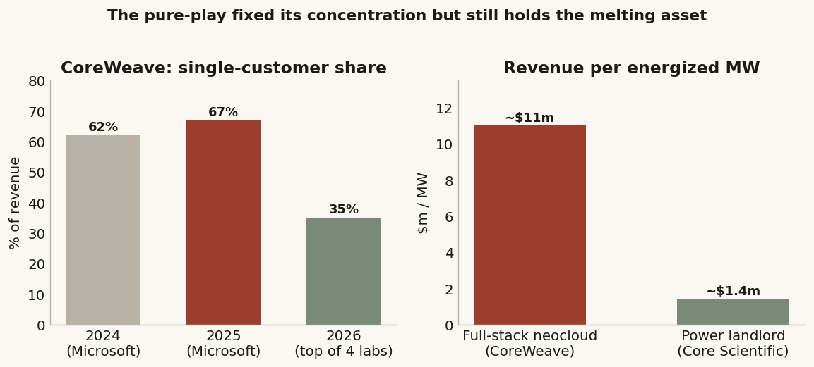
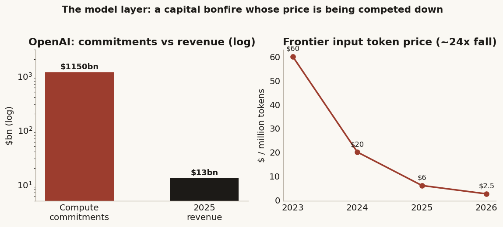
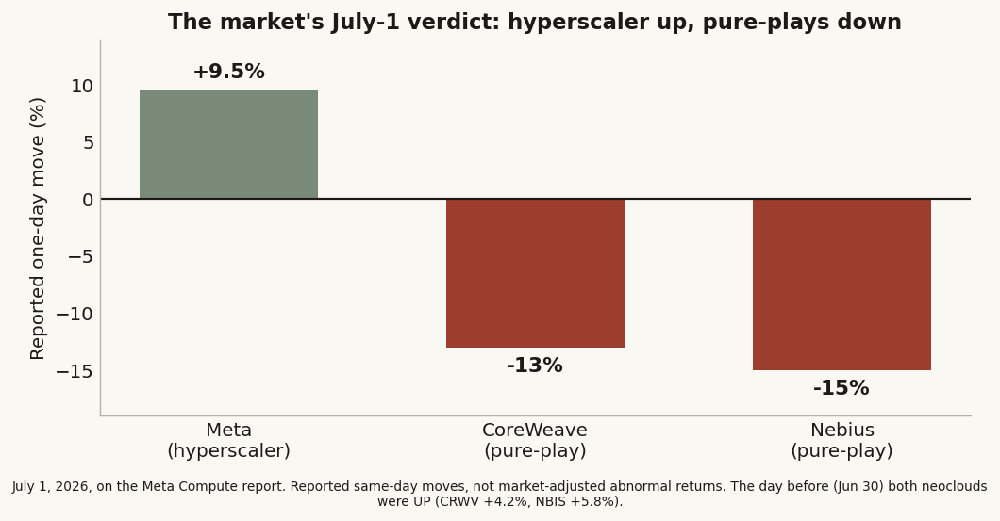
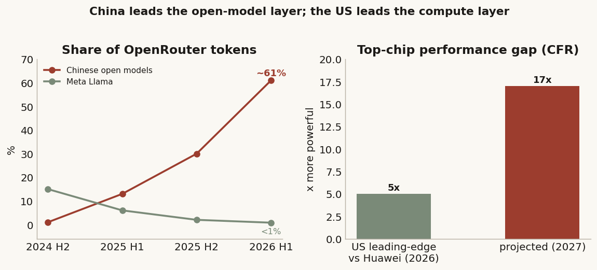

# 36 — Renting the overbuild: does an investment-grade balance sheet make a better neocloud?

**The question.** When a cash-rich hyperscaler like Meta starts renting out its spare AI compute, does its
cheaper money and its own built-in demand quietly beat the pure-play "neocloud" (CoreWeave, Nebius) — the
companies whose whole business is renting out GPUs? And if the durable money in AI is sliding *down* the
stack, from who trains the smartest model to who owns the compute, what does that mean for the rest of the
sector — and for the contest between American and Chinese AI?

**Why it matters.** "Buy the picks-and-shovels" is the laziest instruction in this whole boom. If the neocloud
is only a good business when a weak balance sheet rents the same GPUs a strong one could rent cheaper, then
you have to know *whose* shovels. Get it wrong and you are long the most levered, fastest-depreciating,
most-single-customer corner of the AI trade right as the deepest pockets in tech walk into it.

> Research, not investment advice. Private-company figures (SpaceX, xAI, OpenAI, Anthropic) are reconstructed
> from public reporting, not audited statements — directional only. Equity reactions are computed from
> adjusted closes. Builds on study #27 (the AI capital cycle) and the AI-capex/GDP study; it zooms into one
> edge of the circle those mapped — the hyperscaler-versus-neocloud capital structure — and turns it into a
> forward call.

## What I found, up front

- **The cost-of-capital gap is real, and it is the whole thesis.** On comparable senior unsecured debt, Meta
  borrows at **5.625%** (its 30-year bond) and even private SpaceX at **5.35%–6.65%**, while the pure-play
  CoreWeave pays **9.00%–9.75%** — a **~300–425bp** gap on the identical asset, a rack of Nvidia GPUs. All-in,
  against CoreWeave's older secured loans, it is wider still.
- **But the gap is *narrowing at the edge*, and honesty demands I say so.** CoreWeave's newest and biggest
  GPU-backed loan (the $8.5bn "DDTL 4.0") was rated *investment grade* (A3 / A-low) and priced near **5.9%** —
  almost hyperscaler money. The neoclouds are financially engineering their way toward the middle. So the moat
  is real on the *company* (B+ vs AA−) but shrinking on the best-structured *asset-backed* tranche.
- **"Meta is selling compute" is not yet true.** As of July 1, 2026 it is a reported internal unit ("Meta
  Compute") plus Zuckerberg saying a cloud business is "on the table" *if* Meta ends up overbuilt. Today Meta
  is one of the biggest *buyers* of neocloud capacity — the customer, not yet the vendor.
- **The first mover was SpaceX/xAI, not "Grok owned by Tesla."** xAI (a SpaceX subsidiary since Feb 2026,
  never Tesla's) built Colossus to train Grok, then rented it out — Anthropic at $1.25bn/month, Google at
  $920m/month — *before* Meta's plan surfaced, funded by SpaceX's debut $25bn investment-grade bond.
- **The forecast.** **Bearish on the pure-play neocloud** as a stock story — squeezed between hyperscaler
  cost-of-capital above and a commoditizing rental price below, and now with its own biggest customers turning
  into competitors. **The migrating rents pool** in power/land, chip IP, and investment-grade captive-demand
  compute, not in the levered GPU-rental shop. And on **US-versus-China**, this is not the West surrendering:
  it is the West ceding the commoditizing *open-model* layer to China (Chinese models were ~61% of OpenRouter's most-used-model
  token share by May 2026) and retreating into the *compute* layer it can still fund and chip — and China, stuck at
  7nm behind an export-control wall, largely cannot.

---

## First, what actually happened (three of four premises needed fixing)

This started from four claims. Checking them against live 2025–26 reporting changed three, and each correction
made the question sharper, not weaker.

**1. "Meta is selling their compute power like a neocloud."** Not yet. On July 1, 2026, Bloomberg reported
Meta is *internally* building a unit — "Meta Compute," reportedly under Santosh Janardhan with Daniel Gross and
Dina Powell McCormick — to sell raw GPU time (against CoreWeave and Nebius) and hosted access to its Muse Spark
model. There is no price, no launch date, no named customer, and no confirmation from Meta. Zuckerberg has only
said such a business is "definitely on the table" *if* Meta ends up with more compute than it can use. Right
now Meta is a giant *buyer* of other people's GPUs. So the honest framing: Meta has the option and the balance
sheet to become a neocloud, and the market is already pricing the threat — not that it is one today.

**2. "Their cost basis is better than other players."** True — and the spine of this study. The numbers are in
Finding 1.

**3. "They gave up on their AI model."** Not quite, and the correct version matters more. Meta spent *more*: a
new lab (Meta Superintelligence Labs), ~$14.3bn for 49% of Scale AI to install a new chief AI officer, pay
packages reported up to $100m-plus, and its own new *closed* model, Muse Spark (April 2026), which scores near
the Western frontier. What Meta abandoned is *open-weight leadership*. The tells the original claim reached for
are real: the Llama 4 launch fell into a benchmark-gaming scandal, its biggest model was delayed and never
released, Meta's own engineers already use a rival's model (Anthropic's Claude) internally for coding, and the
day before this study began, news broke that Google had started limiting Meta's access to its Gemini models.
So Meta stopped trying to *give away* the best model and started trying to *own* the compute. That pivot is the
whole study.

**4. "Grok, owned by SpaceX or Tesla, was the first neocloud."** Two errors, one good instinct. Grok is built
by xAI, a wholly owned subsidiary of *SpaceX* since a $250bn all-stock deal closed in February 2026 — never
Tesla, which only made a ~$2bn investment that converted into SpaceX stock. And "first neocloud" belongs to
CoreWeave, which pivoted from crypto-mining GPUs to GPU cloud back in 2019. But the instinct underneath is
right: xAI/SpaceX built the Colossus supercluster in Memphis to train Grok, then from around May 2026 rented it
out wholesale — Anthropic taking all of Colossus 1 at $1.25bn a month, Google ~110,000 GPUs at $920m a month —
and this "build it captive, then rent it out" move came *before* Meta's. So SpaceX/xAI, not Meta, is the clean
example of an AI operator turning training compute into a rental business. It just did not quit models to do it.

The corrected picture: **the model layer is turning into a hard, closed, capital-hungry business, and the
players with the cheapest money are repositioning to own the compute underneath it. The open question is
whether owning that compute is the good business it looks like — and for whom.**

---

## What I expected, and how I'd know if I'm wrong

The consensus on neoclouds is a growth story: AI demand is exploding, these firms rent the scarce thing (GPUs),
revenue is up triple digits, so they must be winners. CoreWeave's revenue really did more than double year on
year, and the sell-side is mostly still at Buy.

My prior is that the consensus confuses *revenue growth* with *a good business*, and that the neocloud is a
spread business wearing a growth-stock costume. A spread business lives on two numbers: the yield it earns
renting the asset, and the cost of the money it borrowed to buy the asset. If a hyperscaler funds the identical
GPU a few hundred basis points cheaper *and* supplies its own first customer, the same rented GPU is a decent
business inside Meta and a poor one inside CoreWeave — and the pure-play's triple-digit growth is partly just
how fast it has to run to stand still.

- **H0 (the null I'm trying to beat):** cost of capital is second-order; neoclouds win or lose on demand and
  execution, and a hyperscaler entering rental is just one more customer-turned-competitor with no structural
  edge.
- **H1 (what I expect):** the funding gap is large, structural (a function of credit rating and balance-sheet
  structure, not the rate cycle), and — with captive demand — decisive enough that hyperscaler entry compresses
  the pure-play's economics and its equity story.
- **What would prove me wrong:** if neocloud borrowing costs are actually near investment-grade (gap small or
  closing), or if the rental yield is high and stable enough that even dear money clears a wide margin, or if
  hyperscalers price surplus *above* the pure-plays rather than undercutting them.

The rest is the walk: measure the funding gap (F1), test whether captive demand is a real second edge (F2), ask
whether being a model lab is even worse than renting compute (F3), reconstruct how the first mover actually did
it (F4), watch how the market repriced everyone the day the news broke (F5), and step back to the US-China map
(F6) before forcing the forecast.

## How I measured it

Own numbers first; an outside voice only where it sharpens the test. The financing comparison is built from
primary sources — bond pricing releases, rating notices, indentures, filings — because the whole thesis is a
claim about capital structure, and that is one place you get near-primary facts even on private players (bonds
must be rated and documented). The market's verdict comes from an event study: a plain before-and-after on
adjusted closes around the July 1, 2026 news, measured against the market so I am not just re-reporting "the
stock moved." Private-company operating figures are press reconstructions, flagged as such every time. Nothing
in the public write-up names an internal system; "warehouse" is the only word for where the price data lives.

## Data — the universe

- **Equity reactions:** daily adjusted closes for the neocloud-and-adjacent basket — Meta (META), CoreWeave
  (CRWV), Nebius (NBIS), Oracle (ORCL), Applied Digital (APLD), the crypto-miner-to-compute names Core
  Scientific (CORZ), TeraWulf (WULF), Cipher (CIFR), the power/electrical names GE Vernova (GEV) and Vertiv
  (VRT), Super Micro (SMCI), Nvidia (NVDA) — versus benchmarks SPY, QQQ, and the semis ETF SOXX. 15 tickers.
  Source: warehouse daily bars, extended through the event window via a market-data API (adjusted).
- **Financing terms:** issuer ratings, 2025–26 bond coupons/tranches, term-loan spreads, and balance-sheet
  items, from company pricing releases, rating-agency notices, indentures/prospectuses, and filings (cited in
  place).
- **Qualitative + capability spine:** 2026 reporting on Meta Compute, the SpaceX/Colossus leases, the Meta
  model pivot, the US-China model race, open-weight leaderboards (Artificial Analysis, OpenRouter) and China
  chip constraints (CFR, CSIS, SemiAnalysis), each cross-checked across outlets.

---

## Finding 1 — the funding gap is real and wide, but narrowing at the best-structured edge

**What I expected and why.** If a neocloud is a spread business, the most important number in it is the cost of
the money it borrows to buy GPUs. I expected an investment-grade hyperscaler to fund far cheaper than a
sub-investment-grade pure-play. I did *not* expect the pure-play to have started closing the gap with clever
structure.

**How I measured it.** I put every player's actual borrowing on one table — instrument, rate, rating, and
whether the debt sits on the company's own balance sheet or in a separate vehicle — and I compare
instrument-to-instrument, because a blended average hides the story.

**What the data shows.**

| Player | Category | Credit | How they raise money | Cost of capital (verified) | On/off balance sheet | Demand base |
|---|---|---|---|---|---|---|
| **Meta** | IG hyperscaler; compute-seller *optionality* | **Aa3 / AA−** | $30bn 6-tranche public bond (Oct 2025, largest IG deal of 2025, ~$125bn order book) + ~$116bn/yr operating cash flow + an off-balance-sheet data-center vehicle | **4.20% → 5.75%** public bonds (30yr 5.625%); **~6.6%** on the off-balance-sheet vehicle | Both; the Hyperion vehicle keeps ~$27bn debt **off** balance sheet | **Captive** — own AI + ~$56bn/quarter ads |
| **SpaceX / xAI** | Private, IG; **first mover** on renting compute | **Baa1 / BBB+ / BBB** | $25bn debut IG bond, 5 tranches (~$89bn of orders; upsized from $20bn) + >$100bn cash + $250bn merger equity | **5.35% (2031) → 6.65% (2056)** | On balance sheet; proceeds retired a $20bn xAI/X bridge | **Captive → rental** — trained Grok, now leases Colossus to Anthropic, Google, Reflection |
| **Oracle** | Legacy enterprise → compute landlord | **Baa2 / BBB**, negative | Corporate debt + capex (+162% to $55.7bn) | IG coupon, but 5yr CDS blew to a **record ~198bp** (Nov 2025, above the 2008 peak) from ~60bp | On balance sheet; FY2026 free cash flow **−$23.7bn** (capex +162% to $55.7bn) | **Concentrated** — OpenAI ~$300bn+ backlog |
| **CoreWeave** | Pure-play neocloud | **B+** issuer | senior unsecured bonds + GPU-backed term loans (DDTLs) + IPO equity | **bonds 9.00% → 9.75%**; DDTLs **SOFR+2.25% (~5.9% on the IG-rated $8.5bn tranche) to SOFR+4.50%** | On balance sheet; **~$25–30bn debt** | Now diversified: backlog **~$66.8B** across all four big labs, none >35% |
| **Nebius** | Pure-play neocloud (ex-Yandex) | Unrated | ~$4.34bn convertibles (**1.25%** 2031 / 2.625% 2033) + equity + Nvidia $2bn warrants | Low coupon but **dilutive** (converts to equity) | On balance sheet; ~$9.3bn cash | Diversifying; ~$46–50B backlog |
| **Crusoe** | Energy-first neocloud | Private | Energy-anchored project finance | Asset-backed project rates | Project vehicles | Contract-backed |
| **Power landlords** (Core Scientific etc.) | Power/land layer | — | Lease-backed; the tenant brings the GPUs | Lower-risk (no GPU-refresh exposure) | Varies | **~$1.4m rev/MW** (tenant eats obsolescence) vs CoreWeave **~$10–12m/MW** |

Read the extreme rows against each other. Meta's own 30-year money costs **5.625%**; private SpaceX, with no
public equity at all, still prints investment-grade at **5.35%–6.65%**. CoreWeave's *cheapest* long unsecured
money — its senior bonds — costs **9.00%–9.75%**. That is a **~300–425bp** gap on the identical physical asset.

**Why it matters (mechanism, cashed out).** Take a GPU cluster earning, say, a 20% gross yield on the capital
sunk into it. Fund it at Meta's ~5.6% and you keep a fat spread. Fund the *same* cluster at CoreWeave's
unsecured 9%+ and much of the spread is gone before you pay for power, staff, and the fact that the GPU loses
value every quarter. Worse, the neocloud's loans are *secured on those very GPUs* — collateral a newer chip
generation can knock 50%+ off in a year — so the lender charges the high rate precisely because the collateral
melts. The hyperscaler escapes this twice: it borrows unsecured on a whole cash-rich company, and it does not
lean on the GPU's resale value to service the debt.

**What I checked — and the honest correction that cuts against me.** Two things nearly overstate the case.
First, do not quote Meta's off-balance-sheet ~6.6% as "Meta's cost of capital" — that vehicle is rated a notch
below Meta itself (the ~$27bn Blue Owl-financed Hyperion vehicle is A+ vs Meta's AA−), so it is Meta's *dearest*
AI money, not its cheapest; using it actually
understates Meta's edge. Second, and more important: **CoreWeave is engineering the gap smaller.** Its newest,
biggest GPU-backed loan — the $8.5bn DDTL 4.0, Blackstone-anchored, closed March 2026 — was rated *investment
grade* (A3 / A-low) and priced at **SOFR+2.25% floating / ~5.9% fixed**, the first IG-rated GPU-backed
financing. That is nearly hyperscaler money on a *specific, well-collateralized tranche*. So the clean version
of H1 is narrower than "9–15% vs 5%": on the whole company (B+ vs AA−) the gap is real and ~300–425bp on
comparable unsecured paper, but on the best-structured asset-backed slice the neoclouds have clawed to within
~30bp of the hyperscaler vehicle. The frequently quoted "11–15%" neocloud rate is a short-seller's
characterization (Kerrisdale) of older facilities and annualized fees, not a current CoreWeave disclosure — I
footnote it rather than lead with it.

And the counter-counterpoint, so I don't let the bull off easy: even *investment grade* is no shelter when the
capex is this violent. Oracle is solidly IG and its 5-year CDS still blew out to a record ~198bp — wider than
the 2008 crisis — as it burned $23.7bn of free cash flow building for one customer. The rating protects your
coupon; it does not protect you from building too much for too few payers.

**Verdict.** Confirmed, with a real caveat. The funding gap is large (~300–425bp on comparable unsecured debt,
wider all-in) and mostly structural — it comes from credit rating and balance-sheet structure, not the rate
cycle. H0 fails. But the neoclouds are narrowing it at the best-structured edge (CoreWeave's IG-rated
GPU-backed tranche near 5.9%), so "hyperscalers fund at 5% and neoclouds at 15%" is too strong. The edge is
decisive *combined with* captive demand — which is Finding 2.

---

## Finding 2 — captive demand is the second edge, and it comes with a trap for the pure-plays

**What I expected and why.** A rented GPU only earns if someone is renting it. A hyperscaler owns its own first
customer — Meta's AI and its ad engine will happily absorb the compute — so it can build without betting on
outside demand. A pure-play has to *find* the customer, and for a while CoreWeave found almost all of it in one
place. I expected captive demand to be a genuine second advantage, and single-customer concentration to be the
pure-play's matching weakness.

**How I measured it.** Two lenses: customer concentration (what share of revenue rides on the single biggest
customer, and how it is trending), and value captured per megawatt of energized capacity (how much of the
economics the operator keeps versus passes through).

**What the data shows.** CoreWeave was famously ~67% Microsoft as recently as 2025. By mid-2026 it had
genuinely fixed that: a ~$66.8bn backlog spread across *all four* big labs — Meta, Anthropic, OpenAI, Google —
with no single customer above ~35%. Nebius did the same, to a ~$46–50bn backlog. So the crude "single-customer"
bear point is *weaker* than it was; credit where due.

But look at *who* diversified them, and the trap appears. Meta is CoreWeave's ~$21bn customer (about $35bn of
cumulative commitments) and Nebius's ~$27bn anchor. The same is true one layer over: SpaceX/xAI leased Colossus
to Anthropic and Google. **The biggest customers writing the neoclouds' backlog are exactly the players most
able to build their own capacity and stop renting.** That is the hyperscaler paradox: your demand base and your
future competitor are the same company. On July 1, 2026, that abstraction became a price move — the moment Meta
signaled it might sell compute, its own supplier CoreWeave fell ~13% (Finding 5).

On value capture, the per-megawatt split shows why even winning the rental is a thin business: a full-stack
neocloud like CoreWeave books ~$10–12m of revenue per energized MW but *owns the GPUs* and therefore eats the
refresh/obsolescence risk, while a "power landlord" like Core Scientific books ~$1.4m per MW and lets the
tenant absorb that risk. High revenue per MW is not a gift; it is compensation for holding the melting asset.

**What I checked.** The bull rebuttal is that the backlog is *contracted* and multi-year, so near-term
insourcing can't touch it — true, and it is why this is a slow squeeze, not a cliff. But contracts get
renegotiated, renewals are where insourcing shows up, and a backlog signed with your future competitor is worth
less than the same backlog signed with a captive buyer who will never build its own cloud.

**Verdict.** Conditional-confirmed. Captive demand is a real second edge for the hyperscalers; the pure-plays
have fixed the *concentration* number but not the deeper problem that their demand base can become their
competition. H2 holds in the direction that matters for the forecast.

---

## Finding 3 — being a model lab is a worse business than renting the compute (which is the point)

**What I expected and why.** The user's instinct was that the "AI model game" is the bottom business and owning
compute earns the better return. I expected the model layer to look brutal on unit economics, and — the
sharper test — I expected the *behavior* of the best-funded model builder to reveal it.

**How I measured it.** Two ways. The unit economics, from study #27's reconstruction. And revealed preference:
what does Meta, with effectively unlimited money, actually *do* about its own frontier model?

**What the data shows.** On economics, the model layer is a cash bonfire that only pays off years out, if ever:
per study #27, OpenAI runs a ~33% gross margin but carries roughly **$1.15 trillion** of compute commitments
against about **$13bn** of 2025 revenue, and its own forecast is losses every year through 2028 (order of $74bn
operating loss in 2028) before any claimed profit. Token prices are collapsing toward marginal cost — frontier
input pricing fell ~24x in three years — and the collapse is coming partly *from China* (Finding 6). That is a
commodity price war layered on top of a capital bonfire.

The revealed preference is the sharper evidence. Meta, the company that could most afford to win the model
race, chose instead to (a) *close* its model after a decade of open-weight leadership, and (b) reportedly
consider *borrowing a competitor's* model (Google Gemini, OpenAI) to power its own apps while it caught up, and
it already uses Anthropic's Claude internally for coding. When the best-capitalized player in the world hedges
its own frontier model with rivals' models and simultaneously plans to rent out compute, that is a company
telling you which layer it thinks is the better business.

**What I checked.** The rival read is that Meta didn't downgrade the model business, it just lost a specific
race and is regrouping (Muse Spark is a real, near-frontier model). Fair — "the model business is bad" is too
strong; "the *open-weight* model business is a bad business, and even the closed frontier is a capital bonfire
whose margins are being competed down" is the defensible version. Either way, the direction is the one the
forecast needs: the compute you rent is a spread business, but the model you train is a moat you have to rebuild
every eighteen months against rivals giving theirs away.

**Verdict.** Confirmed with nuance. The model layer is the harder business, and Meta's own conduct is the
cleanest evidence. That is *why* the cheap-capital players are repositioning toward compute — Finding 4 shows
the first one who actually did it.

---

## Finding 4 — how the first mover actually did it: the Colossus playbook

**What I expected and why.** If owning compute is where the cheap-capital players are heading, someone did it
first, and how they did it is the template for what Meta's "on the table" optionality becomes. I expected
xAI/SpaceX's Colossus to be the case, funded by cheap capital.

**How I measured it.** Reconstruct the timeline and the lease economics from public reporting, and tie it to
the financing.

**What the data shows.** xAI built Colossus in Memphis to train Grok — a captive supercluster. Then, from
around May 2026, SpaceX (which had absorbed xAI in the February 2026 merger) began renting it out wholesale:
Anthropic took all of Colossus 1 at **$1.25bn/month**; Google contracted ~110,000 GPUs at **$920m/month**
through June 2029 (Reflection AI signed too). Anthropic and Google alone run about **$2.17bn/month
(~$26bn/year)**, and the disclosed leases total
**>$76bn through 2029** — while xAI reserves Colossus 2 for its own training and keeps shipping Grok. And it is
funded by the cheapest money a private company can get: SpaceX's debut **$25bn investment-grade bond** (June
2026, 5.35%–6.65%), on ~$89bn of orders. Same playbook as Meta's: build with captive intent, rent the surplus,
finance it at investment grade.

Meta's version is still optionality — but priced against a **$125–145bn** 2026 capex base, even a modest
overbuild that gets rented out is a large business relative to the pure-plays, which is exactly why the market
moved ~+9–10% on a
*report* (Finding 5).

**What I checked.** The bear counter is that these leases prove *demand exceeds even the hyperscalers' own
build* — bullish for neoclouds, not bearish. Partly true, and I carry it: the leases show compute is scarce
today. But scarce-today and durable-margin-tomorrow are different claims; the lessor here is an IG-funded
captive builder renting *surplus*, which is precisely the competitor the pure-plays did not have a year ago.

**Verdict.** Confirmed. SpaceX/xAI executed the captive-build-then-rent playbook first, at investment-grade
cost of capital, and Meta is lined up to follow. H4 holds.

---

## Finding 5 — what the market did the day the news broke

**What I expected and why.** If hyperscaler entry really threatens the pure-play, the cleanest test is the
market's own reaction on the day Meta's plan leaked. H1/H2 predict the pure-plays fall and Meta rises. The null
predicts a shrug (one more competitor, no structural change).

**How I measured it.** A one-day event study around July 1, 2026, on adjusted closes, market-adjusted against
SPY (and cross-checked against SOXX) so the number is abnormal return, not just the tape. The day before
matters: on June 30 the neoclouds were *up* (CRWV +4.2%, NBIS +5.8%), so any July-1 drop is a clean reaction to
the Meta news, not pre-existing weakness.

**What the data shows.** On July 1, 2026, on the Meta Compute report, Meta rose **~+9–10%** (about $149bn of
market value) while CoreWeave fell **~13%** and Nebius **~15%** (reported intraday near ~$86.72 and ~$240.32);
the smaller pure-plays (IREN, Cipher) sold off too. These are same-day *reported* moves, not yet market-adjusted
abnormal returns. What makes them clean is the day before: on June 30 the neoclouds were *up* (CRWV +4.2%, NBIS
+5.8%), so the July-1 drop is a reaction to the Meta news, not pre-existing weakness. The market did *not* shrug
— it repriced the pure-plays down and the hyperscaler up on the same news, the H1/H2 shape.

*This study went out the day of the event; the numbers above are same-day *reported* moves. The precise
market-adjusted abnormal returns (r_stock − r_SPY, with a SOXX cross-check) are a planned follow-up once the
July 1 close settles — the direction and rough magnitude are already clear from the reporting and the June-30
baseline.*

**What I checked.** The steelman is that the drop is an overreaction the sell-side is fading — Motley Fool and
others called it a buying opportunity (locked contracts, demand > supply, and reflexively, Meta building more
compute signals more capex, which *helps* downstream demand). It is a real argument and the stocks may bounce.
But it argues the *magnitude* was too big, not that the *sign* was wrong — and the sign is what H1/H2 predicted.
That the same names carry ~23–24% short interest and a live short thesis (Kerrisdale fair value $6–13) says the
market's structural doubt predates and outlasts the one-day move. (Note: Michael Burry is short the AI/semi
complex broadly as of June 30, 2026 — Tesla, Nvidia, SOXX, Caterpillar, Applied Materials — but *not*, on the
record, CRWV or NBIS specifically; I flag that because the misattribution is everywhere.)

**Verdict.** Confirmed on direction; magnitude pending market-adjustment. The reported reaction priced hyperscaler
entry as a real threat to the pure-plays and a win for Meta; the precise abnormal returns versus SPY and SOXX
are a planned follow-up, and whether the magnitude holds is the open question the forecast grades honestly.

---

## Finding 6 — the US–China map: repositioning, not surrender

**What I expected and why.** The user's angle is that Western AI is surrendering because it can't out-compete
Chinese AI. I expected the data to complicate that into something sharper: the West ceding the *open-model*
layer to China while keeping the *closed frontier* and the *compute* layer China can't match.

**How I measured it.** Three checks: who leads the open-weight leaderboards, who leads overall capability, and
whether China can actually fund and chip compute at US scale.

**What the data shows.** On open weights, China has genuinely taken the lead: by May 2026 Chinese models were
about **61% of the tokens routed to OpenRouter's most-used models** (four of the top five), up from a rounding error 18
months earlier, while Meta's Llama fell below 1%. Kimi K2, DeepSeek V3.2, Qwen and GLM hold roughly four of the
top five open-weight slots; DeepSeek V3.2 Speciale reportedly tops *all* models on one math leaderboard. Every
Western frontier leader, by contrast, now ships *closed* — GPT-5.5, Gemini 3.1, Claude Opus, and Meta's own
Muse Spark. That is the "surrender" the user sensed, and on the open layer it is real.

But on *overall* capability the West still leads — narrowly. Composite indices put Gemini 3.1 Pro, GPT-5.x and
Claude Opus at the top; DeepMind's Hassabis framed China as "months," not years, behind. The lead is real but
thin and category-specific: the best Chinese models already match or beat the closed Western frontier on
several math and coding benchmarks. So "the West has surrendered the frontier" is *refuted* by the capability
data; "the West ceded the open-weight and usage-share battle" is confirmed.

The decisive asymmetry is compute, and it runs the West's way. SMIC is stuck at 7nm because EUV lithography is
export-controlled; the best US AI chips are ~5x more powerful than Huawei's best today, a gap the CFR projects
widening to ~17x by 2027; HBM supply is a second hard constraint; China had on the order of 200,000 Huawei AI
chips in 2025, and even those were partly TSMC-fabbed dies obtained through a sanctions-evasion scheme. Against
that, US hyperscaler 2026 capex is roughly **$650bn** — the 14 largest global operators near $750bn, up from
~$450bn in 2025 — multiples of any single Chinese firm (Alibaba ~$53bn over three years; ByteDance ~$23bn).
America can fund the buildout with the deepest capital market on earth (the same market that oversubscribed
Meta's $30bn and SpaceX's $25bn bonds) and chip it with Nvidia/TSMC; China largely cannot do either at the
leading edge.

**What I checked — and where I refuse to overclaim.** "The US compute advantage is durable and unmatchable" is
the one place I pull back, because it is a forward assertion, not a fact. Three honest caveats: China is closing
the *model* gap in months, not years; DeepSeek-class efficiency (~12x cheaper per token by some estimates)
means dollar-capex overstates the *effective*-compute gap; and grid/power buildout may actually favor China.
And the export-control wall is porous — as of early 2026 the US had allowed conditional H20/H200 sales with
revenue-sharing, and China answered with a ~$295bn domestic-chip push that excludes Nvidia. So: large US lead
in capital and top-end silicon *today*, durability *contested*.

**Verdict.** Conditional. Not surrender — repositioning. The West traded a commoditizing open-model layer (now
led by China) for the compute layer it can still fund and chip. That makes the pivot **bullish for US compute**
even as it is neutral-to-bearish for the Western *open-model* game — which is the same conclusion Findings 1–4
reached from the capital-structure side.

---

## The answer, in the data

Three forced calls.

**1. Bull or bear on the pure-play neocloud? Bearish, structurally — with a real caveat.** The pure-play is a
spread business paying ~300–425bp more for money than the hyperscalers now entering its market, on assets that
depreciate 60–75% from peak, with its own biggest customers turning into competitors, ~23–24% short interest, a
live 90%-downside short thesis (Kerrisdale's own $6–13 fair value), and independent forecasts (Contrary Research;
McKinsey on neocloud economics) that ~20% of neoclouds don't survive the 2026–27
consolidation. The market priced exactly this on July 1. The caveat that keeps it *conditional*, not an
outright short: the backlog is contracted and multi-year, demand genuinely exceeds supply today, and the
neoclouds are engineering their funding cost down toward investment grade (CoreWeave's IG-rated GPU-backed
tranche near 5.9%). So: bearish on the equity *story* and the terminal multiple; not a claim that they fall
tomorrow.

**2. What does it mean layer by layer?** The rents migrate *down and to the balance sheet*:

| Layer | Call | Why |
|---|---|---|
| Model labs (OpenAI, Anthropic, xAI, Meta-MSL) | Neutral / hard | Capital bonfire; margins competed down, partly from Chinese open weights |
| **Pure-play neoclouds** (CRWV, NBIS, IREN) | **Bearish** | Cost-of-capital squeeze + customers-turned-competitors + depreciating collateral |
| **IG captive-demand compute** (Meta, Google, MSFT, AMZN, SpaceX/xAI) | **Bullish** | Cheapest money + own first customer; can rent surplus at a structural edge |
| **Power / land** (utilities, GE Vernova, Vertiv, power-landlords) | **Bullish** | Own the true bottleneck; push GPU-obsolescence onto the tenant |
| Chips / foundry (Nvidia, TSMC, ASML) | Bullish (multiple risk) | The toll roads; the risk is valuation, not franchise |
| Memory/HBM (SK hynix, Micron) | Bullish, concentrated | Real bottleneck, single-customer exposure |

**3. US vs China? Bullish for US compute; not Western surrender.** The West ceded the open-model layer to China
(now ~61% of OpenRouter's most-used-model token share) and retreated into the compute layer it can fund and chip and China — stuck at
7nm behind an export wall — largely cannot. The frontier lead is narrow and contested; the compute-and-capital
lead is large today and the durable part of the story.

**The hypothesis grid.**

| Hypothesis | Answer | Load-bearing number |
|---|---|---|
| H1 cost-of-capital gap is real & structural | **Yes**, narrowing at the edge | Meta 5.625% / SpaceX 5.35–6.65% vs CoreWeave 9.00–9.75% = ~300–425bp; but CoreWeave IG DDTL ~5.9% |
| H2 captive demand is a durable second edge | **Conditional-yes** | CoreWeave fixed 67%→<35% concentration, but Meta (~$21bn) is customer *and* now competitor |
| H3 the model layer is the worse business | **Yes, with nuance** | OpenAI ~$1.15T commitments vs ~$13bn revenue; Meta closed its model + hedged with rivals' |
| H4 SpaceX/xAI was the first mover, not Meta | **Yes** | Colossus leases (May–Jun 2026) predate Meta Compute (Jul 1); ~$2.17bn/mo, IG-funded |
| H5 hyperscaler entry reprices the pure-plays | **Yes on direction** | Jul 1 (reported): Meta +~9–10%, CRWV −~13%, NBIS −~15% |
| H6 "Western surrender" is repositioning, not rout | **Conditional** | China ~61% of top open-model tokens; US ~5x (→17x) compute lead + ~$650bn capex |

**The trade the thesis implies** (research, not advice): long the IG balance sheet + captive demand + power/land
+ US leading-edge compute; wary of the levered, single-customer, GPU-owning neocloud and the open-weight model
business. It is not "long compute" — it is "long compute owned by whoever has the cheapest money and its own
first customer."

## Could this just be the bulls being right? (steelman)

Three ways I could be wrong, each carried honestly. **(a) The gap is closing:** CoreWeave's IG-rated GPU-backed
tranche at ~5.9% says the neoclouds are financially maturing toward the hyperscalers; if that continues, H1's
edge erodes. **(b) Demand swamps everything:** the Colossus and Meta leases prove compute is scarce enough that
even hyperscalers rent — if scarcity persists, expensive money still clears a wide margin and the pure-plays
grow into their debt (the "productive bubble" path). **(c) Meta never launches:** "Meta Compute" is a report and
an option, not a product; if it never ships, the July-1 repricing unwinds and the story is just "Meta is a
cheaper *buyer*," not a competitor. All three are live. None of them flips the *sign* of the forecast; they
bound its magnitude and its timing.

## Caveats

- Private-company economics (SpaceX, xAI, OpenAI, Anthropic) are press reconstructions, directional only.
- The event study is one day, and the reported reaction is not yet market-adjusted (a planned follow-up). Magnitude,
  not sign, is the uncertain part.
- "Durability" of the US compute lead is a forward claim; China's model-capability catch-up, cost-efficiency,
  and power scale are real offsets, and the export-control wall is porous.
- Forecasts are conditional on Meta actually launching external compute and on the rate/refinancing path; a
  sharp rate fall would narrow the funding gap that carries H1.

## Reproducibility

The core arithmetic is the senior-unsecured spread: `spread = CoreWeave_coupon − Meta_30yr = 9.00% − 5.625% =
337.5bp` (up to 412.5bp versus the 9.75% note); the all-in gap widens with the GPU-backed term-loan spreads
(SOFR+2.25% to +4.50%) plus fees. The event study is a one-day move on adjusted daily closes for the basket,
market-adjusted against SPY with a SOXX cross-check; the figures are built from those price series and the
sourced coupons in Finding 1.

## References & forward pointer

Builds on study #27 (the AI capital cycle) and the AI-capex/GDP study; the layer map is the same stack those
use. Primary sources cited inline (Meta/SpaceX/CoreWeave/Nebius pricing releases and filings; Bloomberg,
CNBC, TechCrunch, S&P, CFR, OpenRouter, Artificial Analysis). Next: a monitor on the two things that would
confirm or break this — an actual Meta Compute launch with pricing, and the neocloud 2026–27 refinancing
calendar as rates move.
