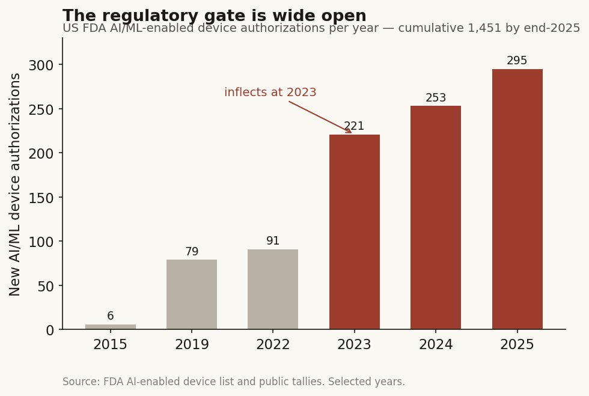
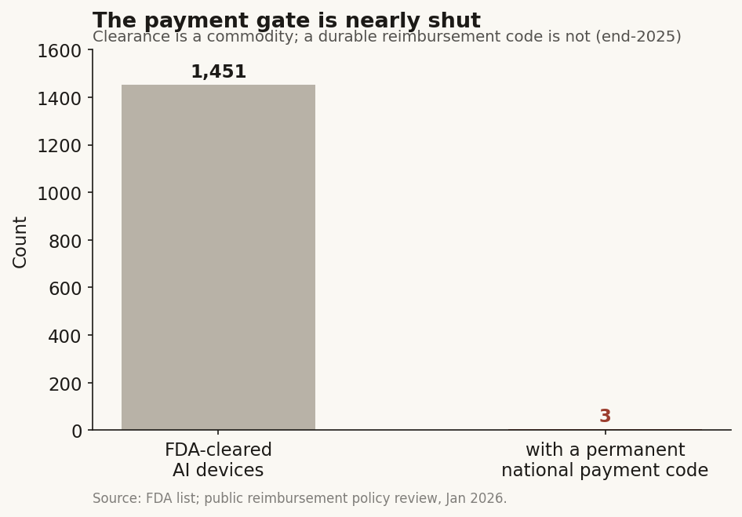
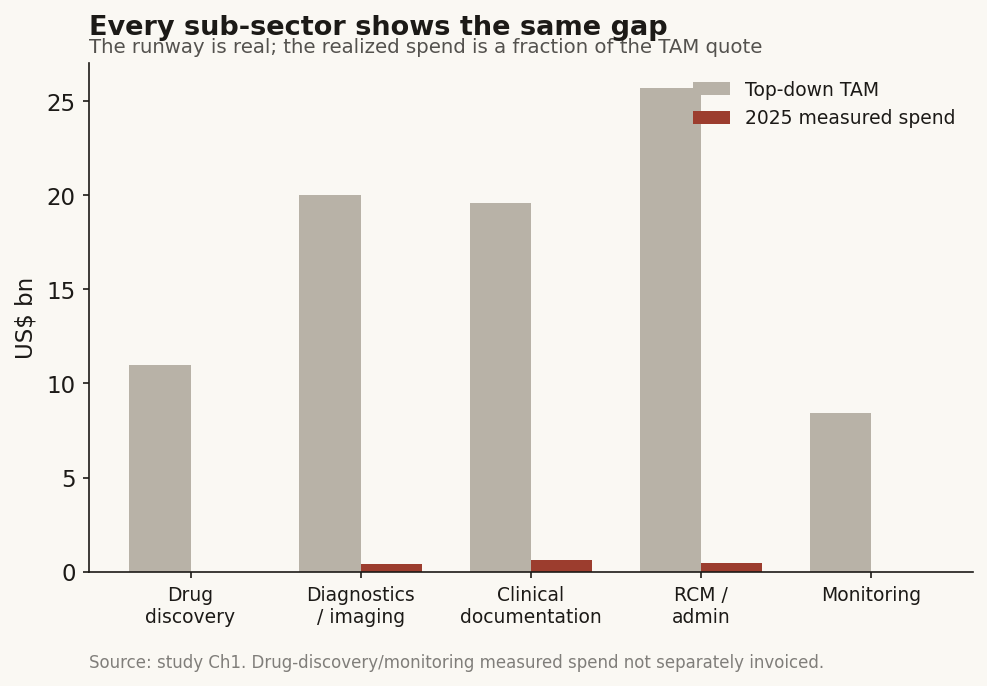
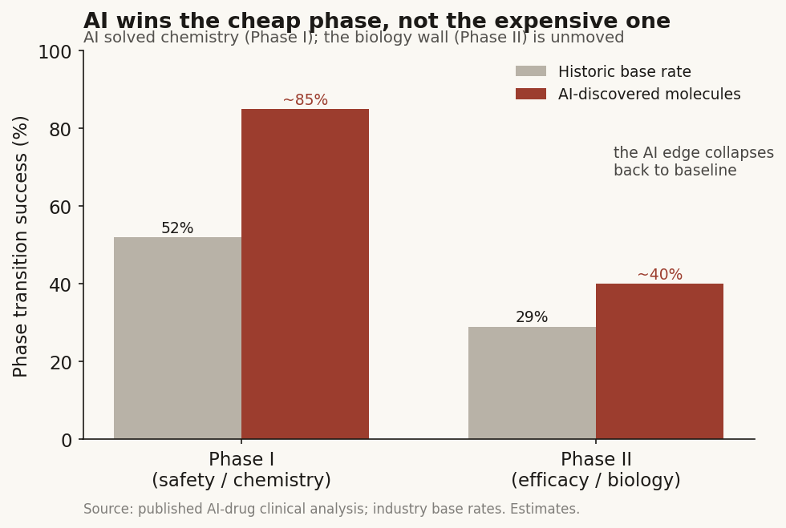
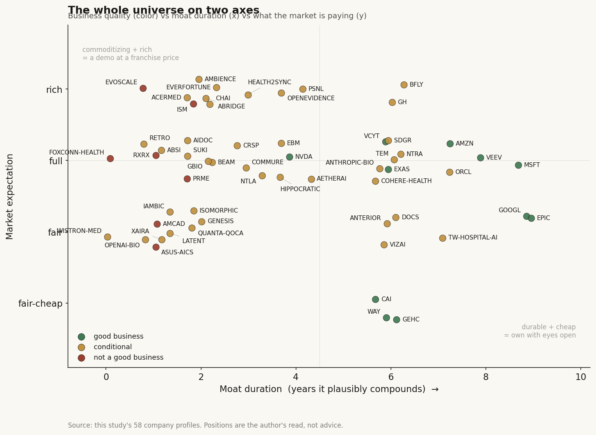

# Healthcare AI: who actually gets paid

**The question:** AI is pouring into healthcare on both sides of the Pacific. Across every player I could find in the US and Taiwan, who captures durable value, and who just has a good demo?

**Why it matters:** if you are deciding where a healthcare-AI dollar of your own is safe, the headline "AI is transforming medicine" tells you nothing about *where the money lands*. This study is my attempt to find the layer that keeps the rent.

*By Hsin Cheng Yeh.*

---

## The short version

I went in expecting the value to sit with the smartest models. It does not. Here is what the data pushed me to, before any of the reasoning below:

- **Value accrues to whoever owns a scarce input that refuses to commoditize** — a permanent reimbursement code, an owned clinical asset, or a licensed data corpus you can resell. Not the model, not the raw-data flywheel, not the FDA clearance certificate.
- **The binding constraint is payment, not technology.** In the US, roughly **1,451** AI devices are FDA-cleared but only **3** hold a permanent, nationally-paid Category-I billing code [disclosed]. In Taiwan, a single-payer decision gates the whole market inside a budget fixed at about **7% of GDP** [disclosed]. Clearance is easy. Getting paid is the wall.
- **In drug discovery, AI solved chemistry, not biology.** AI-designed molecules clear the safety phase (Phase I) at **80-90%** but the first efficacy test (Phase II) at only about **40%** — the same rate the industry has had for thirty years [estimate]. Zero AI-discovered drugs are approved as of 2026.
- **I ran four candidate moats through a refutation test, and only one type survived** everywhere it was claimed: ownership of the workflow, meaning the payment rail, the owned asset, or the data-attach plumbing. The rest have a shelf life of about a year.
- **Taiwan replays the whole US map at under NT$600m of listed pure-play revenue**, with a real single-payer data moat that is captured by the *state*, not by any stock.
- Across nine hypotheses I ended at **2 Yes, 3 No, 3 Conditional, 1 mostly-No**. The net is skeptical-but-selective: healthcare AI is real, but the investable surface is narrow and mostly sits with input-owners, not AI pure-plays.

If you read nothing else, read that list. The rest of this document is me showing my work so you can disagree with any single line of it.

---

## How I looked at this

I want to be upfront about the method, because a reader I respect asked me to make it visible rather than bury it. This is a buy-side industry study, and I deliberately used a buy-side research method rather than a tech-analyst one. Six choices shaped everything:

**I built the framework before I touched the data.** The first question in each part is not "what is the number" but "what is the essential difference of this business, and what would I even need to know to judge it." Get the foundation wrong at the start and a very complete-looking analysis just stands on the wrong ground.

**I drew the complete map, not one deep hole.** The named blind spot of healthcare research is over-drilling a single application — say, AI radiology — and calling it a sector view. So I forced myself to place *every* sub-sector on one graph and connect them, because the value often hides in the seam between two of them (it did: the diagnostics data business turns out to feed drug discovery through exactly one edge).

**I treated market sizing as a first-pass valuation, not a TAM slide.** "How big is this" is really "what is this business worth", so I sized each piece from the bottom up and threw away the top-down headline when it disagreed. It disagreed by 20-25x, and that gap became a finding rather than an embarrassment.

**I picked candidates rather than generated them.** In drug discovery especially, the interesting question is not "can AI make a molecule" but "can it pick the one that survives." I organized the whole discovery section around selection, and it changed the answer.

**I tested moats by trying to kill them.** Every claimed moat got a refutation attempt and a verdict — confirmed, conditional, or refuted — with a duration attached. A moat you did not try to break is a moat you do not understand.

**I tracked reimbursement rate-of-change, not point TAM.** The investable signal in a payment-gated market is which way the coverage line is *moving*, not how big the theoretical pie is. And I staked every claim so it can be refuted by a specific, watchable number — a conclusion you cannot lose is not research.

One housekeeping note. This is a method-and-findings write-up. I read a stack of primary filings, sell-side notes, and regulatory records privately; in the text I refer to them generically ("a filing", "sell-side", "disclosed") rather than by name, and I tag each load-bearing number as **[disclosed]** (company/primary), **[sell-side]** (sell-side/market-research), **[estimate]** (derived), **[reported]** (press), or **[unverified]** (cited but I could not confirm it against a primary — and where that happened, I say so and use the corrected figure).

The universe is **61 companies** across the US and Taiwan, chosen so that every layer of the value-chain map has at least one named occupant. That is the largest coverage the sources supported, and I flag the thin-evidence names inline rather than hiding them.

---

## The findings

I organized the middle of the study around its spine: size it, find the real gate, map who occupies each node, test the one sub-sector everyone is excited about, break the moats, and check the rules per market. Each finding below carries its own reasoning so you watch it earn its place.

### Finding 1 — The headline market is 20-25x bigger than the money actually spent, so the signal is rate-of-change

*What I expected.* I assumed the sizing firms and I would roughly agree on how big healthcare AI is, give or take.

*What I found.* Top-down prints put the "healthcare AI market" at roughly **$27-37bn** for 2025 [sell-side]. But the bottom-up *measured* spend on domain-specific healthcare-AI software in 2025 was about **$1.4bn**, up roughly 3x year on year [sell-side]. That is a 20-25x gap between the headline and what was actually invoiced.

*Why it matters.* A gap that large means the top-down number is a "TAM-of-everything-touched" construct — decorative. The useful signal is not the size of the pie, it is how fast adoption and reimbursement are moving. Money is flowing in through an AI lens (AI took **54%** of 2025 US digital-health funding dollars, up from 37% in 2024 [sell-side]), but I made myself be adversarial: strip the top-nine fundraisers and 2025 falls *below* 2024, and total healthcare investment was down 12% [sell-side]. So part of the "boom" is capital rotating within a shrinking pool, not clean new money.

*How I'd know I was wrong.* If the bottom-up measured spend were within, say, 3x of the headline TAM, I would size on the TAM and drop the rate-of-change framing. It is not close.

*Verdict.* **Confirmed.** Every sub-sector verdict in this study is anchored to a reimbursement or adoption rate-of-change variable, not a point TAM. That single choice follows from this gap.

A picture that carries it (house palette — cream ground, near-black ink, one clay-red accent, no chartjunk): a cumulative FDA-clearance curve from 1995 to 2025 that goes convex around 2023, with the accent marking the inflection. It looks like an explosion. Finding 2 is the chart that stops you over-reading it.

### Finding 2 — FDA clearance is a commodity; CMS reimbursement is the wall

*What I expected.* Naively, "FDA-cleared" sounds like a barrier to entry.

*How I measured it.* I counted cleared AI devices against devices with a permanent national payment code. The counting rule for clearances: FDA AI-enabled device list, authorization date, all classes, so the curve is internally consistent.

*What the data shows.* Cumulative AI-device authorizations reached **1,451** by end-2025, adding a record **295** in 2025 alone, and the pace is *accelerating* — annual prints stepped 91 (2022) to 221 (2023) to 253 (2024) to 295 (2025), with time-to-double compressed from about four years to about two [sell-side]. Around **97%** of these come through the incremental 510(k) predicate-match path — by construction a claim of being similar to something already on the market, the opposite of a defended franchise. Median review in 2025 was **142 days** [sell-side].

Now the bar next to it. Of those ~1,451 cleared devices, exactly **3** hold a permanent Category-I billing code with a national rate [disclosed]. Across billions of commercial claims from 2018 to mid-2023, only **two** AI tools ever exceeded 10,000 total claims [sell-side].

*Why (the mechanism).* Clearance gates the shelf; payment gates the revenue. A device you cannot bill for earns almost nothing. And even a permanent code is not safe: the one permanent code for autonomous AI (autonomous diabetic-retinopathy screening) has been priced *down* every year — **$47.06 (2022), $45.74 (2023), $40.28 (2024)**, about -14% over two years — because it sits inside a budget-neutral fee schedule [disclosed]. The one AI reimbursing at genuine scale, a cardiac CT-derived blood-flow test, got there only by graduating four temporary codes into one permanent Category-I code (effective 2024, roughly **$997 rising to $1,017**), and in the year before that transition it alone drove about 14,000 Medicare claims and $12.7m — dwarfing every other reimbursed AI tool [disclosed].

*What I checked.* The obvious rival explanation is "clearance velocity is the adoption story." It is not, because the holders are overwhelmingly the imaging incumbents (one OEM holds 120 radiology-AI authorizations, the next 89, then 50, then 45 [disclosed]), and clearance does not touch the payment gate at all. The count over-states startup defensibility.

*Verdict.* **Confirmed, and it is the load-bearing finding of the study.** Never underwrite a healthcare-AI thesis on "FDA-cleared." The chart here is two bars — ~1,451 cleared against 3 permanently paid — and it is the antidote to Finding 1's exploding curve.

### Finding 3 — The map has five sub-sectors, and the archetype (not the sub-sector) sets growth quality

*What I expected.* I assumed "precision oncology" or "ambient scribe" were meaningful economic categories.

*What I found.* They are not, really. A single node can host two businesses with a 35-point gross-margin gap between them. What actually sets the quality of the growth is the *revenue physics*: who pays, whether the buyer is the one who benefits, whether a payment or efficacy wall sits between the work and the dollar, and how capital-hungry the next unit is. Six archetypes cover the whole universe:

| Archetype | Who pays / the gate | Gross-margin band | Capital | Durability |
|---|---|---|---|---|
| Per-test / per-scan fee | payer pays, clinician decides, patient benefits (a three-way split); reimbursement-gated | ~40-62% [disclosed] | heavy (wet lab, reagents) | conditional — a code can price down |
| SaaS / subscription | provider pays per seat, **buyer is the beneficiary**, no code needed | ~70-80% | light | high — unless the platform bundles a free substitute |
| Data-licensing to pharma | pharma buys de-identified data; contract-gated | ~71-80% [disclosed] | light | high — a data-scale annuity |
| Milestone + royalty (drug discovery) | pharma pays upfront + milestones; biology-gated | n/a (pre-revenue) | hungry at the clinic | weak / binary — capped by the ~40% Phase II wall |
| Savings-share / risk-share | payer pays from cost avoided, **buyer is the beneficiary**; outcome-gated | ~60-75% | medium | conditional — the lock-in is the workflow, not the AI |
| Infrastructure toll | every layer above pays; usage-gated, reimbursement-independent | bimodal | bimodal | splits inside — model IP commoditizes, silicon does not |

*Why it matters.* The two durable archetypes (SaaS, data-licensing) share three traits: the buyer is the beneficiary, there is no payment gate, and the next unit is nearly free. The two weak ones (per-test, milestone) share the opposite: a payer or efficacy wall stands between the work and the dollar, and the next unit costs real money. That pairing predicts durability better than the technology does.

The single cleanest proof is one company measured twice. The largest multimodal diagnostics platform runs a per-test lab at about **62%** gross margin and a data-licensing annuity bolted on top at about **73%** [disclosed] — same company, two archetypes, an 11-point gap set by the revenue physics, not the sub-sector. The chart is just those two bars.

*The honest caveat I had to add.* Gross margin is a *proxy* for growth quality, not growth quality itself. A 73%-margin data annuity with decelerating bookings is a worse business than a 55%-margin per-test business mid-inflection. The archetype sets the ceiling; the rate-of-change decides whether the business is anywhere near it. Hold that — it is the hinge of the bear case on the very name above.

*Verdict.* **Confirmed.** I read every company case through the archetype, and it kept the analysis honest.

### Finding 4 — Drug discovery is a selection problem, not a generation problem, and the AI edge lands in the wrong phase

This is the sub-sector everyone is most excited about, so I gave it the most adversarial treatment.

*What the market believes.* That structure prediction and generative chemistry mean "AI can now design drugs" — a step-change in the odds of an approved drug.

*Where I differ, and the proof.* The revolution is real but it lands in the wrong phase for drug economics. Split the clinical funnel by where AI-designed molecules actually perform:

| Stage | Historic base rate | AI-designed molecules | What it says |
|---|---|---|---|
| Phase I (safety) | ~52% advance [sell-side] | **80-90%** (21 of 24 in one sample) [estimate] | AI solved "make a well-behaved molecule" |
| Phase II (first efficacy test) | ~29% advance / ~39% success [sell-side] | **~40%**, comparable to historic [estimate] | the AI edge vanishes at efficacy |
| Overall, first-in-human to approval | ~8% [disclosed] | zero approved as of 2026 [estimate] | the ~90% failure rate is unchanged |

Phase I is high *because it is not efficacy-gated* — it tests safety, exactly the "well-behaved molecule" problem AI is good at. Phase II is the low point in every disease area because it is the first real test of the biology. Now overlay the money: out-of-pocket clinical cost runs roughly Phase I $25m, Phase II $59m, Phase III $255m [estimate]. About **93% of clinical spend sits downstream of the selection gate.** So the value lever is picking the right target and candidate and killing the losers *before* the expensive phases — selection and fail-fast — not generating more molecules.

*The mechanism, cashed out.* When pharma writes a headline "$3bn" deal for an AI platform, look at what actually changed hands. In the cleanest set of five deals over four years, the disclosed *upfront* is a tight **1.2-3.0%** of the headline biobuck; the rest is contingent on milestones that mostly never trigger [disclosed components, percentages computed]. One prominent up-to-$12bn deal has paid out on the order of a single ~$7m milestone [estimate]. Pharma is buying a portfolio of cheap staged call options on an unproven platform, not writing a conviction check. That is the tell: the smart money is *already* pricing this as optionality.

*What I checked.* The steelman is "the proprietary wet-lab data flywheel will compound into an edge." Two facts break it. Open, commercially-licensed model clones matched the proprietary structure-prediction frontier within about a year, at over 1000x lower cost — so more proprietary data buys near-zero model advantage where the moat needed it most. And the owner of the largest automated-lab flywheel has the field's *worst* clinical record and cut its three lead programs in 2025 [estimate/disclosed]. The one genuine human proof-of-concept — a single ~71-patient, single-country Phase 2a from an AI-derived target and molecule — refutes the too-strong "nothing works" claim without validating "AI raises the base rate."

*Verdict.* **Confirmed: AI solved the cheap half.** The only defensible position is an owned asset plus pharma distribution, and even that hits the same ~40% Phase II wall as everyone else. The chart is a funnel: the AI spike at Phase I, collapsing flat onto the historic ~40% line at Phase II, with two points pinned to the wall — "0 AI drugs approved (2026)" and "1 genuine human POC."

### Finding 5 — Run four moats through a refutation test, and only workflow ownership survives

*What I did.* I took the four moats the tape keeps pricing and tried to kill each one, giving each a verdict and a duration-of-compounding estimate.

- **Regulatory clearance — refuted, ~0 years on grant.** A "barrier" that 1,451 firms have already cleared, with ~295 more crossing each year and a 142-day median review, is a commodity checkpoint. What survives in its place is a *different* thing: reimbursement-code and coverage ownership, worth roughly 5-8 years, and even that can be repriced down.
- **Workflow embedding / distribution — conditional.** The moat is owned by the *platform*, not the app. In February 2026 the dominant EHR (42% of acute hospitals, 55% of beds) shipped its own native AI charting into notes *and* orders at a rumored ~$80/provider/month against incumbents' several hundred [sell-side]. The ambient-scribe leaders' only real edge was integration depth they *rent* from that platform — and the landlord just became the competitor. This is textbook platform envelopment, made live. Survives only where the vendor owns a scarce input the platform cannot cheaply replicate.
- **Pharma distribution / own-pipeline — conditional.** It is genuinely the only one of the discovery moats where value can accrue, but it is binary optionality gated by the unchanged Phase II wall, not compounding. "The model is the door, not the moat."
- **Data flywheel — conditional (refuted for discovery, intact for licensing).** The loop "more data, better model, better drug" is empirically broken (public clones caught the frontier). But the *data-licensing* flywheel survives intact, because there the data *is* the product and the pharma buyer bears the efficacy risk. And the strongest form of all — a single-payer national dataset — is real but state-captured, so it carries no listed equity.

*The one sentence that carries the chapter:* pay for the payment rail, the owned asset, or the data-attach plumbing — never for the model, the raw-data flywheel, or the clearance certificate.

*Verdict.* **The single surviving moat type is ownership of a scarce, non-commoditizing input.** Everything else has a shelf life: a model ~1 year, a rented EHR slot ~1-3 years, a bare clearance ~0 years on grant.

### Finding 6 — The rules are a filter, and the US and Taiwan gates have opposite shapes

*What I did.* I treated regulation not as a compliance tour but as a key-variable filter: for each market, which rule binds which archetype, and which variable it moves.

*What I found.* Two gates, not one, and the binding one is not the one you would guess. In the US, FDA is a market-*entry* gate and it is wide open; CMS is a market-*size* gate and it is nearly shut. The US payment gate is a fragmented, expandable coverage *curve you climb* — win the national payer, then contract commercial payers name by name, and a rejected device still has cash-pay. The single legislative event that would rewrite the entire per-test column at once is a bill (introduced 2025) that would create a defined "algorithm-based healthcare services" payment category and guarantee at least five years of separate reimbursement. Its very existence is the tell that no durable AI payment pathway exists today.

Taiwan inverts the *shape* of the gate. It is single-payer, so one committee decision is binary — covered nationwide or effectively unsellable at scale — inside a budget fixed at about 7% of GDP, which makes every new AI payment zero-sum. The bar is deliberately higher than the US: reimbursement requires proving, by a randomized trial, that the tool *saves the payer money*, not merely that it is accurate. A standing AI payment does exist (a hypotension-prediction tool paid since mid-2023 as a per-use special-material point value, roughly NT$22.8m a year), which refutes any "Taiwan is 100% pilot" prior — but it took about two years and nine months to get there, and it pays as a bundled material, not as a software service. So a pure documentation or triage AI, which is a fine SaaS business in the US, *fails* the Taiwan savings gate unless it is tied to a costed downstream intervention.

*Verdict.* **Confirmed and consistent.** I re-checked every company's declared core variable against these rules and found no contradictions — and in three places the rules sharpen the case. The investable signal flips by market: in the US it is coverage rate-of-change; in Taiwan it is "did the one gate clear, and through which vehicle."

---

## The company universe, placed on the map

The 61 names are placed so every layer of the value-chain map has an occupant. The diagnostics chain runs from reagents and sequencers up through the lab, the interpretive AI, the clinical workflow, the pharma-data resale, and finally the payer. The drug-discovery sister chain runs from target identification through generation, selection, translation, and clinical development, with a compute/model spine underneath. The two chains touch at exactly one seam worth drawing: pharma-data licensing is a feeder into drug-discovery target ID — the single edge where a diagnostics platform becomes picks-and-shovels for drug discovery.

Three things the universe makes visible. The crowding is at generation and clinical-workflow; the thinnest genuine occupancy is at pre-clinical translation — exactly the unsolved, value-bearing step, which nobody sells as a standalone product (an absence I flag rather than paper over). Nineteen names touch the drug-discovery ladder but only one has a human proof-of-concept. And Taiwan is solid in the diagnostics chain but *materially absent* across every drug-discovery layer; its one load-bearing node there is compute silicon, which is captured by the semiconductor value chain, not by any healthcare-AI stock.

Per-company deep profiles — the four-lens read (business model, value-chain position, competitive landscape, key variables) plus a moat verdict, core variables, a bear case, and an expectation read for each — live in **[`companies/`](companies/)**, one file per name. A verdict-at-a-glance table across all 58 is in **[`companies/INDEX.md`](companies/INDEX.md)**. Depth is scaled to the data: the public names carry real financials, the privates carry funding and moat-thesis, the Taiwan names carry what the local filings disclose (and I flag where that is thin). The compact placement table below links into them.

*Archetype key: DO = drug-owner, P&S = picks-and-shovels, WF = workflow-software, DP = data-platform, AIS = AI-services, SaMD = regulated software-as-a-medical-device, INF = infrastructure. Q = my evidence quality on that specific name (not the company's quality).*

| # | Company | Ticker | Region | Pub/Priv | Primary layer | Archetype | Q |
|---|---|---|---|---|---|---|---|
| 1 | Tempus AI | TEM | US | Pub | interpretive AI (+lab/workflow/data) | DP/AIS | high |
| 2 | Caris Life Sciences | CAI | US | Pub | interpretive AI (+lab/data) | DP/SaMD | high |
| 3 | Natera | NTRA | US | Pub | assay-lab-AI | SaMD/DP | high |
| 4 | Guardant Health | GH | US | Pub | assay-lab-AI | SaMD/DP | high |
| 5 | Exact Sciences | EXAS | US | Pub | assay-lab-AI | SaMD/WF | med |
| 6 | Personalis | PSNL | US | Pub | assay-lab-AI | SaMD/DP | high |
| 7 | Veracyte | VCYT | US | Pub | assay-lab-AI | SaMD/AIS | med |
| 8 | Invitae / Labcorp Genetics | NVTA (delisted) | US | Pub | assay-lab | SaMD | high |
| 9 | GE HealthCare | GEHC | US | Pub | imaging instrument/AI/workflow | INF/SaMD | high |
| 10 | Butterfly Network | BFLY | US | Pub | imaging instrument/AI | P&S/SaMD | med |
| 11 | Aidoc | private | US | Priv | imaging AI/workflow | WF/SaMD | med |
| 12 | Viz.ai | private | US | Priv | imaging AI/workflow/payment | WF/SaMD | high |
| 13 | Absci | ABSI | US | Pub | generation-to-clinical | DO | high |
| 14 | Recursion | RXRX | US | Pub | target-ID/selection-to-clinical | DO | high |
| 15 | Schrodinger | SDGR | US | Pub | generation/selection/clinical | P&S/DO | med |
| 16 | CRISPR Therapeutics | CRSP | US | Pub | edit-selection-to-clinical | DO | med |
| 17 | Beam Therapeutics | BEAM | US | Pub | edit-selection-to-clinical | DO | med |
| 18 | Intellia | NTLA | US | Pub | selection-to-clinical | DO | med |
| 19 | Prime Medicine | PRME | US | Pub | edit-selection | DO | med |
| 20 | Generate:Biomedicines | GBIO | US | Pub | generation-to-clinical | DO | med |
| 21 | Insilico Medicine | ISM | HK | Pub | target-to-clinical | DO | high |
| 22 | Isomorphic Labs | private | US | Priv | generation-to-clinical | DO | high |
| 23 | Xaira Therapeutics | private | US | Priv | target-to-translation | DO | med |
| 24 | Iambic Therapeutics | private | US | Priv | generation-to-clinical | DO | med |
| 25 | Genesis Therapeutics | private | US | Priv | generation-to-translation | DO | low |
| 26 | Retro Biosciences | private | US | Priv | target/selection | DO | low |
| 27 | Chai Discovery | private | US | Priv | generation/compute | P&S | high |
| 28 | EvolutionaryScale | private | US | Priv | generation/compute | P&S | med |
| 29 | OpenAI (life-sci) | private | US | Priv | compute/generation | INF | med |
| 30 | NVIDIA BioNeMo | NVDA | US | Pub | compute spine | INF | high |
| 31 | Anthropic (Claude for Life Sci) | private | US | Priv | compute/tooling | AIS | med |
| 32 | Latent Labs | private | US | Priv | generation | P&S | low |
| 33 | Abridge | private | US | Priv | clinical workflow | WF | high |
| 34 | Ambience Healthcare | private | US | Priv | workflow (+coding) | WF | high |
| 35 | Suki | private | US | Priv | clinical workflow | WF | high |
| 36 | Nuance / Dragon Copilot | MSFT | US | Pub | infra (+workflow) | INF | high |
| 37 | Commure (+Athelas) | private | US | Priv | workflow / RCM | WF | high |
| 38 | Waystar | WAY | US | Pub | revenue-cycle / payment | WF | high |
| 39 | Cohere Health | private | US | Priv | payer-side prior-auth | AIS | high |
| 40 | Anterior | private | US | Priv | payer-side reasoning | AIS | med |
| 41 | OpenEvidence | private | US | Priv | clinical decision support | AIS | high |
| 42 | Hippocratic AI | private | US | Priv | patient-facing agent | AIS | high |
| 43 | Doximity | DOCS | US | Pub | physician workflow | WF | high |
| 44 | Veeva Systems | VEEV | US | Pub | pharma data-platform | DP | high |
| 45 | Microsoft | MSFT | US | Pub | infra | INF | high |
| 46 | Alphabet | GOOGL | US | Pub | infra | INF | med |
| 47 | Amazon | AMZN | US | Pub | infra | INF | med |
| 48 | Oracle Health / Cerner | ORCL | US | Pub | EHR rail (+workflow) | INF | high |
| 49 | Epic Systems | private | US | Priv | EHR rail (+workflow) | INF | high |
| 50 | NVIDIA (Clara/BioNeMo) | NVDA | US | Pub | silicon toll | P&S | high |
| 51 | Ever Fortune AI 長佳智能 | 6841 TT | TW | Pub | diagnostics/imaging AI | SaMD | high |
| 52 | aetherAI 雲象科技 | 7803 TT | TW | Pub | digital-pathology AI | WF/SaMD | high |
| 53 | Acer Medical 宏碁智醫 | 6857 TT | TW | Pub | imaging-triage AI | SaMD | med |
| 54 | Amcad Biomed 安克生醫 | 4188 TT | TW | Pub | ultrasound CAD AI | SaMD | med |
| 55 | EBM Technologies 商之器 | 8409 TT | TW | Pub | imaging infra | WF/INF | med |
| 56 | Health2Sync 慧康 | 7851 TT | TW | Pub | chronic-disease monitoring | WF/DP | med |
| 57 | ASUS AICS 華碩 | 2357 TT | TW | Pub | documentation / coding | AIS/WF | low |
| 58 | Quanta QOCA 廣達 | 2382 TT | TW | Pub | medical-cloud platform | DP/INF | low |
| 59 | Wistron Medical 緯創醫學 | 3231 TT | TW | Pub | medtech ODM / smart-care | P&S/AIS | low |
| 60 | Foxconn CoDocator 鴻海 | 2317 TT | TW | Pub | medical foundation model | AIS/INF | low |
| 61 | Hospital AI centres (NTUH / VGHTPE / CGMH) | n/a | TW | Priv | data source / model-build | AIS | med |

Names I would not underwrite without new primary data, flagged here so nobody mistakes them for pure-plays: Genesis Therapeutics, Retro Biosciences, Latent Labs (private, thin disclosure), and the four Taiwan large-cap parents (ASUS AICS, Quanta QOCA, Wistron Medical, Foxconn CoDocator) whose healthcare-AI economics are buried inside a much larger business.

---

## The answer, in the data

I decomposed the driving question into nine hypotheses and graded each Yes / No / Conditional against the evidence above.

| # | Hypothesis | Verdict | Basis |
|---|---|---|---|
| 1 | Healthcare AI is investable today | **Conditional** | Yes for narrow archetypes (data-licensing, code-owners); no for pure-play model or clearance plays |
| 2 | AI drug discovery is a *generation* revolution | **No** | It is a *selection* edge; Phase II success ~40%, unmoved; zero AI drugs approved by 2026 |
| 3 | The data flywheel is a durable moat | **No (discovery) / Conditional (licensing)** | Refuted where public data suffices; survives where the corpus itself is the product |
| 4 | FDA clearance is a moat | **No** | ~1,451 cleared, ~97% incremental 510(k); a commodity |
| 5 | Reimbursement (CMS / NHI) is the binding constraint | **Yes** | 3 permanent codes vs 1,451 clearances; a single-payer chokepoint in Taiwan |
| 6 | The big pharma-AI deals signal conviction | **No** | Upfront is 1.2-3.0% of headline; cheap staged optionality |
| 7 | Ambient scribe has a durable moat | **Conditional** | The product commoditizes; only workflow/EHR ownership persists; live envelopment risk |
| 8 | Taiwan healthcare AI is investable | **Mostly No** | Real activity, not-investable equity; state-captured data; thin public names |
| 9 | Incumbents (OEM / EHR / pharma) capture the AI rents | **Yes (tendency)** | They own the clearances, the workflow, and the milestone gates |

**Tally: 2 Yes, 3 No, 3 Conditional, 1 mostly-No.**

The summary in one line: the disruption is real, but the *rents* accrue to whoever owns the payment rail or the scarce data/asset — and that is often the incumbent (the OEMs own the radiology clearances, the EHR owns the workflow, pharma owns the milestone gates), not the AI pure-play the tape gets excited about.

---

## Where I could be wrong, and which way it bends

- **The AI Phase-II numbers come from a small sample** (roughly two dozen molecules) [estimate]. If a broader dataset showed AI molecules clearing Phase II above ~45-50%, Finding 4 is wrong and drug discovery becomes a compounding business, not a binary one. Bias direction: my "no" is *conservative* on a thin sample; I would rather be caught under-claiming here.
- **The reimbursement wall is one legislative act from moving.** If the US passes a general permanent payment pathway for AI, Finding 2's "narrow investable surface" widens to "broad." Bias direction: my skepticism is anchored to *today's* rules, which could change on a single vote.
- **Taiwan is my thinnest evidence.** There is no credible Taiwan-specific market size; I triangulated from two listed pure-plays that combine to under NT$600m, and one core count (cumulative device approvals, ~104) sits inside a document I could not fully extract. Treat the Taiwan section as directionally right and quantitatively soft.
- **Several load-bearing figures came from sell-side notes I could not always confirm against a primary.** Where a broker number was contradicted by a filing, I used the corrected value and flagged the original as [unverified] — for example, two oncology tests I had been told carried different Medicare rates are in fact both at the same $3,500, which erases a premium the comp tables still show.
- **A model edge could revive the refuted moat.** If open models stall on the hardest novel-target cases while one proprietary lab pulls durably ahead, the model moat I refuted comes back. I do not think it will, but it is watchable.

Each of those is a specific, dated number I can be checked against — which is the point. A study you cannot lose is not research.

**Where this goes next.** The natural extension is the compute floor under both chains — the silicon toll that every inference and every training run pays regardless of whether any drug works or any code gets covered. I deliberately left it out here because it is captured as *semiconductors*, not as healthcare AI, and it deserves its own study rather than a healthcare multiple pinned onto it.

---

## How this was built (reproducibility)

- **Universe:** 61 companies across the US and Taiwan, public and private, selected so every layer of the value-chain map has at least one named occupant. Thin-evidence names are flagged inline rather than dropped.
- **Sizing method:** each sub-sector sized bottom-up as a first-pass valuation; the top-down TAM is reported only to show the ~20-25x gap against measured spend, then set aside in favor of a rate-of-change variable.
- **Clearance vs payment count:** cleared-device counts use the public regulator device list on an authorization-date, all-classes basis for internal consistency; permanent-payment counts are from a public policy analysis of billing codes.
- **Drug-discovery funnel:** phase-transition base rates from public industry data; AI-molecule transition rates from a published small-sample study; per-phase cost from a published clinical-cost study; deal upfront-percentages computed from disclosed upfront and headline figures.
- **Moat test:** each candidate moat stated as a claim, given an explicit refutation attempt, a verdict (confirmed / conditional / refuted), and a duration-of-compounding estimate.
- **Rules filter:** for each market, statutory anchors from primary regulatory, payer, and legislative records, mapped to which archetype each rule binds and which core variable it moves.
- **Provenance and cross-checks:** every load-bearing number carries a tag — [disclosed], [sell-side], [estimate], [reported], or [unverified]. Where a sell-side figure was contradicted by a primary source, the corrected value is used and the original flagged. Sources were read privately; this write-up is method-and-findings only.
- No external internal-warehouse cost; all figures reproduced from source materials, none fabricated. Byline: Hsin Cheng Yeh.
