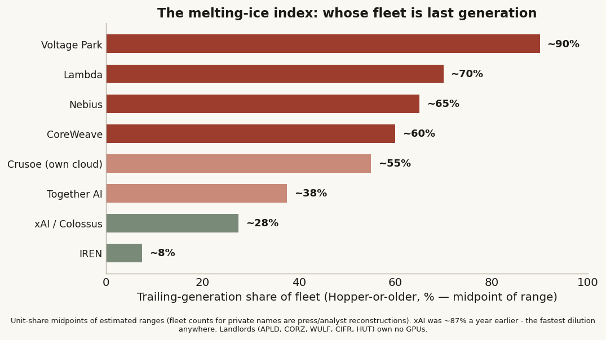
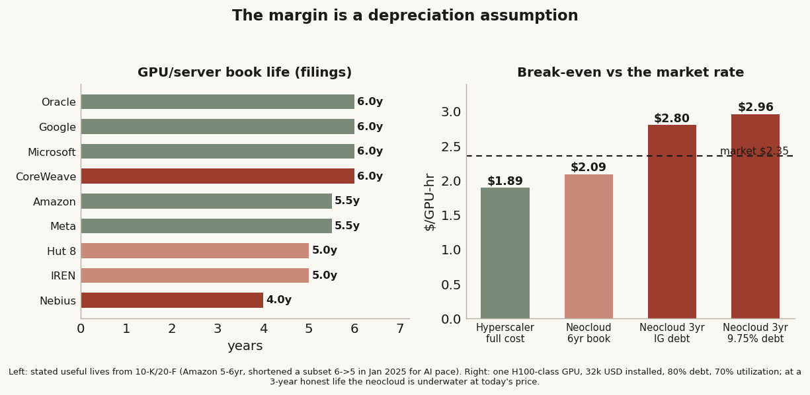
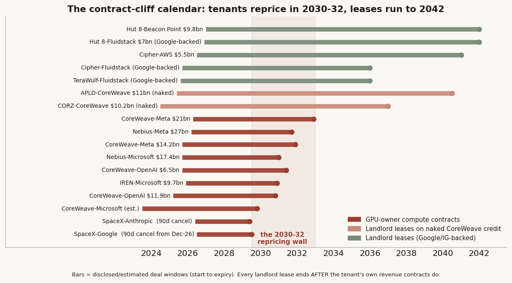
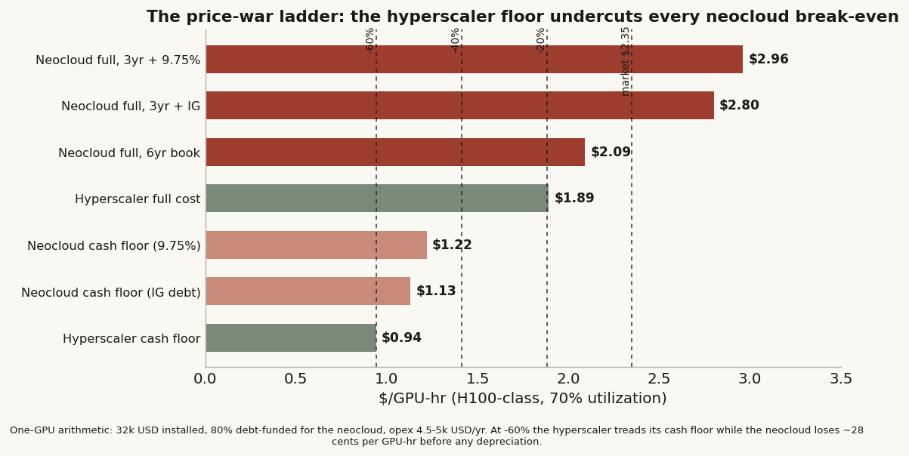
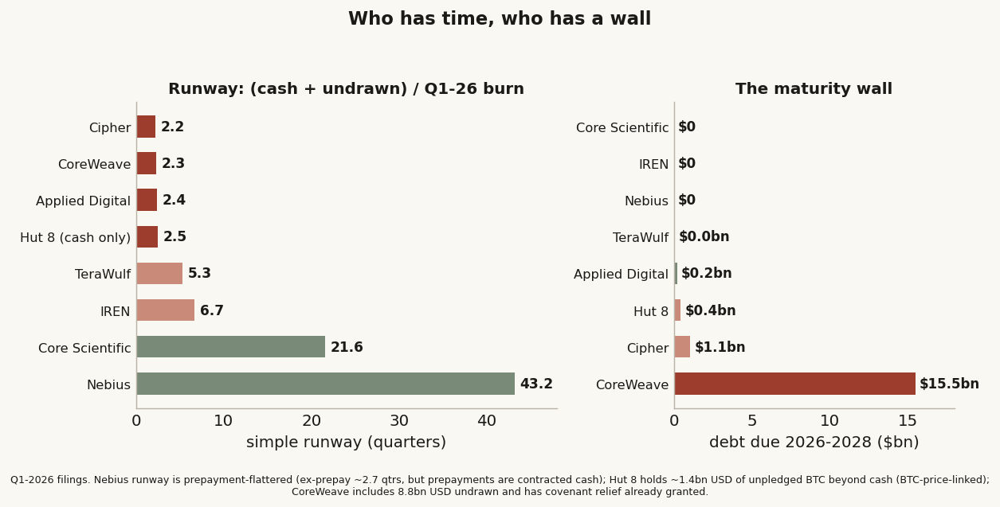

# 37 — The fleet, the contracts, and the price war: who survives when compute reprices?

**The question.** Study #36 showed who has cheap money (the hyperscalers) and who burns cash (every neocloud).
This one asks the survival question: what does each player actually *own* — which generation of silicon, on how
honest a depreciation schedule — how long are the contracts that pay for it, and if the hyperscalers' surplus
compute triggers a rental price war, who has the runway to survive it and who runs out of business?

**Why it matters.** The neocloud trade is no longer about growth; it is about who is still standing when the
GPU-hour reprices. If the fleet is trailing-generation, the depreciation schedule is generous, the contracts
expire before the debt does, and the cash runs out in six quarters — that is not a growth stock, it is a
casualty on a timer. Knowing the order of the timers is the whole game.

> Research, not investment advice. Private fleet counts are press/analyst reconstructions — ranges, not points.
> The price-war scenarios are arithmetic, not forecasts. Financing, depreciation and contract terms are from
> SEC filings (10-K/10-Q/20-F/8-K/6-K) pulled July 2, 2026, each marked confirmed vs estimated. Builds on #36
> (the cost-of-capital scoreboard), #35 (AI capex by company), #27 (the capital cycle), #30 (the endgame
> simulation).

## What I found, up front

- **The 6-year depreciation schedule IS the neocloud's margin.** At CoreWeave's book life (6 years, lengthened
  from 5 in January 2023), an H100-class GPU breaks even around **$2.09/hr** — profitable at today's $2.35
  market rate. At the 2–3-year life the bears (and Nvidia's own product cadence) imply, break-even is
  **$2.96/hr — above today's price**. The profit is an accounting choice, not an operating result.
- **The whole sector bought earnings by lengthening lives — about $18bn of disclosed tailwind** (Microsoft
  +$2.7bn FY21 +$3.7bn FY23, Google +$3.9bn FY23, Amazon +$3.1bn 2024, Oracle +$1.2bn across two moves, Meta
  +$2.9bn actual FY25, CoreWeave, Nebius). Exactly one company went the other way for AI reasons: **Amazon
  shortened** a subset of servers 6→5 years in January 2025, citing "the increased pace of technology
  development, particularly in AI/ML" — eating $1.0bn of net income to say what everyone else is deferring.
- **The contracts invert the risk.** CoreWeave's revenue mega-contracts all expire **2030–2032** (OpenAI Oct
  2030 / May 2031, Meta Dec 2031 / Dec 2032; weighted-average *remaining* tenor ~35 months) — but the
  landlords' leases that CoreWeave and Fluidstack must keep paying run to **2036–2042**. The lease outlives
  the revenue that backs the tenant. And the landlords split in two: the Fluidstack landlords (TeraWulf,
  Cipher, Hut 8) are **Google-backstopped**; CoreWeave's landlords (Applied Digital, Core Scientific) hold
  **naked CoreWeave credit** for 12–15 years.
- **The price war would be asymmetric, and the cash floors say who wins.** A hyperscaler's cash cost on the
  same GPU is ~**$0.94/hr**; a 9.75%-debt neocloud's is ~**$1.22/hr**. At a −60% reprice the hyperscaler
  treads water and the neocloud bleeds cash on every hour sold — before depreciation.
- **Runway ranks the casualty order.** On Q1-2026 filings: CoreWeave ~**2.3 quarters** of simple runway
  against **$15.5bn** of 2026–28 maturities (and it already needed covenant relief: DSCR test pushed to Oct
  2027, minimum liquidity cut to $100m for spring-2026 payment dates, unlimited equity cures until Oct 2026);
  Cipher ~**2.2 quarters** against $1.05bn amortizing; Hut 8 has **$160m of cash** and a BTC-collateralized
  loan with margin calls. At the other end: Nebius **$9.3bn cash and nothing due before 2029**, Core
  Scientific ~21 quarters pro forma, IREN ~7 with Microsoft prepayments. The casualty order writes itself.
- **Who survives:** the hyperscalers win either way (price-setters); Nebius is the best-positioned pure-play
  (most cash, no maturities, the most honest books — 4-year GPU life); IREN has the newest fleet (~5–10%
  trailing-generation) and an anchored contract; the insured landlords survive if Google's backstops hold;
  CoreWeave is the most structurally exposed large player; and the sub-scale Hopper-heavy fleets (Voltage Park
  ~90% trailing-gen, Lambda ~70% going into an IPO) are where "runs out of business" starts.

---

## First, two corrections that reshape the question

**1. The Bitcoin miners did not become neoclouds — they became the neoclouds' landlords.** "Everyone that has
a GPU can do it" turns out to be the wrong picture. The field splits into two different businesses wearing one
label:

- **GPU-owners** — CoreWeave, Nebius, IREN (post-pivot), Lambda, Crusoe (partially), Together, Voltage Park:
  they own the depreciating silicon and sell compute-hours. They carry the refresh risk.
- **Power-landlords** — Applied Digital, Core Scientific, TeraWulf, Cipher, Hut 8: they own land, power and
  shells, and lease them to a tenant *who brings its own GPUs*. The tenant eats the silicon depreciation; the
  landlord holds a 10–15-year take-or-pay lease. Roughly $1.4m of revenue per megawatt instead of CoreWeave's
  $10–12m — a seventh of the revenue, and a fraction of the risk.

A price war on GPU-hour rental therefore hits the two tiers completely differently, and ranking "the
neoclouds" without this split gets the casualty order wrong.

**2. CoreWeave is aggressive in both senses — and the Nvidia backstop is narrower than it sounds.** On
accounting: CoreWeave depreciates its GPUs over six years — a life it *lengthened* from five in January 2023 —
while the bears (Burry, Chanos) put the true economic life at two to three years and Nvidia's own CEO said that
when Blackwell ships "you couldn't give Hoppers away." Kerrisdale's short case is precisely that honest
depreciation would make the company unprofitable; Finding 2 runs that arithmetic. On leverage: debt-to-equity
around 485%, interest around a quarter of revenue. And the famous Nvidia backstop — $6.3bn of unsold-capacity
purchases through April 2032 plus ~$2bn of equity — is a floor under *utilization*, not under *price*. Nvidia
promises to rent what nobody else rents; it does not promise the rate. In a price war, the backstop does not
save the margin. It is also circular: the guarantor's revenue depends on the guaranteed party continuing to buy
its chips.

And the Meta point, carried over from #36 and sharpened: Meta giving up the *open-model* race while keeping
+$46bn of annual free cash flow does not take it out of the game — it makes it a potential **price-setter** in
the rental market. A player whose P&L does not depend on rental income can price surplus at marginal cost.
Every FCF-negative player has to price above its 9–15% funding cost *plus* honest depreciation. That asymmetry
is what makes a price war thinkable, and it is the sword hanging over every row below.

## The frame: three clocks

Every GPU-owner runs three clocks that have to stay aligned:

1. **The silicon clock** — how long the fleet actually earns frontier rates (2–3 years economically, 4–6 on
   the books);
2. **The contract clock** — how long the revenue is locked (3–6 years for compute contracts; 10–15 for
   landlord leases);
3. **The debt clock** — when the borrowings come due (CoreWeave $15.5bn across 2026–28; most others 2030–33).

The landlords are aligned: a 15-year take-or-pay lease outlasts both the debt (Hut 8's project bonds run to
2042) and the tenant's silicon — the tenant eats the refresh. The GPU-owners are misaligned by construction:
the silicon dies before the contract ends, and the contract ends around when the debt matures, so every renewal
is a repricing event on a fleet worth less than its book value. **Vulnerability = how badly the clocks are
misaligned × how little runway you have when the repricing lands.** That product is this study's ranking
function.

## What I expected, and how I'd know I'm wrong

- **H1 — fleet vintage is destiny.** High Hopper-or-older share = collateral and pricing cliff as
  Blackwell/Rubin land. *Wrong if* vintage mix doesn't map to pricing/collateral outcomes.
- **H2 — book depreciation flatters the sector; CoreWeave most.** A 3-year-life restatement should erase the
  GPU-owners' margins and barely dent the hyperscalers. *Wrong if* the restatement barely moves the ranking.
- **H3 — the landlord tier survives a price war; the GPU-owner tier absorbs it.** Take-or-pay leases don't
  reprice until the 2040s; compute contracts reprice at renewal. *Wrong if* tenant risk pierces the leases.
- **H4 — the price war is asymmetric, and the hyperscalers start it.** FCF-positive players can dump surplus at
  marginal cost; FCF-negative players' break-even sits above a dumped price. *Wrong if* break-evens clear even
  −40%, or hyperscalers ration instead of dump.
- **H5 — runway ranks the casualty order.** *Wrong if* contracted backlog is hard enough that runway never
  binds before the contracts pay out.

## How I measured it

Filings first. Useful lives, D&A, gross PP&E, cash, undrawn facilities, maturities and covenants are from
10-Ks/10-Qs/20-Fs/8-Ks/6-Ks retrieved from EDGAR on July 2, 2026 — every such number below is
filing-confirmed unless marked otherwise. Fleet composition is company releases plus analyst reconstruction —
ranges, marked estimated. Contract terms are from filings and press releases, confirmed vs press-reported
flagged per deal. The restatement, break-evens and runway are my own arithmetic on those inputs, shown inline.
Prices come from the same warehouse series as #36.

## Data — the universe

The #36 scoreboard universe: GPU-owners (CoreWeave, Nebius, IREN, Lambda, Crusoe, Together, Voltage Park,
TensorWave), power-landlords (Applied Digital, Core Scientific, TeraWulf, Cipher, Hut 8), the captive-rental
first mover (xAI/SpaceX Colossus), and the hyperscaler reference rows (Meta as benchmark, Microsoft, Google,
Amazon, Oracle). 19 fleet rows, 14 depreciation policies, 22 contracts, 9 runway sheets.

---

## Finding 1 — the fleet census: who holds the melting ice

**What I expected.** The GPU-owners' fleets to differ sharply by vintage — and vintage to be the hidden
balance-sheet risk, since a Hopper GPU must rent ~65% below a GB200 for a buyer to be indifferent, and
trailing-vintage rental rates have already fallen 50–70% once this cycle.

**What the data shows.** The trailing-generation share (Hopper-or-older as % of fleet — the melting-ice index):

| Company | Fleet (confirmed/estimated) | Trailing-gen share | Read |
|---|---|---|---|
| **Voltage Park** | ~24k H100 (bought 2023, ~$500m); B200/GB300 just starting | **~85–95%** | The most melted fleet in the field |
| **Lambda** | ~40–60k est; big H100 base + GB300 via the Microsoft deal | **~65–75%** | H100-heavy book going into an IPO |
| **Nebius** | ~60–100k est; H100/H200 majority, GB200/GB300 first in Europe | **~60–70%** | Melting, but ramping Blackwell + 4yr books (F2) |
| **CoreWeave** | ~250k mostly Hopper (Mar-25) + Blackwell filling ~380MW of new power | **~55–65%**, falling | Biggest absolute Hopper pile; first GB300 cloud |
| **Crusoe** (own cloud) | ~20–30k est; Abilene tenant GPUs are Oracle/OpenAI's | ~50–60% (spec.) | Developer first, cloud second |
| **Together AI** | H100/H200 + 36k GB200 co-built | ~30–45% | Diluting fast |
| **xAI / Colossus** | ~230k C1 (150k H100/50k H200/30k GB200) + ~550k GB200/GB300 at C2 | **~25–30%**, was ~87% a year ago | The fastest vintage dilution anywhere |
| **IREN** | 23k → 150k by end-2026; >50k B300 ordered, ~20k GB300 for Microsoft; only ~2k legacy Hopper | **~5–10%** | Bought late = newest fleet in the field |
| **TensorWave** | 8,192 MI325X + MI355X ramping | AMD curve (~contemporary of Hopper) | The AMD alternative |
| Landlords (APLD/CORZ/WULF/CIFR/HUT) | No own GPUs — tenants' Blackwell-era gear | n/a | The point of the model |

**Why it matters (mechanism).** Two names hold the extremes. Voltage Park owns essentially one vintage — the
2023 H100 buy — so its collateral and pricing both ride the melting edge. IREN bought *late*, so its fleet is
nearly all Blackwell-class and its biggest deployment is pre-sold to Microsoft with 20% prepayment: being slow
to the party became an advantage. CoreWeave sits in the uncomfortable middle: the biggest absolute Hopper pile
(~250k units of exactly the vintage that must reprice ~65% down against GB200) even as its new megawatts fill
with Blackwell. And xAI shows what captive-scale money does: from ~87% trailing-gen to ~25–30% in about a year.

**What I checked.** Fleet counts for private names are reconstructions — ranges kept wide, confidence flagged
per row. The melting-ice index uses unit counts, not value weights; weighting by value would look *worse* for
Hopper-heavy fleets (Hopper units are worth less per unit).

**Verdict on H1: confirmed with a nuance.** Vintage is a real, differentiating risk — but it interacts with
contracts (Finding 3): a pre-sold Blackwell fleet (IREN) and a spot-exposed Hopper fleet (Voltage Park) are
different species even at the same leverage.

## Finding 2 — the depreciation clock: the margin is an accounting choice

**What I expected.** Book lives longer than economic lives across the sector, with CoreWeave the most
aggressive. What I did not expect was how clean the filings evidence would be — or that the most conservative
accountant in the field would be a neocloud.

**What the data shows (all filing-confirmed).** The GPU/server useful-life spectrum:

| Company | Book life (servers/GPUs) | Direction 2023–26 | Disclosed earnings effect |
|---|---|---|---|
| **Nebius** | **4.0 yrs** (intends 5 from Jan 2026) | Lengthening 4→5 | ~+$168m expected FY26 |
| **IREN** | 5 yrs (HPC hardware) | — (shortened *miners* 4→2) | — |
| **Hut 8** | 5 yrs (AI GPUs) | — | — |
| **Meta** | 5–5.5 yrs | Lengthened Jan 2025 | **+$2.59bn NI, +$1.00 EPS FY25 actual** |
| **Amazon** | 5–6 yrs | **SHORTENED subset 6→5, Jan 2025, citing AI pace** | **−$1.0bn NI, −$0.10 EPS FY25** |
| **CoreWeave** | **6 yrs** | Lengthened 5→6, Jan 2023 | +$20m FY23 (small then; the base is 40x bigger now) |
| **Microsoft** | up to 6 yrs | Lengthened twice (FY21, FY23) | +$2.7bn FY21, +$3.7bn FY23 |
| **Google** | 6 yrs | Lengthened Jan 2023 | −$3.9bn depreciation FY23 |
| **Oracle** | 6 yrs | Lengthened twice (FY23, FY25) | +$434m FY23, +$733m FY25 |

Two things jump off this table. First, the *sector-wide* pattern: roughly **$18bn of cumulative disclosed
earnings tailwind** from lengthening server lives, booked while the hardware cycle was accelerating. Second,
the direction of the two outliers. **Amazon** is the only hyperscaler that shortened lives *for AI reasons*,
eating $1.0bn of net income to recognize that "the increased pace of technology development, particularly in
AI/ML" kills servers faster. And **Nebius** — a neocloud — runs the shortest GPU life in the entire field at
4 years, two full years more honest than CoreWeave on the identical asset.

**The restatement.** CoreWeave's FY2025 depreciation was $2.4bn against ~$20.9bn of gross technology equipment
— consistent with the 6-year schedule. On a 3-year life, the same base charges roughly **$2–2.5bn more per
year**, turning a ~$1.5bn-scale net loss into a ~$4bn one, and cutting the book value of the GPU collateral
that secures its DDTLs proportionally faster. Nebius on the same test barely moves (~+$0.3bn) — because its
books already tell most of the truth. The hyperscalers' restatement is larger in dollars but trivial against
+$46–97bn of free cash flow.

**Why it matters (cashed out per GPU).** Take one H100-class GPU at ~$32k installed, 80% debt-funded, 70%
utilization: at a 6-year book life and 9.75% debt, full-cost break-even is **~$2.09/GPU-hr** — profitable at
today's $2.35 market rate. At a 3-year life, break-even is **~$2.96/hr — above today's price**. Even swapping
in the 5.9% IG-tranche debt only gets to ~$2.80. On honest depreciation, the pure-play GPU rental business is
*already* underwater at current prices; the reported margin is the gap between six years and three.

**What I checked.** The 6-year life was adopted in January 2023 with a disclosed rationale ("continuous
advancements in hardware performance…"); the counter-reading is that operators sweat older GPUs on inference
for years, so 6 may be defensible for *utilization* even if not for *frontier pricing*. Carried honestly: the
restatement assumes the asset must earn frontier rates to cover its debt — which is true for CoreWeave's
capital structure, less true for an unlevered operator.

**Verdict on H2: confirmed, strongly.** The margin is a depreciation assumption. CoreWeave is the most
aggressive large holder; Nebius the most honest; Amazon the only hyperscaler pricing the AI cadence into its
own books.

## Finding 3 — the contract book: every deal, and the inversion nobody prices

**What I expected.** A table of clients and tenors. What emerged is a structural inversion between the two
tiers' calendars.

**What the data shows.** The full book (values as disclosed; confirmed vs estimated marked in the workflow
data; sizes are commitments/ceilings, not guarantees):

| Provider | Client | Size | Tenor | Expires | The clause that matters |
|---|---|---|---|---|---|
| CoreWeave | Microsoft | ~$10bn+ (est.) | "through end of decade" | **~2029–30** | FT: MSFT declined a ~$12bn option Mar-25; OpenAI backfilled |
| CoreWeave | OpenAI | up to $22.4bn | ~5.5–6yr | **Oct 2030 / May 2031** | Committed pay-up-to, not guaranteed minimum; $350m equity at signing |
| CoreWeave | Meta | ~$35bn ($14.2bn + $21bn) | ~6–6.7yr | **Dec 2031 / Dec 2032** | "Up to" order forms under MSA |
| CoreWeave | Nvidia | $6.3bn backstop | to Apr 2032 | 2032 | Buys *unsold* capacity — utilization floor, not price floor |
| Nebius | Microsoft | $17.4bn (→$19.4bn) | ~5yr | **2031** | Debt secured against the contract |
| Nebius | Meta | up to ~$27bn ($12bn firm) | 5yr | **~2031–32** | $15bn of it is Meta taking *residual* capacity |
| IREN | Microsoft | ~$9.7bn | 5yr | **~2030–31** | **20% prepayment**; $5.8bn Dell hardware order |
| SpaceX/xAI | Anthropic | $1.25bn/mo (>$40bn ceiling) | ~3yr | May 2029 | **Either party, 90-day termination** |
| SpaceX/xAI | Google | $920m/mo (~$30bn ceiling) | ~2.7yr | Jun 2029 | **90-day cancel — active after Dec 31, 2026** |
| Lambda | Microsoft + Nvidia | multibn + $1.5bn leaseback | n/d + 4yr | n/d / ~2029 | Nvidia leases back its own GPUs = largest customer |
| Applied Digital | **CoreWeave** | ~$11bn (400MW) | ~15yr | **~2040–41** | No backstop — naked CoreWeave credit |
| Core Scientific | **CoreWeave** | $10.2bn (~590MW) | 12yr | **~2036–38** | No backstop; two 5-yr renewal options |
| TeraWulf | **Fluidstack** | $3.7bn→$8.7bn+ | 10yr + options | **~2036 (→2046)** | **Google backstop $3.2bn** + ~14% equity |
| Cipher | **AWS** | ~$5.5bn (300MW) | 15yr | **~2041** | Direct hyperscaler lease |
| Cipher | **Fluidstack** | ~$3.8bn | 10yr + options | **~2036 (→2046)** | **Google backstop $1.4bn** + 5.4% warrants |
| Hut 8 | **Fluidstack** (River Bend) | $7.0bn (→$17.7bn) | 15yr + options | **~2042 (→2057)** | **Google financial backstop, full 15-yr base term** |
| Hut 8 | undisclosed IG tenant (Beacon Point) | $9.8bn (→$25.1bn) | 15yr NNN | **~2042** | Tenant not publicly named |
| Crusoe JV | Oracle → OpenAI (Abilene) | $15bn build | 15yr lease | ~2039–40 | Oracle/OpenAI reportedly scrapped the expansion Dec-25 |

Three structural reads:

1. **The repricing wall is 2030–2032 — for the GPU-owners.** CoreWeave's mega-contracts expire Oct 2030, May
   2031, Dec 2031, Dec 2032; Nebius's both ~2031–32; IREN's ~2030–31. CoreWeave disclosed a weighted-average
   contract duration of ~5 years, but the *remaining* tenor computed from its own RPO buckets is **~35 months**
   — the $99.4bn backlog is a 2029–32 story, and every renewal lands on whatever the GPU-hour price is then.
2. **The inversion: the landlords' leases outlive the tenants' revenue.** Applied Digital and Core Scientific
   hold 12–15-year leases (to 2036–2041) whose sole or anchor tenant is CoreWeave — whose own revenue contracts
   expire in 2030–32. If CoreWeave can't renew at viable rates, the landlord's "contracted revenue" is only as
   good as CoreWeave's credit in a downcycle. **The Fluidstack landlords bought insurance; CoreWeave's didn't**:
   TeraWulf, Cipher and Hut 8 all carry Google/Alphabet financial backstops on the lease payments (Google took
   equity warrants in all three as the price), while APLD and CORZ hold naked tenant credit.
3. **The headline numbers are softer than they look.** Both SpaceX leases are 90-day cancellable (the $40bn
   and $30bn are ceilings); CoreWeave-OpenAI is "pay-up-to"; $15bn of the Nebius-Meta deal is Meta taking
   residual capacity. Prepayments are the hard part: CoreWeave's contracts carry 15–25% of TCV prepaid; IREN's
   Microsoft deal 20%.

**Verdict on H3 (first half): conditional-confirmed.** The landlord tier's calendar does survive a 2030-era
price war — *if* the tenant or its backstop pays. That splits the tier: insured (WULF/CIFR/HUT, Google-backed)
vs naked (APLD/CORZ, CoreWeave-credit). The second half of H3 resolves in Finding 4.

## Finding 4 — the price-war stress test: asymmetric by construction

**What I expected.** That FCF-positive hyperscalers can price surplus compute below any level a levered
neocloud can match. The arithmetic is starker than expected.

**How I measured it.** One H100-class GPU, ~$32k installed, 70% utilization, 8,760 hours/year. The hyperscaler
funds at ~5% and does not need the rental to cover a margin; the neocloud funds 80% of the box at 9.75%
unsecured (5.9% on its best IG tranche) and must cover depreciation to stay solvent. Opex (power, cooling,
staff, networking) ~$4.5–5k/GPU-yr.

**What the arithmetic says (per GPU-hour):**

| Cost basis | Full-cost break-even | Cash-only floor |
|---|---|---|
| Hyperscaler (5.5yr book, ~5% money) | **$1.89** | **$0.94** |
| Neocloud, 6yr book, 9.75% debt | **$2.09** | **$1.22** |
| Neocloud, 3yr honest life, 9.75% debt | **$2.96** | $1.22 |
| Neocloud, 3yr life, 5.9% IG tranche | $2.80 | $1.13 |
| **Market H100 1-yr contract (Mar 2026)** | **$2.35** | — |
| Scenario: −20% / −40% / −60% | $1.88 / $1.41 / $0.94 | — |

Read the ladder against the scenarios. At **−20%** ($1.88): the hyperscaler still covers *full* cost; the
neocloud is below full-cost break-even even on its own 6-year books. At **−40%** ($1.41): the neocloud still
covers cash costs but nothing else — it services debt by eating its equity. At **−60%** ($0.94): the
hyperscaler sits exactly at its cash floor while the neocloud loses ~$0.28 on every GPU-hour *before
depreciation*. There is no price at which the levered neocloud wins a war the hyperscaler is willing to fight.

**The reflexive channel (from #27, now with names).** Rental price → collateral value → refinancing terms.
CoreWeave's DDTLs are secured on GPUs and customer contracts; a −40% reprice at the 2030–32 renewals cuts both
legs of the collateral at once, exactly when $15.5bn of 2026–28 maturities have already consumed the undrawn
capacity. The covenant record shows the machine already creaking in a *bull* market: the December 2025
amendment postponed the first DSCR test to October 2027, postponed the contract-realization test, cut minimum
liquidity to $100m for the March–April 2026 payment dates, and permits unlimited equity cures until October
2026. Those are not the covenants of a business with margin for a price war.

**What I checked (the steelman).** Scarcity is real today — demand exceeds supply, the backlog is contracted,
and the hyperscalers may *ration* surplus rather than dump it (dumping hurts their own cloud pricing too). The
war is a scenario, not a schedule. But the asymmetry doesn't need the war to start to matter: it caps the
neoclouds' pricing power at every renewal, because the customer's alternative is always the price-setter's
floor. And the first cancel window is already dated: Google can walk from the SpaceX lease on 90 days' notice
from December 31, 2026.

**Verdict on H4: confirmed.** Asymmetric by construction; the hyperscalers hold both the cash floor and the
option on when to test it.

## Finding 5 — runway and survivorship: winners and losers, in quarters

**How I measured it.** Simple runway = (cash + undrawn committed facilities) ÷ latest quarterly FCF burn, all
from Q1-2026 filings (fiscal Q3 for IREN/APLD), before any burn growth or contracted prepayments. It's a
stress gauge, not a forecast — most of these names burn by *choice* (contracted buildouts), and can slow capex
if funding closes. The maturities column is the part they cannot choose.

| Company | Cash + undrawn | Q burn | **Simple runway** | Maturities '26–28 | The detail that matters |
|---|---|---|---|---|---|
| **Nebius** | $9.3bn + ATM | −$0.2bn* | **~43 qtrs*** | **$0** (converts from 2029) | *Burn flattered by $3.2bn prepayments; ex-prepay ~2.7 qtrs — but the prepayments are real contracted cash |
| **Core Scientific** | ~$3.0bn pro forma | −$0.14bn | **~22 qtrs** | ~$0 post-refi | Tenant = CoreWeave (naked credit) |
| **IREN** | $2.2bn + $3.6bn facility | −$0.87bn | **~7 qtrs** | $0 (converts 2029+) | Microsoft 20% prepay; facility drawable to May-27 |
| **TeraWulf** | $2.6bn + $0.25bn | −$0.54bn | **~5 qtrs** | ~$0 | Google backstop behind the tenant |
| **Hut 8** | $0.16bn (+~$1.4bn unpledged BTC) | −$0.06bn | **~2.5 qtrs cash-only; ~24 with BTC** | ~$0.44bn | BTC-collateralized loan: margin call at 130%, liquidation at 105% — runway is BTC-price-linked |
| **Applied Digital** | $1.7bn (+MAM pref up to $5bn) | −$0.72bn | **~2.4 qtrs** | ~$0.2bn | Tenant = CoreWeave (naked credit); Macquarie program is the cushion |
| **CoreWeave** | $2.2bn + $8.8bn undrawn | −$4.7bn | **~2.3 qtrs** | **$15.5bn** ($6.1bn rem-'26, $5.7bn '27, $3.8bn '28) | DSCR waived to Oct-27; min-liquidity cut to $100m; unlimited equity cures to Oct-26 |
| **Cipher** | $0.7bn + $0.33bn | −$0.46bn | **~2.2 qtrs** | $1.05bn amortizing | Tightest all-in; anchors (AWS, Google-backed Fluidstack) are the offset |
| Oracle *(ref.)* | $31.3bn + $10bn revolver | ~−$1.9bn (FQ4) | ~5–6 qtrs at FY26 burn | $17.4bn FY27–28 | The IG canary from #35/#36 |

*The casualty ordering this produces:*

- **Price-setters (win either way):** the hyperscalers and SpaceX/xAI. They fund at 4–6%, self-fund the build,
  and hold the option to start or not start the war.
- **Best-positioned pure-play: Nebius.** The most cash ($9.3bn), zero maturities before 2029, the shortest
  (most honest) book life, and the newest revenue base — its risk is dilution and execution, not solvency. The
  honest caveats: burn is prepayment-flattered, and its FY25 20-F carries an adverse ICFR opinion.
- **Cleanest asset-quality story: IREN** — ~5–10% trailing-gen fleet, pre-sold to Microsoft with prepayments,
  no maturities. Its risk is concentration (one anchor) and the sheer scale of the 150k-GPU build.
- **Insured landlords (survive if the backstops hold):** TeraWulf, Cipher, Hut 8 — Google stands behind the
  Fluidstack leases. Cipher is the tightest on near-term cash (~2.2 qtrs, amortizing notes); Hut 8's runway is
  literally BTC-price-linked (a crypto drawdown triggers margin calls on the loan that funds an AI landlord).
- **Naked-credit landlords: Applied Digital, Core Scientific.** Long leases, decent runway (CORZ ~22 qtrs) —
  but the tenant behind 100% (APLD) and ~all (CORZ) of the AI book is CoreWeave. They are CoreWeave credit in
  landlord costume. No Google. No backstop.
- **Most structurally exposed large player: CoreWeave.** Shortest simple runway (~2.3 qtrs), the only $15.5bn
  2026–28 maturity wall in the field, the biggest trailing-gen fleet, the longest book life, covenant relief
  already granted, and a 2030–32 contract cliff — every clock misaligned at once. The offsets are real
  ($99.4bn backlog, 15–25% prepayments, $8.8bn undrawn, the Nvidia utilization floor), which is why this is a
  2027–28 refinancing story, not a 2026 insolvency call — the same window #30's simulation named from the
  other direction.
- **Where "runs out of business" starts:** the sub-scale, spot-exposed, Hopper-heavy fleets — Voltage Park
  (~90% trailing-gen, though debt-free by design), Lambda (~70% trailing-gen, IPO-dependent) — plus
  **Fluidstack itself**, a tiny company carrying $10bn+ of lease obligations whose economics depend on Google
  choosing to keep honoring backstops built for its own capacity needs.

**Verdict on H5: confirmed.** Runway plus the maturity calendar produces a clean, defensible ordering — and it
converges with #30's independent simulation (financing refusal, neoclouds first, 2027–28 window) from a
completely different method.

## The answer, in the data

| Hypothesis | Answer | Load-bearing number |
|---|---|---|
| H1 fleet vintage is destiny | **Yes, with nuance** | Voltage Park ~90% vs IREN ~5–10% trailing-gen; H100 must price ~65% under GB200 |
| H2 depreciation flatters; CoreWeave most | **Yes** | 6yr book → $2.09/hr break-even vs 3yr honest → $2.96 (market: $2.35); ~$18bn sector tailwind; only Amazon shortened |
| H3 landlords survive the war | **Conditional** | Leases run 2036–42 vs tenant revenue cliff 2030–32; insured (Google-backed WULF/CIFR/HUT) vs naked (APLD/CORZ on CoreWeave credit) |
| H4 the war is asymmetric | **Yes** | Cash floors $0.94 (hyperscaler) vs $1.22 (neocloud); at −60% the neocloud bleeds $0.28/GPU-hr before depreciation |
| H5 runway ranks the casualties | **Yes** | CRWV ~2.3 qtrs + $15.5bn wall; CIFR ~2.2; HUT BTC-linked; NBIS ~43 qtrs + $0 due |

**The survivorship grid (research, not advice):**

| Tier | Names | Why |
|---|---|---|
| Price-setters | Meta, Microsoft, Google, Amazon, SpaceX/xAI | Cheapest money + captive demand + the option on the war |
| Best pure-play | Nebius | Most cash, no maturities, honest books |
| Clean asset story | IREN | Newest fleet, pre-sold, prepaid |
| Insured landlords | TeraWulf, Cipher, Hut 8 | Google backstops (Cipher tight on cash; Hut 8 BTC-linked) |
| Naked landlords | Applied Digital, Core Scientific | CoreWeave credit in landlord costume |
| Most exposed at scale | CoreWeave | All three clocks misaligned; $15.5bn wall into a 2030–32 repricing cliff |
| First casualties | Voltage Park-tier Hopper fleets, Lambda (IPO-dependent), Fluidstack (the load-bearing counterparty) | Spot-exposed melting ice; obligations without balance sheets |

**On the price war itself:** it has not started — scarcity is real, the backlog is contracted, and rationing
(not dumping) is the hyperscalers' rational opening move. But the arithmetic above says the war doesn't need to
*start* to bind: it caps every renewal negotiation from 2029 on, because the customer's alternative is always
the price-setter's floor. The first dated tell is **December 31, 2026** — the day Google's 90-day cancel right
on the SpaceX lease goes live. The structural tell is CoreWeave's 2027 refinancing calendar meeting its first
DSCR test in October 2027.

## Could I be wrong? (steelman)

**(a) Six years might be right.** Old GPUs sweat profitably on inference for years; if trailing-vintage
utilization stays high, the 6-year life is defensible and the restatement overstates the hole. *Against it:*
the debt is priced on frontier collateral values, and the H100 rental tape (−60%+ from peak) already voted.
**(b) Demand may outrun the war indefinitely.** If scarcity persists through 2028, every renewal reprices *up*,
the backlog converts, and the levered names grow into their balance sheets — the "productive bubble" path.
**(c) The backstops may be stronger than the tenants.** If Google keeps insuring Fluidstack and Nvidia keeps
backstopping CoreWeave, the fragile tier is effectively wearing hyperscaler credit and the casualty list
shrinks to the uninsured. All three are live; none flips the *ordering* — they stretch the timeline.

## Caveats

- Private fleet counts are reconstructions (ranges, flagged); the melting-ice index is unit-weighted.
- Break-evens are one-GPU arithmetic with stated assumptions ($32k installed, 70% utilization, 80% debt) —
  directionally robust, not company P&L models.
- Simple runway ignores burn growth *and* contracted prepayment inflows; both directions noted per name.
- Contract sizes are commitments/ceilings; "up to" structures and cancel rights are flagged where disclosed.
- Scenario grid ≠ forecast; consolidation mapping is judgemental.

## Reproducibility

Break-even: `cost_per_hr = (capex/life + capex×0.8×rate + opex) / (8760×utilization)` — e.g. CoreWeave book:
`(32000/6 + 32000×0.8×0.0975 + 5000) / 6132 = $2.09`; honest: `(32000/3 + …) / 6132 = $2.96`. Simple runway:
`(cash + undrawn) / |quarterly FCF|`, Q1-2026 10-Qs. Restatement: FY25 depreciation rescaled from book life to
3 years on the filed gross-PP&E base. All filing inputs cited in the tables; figures built from the same
numbers.

## References & forward pointer

Builds on #36 (cost-of-capital scoreboard), #35 (capex by company — the debt-schedule and war-chest chapters),
#27 (the capital cycle), #30 (the endgame simulation — which independently named the same 2027–28 window).
Primary sources: SEC EDGAR filings (CRWV 10-K/10-Q/8-K, NBIS 20-F/6-K, IREN/APLD/CORZ/WULF/CIFR/HUT
10-K/10-Q/8-K, META/MSFT/GOOGL/AMZN/ORCL/NVDA 10-Ks), company releases, SemiAnalysis rental tape. Forward: the
two dated tells — Google's SpaceX cancel window (Dec 31, 2026) and CoreWeave's first DSCR test (Oct 31, 2027)
— and the H100/B200 one-year contract rate as the live price gauge.
