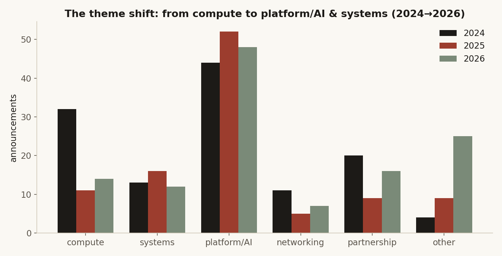
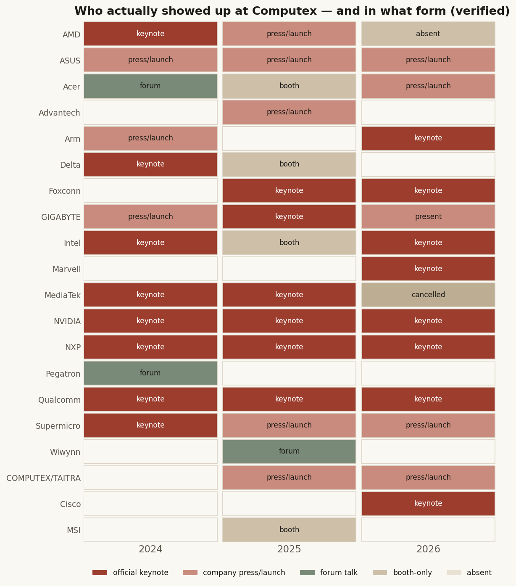
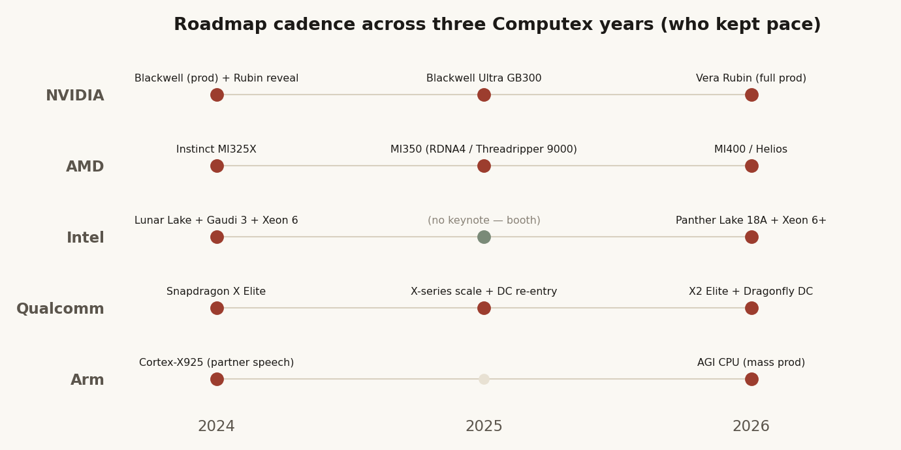
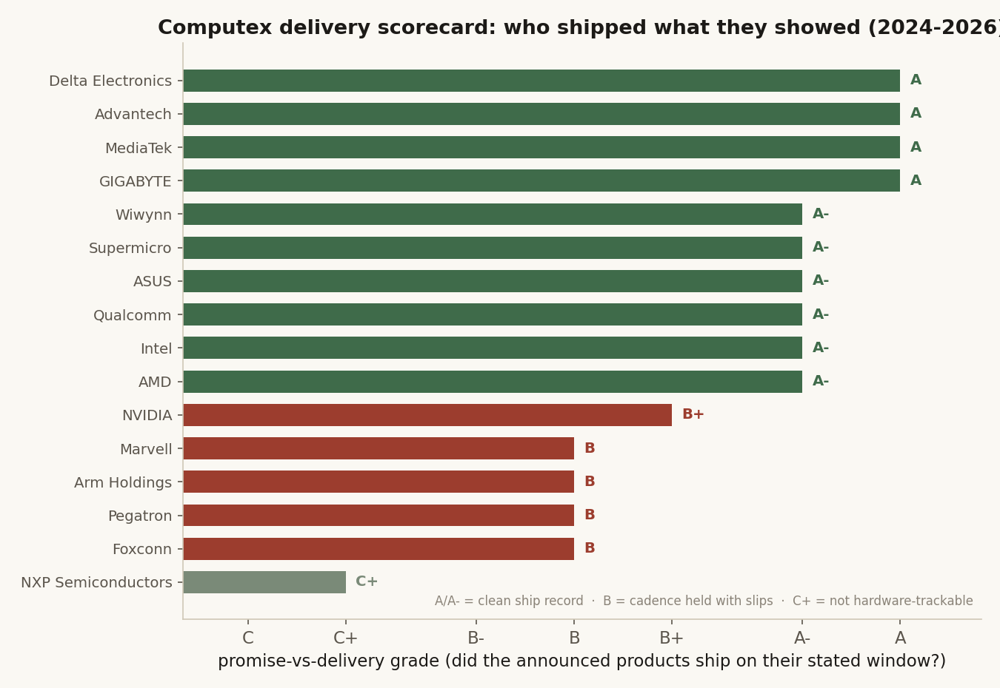

# Computex 2024–2026: the AI build-out, read from the keynote floor

Three years of Computex Taipei, read as one story. Not a recap and not a
spreadsheet — the *interpretation* the data can't give you: what the keynote
floor actually told us about the AI build-out, **who kept the roadmaps they
declared**, and whether any of it was tradable. Built on the
[independently-verified Computex dataset](../computex-dataset/) (every session
and announcement cross-checked against the official program and the tech press),
with the quant event-study in [study 18](../18-computex-event-study/).

> Research / synthesis. Sources: the verified Computex dataset + tech press
> (AnandTech, Tom's Hardware, The Verge, Reuters, DigiTimes, ServeTheHome,
> VideoCardz). No live capital, no audited track record. Not investment advice.

## 1. The three-year arc — silicon → system → agent

**2024 — the cadence was *declared* and the AI PC was born.** Jensen Huang
formalized NVIDIA's one-year rhythm (Blackwell 2024 → Blackwell Ultra 2025 →
Rubin 2026); AMD answered within days with a "new data-center GPU every year"
roadmap; Intel's Gelsinger ran a full "AI Everywhere" keynote. On the client
side Microsoft's 40-TOPS Copilot+ bar set off an on-device NPU race — Qualcomm
won on *timing* (Snapdragon X PCs shipped June 18, 2024), AMD won the *headline
number* (Ryzen AI 300 "Strix Point", 50 TOPS). Cooling, power and optics were
still optional upgrades on a 51.2T baseline.

**2025 — the cadence was *tested* and the build-out went to scale-out.** NVIDIA
shipped Blackwell despite a real GB200 NVL72 overheating/NVLink slip and landed
GB300 on its H2 window; AMD's MI325X slipped to Q2 volume but it launched
MI350X/MI355X and bought visibility with OpenAI/Meta/Oracle megadeals; **Intel
cracked** — Gelsinger out, Falcon Shores cancelled, *no Computex keynote at
all*. Liquid cooling and 800VDC became the default architecture, not an option;
co-packaged optics was announced everywhere even as Broadcom doubled the switch
ceiling to 102.4T.

**2026 — the year of physical AI and agents.** The unit of value moved from the
device to the agent and the ambition from the laptop NPU to the rack. Qualcomm's
Amon declared "the year of agents" and the Dragonfly data-center brand; Arm broke
35 years of IP-only history to ship its own 136-core AGI CPU (Meta lead); NVIDIA
put Vera Rubin "into full production" with CPO as the default fabric. The catch:
by mid-2026 nearly every 2026 flagship is **announced-and-ramping, not yet
shipped** — the delivery verdict on the agent era is still pending.

## 2. Who actually showed up — and in what form

The first thing the verification corrected: most of the "keynotes" weren't. Only
a handful are official TAITRA keynotes; the OEMs ran company launch/press events,
and several records were forum talks or the wrong event entirely (Arm's "2024"
was the 2021 keynote; Delta 2025 was booth-only; MediaTek's 2026 keynote was
*cancelled*; Cisco debuted in 2026; AMD sat out 2026).

## 3. The compute cadence — who kept pace

**NVIDIA is the only one of the three big silicon vendors to hold its
2024-declared annual cadence product-for-product through 2026** — Blackwell →
Blackwell Ultra/GB300 (H2 2025) → Rubin "in full production" (2026), with Rubin
Ultra (2027) and Feynman (2028) on the same rhythm. The one wobble was the GB200
ramp (overheating/NVLink bugs pushed volume across 2025), but the architecture
launched on cadence. **AMD** matched the announcement rhythm and mostly hit
windows but trails by ~a generation on rack-scale integration (MI450/Helios is an
unshipped H2-2026 event vs Rubin already shipping). **Intel** is the laggard, but
the break is *surgical*: it kept the client/foundry promise (Lunar Lake → 18A
Panther Lake, Clearwater Forest) while its data-center AI line collapsed (Gaudi 3
missed its $500M target, Falcon Shores cancelled, Jaguar Shores a late-decade
promise).

## 4. Promise vs delivery — did the keynote ship?

The piece nobody else does: of everything announced, **what actually shipped on
its stated window?** Each company graded on delivery precision (not importance —
note NVIDIA sits at B+ *despite* being the overall winner, docked for the GB200
ramp and the DGX Spark slip).

The stories behind the grades:

- **NVIDIA held the cadence** four straight years — the single best execution
  story of the three.
- **…but DGX Spark slipped a full quarter** (GB10 superchip delayed; orders only
  opened Oct 2025), cascading to ASUS/Gigabyte/Advantech's GB10 boxes.
- **Intel's 18A kept its promise while Gaudi broke** — every Computex-specific
  commitment (Lunar Lake, Sierra Forest, Gaudi 3, Clearwater Forest *same-day* on
  18A) shipped, even as the off-stage data-center AI roadmap collapsed.
- **AMD met the date but cut the spec** — MI325X shipped Q4 2024 on time, but at
  256GB not the announced 288GB HBM3E.
- **Qualcomm shipped Copilot+ to the day** (June 18, 2024) — its one drift is the
  2025 Oryon server CPU, still unshipped.
- **Arm broke 35 years of IP-only history** — first in-house 136-core AGI CPU on
  TSMC 3nm, orderable as promised; the real volume test is Q4 2026.
- **Delta's delivery is proven by the P&L** — liquid cooling ~17% of revenue
  (~NT$10bn/month), >50% share of high-end AI-server PSUs. Not vaporware.
- **Supermicro's 2026 "PG25-A" coolant claim** ("~1,000× higher impedance")
  shipped with no published specs — flagged by the press as marketing pending
  independent testing.

## 5. The supply-chain arms race — cooling, power, optics

As GPU racks climbed from ~50kW (Hopper) toward 250kW+ (Blackwell) and a
roadmapped 600kW–1MW (Vera Rubin/Kyber), **liquid cooling and 800VDC moved from
optional (2024) to default (2025) to a productized standard tied to Rubin
(2026).** Two Taiwan vendors led and *delivered*: **Supermicro** on thermal
(DLC → DLC-2, 2,000+ liquid racks delivered, 100k+ GPUs/quarter) and **Delta** on
power (vertical power → full 800VDC HVDC → 2.4MW CDUs, proven by record revenue).

In networking, the move is to **co-packaged optics** as the copper wall forces
light into the rack. **Broadcom won the shipping race** — first to production CPO
(Bailly 51.2T, March 2024, validated at Meta with 1M+ flap-free hours), first to
102.4T (Tomahawk 6), first to 102.4T CPO — beating NVIDIA's Spectrum-X Photonics
to shipping CPO Ethernet by ~1–2 years. **NVIDIA won the platform** (CPO as the
default Rubin fabric); **Marvell** is a credible #3 but stayed at 51.2T while
Broadcom doubled, its 102.4T part only sampling Q2 2026. Underneath all of them:
**TSMC** (3nm + COUPE silicon photonics).

## 6. The platform shift — from AI PC to agents

2024's on-device "NPU TOPS" race (Qualcomm timing, AMD number, Intel Lunar Lake)
gave way through a 2025 holding year to a 2026 pivot to **agents and the rack**:
Qualcomm's Dragonfly data-center brand, Arm's AGI CPU, NVIDIA's Vera/RTX Spark,
AMD's Ryzen AI Halo for "agent computers." The delivery caveat dominates — nearly
every agentic flagship is announced-not-shipped (X2 systems 1H26, Dragonfly
accelerators 2026/27, Arm AGI volume Q4 2026, RTX Spark fall 2026). The market's
verdict on announce-don't-ship: Qualcomm slid ~9% as NVIDIA overshadowed
Dragonfly. **Intel is the platform laggard** in the agentic reframing; **Apple**,
a non-participant, is the implicit one.

## 7. Winners & losers

**Winners.** NVIDIA (only cadence-keeper; won compute, power-spec, optics
platform, *and* the agentic narrative). TSMC (the silent picks-and-shovels winner
under everyone). Broadcom (networking shipping race). The Taiwan infrastructure
cohort on delivery — Delta, Supermicro, Gigabyte, MediaTek, Advantech, Wiwynn
(the A/A- graders whose delivery shows up in their P&L). AMD (cadence + the
~12GW of OpenAI/Meta/Oracle megadeals). Arm (broke into the rack with its own
silicon). **Losers.** Intel's data-center AI line (the clear loser — cadence
broke entirely; the foundry/client recovery is the only thesis). Apple (reduced
to a benchmark target). Air-cooling-first and AC-only power vendors (structurally
displaced). Marvell (lost the marquee bandwidth race). And the whole 2026 agentic
field is a winner *only on paper* until H2-2026 deliveries land.

## 8. The investment read

Separate the trade from the structure. **The trade: there is no basket alpha** —
[study 18](../18-computex-event-study/) shows buying a Computex-announcer basket
around the show did not beat the market (these are scheduled, well-telegraphed
events; the surprise is in execution months later, not on keynote day). "Buy the
headline" is not the edge.

**The structure is where the signal lives, and the delivery scorecard sharpens
it.** The durable winners are the ones who *both* set the roadmap *and* ship to
it — NVIDIA and the picks-and-shovels layer underneath (TSMC, Broadcom, and the
Taiwan infrastructure cohort whose delivery is provable in revenue). The implied
factor: **be long the vendors whose announcements convert to shipped revenue
within ~12 months, not the ones whose decks are full of not-yet-due 2026/2027
promises.** Cautions: Intel's clean Computex grades mask a broken AI-accelerator
franchise (own the 18A foundry story, not Gaudi); AMD is a "show me" name until
MI450/Helios ships in H2-2026; the agentic cohort (Qualcomm Dragonfly, Arm AGI,
RTX Spark) is priced on Q4-2026 promises — re-audit when they actually land.

---

*Method: synthesized from the verified Computex dataset (44 sessions, cited
attendance + announcements) plus tech-press cross-checks, by per-company
delivery audits and thematic deep-dives. Grades are delivery-precision (did it
ship on its stated window?), not importance; 2026 flagships are mostly not-yet-
due. Sources are linked in the dataset's `verification_report.json`. Not
investment advice.*
